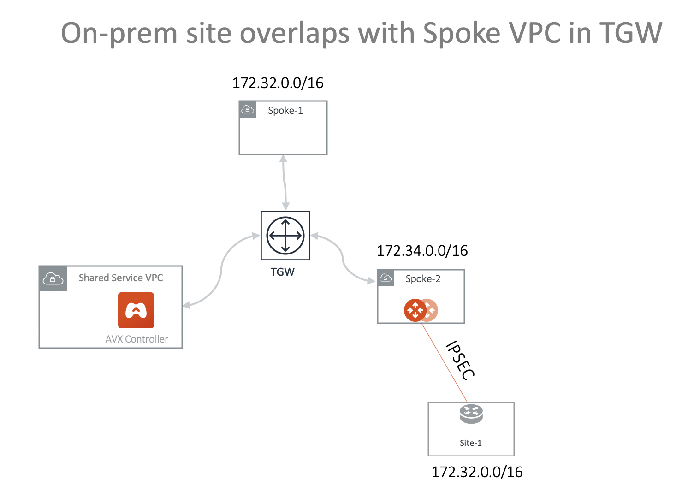
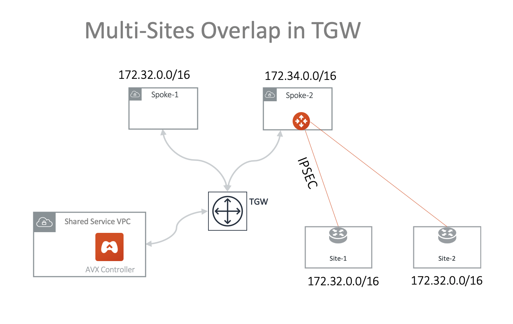
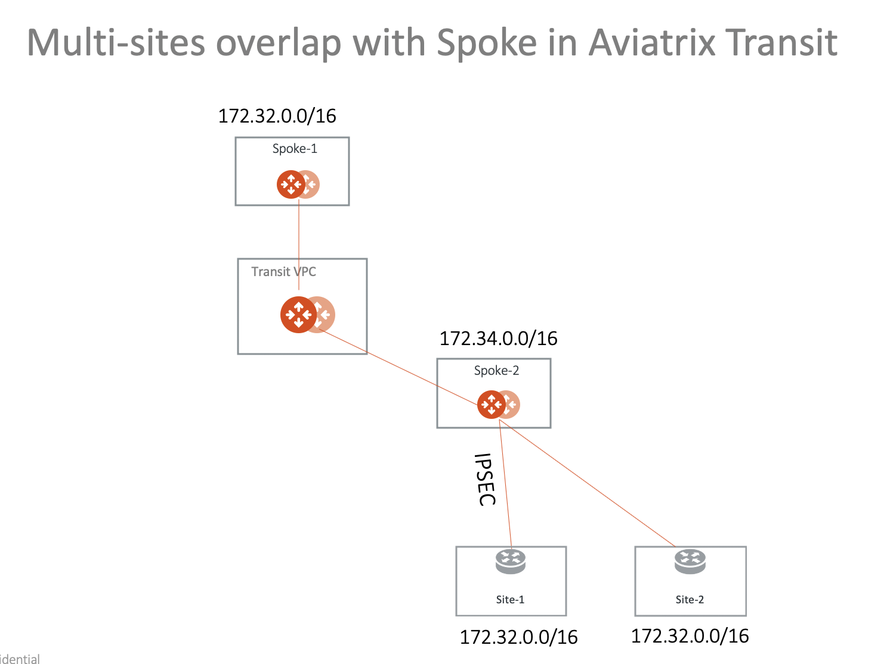
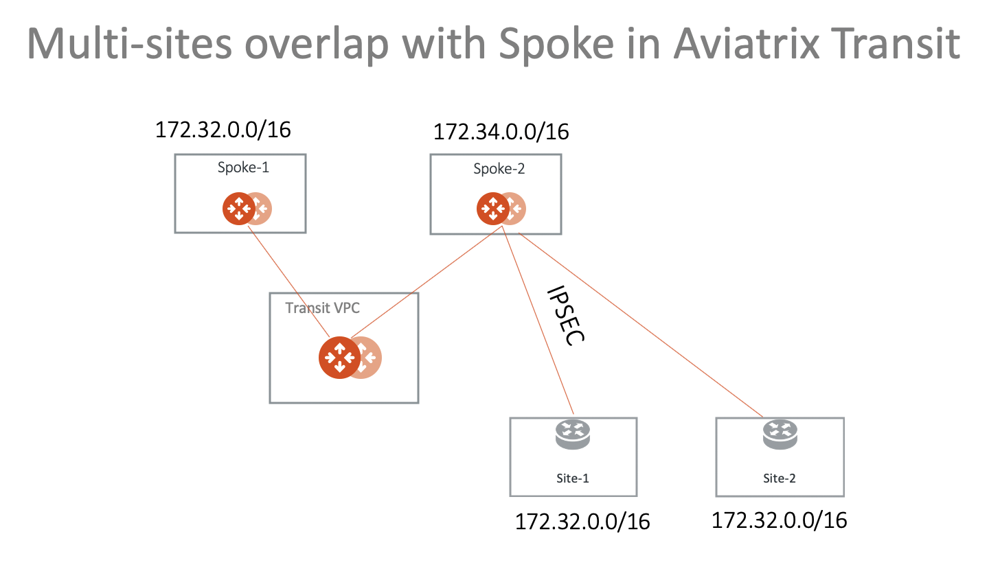

.. meta::
   :description: Create site2cloud connection with overlap network address ranges 
   :keywords: Mapped site2cloud, VGW, SNAT, DNAT, Overlap Network CIDR, overlap CIDRs

===========================================================================================
Overlapping Network Connectivity Solutions
===========================================================================================

This document describes a few scenarios of overlapping networking CIDRs and their solutions. The solution uses the `Mapped` option
of Aviatrix `Site2Cloud <https://docs.aviatrix.com/HowTos/site2cloud.html>`_ feature when building IPSEC tunnels. 

Using Mapped Site2Cloud provides the advantage of not having to configure individual SNAT/DNAT rules, as 
all virtual and physical network addresses are 1-1 translated. 

This document does not go into specifics of the actual configurations. For such information, check out `this example document <https://docs.aviatrix.com/HowTos/connect_overlap_cidrs_routebasedipsec.html>`_.

Scenario 1: On-prem Overlaps with Spoke VPC in TGW Deployment
----------------------------------------------------------------

In this scenario, on-prem site-1 overlaps with Spoke-1 VPC CIDR, they both are 172.32.0.0/16 and wish to communicate with each 
other. The solution is to deploy an Aviatrix gateway in Spoke-2 VPC and build IPSEC tunnel
between Spoke-2 gateway and the on-prem. In the deployment, both Spoke-1 and Spoke-2 are attached to TGW and are in the same Security Domain.  

The diagram is shown below. Note one can launch an Aviatrix gateway in Spoke-1 directly and build the IPSEC tunnel. This example
demonstrates how to use `Spoke VPC Advertised Routes <https://docs.aviatrix.com/HowTos/tgw_list.html#edit-spoke-vpc-advertised-routes>`_ to 
build a more complex network.

.. Tip::

   VPC Spoke-1 is for illustration purpose. The destination network that overlaps with the on-prem site may be on on-prem network that connects with AWS TGW via DXGW or VPN. Similarly, the on-prem network could be a VPC/VNet in the cloud.

|overlap_onprem_tgw|

Following are the steps to setup the above networks. 

 1. Attach VPC Spoke-2 to TGW. Go to TGW Orchestrator -> Build to attach. 
 #. Launch Aviatrix gateway in Spoke-2. Go to Gateway -> Add New to launch. 
 #. (Optional) Enable HA. Go to Gateway -> Gateway for High Availability Peering to enable HA. 
 #. Configure Site2Cloud to site-1 with Mapped Option on Spoke-2. Go to Site2Cloud -> Add New. Key parameters on site2cloud IPSEC configuration: 
	
    ::

       Spoke-2 gateway site2cloud key parameters: 

            Connection Type: Mapped
            Enable HA: Selected (Optional)
            Local Subnet (real): 172.32.0.0/16
            local Subnet (virtual): 192.168.0.0/16
            Remote Subnet (real): 172.32.0.0/16
            Remote Subnet (virtual): 100.100.0.0/16

 #. Configure the on-prem site-1 IPSEC. Key parameters 

    ::

       on-prem site-1 IPSEC key parameters:

            Local Subnet: 172.32.0.0/16
            Remote Subnet: 192.168.0.0/16

 #. Make sure the tunnel come up. 
 
 #. **Important** Advertise 100.100.0.0/16 to TGW from Spoke-2 VPC. Go to TGW Orchestrator -> List. Click Spoke-2, click Actions -> Edit Spoke Advertised Routes. Enter `172.34.0.0/100, 100.100.0.0/16`, where 172.34.0.0/16 is Spoke-2 VPC CIDR and 100.100.0.0/16 is the virtual network CIDR of on-prem site-1. 

 #. Test connectivity. From on-prem site-1 to ping an instance in Spoke-1 using the Spoke-1 virtual network CIDR with the real host portion of its IP address. For example, if the instance in Spoke-1 is 172.32.10.15, then site-1 should ping 192.168.10.15. 

 #. Done. 

Scenario 2: Multi-Sites Overlap in TGW Deployment
-----------------------------------------------------------------

Scenario 1 can be extended to on-prem multi sites that have overlapping or identical network addresses, as shown in the diagram below. 

|overlap_multi_onprem_tgw| 

 1. Attache VPC Spoke-2 to TGW. Go to TGW Orchestrator -> Build to attach.
 #. Launch Aviatrix gateway in Spoke-2. Go to Gateway -> Add New to launch.
 #. (Optional) Enable HA. Go to Gateway -> Gateway for High Availability Peering to enable HA.
 #. Create a Site2Cloud connection to site-1 with Mapped Option on Spoke-2. Key parameters on site2cloud IPSEC configuration:

    ::

       Spoke-2 gateway site2cloud to site-1 key parameters:

            Connection Type: Mapped
            Enable HA: Selected (Optional)
            Local Subnet (real): 172.32.0.0/16
            local Subnet (virtual): 192.168.0.0/16
            Remote Subnet (real): 172.32.0.0/16
            Remote Subnet (virtual): 100.100.0.0/16

 #. Create an on-prem site-1 to Spoke-2 gateway IPSEC connection with an on-prem router or firewall. Key parameters

    ::

       on-prem site-1 IPSEC key parameters:

            Route Based VPN.
            Local Subnet: 172.32.0.0/16
            Remote Subnet: 192.168.0.0/16

 #. Make sure the tunnel come up.

 #. Configure a Site2Cloud to site-2 connection with Mapped Option on Spoke-2. Key parameters on site2cloud IPSEC configuration:

    ::

       Spoke-2 gateway site2cloud to site-2 key parameters:

            Connection Type: Mapped
            Enable HA: Selected (Optional)
            Local Subnet (real): 172.32.0.0/16
            local Subnet (virtual): 192.168.0.0/16
            Remote Subnet (real): 172.32.0.0/16
            Remote Subnet (virtual): 100.200.0.0/16

 #. Create an on-prem site-2 to Spoke-2 gateway IPSEC connection with an on-prem router or firewall. Key parameters

    ::

       on-prem site-2 IPSEC key parameters:

            Route Based VPN.
            Local Subnet: 172.32.0.0/16
            Remote Subnet: 192.168.0.0/16

 #. **Important** Advertise 100.100.0.0/16 100.200.0.0/16 to TGW from Spoke-2 VPC. Go to TGW Orchestrator -> List. Click Spoke-2, click Actions -> Edit Spoke Advertised Routes. Enter `172.34.0.0/100, 100.100.0.0/16, 100.200.0.0/16`, where 172.34.0.0/16 is Spoke-2 VPC CIDR and 100.100.0.0/16 is the virtual network CIDR of on-prem site-1 and 100.200.0.0/16 is the virtual network CIDR of on-prem site-2.

 #. Test connectivity. From on-prem site-1 to ping an instance in Spoke-1 using the Spoke-1 virtual network CIDR with the real host portion of its IP address. For example, if the instance in Spoke-1 is 172.32.10.15, then site-1 should ping 192.168.10.15. 

 #. Test connectivity. From on-prem site-2 to ping an instance in Spoke-1 using the Spoke-1 virtual network CIDR with the real host portion of its IP address. For example, if the instance in Spoke-1 is 172.32.10.15, then site-2 should ping 192.168.10.15. 

 #. Done.

Scenario 3: On-prem Overlaps with Spoke in Aviatrix Transit Deployment
--------------------------------------------------------------------------

In this scenario, Aviatrix Transit solution is deployed and similarly on-prem site
overlaps with a Spoke CIDR where it needs to communicate with, as shown in the diagram below. 

|overlap_onprem_aviatrix_transit|

This scenario currently not supported. It will be available in the future releases.

Scenario 4: Multi-Sites Overlap in Aviatrix Transit Deployment
-----------------------------------------------------------------

This scenario extends the previous solution to include multi sites, as shown in the diagram below. 

|overlap_multi_onprem_aviatrix_transit|

This scenario currently not supported. It will be available in the future releases.

   

.. disqus::    
