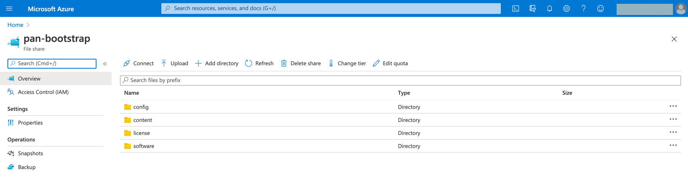

=========================================================
Bootstrap Configuration Example for VM-Series in Azure
=========================================================

Using the bootstrap option significantly simplifies VM-Series initial configuration setup.

In this document, we provide a bootstrap example to set up an to allow HTTPS for Health Check Policy , "Allow All" firewall Policy and Egress NAT policy for the VM-Series to validate
that traffic is indeed sent to the VM-Series for VNet-to-VNet traffic inspection. This example does not use Panorama.

Please use 9.1.0 and above version for better results.

Note that Panorama PAN-OS version should be the same or higher than the firewall VMs when they are added to the Panorama, like, 9.1.0 for both Panorama and VMs.

For a manual setup, follow `manual setup example <https://docs.aviatrix.com/HowTos/config_PaloAltoAzure.html>`_.

Creating a Storage Account and Private Container
---------------------------------------------------------------

Log in to Azure's console and create a storage account and file share in the storage for bootstrap with a **unique** name, for example "pan bootstrap", using this `guide <https://docs.paloaltonetworks.com/vm-series/9-1/vm-series-deployment/bootstrap-the-vm-series-firewall/bootstrap-the-vm-series-firewall-in-azure.html>`_ Step 1 and 2 with the following structure:

::

    Storage Account (e.g. bootstrapstorage)
        File Share (e.g. pan-bootstrap)
            Config/
                init-cfg.txt
                bootstrap.xml
            Content
            License
            Software

|file-share-folder-example|

Uploading Config Files
-----------------------------------

Follow `Step 2.3 <https://docs.paloaltonetworks.com/vm-series/9-1/vm-series-deployment/bootstrap-the-vm-series-firewall/bootstrap-the-vm-series-firewall-in-azure.html>`_ to upload the configuration. Example Bootstrap.xml and config file is provided below.

1. The example bootstrap.xml file contains the "Allow All," Egress and API admin setup. To download the file, click :download:`bootstrap.xml <bootstrap_example_media/bootstrap-azure.xml>`.

2. For the example init-cfg.txt file, click :download:`init-cfg.txt <bootstrap_example_media/init-cfg.txt>`.

.. Note::
	In the example bootstrap.xml, you must specify custom usernames and passwords for the <https_interface_admin_username> and <api_admin_username>, and generate hash strings for the passwords.

*3. Upload these two files to your config folder under Storage Account > File Shares.

Launching the VM-Series Instance
----------------------------------------------

First follow `Step 3 <https://docs.paloaltonetworks.com/vm-series/9-1/vm-series-deployment/bootstrap-the-vm-series-firewall/bootstrap-the-vm-series-firewall-in-azure.html>`_ to get an access key which will be required at a time of VM-Series launch.

Follow `this step <https://docs.aviatrix.com/HowTos/firewall_network_workflow.html#launching-and-associating-firewall-instance>`_ of the Aviatrix Firewall Network (FireNet) workflow.

Fill in the required fields. Click **Advanced**. Fill in the following parameters.

================================  ======================
**Advanced Field**                **Example Value**
================================  ======================
Bootstrap Storage Name              Azure Storage Name (e.g. bootstrapstorage)
Storage Access Key                  Azure Storage key (e.g. XiFiEeCzBLueMDTcKGdxhSV+ZUG3UvnLgfqA==)
File-share Folder                   File Share Folder Name (e.g. pan-bootstrap)
Share-directory (Optional)          Config (Optional)
================================  ======================

Launch the VM-Series instance. Wait for 15 minutes for it to boot up and initialize.

Login to the HTTPS interface of VM-Series management public IP with the username and password specified in the bootstrap.xml file.

Configuring API Vendor Integration
-----------------------------------------------------

In order for the Aviatrix Controller to automatically update firewall instance route tables, monitor the firewall instance health and manage instance failover, you need to setup API access permissions.

Go to Controller > Firewall Network > Vendor Integration > Firewall. Note the following fields.

 -  In the Firewall Login User Name field, use the username specified in the bootstrap.xml file.
 -  In the Firewall Login Password field, use the password specified in the bootstrap.xml file.

If you are manually configuring the firewall from scratch, follow `the instructions here <https://docs.aviatrix.com/HowTos/paloalto_API_setup.html>`_ to enable API access.

Ready to Go
-------------------

Now your firewall instance is ready to receive packets.

The next step is to validate your configurations and polices using FlightPath and Diagnostic Tools (ping, traceroute etc.).

Viewing the Traffic Log
--------------------------------

You can view if traffic is forwarded to the firewall instance by logging in to the VM-Series console. Click **Monitor**. Start ping packets from one Spoke VNet to another Spoke VNet.

Additional References
------------------------------------

Following links from Palo Alto Networks for PAN-OS 8.1 and 9.0 provides additional information.

`Create the init-cfg.txt File <https://docs.paloaltonetworks.com/vm-series/9-0/vm-series-deployment/bootstrap-the-vm-series-firewall/create-the-init-cfgtxt-file.html#id8770fd72-81ea-48b6-b747-d0274f37860b>`_

`Bootstrap the VM-Series Firewall in Azure 9.1 <https://docs.paloaltonetworks.com/vm-series/9-1/vm-series-deployment/bootstrap-the-vm-series-firewall/bootstrap-the-vm-series-firewall-in-azure.html>`_

.. disqus::
