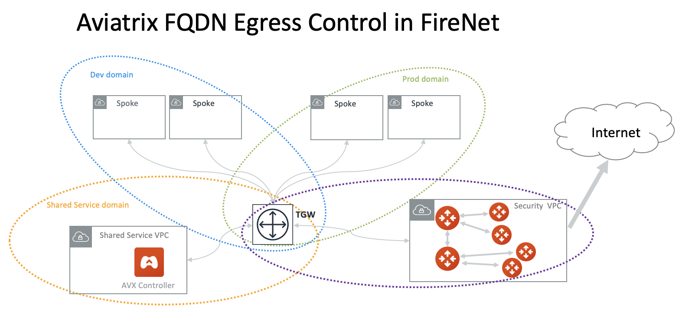

.. meta::
  :description: Private OOB Workflow
  :keywords: AWS Transit Gateway, AWS TGW, TGW orchestrator, Aviatrix Transit network, Transit DMZ, Egress, Firewall, Firewall Network, FireNet

=========================================================
Private OOB Emulation Setup in AWS 
=========================================================

The purpose of this document is to provide instructions to setup an environment to demo or POC 
a Private OOB deployment.

Private OOB is a deployment pattern where Controller and all multi-cloud transit gateways and spoke gateways
are launched in private subnets, that is, when applied to AWS, none of them have EIP or IGW in the subnet associated 
route tables in which these instances are launched. Key characteristics in private OOB deployment are:

 - Accessing the Controller is via its private IP address.  
 - Controller and gateways accessing Internet is via a mechanism other than IGW. 

This document describes an emulation environment that meets the above infrastructure requirement, as shown in the diagram below.

|oob_demo_setup|

The key in this emulation setup is to use a Helper Controller to facilitate accessing the OOB Controller by its private IP address. 
The Helper Controller is also
used to emulate the on-prem by a VPC in which an Aviatrix gateway builds site2cloud and NAT functions for Internet accessing.  

The workflow to setup the emulation environment is as the follows. 

Preparation
--------------

The Controller VPC should have public subnet and its associated route table for the Helper Controller and UserVPN gateway. 
It should also have private subnet and its associate route table for OOB Controller. 

The `Emulate on prem VPC` is a VPC that emulate on-prem environment. 

1. Launch the Helper Controller
---------------------------------

Follow the `Aviatrix Startup Guide <https://docs.aviatrix.com/StartUpGuides/aviatrix-cloud-controller-startup-guide.html>`_ to launch a Helper Controller on a **public subnet** in the Controller VPC, 172.32.0.0/16. This Helper Controller should be accessed by its public EIP. 

2. Launch UserVPN Gateway
-----------------------------

This step is to facilitate accessing the OOB Controller via private IP address from your laptop. 

From the Helper Controller, launch a `UserVPN gateway <https://docs.aviatrix.com/HowTos/uservpn.html>`_, and follow the instructions to 
create a VPN user and download the client certificate. Test to make sure that you can VPN to the UserVPN gateway. 

3. Launch on-prem Gateway
---------------------------

This step is to create a on-prem environment. 

From the Helper Controller, launch an `Aviatrix gateway <https://docs.aviatrix.com/HowTos/gateway.html>`_ on a public subnet with the default gateway size. 

4. Enable Internet Access (Enable NAT)
---------------------------------------

This step enables NAT function on the on-prem gateway for Internet access.  

From the Helper Controller, go to Gateway page, select the on-prem gateway launched above, click Edit. Go to `Source NAT` and 
enable `Single IP` to enable Single IP NAT. 

5. Build IPSEC Tunnel to VGW
-----------------------------

This step is to build an IPSEC tunnel between Controller VPC and on-prem where on-prem advertises the default route 0.0.0.0/0 to the 
Controller VPC. This step facilitates OOB Controller to access Internet. 

AWS native service VGW is used to build the IPSEC tunnel. Follow the instruction `here <https://docs.aviatrix.com/HowTos/site2cloud_awsvgw.html>`_ to build a static IPSEC tunnel. 

Make sure to specify:
  
   a. When configuring VGN Site-to-Site VPN connection, enter 0.0.0.0/0 for the Static IP Prefix field. 
   #. When configuring site2cloud on the on-prem gateway, enter 0.0.0.0/0 for the Local Subnet field. Enter the Controller VPC CIDR (172.32.0.0/16 as in this example) for the Remote Subnet field. 

6. Launch OOB Controller
--------------------------

Follow the `Aviatrix Startup Guide <https://docs.aviatrix.com/StartUpGuides/aviatrix-cloud-controller-startup-guide.html>`_ to launch OOB Controller on a **private subnet** in the Controller VPC, 172.32.0.0/16. After the Controller is launched, disassociate and 
delete its EIP from AWS console (This is optional, take this step to reduce unused EIP cost). 

Once the OOB Controller is up and running, use your VPN client to access its browser interface by the OOB Controller's 
private IP address. 

7. Launch OOB TGW 
-------------------

Private OOB deployment uses AWS Transit Gateway (TGW) for OOB connection between Spoke and Controller. 

From the OOB Controller, go to TGW Orchestrator to launch a TGW. 

8. Build IPSEC tunnel between TGW and on-prem
-----------------------------------------------

This step is to build IPSEC tunnel between TGW and on-prem so that the control plane traffic initiated from Aviatrix Spoke gateways 
and Transit Gateways can access Internet via on-prem through this tunnel. 

Go to OOB Controller -> TGW Orchestrator -> Plan -> Setup AWS Transit Gateway Native Edge Connection. Select TGW VPN. Follow the 
`TGW VPN instruction <https://docs.aviatrix.com/HowTos/tgw_plan.html#setup-aws-transit-gateway-vpn-connection>`_ to complete 
the configure. Make sure to specify 0.0.0.0/0 for the `Remote  CIDRs` field. Once TGW VPN configuration is done, go to AWS Console to 
download the configuration.

From Helper Controller console, go to Site2Clooud to create a connection between on-prem gateway and TGW VPN. Make sure to specify 0.0.0.0/0 for the `Local Subnet` field. The `Remote Subnet` field should include all Spoke and Transit VPC CIDRs. The `Remote Subnet` field can 
be edited later when you spin up new Spoke or Transit VPCs. 

9. Ready to go!
----------------

Now the emulation infrastructure setup is complete. You can start to work from OOB Controller to attache Spoke or Transit VPCs to TGW 
for control plane traffic, and launch Aviatrix Spoke gateways and attach them to Aviatrix Transit gateways for dataplane traffic. 

.. |oob_demo_setup| image:: private_oob_demo_media/oob_demo_setup.png
   :scale: 30%

.. |gw_launch| image:: firewall_network_workflow_media/gw_launch.png
   :scale: 30%

.. |private_interfaces| image:: firewall_network_workflow_media/private_interfaces.png
   :scale: 30%

.. |panvm_bucket| image:: firewall_network_workflow_media/panvm_bucket.png
   :scale: 30%

.. |fqdn_egress| image:: transit_firenet_design_patterns_media/fqdn_egress.png
   :scale: 30%

.. disqus::
