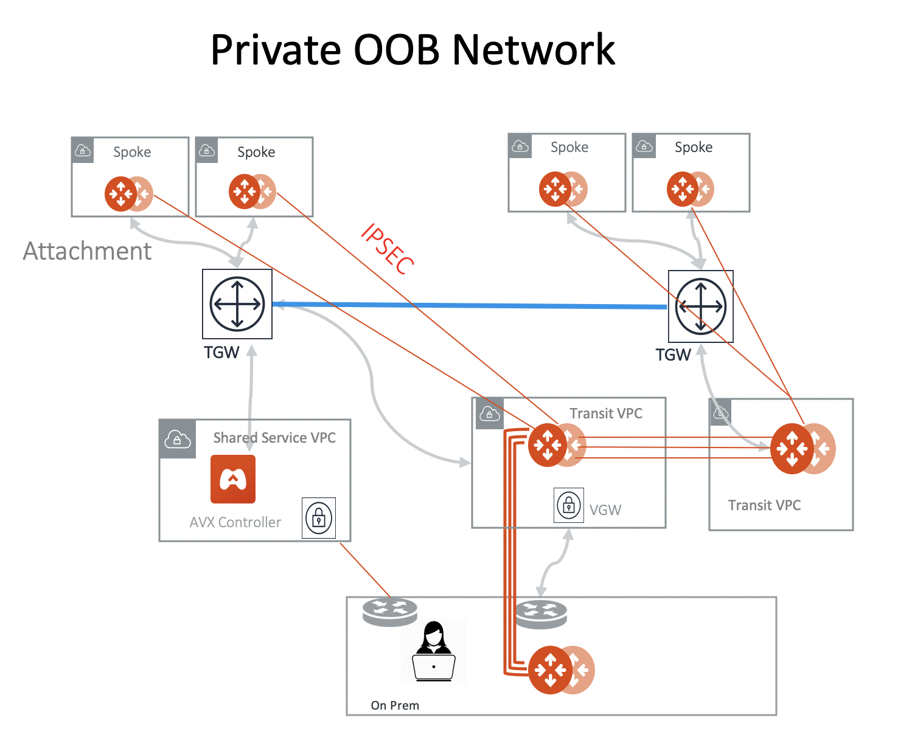

.. meta::
  :description: Private OOB Network Design
  :keywords: AWS Transit Gateway, AWS TGW, TGW orchestrator, Aviatrix Transit network, Firewall, DMZ, Cloud DMZ

==================================================================================================
Private OOB Network Design
==================================================================================================

1. Introduction
---------------

Aviatrix Solution consists of a Controller and a group of gateways, both deployed in the public cloud. Controller and gateways
communicate with each other for management information, such as gateway keep alive messages, tunnel status messages and configuration
change messages.  This management network, call it Out-of-Band (OOB)  is necessary for a distributed system 
where the Controller and gateways may be deployed
in different cloud accounts, regions and even public cloud. By default, the OOB network is run over the Internet, that is, both 
Controller and gateways have public IP addresses and communicate with each other over the Internet. 

However certain environments require that the OOB network to be formed and operated in the private networks for privacy and compliance reasons. 
In such cases, both the Controller and the gateways must take private IP addresses and communicate with each other with private IP addresses 
only. In addition for the private OOB network, the Controller and gateways still require certain Internet access for API calls and 
software upgrades. 

This document describes the design and implementation of private OOB network. The private OOB network is built on an AWS Transit Gateway (TGW) 
based network where Spoke VPCs including the VPC where the Controller is deployed are connected via this OOB TGW.  

2. Design Principals
----------------------

The key design principal is to use cloud provider's native network construct to build a private OOB network, as shown in the diagram 
below in AWS where AWS Transit Gateway is used for building the private OOB for Controller and gateway communications. 

|private_oob_aws|

In the above diagram, Aviatrix Transit solution is deployed as the data plane that connects the Spoke VPCs to on-prem network through Aviatrix Transit Gateways and on-prem Aviatrix CloudN appliance for high performance encryption. A separate network, the private OOB network, 
that connects the Aviatrix Spoke gateways with the Controller is built with TGW where the Controller communicates management information
with the Spoke gateways as TGW attachments. 

If the Controller is deployed in Azure, Azure native transit are used for private OOB network. 

In a multi cloud environment, gateways deployed in the different cloud are expected to have private network connectivity to the Controller. 
This may be accomplished via on-prem network. For example, build a private network connectivity via private circuit or public Internet such 
that network in the different cloud connect with the Controller via on-prem network.

3. Private OOB Deployment 
---------------------------------------

Follow the steps outlined below to deploy private OOB network.

**1. Initial Bootstrap** As Controller instance runs in the public cloud and requires HTTPS access to the Controller, an IPSec VPN connection is required to establish between the Controller and the on-prem data center so that on-prem can access the Controller via its private IP address. 

**2. Launch the Controller** Launch the Controller on a private subnet in a VPC where an IPSec VPN connection has been built from the previous step. 

**3. Deploy TGW** From the Controller, launch a TGW

**4. Attach Shared Service VPC to TGW** Assume the Controller is launched in the shared service VPC, attach this VPC to the TGW.

**5. Attach transit VPC to TGW** From the Controller console or via API, attach the transit VPC to the same TGW. Note only attach the subnet where Aviatrix Transit Gateway management interface will be launched on and packets from gateway to Controller are sent over. 

**6. Attach Spoke VPC to TGW** From the Controller console or via API, attach a Spoke VPC to the same TGW. Do so for all Spoke VPCs. This is the private OOB network where Controller and gateways management information is communicated over. Note only attach the subnet where Aviatrix spoke gateway management interface will be launched on and packets from gateways to Controller are sent over. 

**7. Launch Aviatrix Transit Gateway** From the Controller console or via API, launch Aviatrix Transit Gateway on a private subnet in the transit VPC, copy necessary software to the gateway via TGW attachment connection. 

Once Aviatrix gateways are launched, you can attach Spoke gateways to the Transit Gateway and form the data plane network. 

.. disqus::

