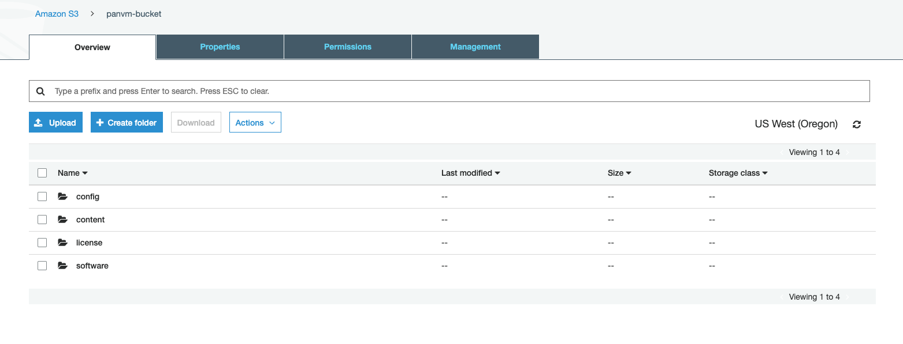

.. meta::
  :description: Private OOB Workflow
  :keywords: AWS Transit Gateway, AWS TGW, TGW orchestrator, Aviatrix Transit network, Transit DMZ, Egress, Firewall, Firewall Network, FireNet

=========================================================
Private OOB Deployment Workflow in AWS
=========================================================

This document describes the general workflow to deploy the multi-cloud transit architecture in an environment where 
there is no IGW in any VPCs, all control plane communications between the Controller and gateways are done via a private
out-of-band (OOB) network. For background information on Private OOB, refer to `Private OOB Design. <https://docs.aviatrix.com/HowTos/private_oob.html>`_

Private OOB Deployment is only applicable to multi-cloud transit solution and transit Firenet solution. 
It does not apply to a deployment where there is any gateway that perform FQDN, site2cloud or UserVPN function. 

In this document, the Controller is referred as OOB Controller.  

1. Initial Bootstrap
------------------------------------------------

The initial bootstrap is about building a private connectivity between the OOB Controller VPC and on-prem 
so that the Controller can be accessed only by its private IP 
address. In addition, accessing to Internet for API calls by both Controller and gateways should be provisioned by customer. 

Refer to `Private OOB Emulation Setup in AWS <https://docs.aviatrix.com/HowTos/private_oob_demo.html>`_ on how to 
setup an on-prem emulation environment for demo and POC (proof of concept). Refer to the example in the emulation
document for the workflow in sections 1, 2, 3 and 4 described below. 

2. Launch OOB Controller on Private Subnet
----------------------------------------------

Use a published CloudFormation script to launch the Controller on a **private subnet**. 

2.1 Launch OOB Controller
~~~~~~~~~~~~~~~~~~~~~~~~~~~~

As an example, launch the `Aviatrix Secure Networking Platform Metered - 24x7 Support` product. Click the link below.

`CloudFormation for Aviatrix Secure Networking Platform Metered - 24x7 Support <https://us-east-2.console.aws.amazon.com/cloudformation/home?region=us-east-2#/stacks/new?stackName=AviatrixController&templateURL=https://s3-us-west-2.amazonaws.com/aviatrix-cloudformation-templates/aws-cloudformation-aviatrix-metered-controller-24x7-support.template>`_

Select a private subnet (instead of a public subnet as displayed in the CFT stack launch parameter) to create a CFT stack. 
When it is completed, a Controller instance is launched. 

2.2 Release EIP
~~~~~~~~~~~~~~~~~

An EIP is associated with the Controller instance as a result of stack creation, 
login to the AWS Console to disassociate the EIP as it is not needed. 

2.3 Access OOB Controller
~~~~~~~~~~~~~~~~~~~~~~~~~~~~~

Login to the Controller web console by connecting to its private IP address over HTTPS. 
`https://controller-private-ip-address` 

2.4 Download the latest software
~~~~~~~~~~~~~~~~~~~~~~~~~~~~~~~~~~

Go through the initial setup steps to download the latest Controller software. 

3. Deploy TGW for OOB Network
-------------------------------

On OOB Controller web console, go to TGW Orchestrator -> Plan -> Create AWS Transit Gateway.  

4. Connect TGW VPN to on-prem
-------------------------------

The requirement for Aviatrix gateways accessing the Internet can be satisfied by building an IPSEC tunnel between 
TGW VPN and on-prem. 

5. Attach OOB Controller VPC to TGW for OOB Communication
------------------------------------------------------------

On OOB Controller console, go to TGW Orchestrator -> Build -> Attach VPC to TGW, to attach OOB Controller VPC to TGW. 

Specifically, 

 - Click the `Advanced` option. 
 - For `Select Subnets` field, select the subnet on which OOB Controller instance was launched. 
 - For `Select Route Tables` field, select the route table associated with the OOB Controller instance subnet. 

6. Enable Private OOB Function on the OOB Controller
------------------------------------------------------

Login to the OOB Controller, go to Settings -> Controller -> Private OOB. Click the sliding bar to enable.

7. Attach Transit VPC to TGW for OOB Communication
-------------------------------------------------------

.. tip::

  Use `Create a VPC <https://docs.aviatrix.com/HowTos/create_vpc.html>`_ to create Transit VPC from OOB Controller. Select the  `Advanced` option and select `Private OOB Subnet`. Also select `Aviatrix Transit VPC` option. This will create a transit VPC  with dedicated 2 OOB subnets in two AZ.

On the OOB Controller console, go to TGW Orchestrator -> Build -> Attach VPC to TGW, to attach Transit VPC to TGW.

Specifically,

 - Click the `Advanced` option.
 - For `Select Subnets` field, select the -OOB-Subnet- (as created by the Create a VPC tool) 
 - For `Select Route Tables` field, select the -OOB-Route-Table- (as created by the Create a VPC tool)

8. Launch Aviatrix Transit Gateway
--------------------------------------------

On the OOB Controller console, go to Multi-cloud Transit -> Launch an Aviatrix Transit Gateway to launch an Transit 
Gateway. 

Specifically, 

  - For `Gateway eth0 Subnet` field, select one auto generated subnet in the same AZ as the `Gateway OOB Management Subnet`. 
  - For `Gateway OOB Management Subnet` field, select the -OOB-Subnet-.   

.. tip::

  To enable Spoke to Spoke communication in a multi-cloud transit architecture, enable `Connected Transit <https://docs.aviatrix.com/HowTos/transit_advanced.html#connected-transit>`_.

9. Attach a Spoke VPC to TGW for OOB Communication
-------------------------------------------------------------

.. tip::

  Use `Create a VPC <https://docs.aviatrix.com/HowTos/create_vpc.html>`_ to create a Spoke VPC from OOB Controller. Select the  `Advanced` option and select `Private OOB Subnet`. This will create a Spoke VPC  with dedicated 2 OOB subnets in two AZ.

On the OOB Controller console, go to TGW Orchestrator -> Build -> Attach VPC to TGW, to attach Spoke VPC to TGW.

Specifically,

 - Click the `Advanced` option.
 - For `Select Subnets` field, select the -OOB-Subnet- (as created by the Create a VPC tool)
 - For `Select Route Tables` field, select the -OOB-Route-Table- (as created by the Create a VPC tool)

10. Launch a Spoke Gateway
--------------------------------------------------------------------

On the OOB Controller console, go to Multi-cloud Transit -> Launch an Aviatrix Transit Gateway to launch 
a spoke gateway.

Specifically,

  - For `Gateway eth0 Subnet` field, select one auto generated subnet in the same AZ as the `Gateway OOB Management Subnet`.
  - For `Gateway OOB Management Subnet` field, select the -OOB-Subnet-.

11. Attach a Spoke Gateway to Aviatrix Transit Gateway
-------------------------------------------------------

On the OOB Controller console, go to Multi-cloud Transit -> Attach Spoke Gateway to Transit Network to attach the Spoke Gateway. Note the OOB Controller automatically excludes the -OOB-Route-Table-. 

12. Build More
---------------

Repeat section 9 to 11 to attach more Spoke VPCs.  

.. |firewall_domain| image:: firewall_network_workflow_media/firewall_domain.png
   :scale: 30%

.. |gw_launch| image:: firewall_network_workflow_media/gw_launch.png
   :scale: 30%

.. |private_interfaces| image:: firewall_network_workflow_media/private_interfaces.png
   :scale: 30%

.. |fqdn_in_firenet| image:: firewall_network_workflow_media/fqdn_in_firenet.png
   :scale: 30%

.. |fqdn_egress| image:: transit_firenet_design_patterns_media/fqdn_egress.png
   :scale: 30%

.. disqus::
