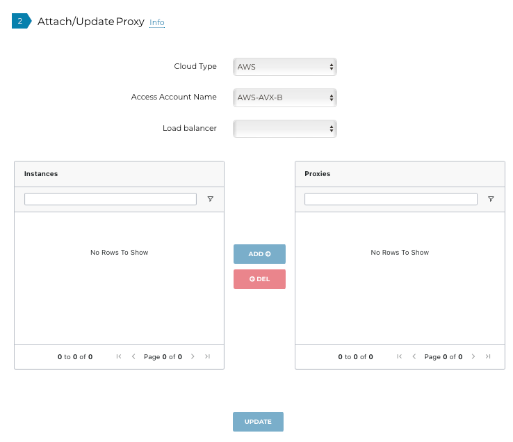

.. meta::
  :description: configuring Private Mode for AWS, AWS GovCloud, Azure, Azure Government	
  :keywords: Private Mode, multi-cloud, single cloud, AWS, AWS GovCloud, Azure, Azure Government

====================
Private Mode
====================

Private Mode is a global setting that offers secure orchestrated intra- and multi-cloud networking by removing the need for public IPs for Aviatrix gateways. Web proxies are used for the gateways to access the internet. All communication is done via native cloud constructs such as Load Balancers, Private Link Services, and peering connections, which act as the underlay for the Aviatrix encrypted Transit network. 

After Private Mode is configured you can create gateways using `Multi-Cloud Transit <https://https://docs.aviatrix.com/HowTos/transitvpc_workflow.html>`_.

|topology-private-mode|

Cloud environments that support this feature are AWS, AWS GovCloud, Azure, and Azure Government. 

+-----------------------+--------------------------------------+
|Controller Location    | Gateways                             |  
+=======================+======================================+
|AWS GovCloud           | AWS, Azure, Azure Government         |
+-----------------------+--------------------------------------+
|AWS                    | AWS GovCloud, Azure, Azure Government|	                
+-----------------------+--------------------------------------+

Prerequisites
--------------

- `Configure the permissions for Private Mode and GWLB-Based FireNet <https://docs.aviatrix.com/HowTos/aviatrix_iam_policy_requirements.html>`_. This is very important; you cannot deploy your Private Mode resources without these permissions. Please see sections 6 and 15 in the referenced document.
- Upgrade to 6.8.
- A Controller in AWS or AWS GovCloud. It is best to set up Private Mode from a new Controller that does not have any previously deployed gateways. Private Mode will not work if you already have gateways deployed in your Controller.
- A version of CoPilot that supports Private Mode, if you want to send syslog or Netflow data to CoPilot from the gateways. 
- If you want to associate a CoPilot instance, it must be in the same VPC as the Controller.
- If setting up Private Mode in a multi-cloud deployment, a private underlay between the CSPs must exist (Direct Connect for AWS or Express Route for Azure). 

Preparing Your Single Cloud Private Mode Environment 
----------------------------------------------------

When you prepare your single cloud Private Mode environment, you are building a Link Service; creating subnets for the Link Service; and attaching Controller/CoPilot/proxy to the Link Service target.

#. To enable Private Mode, in the Controller, navigate to Settings > Private Mode > Controller. After enabling Private Mode:

- All gateways you create will use private IPs. You will not be able to create or deploy non-private gateways. A mixture of public and private IPs is not possible.
- The existing eth0 private IP is used for the Controller. 

2. (optional) If you want to view syslog and Netflow data gathered by the gateways in CoPilot, you can associate a CoPilot instance with the Controller. This ensures that data is sent to CoPilot. On the Controller tab, select a CoPilot instance and click Associate. 

|private-mode-enable|

3. On the Intra-Cloud tab, enter the access account name, region, and VPC ID of the Controller to create a Link Service and click Create. 

|private-mode-intracloud|

This creates a Link Service in the selected region that endpoints in that cloud can connect with. It also attaches the CoPilot instance (if configured) and proxy (configured in the following section; you can configure the AWS proxy first if you like). You are only allowed to create one Link Service per region (AWS and Azure). 

If you associated a CoPilot instance in step 2 above, you must ensure that your CoPilot Security Group is open to the IP addresses you configure when creating the Link Service.

  .. note::
	The expected Link Service configuration for AWS/AWS GovCloud is having one Link Service in each region where you want to launch gateways. However, if you have two AWS/AWS GovCloud accounts, you can have one Link Service used by both accounts in the same region, or you can have a Link Service in each account in the same region.

4. If you have multiple regions in your AWS/AWS GovCloud CSP you must set up a Link Service for each one by repeating the previous step. 

Creating AWS Proxy for Single Cloud Private Mode
^^^^^^^^^^^^^^^^^^^^^^^^^^^^^^^^^^^^^^^^^^^^^^^^

#. You must create a proxy that will sit behind the Link Service and securely direct traffic to the internet. This proxy must be in the same VPC as the Controller where Private Mode is enabled. You must launch this proxy virtual machine in AWS/AWS GovCloud. To create the AWS/AWS GovCloud proxy do the following:
	
	a. Launch your preferred HTTPS proxy; it must be listening on port 3128.
	b. Make sure your proxy security group is open to the the IPs of the Link Service (created in step 3 above). This ensures that the Link Service IPs have access to the proxy. You can find the IP addresses under Settings > Private Mode > List > Link Service List.
	c. Make sure the proxy has access to the internet.

#. After creating this proxy:

	a. Navigate to Private Mode > Controller and add the AWS proxy instance you created. 
	b. Click Update. The proxy instance/VM is now associated with Private Mode and will be attached to the Link Service (assuming you have already created it as per step 3 above).

|private-mode-aws-proxy|

If you are configuring Private Mode in a single cloud, the process is now complete (AWS/AWS GovCloud only). 

Preparing Your Multi-Cloud Environment
--------------------------------------

You must have completed the steps under “Preparing Your Single Cloud Private Mode Environment”. See the table at the beginning of this document for where you can create your multi-cloud endpoints.

In a multi-cloud Private Mode environment, you are creating endpoints in a multi-cloud access VPC attached to the intra-cloud Link Service; building a multi-cloud Link Service; and attaching a multi-cloud proxy (Azure only) to the Link Service target. 

#. On the Multi-Cloud Access tab, enter the Access Account Name, Region, VPC ID of the multi-cloud access VPC, and the Intra-Cloud Link VPC ID you want to connect to. Click Create. This launches an endpoint in the new multi-cloud access VPC for Direct Connect/Express Route to connect to. It also creates the necessary subnets, route tables, and endpoint security groups.

|private-mode-multicloud-access|

2. On the Multi-Cloud Link tab, you create the multi-cloud Link Service and prepare it for the proxy that will be attached in the next step. In Azure, you only need to create multiple Link Services if desired for scalability. Enter the Cloud Type, Access Account Name, Region, VPC ID, and Multi-Cloud Access VPC ID.

|private-mode-multicloud-link|

  .. note::
	You must have already set up the private underlay (cross-cloud link, such as Direct Connect or Express Route) that will connect the two CSPs.
	Also, you only need to create a proxy using the two steps below if you are connecting Azure/Azure Government to your existing AWS/AWS GovCloud CSP. If you are connecting AWS/AWS GovCloud to an existing CSP you can skip these steps. 

3. Create the Azure-related proxy (Azure HTTPS and TCP proxy must be in the same VNet as the Link Service it is associated with):

	a. Launch your preferred HTTPS and TCP proxies. These must be in the same VM as each other.
	b. Set up the HTTPS proxy as per the AWS proxy you created for single cloud (listening on port 3128).
	c. For the TCP proxy, you need to map incoming requests on port 443. Also map ports 31283 (Netflow data) and 5000 (remote syslog) if you want this information to be visible in CoPilot.
	d. For the TCP proxy, the ports should forward requests for ports 443, 31283 and 5000 to the DNS entry for the multi-cloud access endpoint that the proxy is communicating to on the Controller cloud. The DNS entry is located under Settings > Private Mode > List > Multi-Cloud Access Endpoint List.

 .. note::
	If your proxy has a public IP, make sure the SKU is Standard and not Basic.

4. On the Multi-Cloud Link tab under Attach/Update Proxy, enter the Cloud Type, Access Account Name, and Link Service. Only instances that are in the same VNet as the Link Service are listed. 

5. Attach the proxy you just created by clicking Attach and then Update. This proxy server is the Link Service target for traffic from Azure gateways. Only do this if you had to create a proxy for Azure/Azure Government.

|private-mode-multicloud-proxy|

Creating Gateways
-----------------

After completing your single cloud or multi-cloud configuration, you can launch transit or spoke gateways from Multi-Cloud Transit. 

.. note::
	In Private Mode, transit peering always occurs over a private network. If your transit gateway and its backup use HPE/Insane Mode, transmission will always occur over a private network regardless of whether you enable Peering Over Private Networks.

In the Controller, navigate to Multi-Cloud Transit > Setup. On the Transit/Spoke tabs, enter the information required to launch your gateways. For more information see:

- `Launch an Aviatrix Transit Gateway <https://docs.aviatrix.com/HowTos/transitvpc_workflow.html#launch-an-aviatrix-transit-gateway>`_
- `Launch an Aviatrix Spoke Gateway <https://docs.aviatrix.com/HowTos/transitvpc_workflow.html#launch-an-aviatrix-spoke-gateway>`_

Deleting Multi-Cloud Access VPC and Link Service
------------------------------------------------

On the Delete Functions tab you can remove the multi-cloud access endpoint and/or the intra/multi-cloud link service. If you have dependent resources you must resolve the dependencies first.

Disabling Private Mode
----------------------

If you want to disable Private Mode, you must delete all gateways and Private Mode resources. If you do not delete gateways or resources first, you will receive errors when you attempt to disable Private Mode.

Backup/Restore
--------------

When in Private Mode, you can restore the Controller and related Private Mode configuration if the restoration is done in the same VPC as the previous Controller. You cannot restore a Controller that has been created in a different VPC. The restoration will change the targets of the Link Services to the new Controller.

Limitations
-----------

In Private Mode the following Aviatrix functionality is not available:

- Site2Cloud
- AWS TGW
- Controller Security tab
- rsyslog that runs over UDP (Private Mode Load Balancers currently only support TCP)
- You cannot launch gateways in the same VPC/VNet as the Link Service VPC/VNet
- BGP over LAN
- BGP over Spoke
- Transit Connect to External Device (except for BGP over IPSec and Static IPSec)
- Insane mode to Internet
- FQDN Gateway
- Egress through Firewall
- Enable Egress Transit FireNet 
- Software rollback to 6.7 is not supported (since Private Mode did not exist prior to 6.8)

.. disqus: