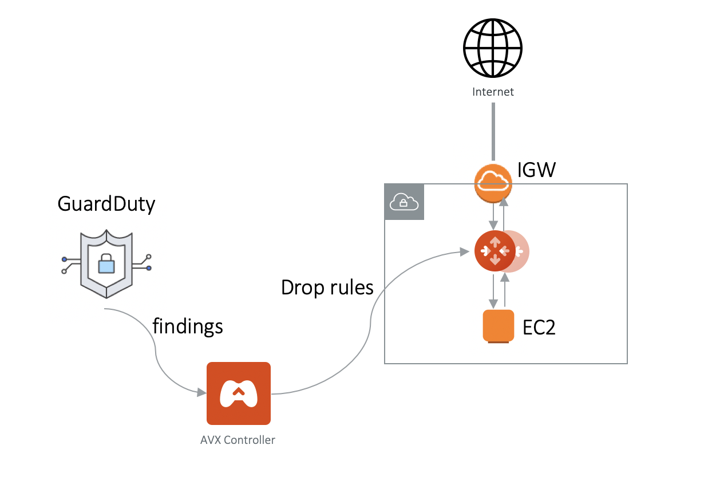

.. raw:: html

   

========================================
 Public Subnet Filtering Gateway FAQ (AWS)
========================================

What does Public Subnet Filtering gateway do?
===============================================

Public Subnet Filtering gateway, PSF gateway, provides both Ingress and Egress security for AWS public subnets where
instances have public IP addresses. It includes two parts: Ingress filtering via GuardDuty enforcement and Egress FQDN. 

Public Subnet Filtering function is described in the diagram below. 

|public_subnet_filter|

Ingress protection via GuardDuty enforcement is a feature where Aviatrix Controller periodically polls 
the AWS GuardDuty findings and blocks the malicious source IP addresses from attacking the public subnet instances
by programming stateful firewall rules in the filtering gateway.  

Egress FQDN is an existing `FQDN feature <https://docs.aviatrix.com/HowTos/fqdn_faq.html>`_ applied to the public 
subnets. Previously, this feature was only available to filter egress traffic initiated from instances in the private subnets. 

How do I deploy a Public Subnet Filtering gateway?
---------------------------------------------------------------

Follow the workflow below. 

Launching a Public Subnet Filtering Gateway 
^^^^^^^^^^^^^^^^^^^^^^^^^^^^^^^^^^^^^^^^^^^^^^^^

Go to Security > Public Subnet > Add New.

===================       =================
Setting                   Value
===================       =================
Cloud Type                AWS
Gateway Name              Input a unique gateway name
Account Name              Select the Access Account
Region                    Select the AWS region
VPC ID                    Select the VPC in the chosen AWS region
Unused Subnet             Aviatrix Controller creates a public subnet and creates a route table associated with the subnet to launch the filtering gateway
Gateway Size              Select an instance type
Route Table               Select a route table whose associated public subnets are protected.  
===================       =================

After the PSF gateway is launched, Ingress traffic from IGW is routed to the gateway in a pass through manner. 
Egress traffic from instances in the protected public subnets is routed to the gateway in a pass through manner. 

Enabling GuardDuty Enforcement
^^^^^^^^^^^^^^^^^^^^^^^^^^^^^^^^^

Go to Security > AWS GuardDuty, select an Access Account and AWS Region > click **Enable**.

Once GuardDuty is enabled, malicious source IP addresses attacking instances in the public subnets in the region 
will be polled by the Controller. The Controller then programs rules into the filtering gateway to drop these packets.

.. Note::

 if you enable AWS GuardDuty without launching the PSF gateway, GuardDuty does not have enforcement functionality.  

Enabling Egress FQDN 
^^^^^^^^^^^^^^^^^^^^^^^^

Once the PSF gateway is launched, you can configure the FQDN feature. 

Go to Security > Egress Control, follow the instructions in `FQDN workflow <https://docs.aviatrix.com/HowTos/FQDN_Whitelists_Ref_Design.html>`_.

How do I view blocked malicious IPs?
-----------------------------------------------

After the filtering gateway is launched and AWS GuardDuty is enabled from the previous steps, view blocked malicious IPs by going
to Security > Public Subnet. Highlight the PSF gateway, click the 3 dots skewer, and click **Show Details**. Scroll down to Blocked Malicious IPs.

Do the public subnet instances keep their public IP addresses with FQDN function?
------------------------------------------------------------------------------------------------------

Yes. When you enable FQDN filtering for public subnets, packets initiated from the instances on the public subnet do not 
get NATed when going through FQDN filtering gateway, and the source public IP address of a public subnet instance is preserved. 

.. add in the disqus tag

.. disqus::
