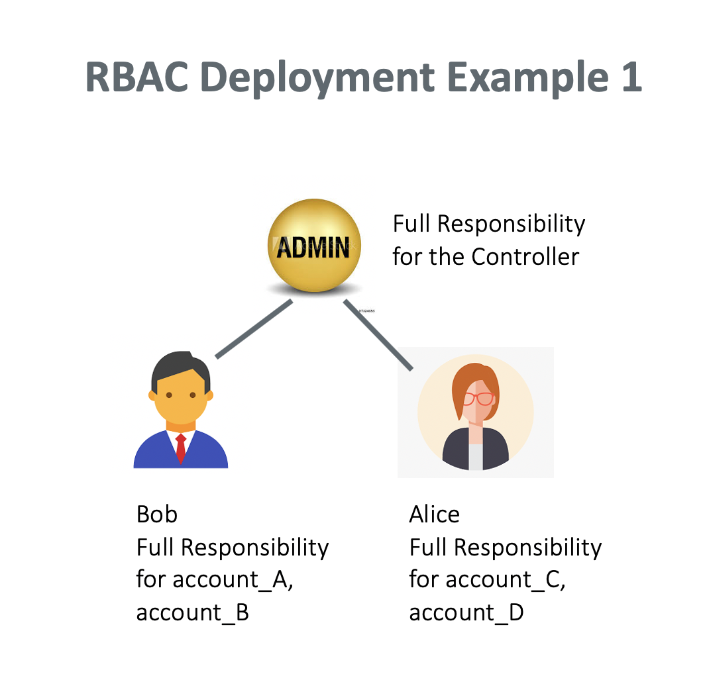
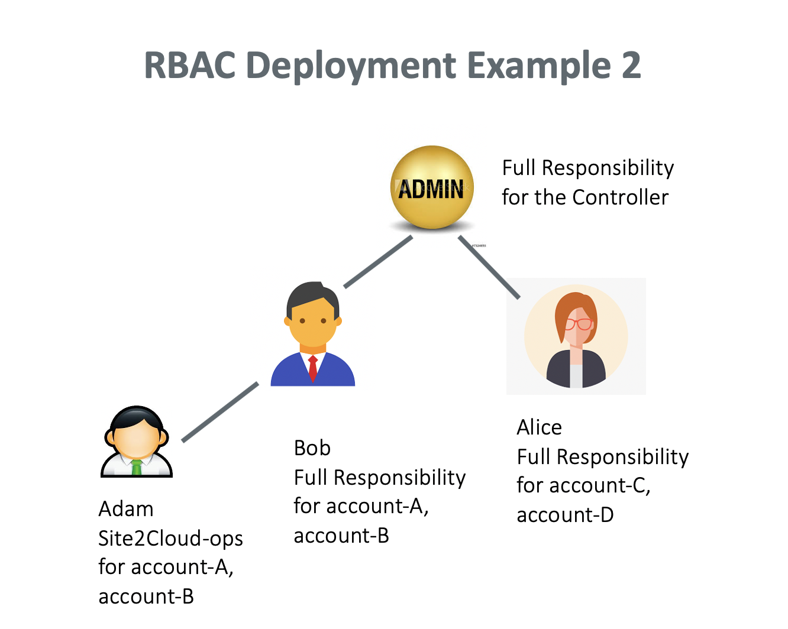
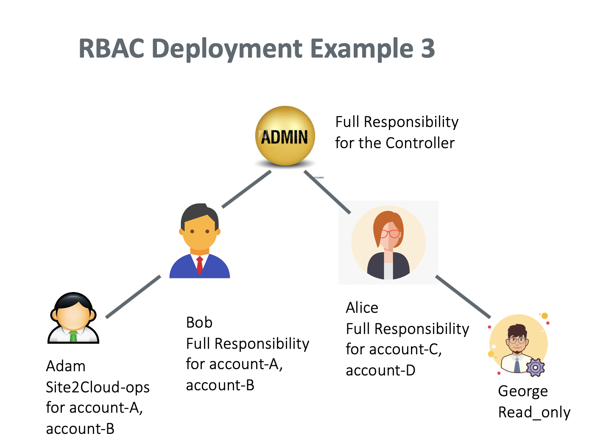
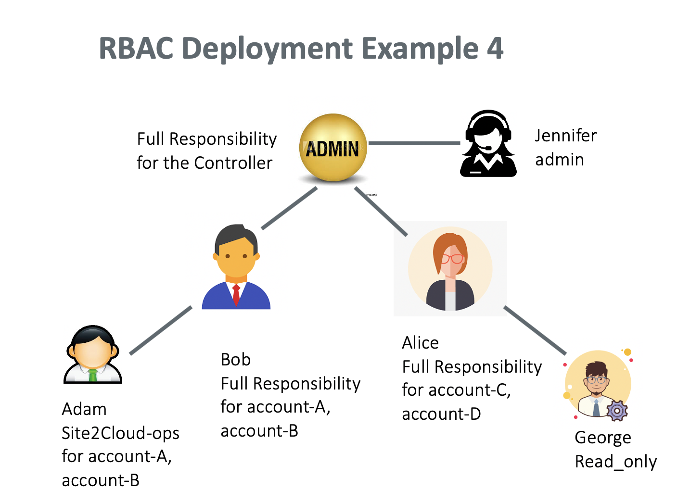
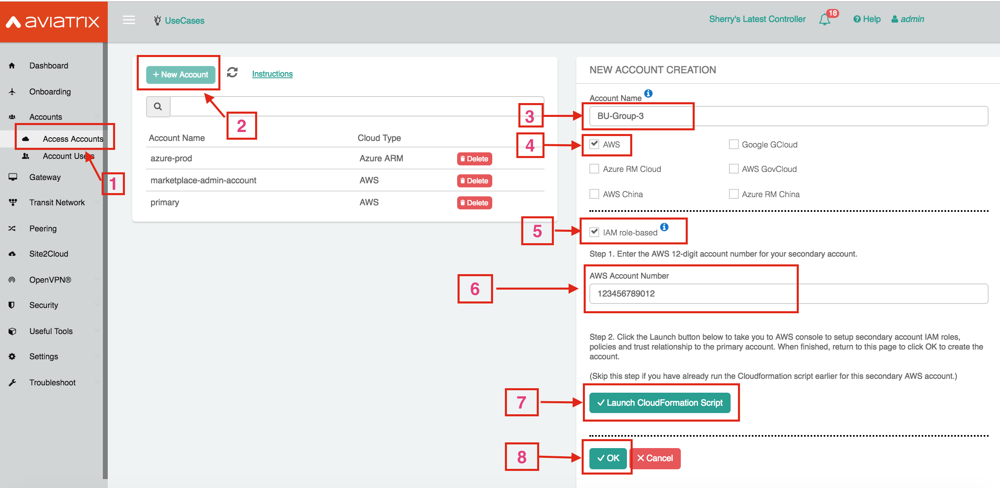

.. meta::
  :description: Role-Based Access Control
  :keywords: account, aviatrix, AWS IAM role, Azure API credentials, Google credentials, RBAC

=================================
Role-Based Access Control FAQ
=================================

What is Aviatrix Role-Based Access Control (RBAC)?
----------------------------------------------------------

The Aviatrix Controller is a multi-cloud and multi-tenant enterprise platform. As such, the Aviatrix Controller manages multiple cloud accounts by requiring access by multiple
administrators. RBAC provides access controls to protect the security and integrity of the Controller while providing the ability to delegate and limit specific Aviatrix features 
to groups defined by the admin of the Controller.

Aviatrix RBAC aims to achieve two objectives:

  - **Granular Access Control** A Controller administrator in a specific permission group can perform certain tasks for a subset of Aviatrix `Access Account <https://docs.aviatrix.com/HowTos/aviatrix_account.html>`_. For example, an Administrative user can be limited to perform on his own AWS account VPC attachment function. 
  - **Self Service** A Controller administrator in a specific permission group can onboard its own cloud accounts on the Controller and perform tasks. For example, a Controller administrator can be allowed to onboard his own AWS account on the Controller and create a group of users for different tasks on this access account. Another use case is for developers to have a read_only login permission to troubleshoot network connectivity issues. 

How does RBAC work?
----------------------

RBAC allows you to create a hierarchy of administrators within the Aviatrix Controller. It has the flexibility to permutate based on your requirements. 

The best way to explain how RBAC works is through examples. Below are a few deployment examples.

RBAC Deployment Example 1
------------------------------------------

In this example, the Controller admin creates a user, Bob, who has full responsibility to access account account-A and account-B. The Controller
admin also creates another user, Alice, who has full responsibility to access account-C and account-D.

|rbac_example_1|

Tasks carried out by an Admin
~~~~~~~~~~~~~~~~~~~~~~~~~~~~

1. The admin creates an account admin group by logging in and navigating to Accounts > Permission Groups > **+Add New**. The admin gives the group a name, such as "account-admins."

.. note:: For every new Permission Group, the admin has two additional options:

 * Toggle Local Login (disabled by default) – This setting determines whether users log into the Controller with a local password vs. an LDAP password. The admin can enable this setting to let users log in with a local password, which will allow users who are not registered in the Active Directory to log into the Controller.
 * Toggle Concurrent Session (enabled by default) – This setting determines whether users can have concurrent sessions, or multiple login sessions per user on different browser sessions. The admin can disable this setting to ensure that a user can only have one login session at a time.

2. The admin gives this group permission to create Access Accounts by navigating to Accounts > Permission Groups. The admin selects the group in the table > **Manage Permission**> **+Add New**. 
3. The admin selects **Accounts** in the list of functions and **OK** to confirm. 
4. The admin creates user Bob to the account_admins group by navigating to Account Users > **+New User**. The admin enters Bob in the name field and completes the other fields. For the field RBAC Groups, the admin selects account-admins created in step 1. 

Tasks carried out by Bob
~~~~~~~~~~~~~~~~~~~~~~~~~

4. Bob should receive an email to invite him to access the Controller. Bob logs in and creates a new permission group with full access by navigating to Accounts > Permission Groups > **+Add New**. He enters a permission group name, for example, "group-bob." 
5. Bob associates himself with the group-bob by navigating to Accounts -> Permission Groups and selecting bob-group. He clicks **Manage users** and selects "Bob" to associate himself with the group. 
6. Bob grants group-bob functional privilege. He navigates to Accounts > Permission Groups and selecting **group-bob**. He clicks **Manage permissions** and then **ALLWrite** to grant group-bob the functional privilege.
7. Bob creates a new Access Account account-A by logging in and navigating to Accounts > Access Accounts > **+Add New**. For the field Attach to RBAC Groups, he selects **group-bob**. This creates an access account that associates a cloud account that Bob manages. For the Account Name field, Bob enters "account-A."

Bob can repeat **Step 7** to create account-B. Now Bob has full functional access to both account-A and account-B.

Apply **Step 3** to **Step 7** for Alice to manage account-C and account-D.

Can Bob assign a teammate with subset of functional privileges?
---------------------------------------------------------------------------------------

Yes. The deployment is shown in the diagram below.

|rbac_example_2|

Bob should perform the following tasks to set it up.

 1. Bob creates a new permission group, such as "Site2Cloud-ops."
 2. Bob assigns himself to the Site2Cloud-ops group.
 3. Bob clicks **Manage permission** for Site2Cloud-ops group to select Site2Cloud permission for the group.
 4. Bob clicks **Manage access accounts** for Site2Cloud-ops group to select account-A. 
 5. Bob creates a new user such as "Adam" and associates Adam to Site2Cloud-ops group. 

After the above tasks, Adam will be able to log in and perform Site2Cloud tasks for account-A. However, Adam cannot perform Site2Cloud 
tasks for Alice's account. 

How do I add a read_only user?
----------------------------------------------

Read_only user has visibility to all pages on the Controller and can perform troubleshooting tasks. A read_only user cannot make modifications to any functions or accounts. 

|rbac_example_3|

In this example, Alice creates a read_only user George. Alice performs the following steps. 

 1. Alice logs in and navigates to Accounts > Account Users > **+Add New**.
 #. Alice adds a user named George and adds a User Name, User Email, and Password. For RBAC Groups, she selects read_only.

Can there be multiple admin users?
----------------------------------------------------------

Yes. Only an admin can add more admin users. An admin user has the same privilege as the login admin with full access 
to all pages and accounts. 

In this example, an admin creates a new admin user, Jennifer. The admin performs the following steps. 

|rbac_example_4|

 1. The admin logs in and navigates to Accounts > Account Users > **+Add New**.
 2. The admin adds a user with the User Name "Jennifer," User Email, Password. For RBAC Groups, the admin selects **admin**. 

Does RBAC support remote authentications?
----------------------------------------------------------

RBAC supports remote authentication against LDAP, Duo, and other SAML IDPs.

For LDAP and Duo, RBAC supports authentication only. The permissions are still validated locally on the Controller. 

For other SAML IDPs, you can configure profile attribute associated with the SAML user for permissions and avoid having to add users on the Controller. 

How do I set up SAML login for RBAC?
-------------------------------------------------

The Aviatrix Controller login supports `SAML login. <https://docs.aviatrix.com/HowTos/Controller_Login_SAML_Config.html>`_ 

You have the option of authorizing users by Controller configuration or through SAML IDP Attribute. 
Go to Settings > Controller > SAML Login > **+ Add New**.

If you select **Set Access By** to be 'SAML IDP attribute', follow the instructions to setup SAML. In the SAML IDP Attribute Statements, add a new attribute, "Profile." 
For the Value field, add the Name of the Permission Groups you configured on the Controller. 

When a user authenticates against SAML IDP, the Controller retrieves the profile attribute and apply permission to the user. 
There is no need to configure account users on the Controller, but you still need to specify Permission Groups 
and their associated permissions. 

If you select **Set Access By** to be "Controller," you need to select an RBAC Group when creating an IDP endpoint. 

.. |account_structure| image:: adminusers_media/account_structure_2020.png
   :scale: 50%

.. disqus::
