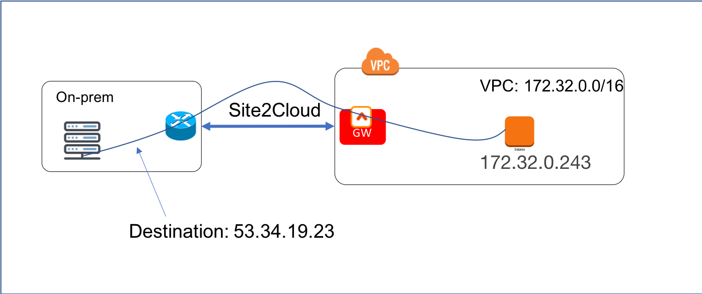
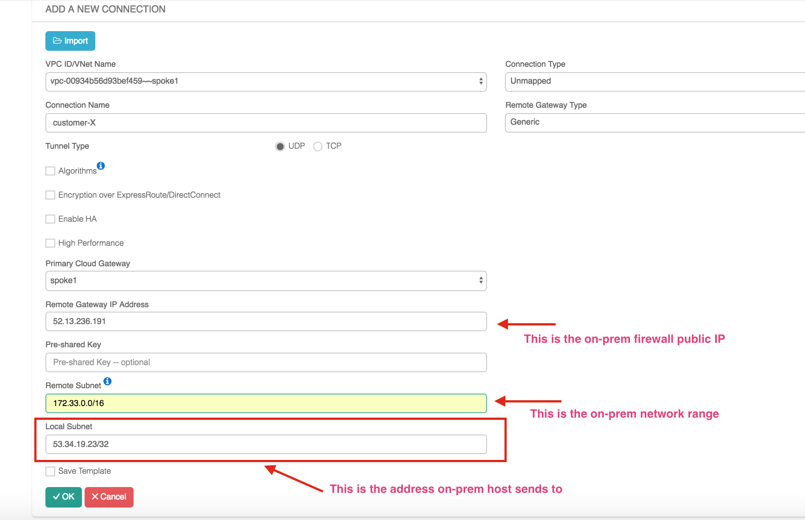
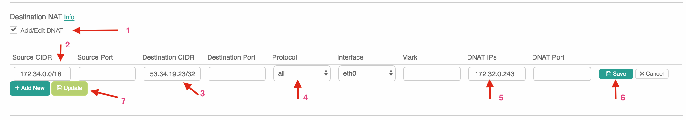

===========================================================================================
Site2Cloud to a Public IP Address 
===========================================================================================

This document addresses the scenario where a customer on-prem firewall device needs to route encrypted 
traffic to a partner network in the cloud (AWS/Azure/GCP). 
However due to concerns for overlapping CIDR blocks to the customer network, the customer side enforces a policy that the destination IP address must be a public IP address regardless if the partner network is in the RFC 1918 range. 

For example, the VPC instance IP address that the on-prem machine 
should send data to is 172.32.0.243, but the on-prem machine must instead send data to a public IP address 53.34.19.23 (or even 100.100.100.100). The scenario is shown in the diagram below. 

|site2cloud-publicIP|

This problem can be solved by combining `Site2Cloud <https://docs.aviatrix.com/HowTos/site2cloud.html>`_ feature and `DNAT <https://docs.aviatrix.com/HowTos/gateway.html#destination-nat>`_ feature. 

Below are the configuration steps. 

Step 1: Determine the public IP address
----------------------------------------

As this public IP address is what the on-prem host sees, it should not change. There are a couple of ways to determine it.

You can allocate an EIP in the VPC for this public IP address. Make sure you don't associate this EIP to any instance.

Alternatively, if the EC2 instance that on-prem hosts need to send data to has an EIP, 
you can use that EIP. 

You can also try a reserved public IP address range, for example, 100.100.x.x range, if the customer does not object. 

Step 2: Follow the Site2Cloud workflow to launch a gateway 
-----------------------------------------------------------

Login to the Controller console, go to Site2Cloud. Follow step 1 to launch a gateway in the VPC 172.32.0.0/16. In this example the gateway name is Spoke1. 

(You can follow the `gateway launch instructions in this <http://docs.aviatrix.com/HowTos/gateway.html>`_. Leave optional parameters unchecked.) 

Step 3: Follow the Site2Cloud workflow to Create a Site2Cloud tunnel
-----------------------------------------------------------------------

Click "+Add New". Fill the form and click OK. 

Note the Local Subnet field is the real or fake public IP address. If there are multiple instances in VPC that needs to be addressed, enter multiple such IP addresses separate them by comma.

|site2cloud-publicIP-config|

Step 4: Download the Configuration Template
---------------------------------------------

Click on the connection just created, the Edit page pops up. Select the Vendor (Generic) and click Download Configuration. This will download a text file with configuration information. 

Send the text file to your customer-X so they'll configure their end. 

Step 5: Configure DNAT
-----------------------

This step is to configure the gateway to translate the destination IP address 53.34.19.23 to the real private IP address 172.32.0.242.

At the main navigation bar, click Gateway. Highlight the gateway, in this case, Spoke1, and click Edit. 

Scroll down to Destination NAT. Follow the instructions `here <https://docs.aviatrix.com/HowTos/gateway.html#destination-nat>`_ to configure, as shown below. Note to use "Connection" field to specify the site2cloud connection name configured in Step 3. 

|dnat-config|

Step 6. Test the Site2Cloud Connection and DNAT
---------------------------------------------------------

Go to the "Site2Cloud" page and verify that the site2cloud connection status is "Up".

Test connectivity from on-prem host to the EC2 instance. For example, ping 53.34.19.23 from an on-prem host machine. The ping should reach 172.32.0.243.  

   

.. disqus::    
