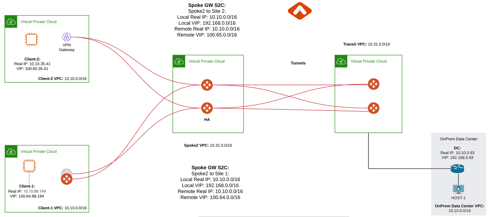

.. meta::
   :description: Site2Cloud Fast Timer and Convergence
   :keywords: site2cloud, convergence, fast timers, overlapping subnets, netmap, ipsec

===========================================================================================
Tuning Sub-10 Seconds Failover Time in Overlapping Networks
===========================================================================================

Introduction
--------------

The purpose of this document is to provide the instructions for tuning network configurations for sub-10 seconds failover time when 
network address ranges on-prem and cloud are overlapping.

The scenario is described in the following diagram:

|s2c_overlapping_cidr_topology|

In the above diagram, Client-1 and Client-2 need to communicate with on-prem network. However, both Client-1 and Client-2 network 
address ranges overlap with each other, and worse yet, they both overlap with on-prem network address range (10.0.0.0/16). Such scenarios
happen when Client-1, Client-2 and the on-prem networks belong to three different organizations. 

The traditional solution is to build IPSEC tunnel between the two networks and use SNAT/DNAT rules to translate each addresses, as
demonstrated in this `example. <https://docs.aviatrix.com/HowTos/connect_overlap_cidrs.html>`_. Such solution requires a potentially
large number of SNAT/DNAT rules which is difficult to configure and maintain.

With the introduction of `Mapped Site2Cloud for address overlapping networks <https://docs.aviatrix.com/HowTos/overlapping_network_solutions.html>`_ , you no longer need to wrestle with the individual SNAT/DNAT rules. 

Configuration Steps
----------------------------

.. note::
    This example uses Aviatrix Gateway on client site to simulate fast convergence environment

Step 1: Follow the Multi-Cloud Transit workflow to launch gateways
~~~~~~~~~~~~~~~~~~~~~~~~~~~~~~~~~~~~~~~~~~~~~~~~~~~~~~~~~~~~~~~~~~~~

Log in to the Controller console, go to Multi-CLOUD TRANSIT. Follow step 1, step 4 and step 6 respectively to launch transit and spoke gateways, and attach spoke gateways to transit.

Create VPN tunnel between Transit Gateway and On-prem.

Step 2: Create a Site2Cloud tunnel between Spoke Gateway and Client-1
~~~~~~~~~~~~~~~~~~~~~~~~~~~~~~~~~~~~~~~~~~~~~~~~~~~~~~~~~~~~~~~~~~~~~~~

2.1 Configure S2C from Spoke Gateway to Client-1
##################################################

Go to Controller Console -> Site2Cloud -> Setup.

Click "+Add New". Fill the form and click OK. Select "Mapped" for the Connection Type field.

==================================================                =======================================================================
  **Field**                                                         **Value**
==================================================                =======================================================================
  VPC ID/VNet Name                                                  Choose VPC ID  (Select Spoke Gateway VPC)
  Connection Type                                                   Mapped
  Connection Name                                                   Arbitrary (e.g. S2C-SPK-to-Client1)
  Remote Gateway Type                                               Aviatrix
  Tunnel Type                                                       Route-based
  Algorithms                                                        Uncheck this box
  IKEv2                                                             Uncheck this box
  Over Private Network                                              Uncheck this box
  Enable HA                                                         Check this box
  Primary Cloud Gateway                                             Select the Aviatrix Gateway created above
  Backup Gateway                                                    Select the Aviatrix Gateway HA
  Remote Gateway IP Address                                         Public IP of Client-1 Primary Gateway
  Remote Gateway IP Address (Backup)                                Public IP of Client-1 Backup Gateway
  Pre-shared Key                                                    Optional (auto-generated if not entered)
  Same Pre-shared Key as Primary                                    Check this box
  Custom Mapped                                                     Uncheck this box
  Remote Subnet (Real)                                              10.10.0.0/16 (Client-1 Real CIDR)
  Remote Subnet (Virtual)                                           100.64.0.0/16 (Client-1 Virtual CIDR)
  Local Subnet  (Real)                                              10.10.0.0/16 (On-Prem Network CIDR)
  Local Subnet  (Virtual)                                           192.168.0.0/16 (On-Prem Virtual CIDR)
==================================================                =======================================================================

2.2 Configure S2C from Client Side
##################################################

Go to Controller Console -> Site2Cloud -> Setup.

Click "+Add New". Fill the form and click OK. Select "unmapped" for the Connection Type field.

==================================================                =======================================================================
  **Field**                                                         **Value**
==================================================                =======================================================================
  VPC ID/VNet Name                                                  Choose VPC ID  (Select Client-1 VPC)
  Connection Type                                                   Unmapped
  Connection Name                                                   Arbitrary (e.g. S2C-Client1-to-SPK-GW)
  Remote Gateway Type                                               Aviatrix
  Tunnel Type                                                       Route-based
  Algorithms                                                        Uncheck this box
  IKEv2                                                             Uncheck this box
  Over Private Network                                              Uncheck this box
  Enable HA                                                         Check this box
  Primary Cloud Gateway                                             Select the Aviatrix Gateway created above
  Backup Gateway                                                    Select the Aviatrix Gateway HA
  Remote Gateway IP Address                                         Public IP of Spoke Primary Gateway
  Remote Gateway IP Address (Backup)                                Public IP of Spoke Backup Gateway
  Pre-shared Key                                                    Optional (auto-generated if not entered)
  Same Pre-shared Key as Primary                                    Check this box
  Remote Subnet                                                     192.168.0.0/16 (On-Prem Virtual CIDR)
  Local Subnet                                                      10.10.0.0/16 (Client-1 Local Network CIDR)
==================================================                =======================================================================

Step 3: Configure global parameters
~~~~~~~~~~~~~~~~~~~~~~~~~~~~~~~~~~~~~

Go to Controller Console -> Settings -> Advanced

1) Click on "Tunnel" tab and change "Status Change Detection Time" and save settings.

==================================================                =======================================================================
  **Field**                                                         **Value**
==================================================                =======================================================================
  Aviatrix Entity                                                  Choose Controller
  Detecion time (secs)                                             20
==================================================                =======================================================================

2) Click on "Keepalive" tab and modify Keepalive Template Configuration

==================================================                =======================================================================
  **Field**                                                         **Value**
==================================================                =======================================================================
  Keep Alive Speed                                                 fast
==================================================                =======================================================================

Step 4: Configure site2cloud parameters
~~~~~~~~~~~~~~~~~~~~~~~~~~~~~~~~~~~~~~~~~~

Go to Aviatrix Controller's Console -> Site2Cloud -> Setup.

4.1 Spoke Gateway Side
########################

Select Spoke Gateway VPC, spoke gateway to client site2cloud connection and click "Edit"

1) Make sure only one tunnel is UP and HA status Active-Standby
2) DPD Timer is enabled, configure DPD timers as shown below and click "Save and Apply".

==================================================                =======================================================================
  **Field**                                                         **Value**
==================================================                =======================================================================
  Initial Delay                                                      1
  Retry                                                              1
  Maxfail                                                            1
==================================================                =======================================================================

3) Forward Traffic to Transit Gateway is enabled
4) Event Triggered HA is enabled

4.2 Client Side
########################

Select Client VPC, client to spoke site2cloud connection and click "Edit"

1) Make sure only one tunnel is UP and HA status Active-Standby
2) DPD Timer is enabled, configure DPD timers as shown below and click "Save and Apply".

==================================================                =======================================================================
  **Field**                                                         **Value**
==================================================                =======================================================================
  Initial Delay                                                      1
  Retry                                                              1
  Maxfail                                                            1
==================================================                =======================================================================

3) Active Active HA is disabled
4) Event Triggered HA is enabled

Test site2cloud fast convergence
------------------------------------

Bring down IPSec primary tunnel and measure convergence.

Done.

.. disqus::

