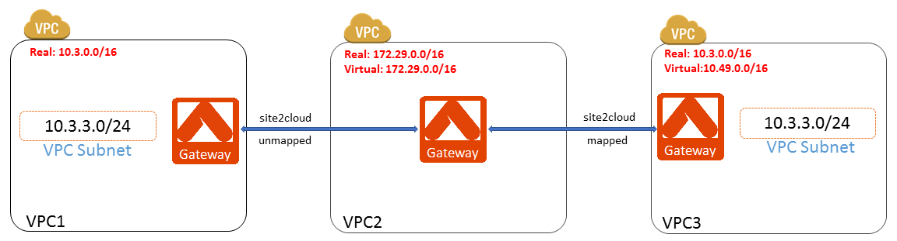

===========================================================================================
Site2Cloud with NAT to fix overlapping VPC subnets 
===========================================================================================

This document provides a reference design for solving issues in reaching VMs in two overlapping subnets within two different VPCs.

|
Environment Description
---------------------------------------------------------

There are three VPCs as illustrated in the diagram below. 

+ **VPC1**: VPC CIDR - 10.3.0.0/16
+ **VPC2**: VPC CIDR - 172.29.0.0/16
+ **VPC3**: VPC CIDR - 10.3.0.0/16

|image1|

Both VPC1 and VPC2 have a subnet with the same CIDR (10.3.3.0/24). VPC2 VMs need to access both VPC1 and VPC3 VMs in their 10.3.3.0/24 subnets. Since VPC1 VMs may change their private IP addresses after some unplanned reboots, VPC2 VMs have to access them through DNS. In addition, VPC2 VMs need to access VPC3 VMs through their private IP addresses.   

To solve this overlapping subnet issue, we need to create two Site2Cloud connections:

+ **Site2Cloud connection 1**: Unmapped Site2Cloud connection between VPC1 and VPC2
+ **Site2Cloud connection 2**: Mapped Site2Cloud connection between VPC2 and VPC3 

Detailed configuration steps are illustrated below.

|
Steps to Configure Site2Cloud Connections
---------------------------------------------------------

+ **Step 1: Install Aviatrix gateways in VPC1, VPC2 and VPC3.**

Install the Aviatrix Gateways by following the instructions in this `document <http://docs.aviatrix.com/HowTos/gateway.html>`__ 

Don't select "Enable SNAT" when creating the new gateways in these VPCs.

+ **Step 2: Create an unmapped Site2Cloud connection at the Aviatrix Gateway in VPC2 for the connection to VPC1**

Go to the **Site2Cloud** page and click the **Add New** button. Enter the following fields. 

===========================================   ======================================================
  **Field**                                    **Value**
===========================================   ======================================================
VPC ID/VNet Name                              Enter VPC2 VPC ID                                    
Connection Type                               Select **Unmapped**                                  
Connection Name                               Enter any name here
Remote Gateway Type                           Select **Aviatrix**
Tunnel Type                                   Select **UDP**
Algorithms                                    Leave it blank
Encryption over ExpressRoute/DirectConnect    Leave it blank
Registered                                    Leave it blank
Enable HA                                     Leave it blank
Primary Cloud Gateway                         Select Aviatrix Gateway in VPC2
Remote Gateway IP Address                     Enter the public IP of Aviatrix Gateway in VPC1
Pre-shared Key                                Leave it blank (Pre-shared key will be auto-generated)
Remote Subnet                                 Enter VPC1 CIDR (10.3.0.0/16 in this case)
Local Subnet                                  Leave it blank (VPC2 CIDR will be used by default)
===========================================   ======================================================

+ **Step 3: Download the sample configuration from the Site2Cloud created in Step 2**

After the Site2Cloud connection is created in Step 2, select this connection at the **Site2Cloud** page. 

Enter the following fields and click **Download Configuration** button 

=========================   ============================================
  **Field**                  **Value**
=========================   ============================================
Vendor                      Select **Aviatrix**
Platform                    Select **UCC**
Software                    Select **1.0**
=========================   ============================================

Save the downloaded sample configuration locally at your PC. 

+ **Step 4: Import the sample configuration downloaded from Step 3**

Go to **Site2Cloud** page and click the **Add New** button. 

Select VPC1 VPC ID from **VPC ID/VNet Name** and click the **Import** button. 

Import the sample configuration downloaded from Step 3.

+ **Step 5:  Create a mapped Site2Cloud at Aviatrix Gateway in VPC2 for the connection to VPC3**

Go to the **Site2Cloud** page and click the **Add New** button. Enter the following fields.

==========================================   ======================================================
  **Field**                                   **Value**
==========================================   ======================================================
VPC ID/VNet Name                             Enter VPC2 VPC ID
Connection Type                              Select **Mapped**
Connection Name                              Enter any name here
Remote Gateway Type                          Select **Aviatrix**
Tunnel Type                                  Select **UDP**
Algorithms                                   Leave it blank
Encryption over ExpressRoute/DirectConnect   Leave it blank
Registered                                   Leave it blank
Enable HA                                    Leave it blank
Primary Cloud Gateway                        Select Aviatrix Gateway in VPC2
Remote Gateway IP Address                    Enter the public IP of Aviatrix Gateway in VPC3
Pre-shared Key                               Leave it blank (Pre-shared key will be auto-generated)
Remote Subnet(Real)                          Enter VPC3 CIDR (10.3.0.0/16 in this case)
Remote Subnet(Virtual)                       Enter the virtual CIDR (10.49.0.0/16 in this example)
Local Subnet(Real)                           Enter VPC2 CIDR (172.29.0.0/16 in this case)
Local Subnet(Virtual)                        Enter VPC2 CIDR again (172.29.0.0/16 in this case)
==========================================   ======================================================

.. note::

  **a.** For Remote Subnet, we want to map the real subnet CIDR (10.3.0.0/16) to the virtual subnet CIDR (10.49.0.0/16). The masks of both real and virtual subnets have to be the same (/16 in this case). The IP addresses in real and virtual subnets are one-to-one mapping by translating 10.3.x.y to 10.49.x.y. For example, for VPC2 VM to reach 10.3.1.100 in VPC3, VPC2 VM needs to use IP address 10.49.1.100.

  **b.** For Local Subnet, we don't need to map the real subnet CIDR (172.29.0.0/16) to a different virtual subnet CIDR because 172.29.0.0/16 in VPC2 doesn't conflict with any subnet in VPC1 and VPC3. So we use 172.29.0.0/16 for both Real Local Subnet and Virtual Local Subnet.

+ **Step 6: Download the sample configuration from the Site2Cloud created in Step 5**

After the Site2Cloud connection is created in Step 5, select this connection at the **Site2Cloud** page.

Enter the following fields and click the **Download Configuration** button

=========================   ============================================
  **Field**                  **Value**
=========================   ============================================
Vendor                      Select **Aviatrix**
Platform                    Select **UCC**
Software                    Select **1.0**
=========================   ============================================

Save the downloaded sample configuration locally at your PC.

+ **Step 7: Import the sample configuration downloaded from Step 6**

Go to **Site2Cloud** page and click the **Add New** button.

Select VPC3 VPC ID from **VPC ID/VNet Name** and click the **Import** button.

Import the sample configuration downloaded from Step 6.

+ **Step 8: Verify that the Site2Cloud connections are up**

Go to **Site2Cloud** page and verify that **Status** of all four Site2Cloud connections are **Up**. It may take several minutes for **Status** to be updated to **Up**. To troubleshoot the connections, please go to **Site2Cloud->Diagnostics** page.

   
.. disqus::    
