=========================================================================================
Site2Cloud with Customized SNAT and DNAT to a virtual ip address
=========================================================================================

This technical note provides a step-by-step configuration on Aviatrix controller that will address the following requirements:

1. An EC2 instance with private ip address 172.31.72.13 in VPC will need to reach a device in a customer on-premise network.

2. The EC2 instance will only use a virtual ip address 172.27.254.100 when it needs to access the remote on-premise device.

3. The remote on-premise device will see the EC2 instance traffic as coming from 10.123.51.100 instead of the actual 172.31.72.13.

4. The remote on-prem device will access the EC2 instance in the VPC using the 10.123.51.100 instead of the actual 172.31.72.13. 

5. The EC2 instance will see the traffic from on-premise as coming from 172.27.254.100.

In this example, we will use 2 Aviatrix gateways to simulate the cloud VPC and on-premise network.

 - Cloud VPC: 172.31.72.0/24
 - Cloud-EC2: 172.31.72.13/32
 - Onprem VPC:10.23.75.0/24 (simulating on-premise internal network)
 - Onprem-EC2: 10.23.75.7/32 (simulating on-premise device)

In the diagram below, both Aviatrix gateways (demo1-ptp-cloud and demo1-ptp-onprem) will build a Site2Cloud to a VGW.

|s2c_snat_dnat1_01|

We will configure customized SNAT and DNAT at Aviatrix gateway demo1-ptp-cloud, which translates the source IP of traffic initiated from Cloud-EC2 172.31.72.13 to an user defined IP address (10.123.51.100 in this example). In this way, Onprem-EC2 will see all packets from Cloud-EC2 with the source IP address (10.123.51.100) when the Cloud-EC2 attempts to access the virtual ip address 172.27.254.100.

We also need to configure the relevant SNAT and DNAT to meet the requirement in which traffic initiated from Onprem-EC2 will reach the Cloud-EC2 using the 10.123.51.100. Traffic from on-premise will be seen as coming from 172.27.254.100.

Create Aviatrix gateways
------------------------
1. Create Aviatrix gateway in Cloud VPC

 - Follow the instructions in this `document <http://docs.aviatrix.com/HowTos/gateway.html>`__ to create an Aviatrix gateway (we use demo1-ptp-cloud as the gateway name and us-east-2 region in this example) in the Cloud VPC (172.31.72.0/24) without selecting "Enable SNAT".

2. Create Aviatrix gateway in Onprem VPC

 - If you are building the actual Site2Site VPN from your remote onprem device (router/firewall) to the VGW, you may skip this step 2. Else, follow the instructions in this `document <http://docs.aviatrix.com/HowTos/gateway.html>`__ to create an Aviatrix gateway (we use demo1-ptp-onprem and us-east-2 region in this example) in the Onprem VPC (10.23.75.0/24) without selecting "Enable SNAT".

Create a Site2Cloud connection between Aviatrix GW and VGW
----------------------------------------------------------
.. Note:: In the Aviatrix terminology, Site2Cloud is the name of the feature that enables connections from one site (or datacenter) to other sites (including cloud environments).
..

1. Go to AWS console in us-east-2 (Ohio) region. Click on Services and go to VPC Dashboard.

2. Click on Virtual Private Gateways at the left panel and create a Virtual Private Gateway.

3. Click on the Site-to-Site VPN Connections at the left panel and click "Create VPN Connection" to create an IPsec tunnel to demo1-ptp-cloud EIP with static route 10.123.51.0/24.

4. Select the VPN connection that you just created and click "Download Configuration" to download the "Generic" configuration.

5. At Aviatrix Controller UI, click Site2Cloud at the navigation panel.

6. Click "Add New" to configure the Site2Cloud connection.

  |s2c_snat_dnat1_02|

7. Click on Site2Cloud > Diagnostics page and verify that the IPsec tunnel is established between demo1-ptp-cloud and the VGW. Please note that it may take a few minutes for the tunnel status as UP at the Site2Cloud page.

  |s2c_snat_dnat1_03|

8. Since we are using another Aviatrix gateway demo1-ptp-onprem to simulate the on-premise device, click on the Site-to-Site VPN Connections at the left panel in AWS portal. Click "Create VPN Connection" to create an IPsec tunnel to demo1-ptp-onprem EIP with static route 10.23.75.0/24. If you are connecting the actual remote device to the VGW, you will create the VPN connection with the remote device public IP.

9. Repeat step 4 through 7 for the new VPN connection created in step 8. The following screenshots show Site2Cloud configuration that simulate the on-premise network.

  |s2c_snat_dnat1_04|

  |s2c_snat_dnat1_05|

Configure Customized SNAT and DNAT at Aviatrix gateway
------------------------------------------------------
1. Log into the Controller and go to "Gateway" page.

2. Select the Aviatrix gateway demo1-ptp-cloud previously created.

3. Click "Edit" button and go to "Source NAT" section.

4. Select "Customized SNAT".

5. Configure the following SNAT rule.

|s2c_snat_dnat1_06|

6. Click "Save" and "Enable SNAT" buttons

7. Configure the following DNAT rule.

|s2c_snat_dnat1_07|

8. Click "Save" and "Update" buttons

Validate the connectivity
-------------------------
1. At Cloud-EC2 instance, ping to the virtual ip address 172.27.254.100. Turn on "tcpdump icmp -n" at Onprem-EC2 instance to verify the source IP of the icmp ping.

|s2c_snat_dnat1_08|

|s2c_snat_dnat1_09|

2. At Onprem-EC2 instance, ping to the virtual ip address 10.123.51.100. Turn on "tcpdump icmp -n" at Cloud-EC2 instance to verify the source IP of the icmp ping.

|s2c_snat_dnat1_10|

|s2c_snat_dnat1_11|

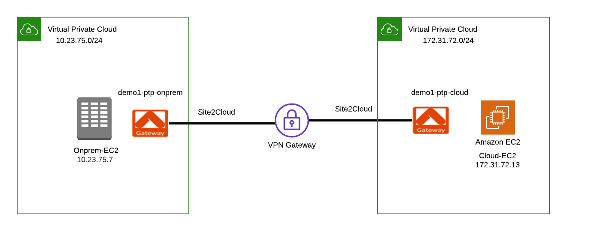
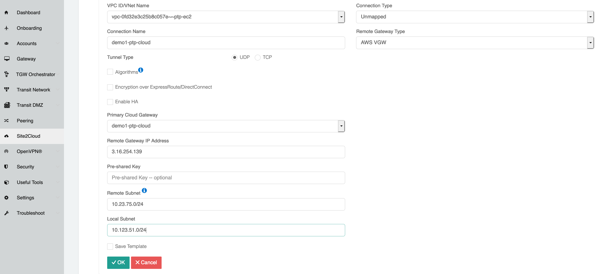
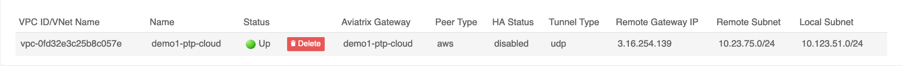
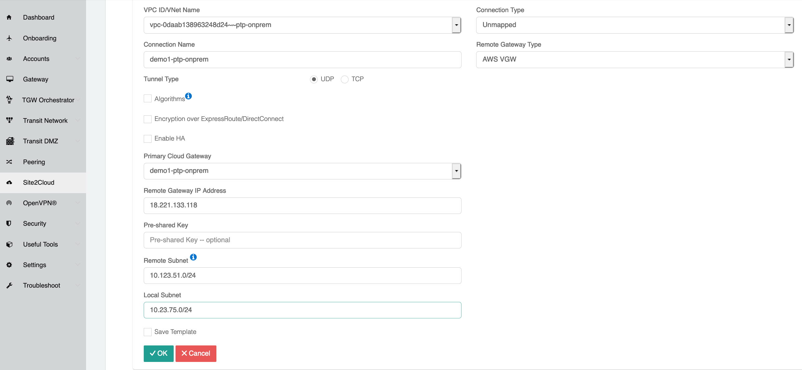
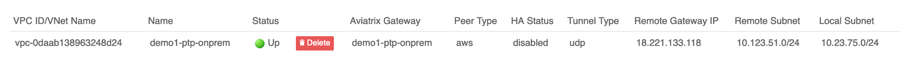
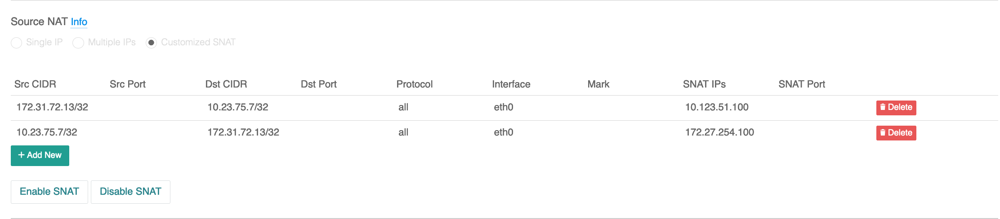
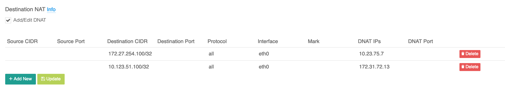
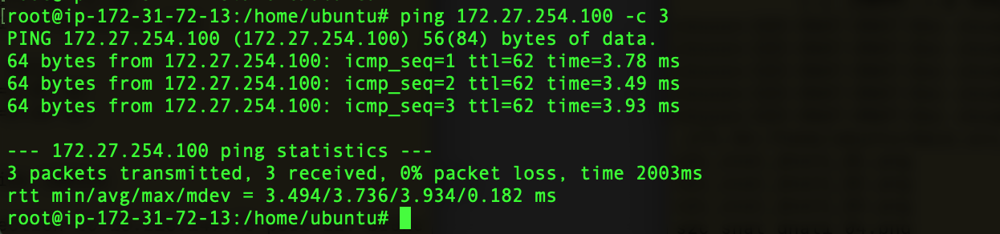
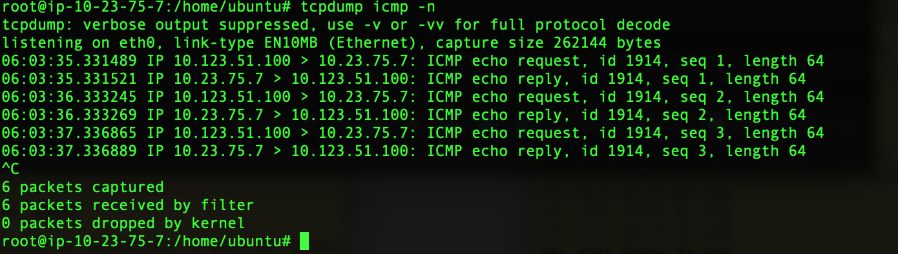
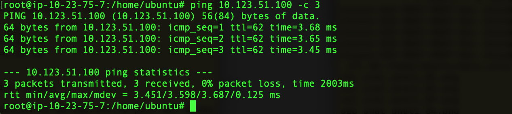
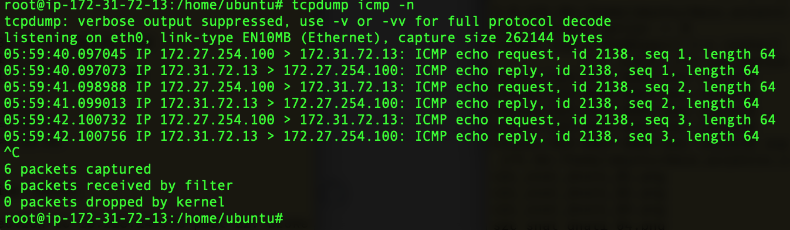

.. disqus::
