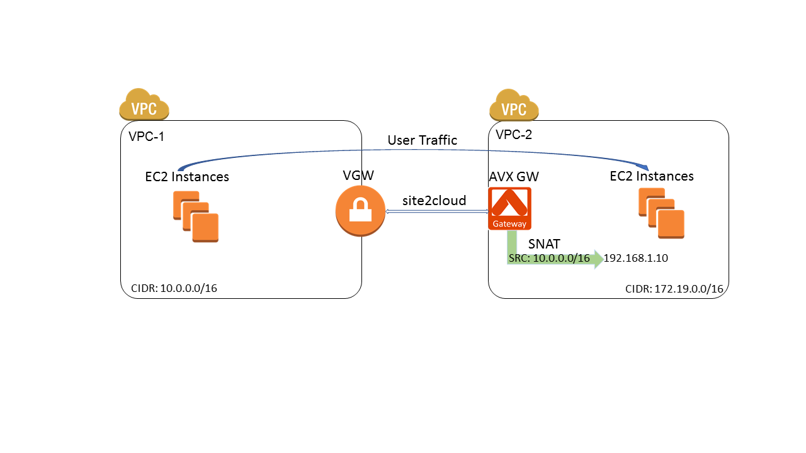
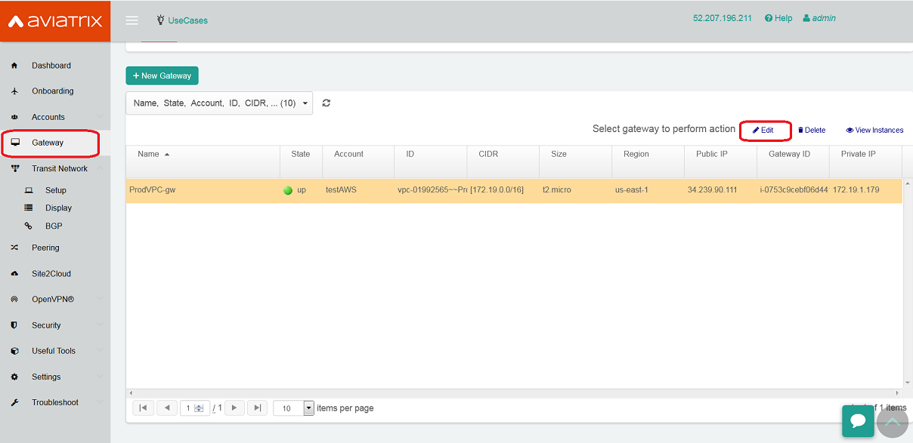
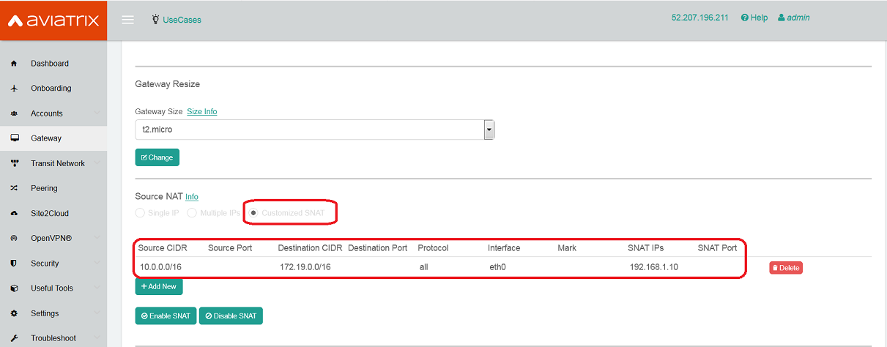
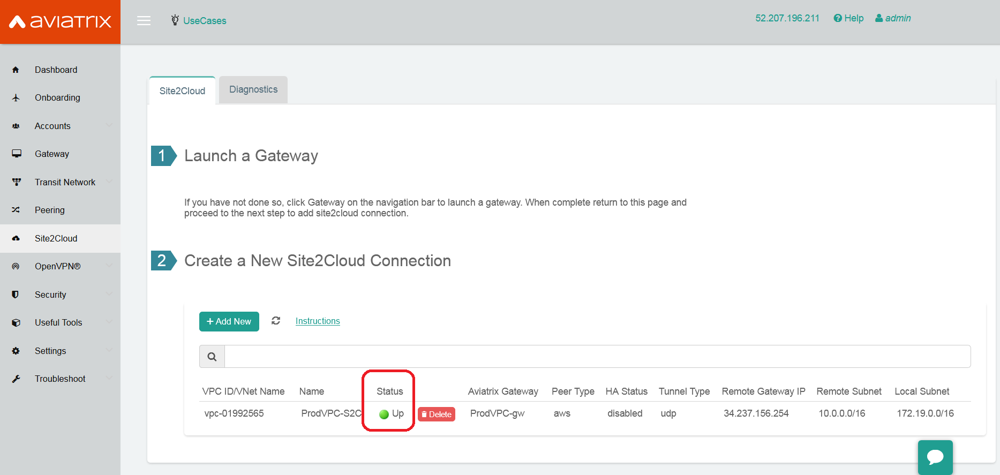

.. meta::
   :description: Create site2cloud connection with VGW and run customized SNAT on gateway
   :keywords: site2cloud, VGW, SNAT

===========================================================================================
Site2Cloud With Customized SNAT 
===========================================================================================

This tech note describes how to create a Site2Cloud connection between two VPCs by using a VGW and an Aviatrix gateway. The Aviatrix gateway also serves as a source NAT device and translates source IP of traffic initiated from a peering VPC to an IP address selected by users.

|

Environment Requirements
---------------------------------------------------------

There are two VPCs as illustrated in the diagram below. VPC-1's CIDR is 10.0.0.0/16 and VPC-2's CIDR is 172.19.0.0/16. The Site2Cloud connection is between a VGW in VPC-1 and an Aviatrix gateway in VPC-2. 

|image1|

We will also configure customized SNAT at the Aviatrix gateway, which translates the source IP of traffic initiated from VPC-1 (10.0.0.0/16) to a user selected IP address (192.168.1.10 in this example). In this way, VPC-2 VMs will see all packets from VPC-1 with the same source IP address (192.168.1.10)

|

Steps to Configure Site2Cloud Connection and SNAT
---------------------------------------------------------

+ **Step 1: Install an Aviatrix gateway in VPC-2.**

Download and install the Aviatrix Gateways by following the instructions in this `document <http://docs.aviatrix.com/HowTos/gateway.html>`__ 

Don't select "Enable SNAT" when creating the new gateway in VPC-2.

+ **Step 2: Create a Site2Cloud connection between a VGW in VPC-1 and an Aviatrix gateway in VPC-2**

.. Note:: In the Aviatrix terminology, Site2Cloud is the name of the feature that enables connections from one site (or datacenter) to other sites (including cloud environments).

..

Please follow the instructions in this `document <http://docs.aviatrix.com/HowTos/site2cloud_awsvgw.html>`__ to create the Site2Cloud connection.

+ **Step 3: Update VPC-1 Route Tables at AWS portal**

Update VPC-1 route tables to ensure that traffic destinating to VPC-2 (172.19.0.0/16) takes the VGW as "Target":

==============   ==================================
  **Field**      **Value**
==============   ==================================
Destination      172.19.0.0/16
Target           VGW ID
==============   ==================================

+ **Step 4: Configure Customized SNAT at the Aviatrix gateway**

**a.** Log into the Controller and go to "Gateway" page.

**b.** Select the Aviatrix gateway created in VPC-2.

|image2|

**c.** Click "Edit" button and go to "Source NAT" section.

**d.** Select "Customized SNAT".

**e.** Configure the following SNAT rule.

==================   ==================================
  **Field**          **Value**
==================   ==================================
Source CIDR          VPC-1 CIDR (10.0.0.0/16)
Source Port          Leave it blank
Destination CIDR     VPC-2 CIDR (172.19.0.0/16)
Destination Port     Leave it blank
Protocol	     all
Interface            eth0
Mark                 Leave it blank
SNAT IPs             User selected IP (192.168.1.10)
SNAT Port            Leave it blank
==================   ==================================

|image3|

**f.** Click "Save" and "Enable SNAT" buttons

Test site2cloud Connection and SNAT
---------------------------------------------------------

**a.** Go to the "Site2Cloud" page and verify that the Site2Cloud connection status is "Up".

|image4|

**b.** Pings from an Ubuntu VM in VPC-1 to another Ubuntu VM in VPC-2.

**c.** Turn on "tcpdump icmp -n" at the Ubuntu VM in VPC-2. Verify the source IP of the pings is 192.168.1.10.
 

   

.. disqus::    
