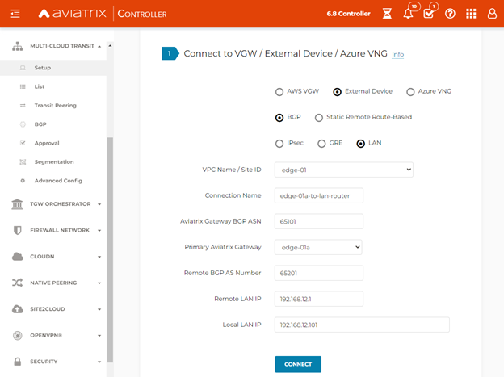
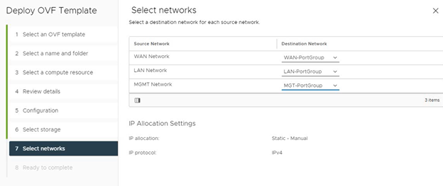
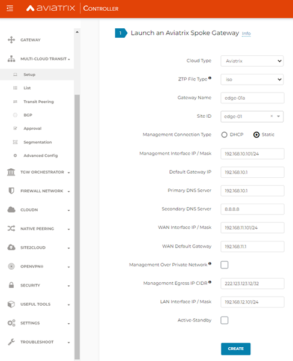
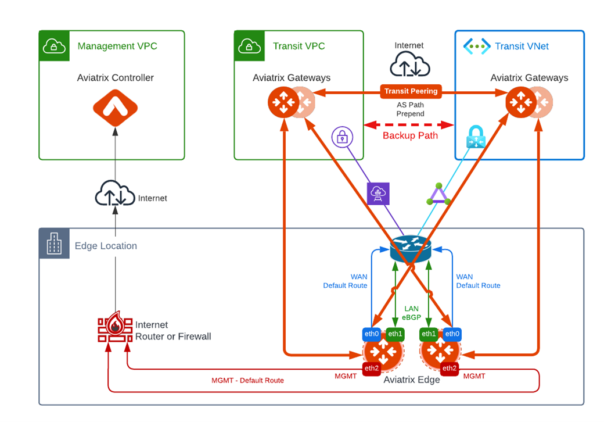
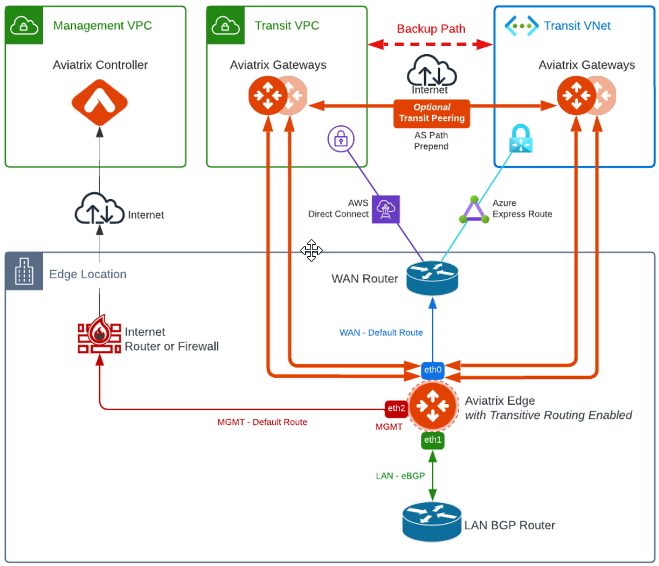
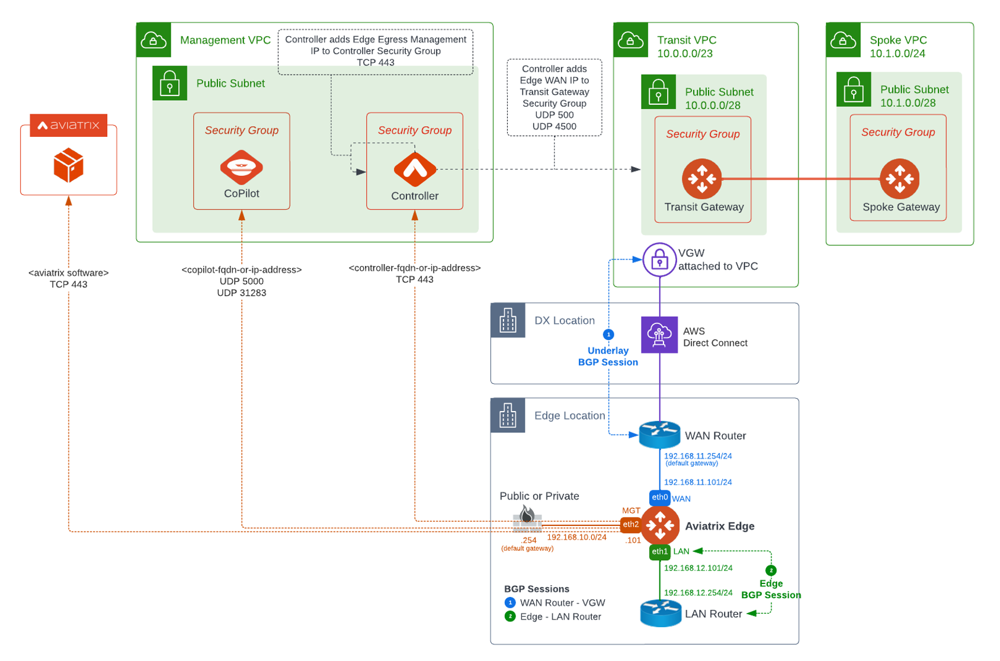
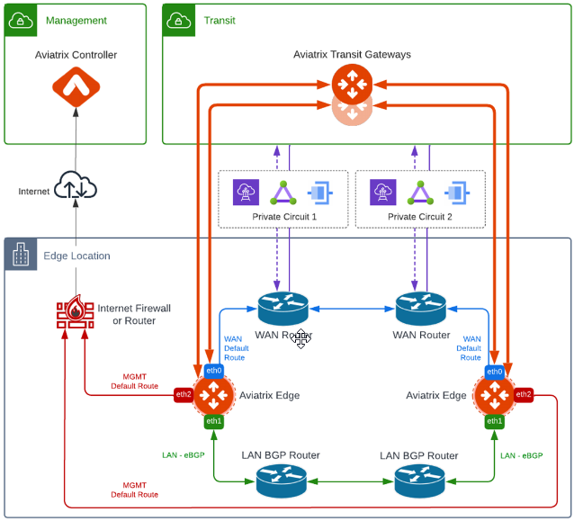
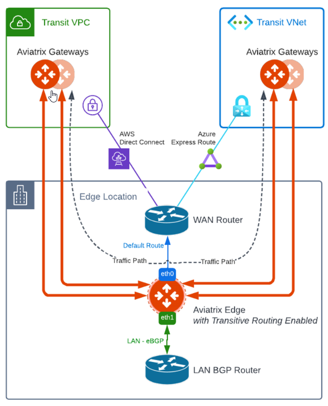
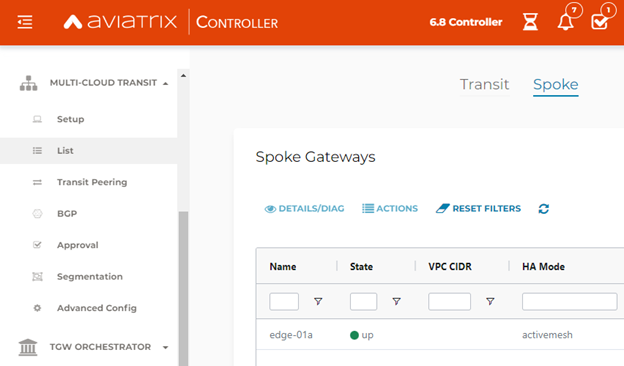

.. meta::
   :description: Aviatrix Edge 2.0
   :keywords: Edge as a spoke, KVM, ESXi, secure edge, edge gateway

============================
Deploying Aviatrix Edge  2.0
============================

Aviatrix Edge 2.0 (Edge as a Spoke) enables you to extend your cloud network to the Edge and easily integrate it with your remote locations and data centers. You can extend your Aviatrix-managed platform to the Edge as well as support multi-cloud multi-transit connectivity. 

Aviatrix Edge 2.0 is supported in AWS, Azure, and OCI. Edge 2.0 is supported in GCP for non-High-Performance Encryption (HPE) environments.

This document provides instructions for deploying Aviatrix Edge 2.0 on VMware ESXi or on open-source Kernel-based Virtual Machine (KVM). 

For examples of Edge 2.0 designs, refer to `Edge Design Patterns <http://docs.aviatrix.com/HowTos/secure-edge-kvm.html#edge-design-patterns>`_.

For additional information about Aviatrix Edge 2.0, refer to `Aviatrix Secure Edge FAQ <http://docs.aviatrix.com/HowTos/secure_edge_faq.html>`_. 

For the Aviatrix Edge 1.0 for ESXi workflow, refer to `Deploying Aviatrix Edge 1.0 for VMware ESXi <http://docs.aviatrix.com/HowTos/secure_edge_workflow.html>`_.
   
   
Aviatrix Edge Design Patterns
=============================

The following are examples of Aviatrix Edge 2.0 design patterns.

Single Transit with Single Edge – Attachment over Private Network
-----------------------------------------------------------------

|edge-single-transit-private|

Single Transit with Single Edge – Attachment over Public Network
----------------------------------------------------------------

|edge-single-transit-public|

Single Transit with Redundant Edge
----------------------------------

|edge-single-transit-redundant|

Single Transit with Redundant Edge 2.0 + Redundant Circuits
-----------------------------------------------------------

|edge-redundant-circuit|

Multiple Transit with Single Edge
---------------------------------

|edge-multiple-transit-single-edge|

Multiple Transit with Redundant Edge
------------------------------------

|edge-multiple-transit-redundant|

Aviatrix Edge Network Connectivity
==================================

|edge-network-connectivity|

Active-Active Edge and Active-Standby Edge Modes
================================================

When deploying multiple Edge Gateways, you have the option to use Active-Active mode or Active-Standby mode for connectivity between Edge Gateways and Transit Gateways.

Active-Active Edge
------------------

In Active-Active mode, all Edge-to-transit connections perform load sharing and transit the traffic.  

.. Note::
    Active-Active mode can support more than 2 Edge Gateways. While there is no maximum number of Edge Gateways, Aviatrix recommends a maximum of 4.
	
Active-Standby Edge
-------------------

Active-Standby mode provides the flexibility on Aviatrix Transit Gateways and Aviatrix BGP Spoke Gateways to connect to on-prem with only one active tunnel and one backup/standby tunnel. 

|edge-active-standby|

.. Important::
    The active_standby and active_standby_preemptive setting is per site and is decided when you create the first Edge Gateway for that site_id. You cannot choose a different setting when you add more Edge Gateways to that site. Active-Standby Mode only supports ActiveMesh 2.0.

Transitive Routing
==================

Transitive Routing feature allows an Edge Gateway to forward routes between multiple Transit Gateways that are connected to it. In Edge 2.0, you have the option to enable or disable Transitive Routing for an Edge Gateway; it is disabled by default.

|edge-transitive-routing|

Transit Peering over Internet for Backup Path
=============================================

If you are in a multi-cloud environment with, for example, AWS and Azure, you can create Transit Gateway Peering over Public Network and use it as a secondary/backup path while the Edge with Transitive Routing enabled is used as the primary path.

|edge-transitive-peering|

Prerequisites
=============

Aviatrix Edge 2.0 requires the following:

-	Aviatrix Controller 6.8
-	VMware ESXi

    -	OVA image for VMware ESXi (see `Requesting Aviatrix Edge Gateway Image File <http://docs.aviatrix.com/HowTos/secure-edge-kvm.html#requesting-an-aviatrix-edge-gateway-image-file>`_).
    -	VMware ESXi 6.7 or 7.0.1
    -	Sufficient VMware ESXi resources to run Edge Gateway (see `Aviatrix Edge 2.0 Installation Requirements <http://docs.aviatrix.com/HowTos/secure-edge-kvm.html#aviatrix-edge-2.0-installation-requirements>`_).
    -	(Optional) VMware vCenter Server
	
	For more information about installing VMware products, refer to the VMware product documentation.
	
-	KVM

    -	QCOW2 image for KVM (see `Requesting Aviatrix Edge Gateway Image File <http://docs.aviatrix.com/HowTos/secure-edge-kvm.html#requesting-an-aviatrix-edge-gateway-image-file>`_).
    -	KVM server running in Linux Bare Metal Server
    -	CentOS 7.6-1810
    -	QEMU Version 1.5.3, Release 160.el7_6.3
    -	Sufficient KVM resources to run Edge Gateway (see `Aviatrix Edge 2.0 Installation Requirements <http://docs.aviatrix.com/HowTos/secure-edge-kvm.html#aviatrix-edge-2.0-installation-requirements>`_).
	
	For more information about installing KVM products, refer to KVM product documentation.
	
-	Aviatrix Transit Gateway BGP ASN configured (High-Performance Encryption (HPE) is now optional for Edge 2.0 attachments)
-	Access to Aviatrix Controller using the Internet or private network with DNS resolution from the Edge Gateway Management interface
-	BGP-enabled router to peer with Edge Gateway LAN interface via BGP over LAN
-	Default RBAC access account for Edge Gateway (see `Creating the Default RBAC Access Account for Edge 2.0 <http://docs.aviatrix.com/HowTos/secure-edge-kvm.html#creating-the-default-rbac-access-account-for-edge-2.0>`_.)

Aviatrix Edge 2.0 Installation Requirements
-------------------------------------------

The following sections describe the virtual machine instance configuration, network interfaces, ports and protcols, and access requirements for the Edge Gateway to communicate with the Aviatrix Controller and the Aviatrix Transit Gateway.

Virtual Machine CPU and Memory Configurations
^^^^^^^^^^^^^^^^^^^^^^^^^^^^^^^^^^^^^^^^^^^^^

The following table provides CPU and memory configurations of the virtual machine instance supported for the Aviatrix Edge Gateway deployment.

+---------------------+----------------------+--------------------------+------------------------+
| **Deployment Type** | **Hardware Profile** | **Storage Requirements** | **Note**               |
+=====================+======================+==========================+========================+
| Small               | 2 vCPU - 4GB         | 64 GB                    | PoC / Test only        |
+---------------------+----------------------+--------------------------+------------------------+
| Medium              | 4 vCPU - 8GB         | 64 GB                    | <5Gbps throughput      |
+---------------------+----------------------+--------------------------+------------------------+
| Large               | 8 vCPU - 16GB        | 64 GB                    | ~10Gbps throughput     |
+---------------------+----------------------+--------------------------+------------------------+
| X-Large             | 16 vCPU - 32GB       | 64 GB                    | ~10Gbps throughput     |
+---------------------+----------------------+--------------------------+------------------------+

We recommend that you not change the Edge VM resource allocation after deploying it. Aviatrix support may not be able to assist with any issue that occurs on a system with customized resource allocation.

Oversubscription of host resources can lead to a reduction of performance and your instance could become unstable. We recommend that you follow the guidelines and the best practices for your host hypervisor.

Aviatrix Edge Networking and Ports and Protocols
------------------------------------------------

|edge-network-port-protocol|

The following sections describe the Edge network interfaces, port, and protocols.

Aviatrix Edge Network Interfaces
^^^^^^^^^^^^^^^^^^^^^^^^^^^^^^^^

+-----------------------+------------------------------------------------------------------------+
|**Interface**          | **Description**                                                        |
+=======================+========================================================================+
|WAN eth0               | Interface to connect to the Aviatrix Transit Gateway.                  |
|                       | Requires a default gateway and Layer 3 reachability to Transit Gateway |
|                       | Private or Public IP.                                                  |
+-----------------------+------------------------------------------------------------------------+
|LAN eth1               | Interface to connect to the LAN network. Requires a BGP session with   | 
|                       | LAN Router.                                                            |
+-----------------------+------------------------------------------------------------------------+
|Management eth2        | Interface to connect to the Aviatrix Controller. Requires a default    |
|                       | gateway, DNS access and Internet access to Aviatrix Controller,        |
|                       | Aviatrix software download, and tracelog upload.                       |
+-----------------------+------------------------------------------------------------------------+

Aviatrix Edge Ports and Protocols
^^^^^^^^^^^^^^^^^^^^^^^^^^^^^^^^^

+------------+-------------------------------------------+--------------+----------+-----------------------+
|**Source**  | **Destination**                           | **Protocol** | **Port** | **Purpose**           |
+============+====================================================+==============+==========+==============+
| WAN eth0   | Aviatrix Transit Gateway eth0 private or  | UDP          | 500      | IPsec                 |
|            | public IP address.                        |              |          |                       |
+------------+-------------------------------------------+--------------+----------+-----------------------+
| WAN eth0   | Aviatrix Transit Gateway eth0 private or  | UDP          | 4500     | IPsec                 |
|            | public IP address.                        |              |          |                       |
+------------+-------------------------------------------+--------------+----------+-----------------------+
| Mgmt eth2  | DNS server                                | UDP          | 53       | DNS lookup            |
+------------+-------------------------------------------+--------------+----------+-----------------------+
| Mgmt eth2  | Aviatrix Controller FQDN or               | TCP          | 443      | Edge to Controller    |
|            | public IP address.                        |              |          | registration          |
|            | controller.aviatrixnetwork.com            |              |          |                       |
|            | spire-server.aviatrixnetwork.com          |              |          |                       |
+------------+-------------------------------------------+--------------+----------+-----------------------+
| Mgmt eth2  | security.aviatrix.com                     | TCP          | 443      | Credentials sync      |
|            |                                           |              |          | Software download     |
+------------+-------------------------------------------+--------------+----------+-----------------------+
| Mgmt eth2  | diag.aviatrix.com                         | TCP          | 443      | Tracelog upload       |
|            |                                           |              |          | Remote support        |
+------------+-------------------------------------------+--------------+----------+-----------------------+

Access Requirements
^^^^^^^^^^^^^^^^^^^

The Aviatrix Controller requires access to the following ports for Edge Gateway deployment. You must allow access on these ports on your firewall.

- MGMT: TCP 443 access to the Aviatrix Controller’s public IP address 
- MGMT: TCP 443 access to the Aviatrix Controller’s private IP address (only permit this access if you selected **Over Private Network** for management IP connectivity) 
- WAN: UPD 500/4500

Requesting an Aviatrix Edge Gateway Image File
==============================================

Before you begin the deployment of the Edge Gateway, submit a request to Aviatrix Support for a link to the Edge Gateway image file. You will use the image file to deploy the Edge virtual machine.

1. Log in to the Aviatrix Support Portal: `<https://aviatrix.zendesk.com>`_.

2. Select **Submit a request**.

3. In the **Subject** field, enter **Requesting access to Edge image**.

4. In the **Edge Location** field, enter the physical address of the location where you will install the Edge VM(s), such as a data center, headend, co-location site, or office. If you are installing Edge VMs at more than one location, provide the following information for each physical location:

    - Physical Address (Do not enter a P.O.Box.)
    - City
    - State or Locality
    - Zip Code or Postal Code
    - Country

5. In the **Type of VM**, enter OVA for VMware ESXi or QCOW2 for KVM.

6. Click **Submit**. Aviatrix Support will respond with a link you can use to download the Edge Gateway image file.

Creating the Default RBAC Access Account for Edge 2.0
=====================================================

RBAC group to create, delete, and manage Edge Gateways.
Follow these steps to create a RBAC group to create, delete and manage Edge gateways.

1.	Log in to Aviatrix Controller 6.8.

2.  Go to **ACCOUNTS** > **Permission Groups** > **ADD NEW**.

3.  In the **Group Name** field, enter **EdgeRBAC**, and then click **OK**.

4.  In **Permission Groups**, select EdgeRBAC group, and then click **MANAGE PERMISSION**.

5.  In **Permissions for group EdgeRBAC**, click **ADD NEW**. 

6.  In **Add permissions to group EdgeRBAC**, select Gateway – All read/write for Gateway. 

7.  Click **OK**, and then click **Close**.

|edge-rbac|

8.	In **Permission Groups**, select **EdgeRBAC** group, and then click **MANAGE ACCESS ACCOUNTS**.

9.	In **Access accounts for group EdgeRBAC**, click **ADD NEW**. 

10.  In **Add access accounts to group EdgeRBAC**, select **edge_admin**. 

11.  Click **OK**, and then click **Close**.

You can now create or assign a user account with the newly created RBAC permission groups to create, delete, and manage Edge gateways.

Aviatrix Edge 2.0 Deployment Workflow
=====================================

The diagram below provides a high-level view of the four-step process for deploying Aviatrix Edge 2.0 in Aviatrix Controller. You have the option to use either VMware ESXi or an open-source Kernel-based Virtual Machine (KVM) to deploy the Edge VM and attach the ZTP **.iso** file.

|edge-deploy-workflow|
 
1. Create the Edge Gateway ZTP ISO Image File
---------------------------------------------

.. note::
   You must have port 443 open to the IP address of the Aviatrix Controller. For the required access for Edge Gateway deployment, refer to `Access Requirements <http://docs.aviatrix.com/HowTos/secure_edge_workflow.html#access-requirements>`_.

To create the Edge Gateway ISO image file, follow these steps.

1.  Log in to Aviatrix Controller 6.8.

2.  Go to **MULTI-CLOUD TRANSIT** > **Setup**

3.  In the Launch an Aviatrix Spoke Gateway page, enter the following values:

    a.  **Cloud Type**: Is always set to **Aviatrix**.

    b.  **ZTP File Type**: Select **iso**.

        .. note::
         The ISO file is the equivalent of the Zero-Touch Provisioning (ZTP) token. ZTP allows network engineers to remotely deploy and provision network devices at remote locations.

    c.  **Gateway Name**: Enter a name for the new Edge Gateway.
	
	d.  **Site ID**: Select an existing Site ID or create a new Site ID by entering a name (such as, edge-01) and clicking **Add item**. 
	
	    For guidance on whether to select an existing Site ID or create a new one, see `Edge Site ID Guidelines <http://docs.aviatrix.com/HowTos/secure_edge_kvm.html#edge-site-id-guidelines>`_.
	
    e.  **Management Connection Type**: Select DHCP or Static, depending on your environment. 
      
    .. note::
      Steps (e-m) are applicable only for static IP configuration on the management interface.
      For IP and DNS settings, enter using the applicable format. For example, if the Edge Gateway's WAN IP is 10.1.1.151, enter 10.1.1.151/24 or what your netmask is.
 
    f.  **Management Interface IP/Mask**: Enter the management interface IP/mask for the Edge VM.

    g.  **Default Gateway IP**: Enter the IP address of the Default Gateway for the Management Subnet.

    h.  **Primary DNS Server**: Enter the DNS server IP address.

    i.  **Secondary DNS server**: Enter the DNS server IP address, this field is optional.
	
	j.  **WAN Interface IP/Mask**: Enter the interface IP/mask for the Edge VM.

    k.  **WAN Default Gateway**: Enter the IP address of the Edge WAN interface.

    l.  **Managemen Over Private Network**: Check the box if the Edge management connection to the Aviatrix Controller is over a private network. Leave it unchecked if the connection is over the public internet.

    m.  **Management Egress IP CIDR**: Enter the IP address  of the Edge VM visible to the Aviatrix Controller (IP address to be allowed in the Controller Security Group. This IP is optional and can be added later).

       This field adds a security bypass filter rule for the incoming traffic on TCP/443 to your Controller.

    n.  **LAN Interface IP/Mask**: Enter the interface IP/mask for the Edge VM. 
	
	o.  **Active-Standby**: Check the box for active-standby mode (see `Active-Standby Edge <http://docs.aviatrix.com/HowTos/secure_edge_kvm.html#active-standby-edge>`_). Leave unchecked for Active-Active mode.
	
	.. Important::
          The Active-Active and Active-Standby modes are configured when you create the first Edge ZTP for a particular Site ID. If you need to change a configuration from Active-Active to Active-Standby, delete all the Edge Gateway for that Site ID and recreate the Edge Gateway with the new setting.

      |edge-launch-spoke-gateway|

4. To create the ISO image file, click **Create**. Aviatrix Controller prompts you to download the ISO file.

    Controller downloads the ZTP .iso file to your downloads folder. Next, you upload the **.iso** file to a datastore in the VMware or KVM environment for attachment to the Edge Gateway.

.. Note::
   Controller displays a message that confirms when you have successfully downloaded the **.iso** file you created for the Edge gateway. The .iso file will expire 24 hours after you create it, so you must mount the .iso file to an Edge VM to complete the Edge gateway registration within that timeframe, as you cannot download it again and will have to repeat the above steps.

Edge Site ID Guidelines
^^^^^^^^^^^^^^^^^^^^^^^

Follow these guidelines to decide whether to use an existing Site ID or create a new one.

-	Use an existing Site ID if:

    -	You want to have Active-Standby on 2 Edge Gateways (assign the same Site ID).
    -	You want to have ECMP on multiple Edge Gateways (assign the same Site ID).
	
-	Edge Gateways with the same Site ID:

    -	Can only join the same domain.
    -	Can have the same or different local ASN.
    -	Need to have FireNet traffic inspection configured per site.
	
-	If you want to configure FireNet management on the Edge Gateway, you need to configure it per site.
-	When multiple Edge Gateways are attached to a common transit, the transit will propagate routes from Edge Gateways with the same Site ID to other Edge Gateways with a different Site ID but will not propagate routes from the Edge Gateways to other Edge Gateways with the same Site ID.

2. Deploying the Edge Virtual Machine and Attaching the ZTP ISO File
--------------------------------------------------------------------

Deploying the Edge Virtual Machine in VMware ESXi
^^^^^^^^^^^^^^^^^^^^^^^^^^^^^^^^^^^^^^^^^^^^^^^^^

To deploy the Edge virtual machine in VMware ESXi, follow these steps. 

1. Download the ESXi OVA file by using the link provided to you by Aviatrix Support. Refer to `Requesting a VMware ESXi OVA File <http://docs.aviatrix.com/HowTos/secure_edge_workflow.html#requesting-a-vmware-esxi-ova-file>`_.

2. Log into VMware vSphere Web client to access the ESXi host.

   You can use vSphere Web client to manage ESXi host, launch a VM, mount ISO files, and start and stop the Aviatrix Edge Gateway.

3. To load the OVA file into the ESXi using vSphere, go to: **ESXI** > **Virtual Machines** > **Create/Register VM**.

4. Select **Deploy a virtual machine from an OVF or OVA file**. Click **Next**.

5. Enter a name for the Edge VM and drag the OVA file into the blue pane. Click **Next**.

   |secure_edge_ova_load_file|

6. In the Select storage page, select the storage device for the instance you created (the OVA is installed in this instance). Click **Next**.

7. In the Deployment options window, enter the network interface mappings and select the Deployment type. (Refer to the pull-down menu or see `Virtual Machine CPU and Memory Configurations <http://docs.aviatrix.com/HowTos/secure_edge_workflow.html#virtual-machine-cpu-and-memory-configurations>`_.)

   .. Note::
      If necessary, you can change the network interface mappings after deployment.

   |secure_edge_ova_deploy_options|

8. Click **Next**.

9. In the Ready to complete page, click **Finish**.

Next, attach the ZTP **.iso** and the Edge will auto-mount the media which contains the configuration file to be provisioned to the Edge.

Attaching the ISO Image to the Edge Virtual Machine in VMware ESXi
~~~~~~~~~~~~~~~~~~~~~~~~~~~~~~~~~~~~~~~~~~~~~~~~~~~~~~~~~~~~~~~~~~

.. note::
   * The ZTP ISO file can only be used for a single Edge VM instance, and only one time for that instance. 
   * The ZTP token expires after 24 hours. If you wait too long to boot up the VM with the attached ISO image, it will not work.  In that case, delete the Edge Gateway in the Controller UI and create a new Edge Gateway to receive a new ISO file.

1. Upload the ISO file you downloaded from Aviatrix Controller to your VMware datastore.

2. In vSphere, select the Edge VM you created and click **Edit settings**.

3. Select the **Virtual Hardware** tab.

4. Next to CD/DVD Drive 1, click the down arrow and select **Datastore ISO file** from the pull-down menu.

5. To load the ISO to the virtual CD drive, next to **Status**, check **Connect at power on**.
 
6. Next to the CD/DVD Media field, click **Browse**. Select the ISO file you downloaded.

   |secure_edge_edit_settings|

   .. note::
      **Connect at power on** (step 4) is required when you attach the ISO image to the VM for the first time. If the VM is powered on at the time you attach the ISO image, select the **Datastore ISO file** and save the configuration to make the ISO available to ZTP.

7. Click **Save**.

Next, verify Edge in Controller. See 

Deploying the Edge Virtual Machine in KVM
^^^^^^^^^^^^^^^^^^^^^^^^^^^^^^^^^^^^^^^^^

Locate the downloaded ZTP .iso file you created in Controller and follow these high-level steps in your KVM hypervisor to attach the .iso file. 

1.	Log on to KVM Guest OS (CentOS).
2.	Deploy qcow2 via the CLI or the virt-manager UI.
3.	Add two additional network adapters.
4.	Add a CD ROM and attach/mount the downloaded ZTP .iso.

Attaching the ISO Image to the Edge Virtual Machine in KVM
~~~~~~~~~~~~~~~~~~~~~~~~~~~~~~~~~~~~~~~~~~~~~~~~~~~~~~~~~~~~~~~~~~

After you attach the ZTP **.iso**, the KVM hypervisor will auto-mount the media which contains the configuration file to be provisioned to the Edge.

Next, verify Edge in Controller. See `Verifying Edge in Controller <http://docs.aviatrix.com/HowTos/secure_edge_kvm.html#verifying-edge-in-controller>`_.)

Verifying Edge in Controller
^^^^^^^^^^^^^^^^^^^^^^^^^^^^

Wait for about 5 minutes after you have attached the ZTP **.iso** file and log in to Aviatrix Controller and complete the following steps.

1.	In Aviatrix Controller, go to **Multi-Cloud Transit** > **List** > **Spoke**.
2.	In the **State** column, verify that the Edge you created is in the **up** state. Click the refresh button to update the registration status.

|edge-verify|

3. Attach Edge Gateway to Transit Gateway
-----------------------------------------

For an Attachment over a public network, follow these steps before you attach the Edge Gateway to update the WAN Public IP.

1.	Go to Gateway. Select the Edge Gateway you want to attach and click Edit.
2.	In IP Configurations, click Discover Public IP. Verify the Public IP and click Update. 

.. Important::
    If you have multiple Edge Gateways, make sure each Edge Gateway has a unique WAN Public IP.
	
|edge-ip-config|

Prepare the following information for attaching an Aviatrix Edge Gateway 2.0 to a Transit Gateway:

Add Table.

 In Controller, follow these steps to configure BGP ASN on Transit Gateway and Edge Gateway.

1.	Go to MULTI-CLOUD TRANSIT > Advanced Config > Edit Transit. Select your transit. Enter the Local AS Number (ASN) for the Transit Gateway. Click CHANGE.
2.	Select Edit Spoke. In the BGP Spoke Gateway pull-down menu, select the Edge Gateway you created. Enter the Local AS Number (ASN) for the Edge Gateway. Click CHANGE.

Once the BGP ASNs are configured on Transit Gateway and Edge Gateway, follow these steps to attach the Edge Gateway 2.0 to a Transit Gateway:

1.	Go to MULTI-CLOUD TRANSIT > List > Spoke. Confirm that the Edge Gateway you created is up.
2.	Go to MULTI-CLOUD TRANSIT > Setup > Attach / Detach > 1a Attach Spoke Gateway to Transit Network.

|edge-attach-spoke-to-transit|

3.	In the Spoke Gateway/Source Gateway pull-down menu, select the Edge Gateway you created.
4.	In the Transit Gateway/NextHop Gateway pull-down menu, select your transit.
5.	Select the Over Private Network checkbox if you want the connection over a private network. Leave unchecked if you want to use a public network.
6.	Select the Jumbo Frame checkbox if you want to configure Jumbo Frame on Edge Gateway.
7.	Select the Insane Mode checkbox if you want to build HPE. Leave unchecked if you do not require HPE. Click ATTACH. 

.. Important::
    To create an Insane Mode attachment, make sure the Transit Gateway is enabled for Insane Mode.
	
.. Note::
    For Insane Mode over the Internet, you will need to enter the Insane Mode Tunnel Number.

You can verify the attachment from either Controller (Multi-Cloud Transit > List > Spoke) or CoPilot (Topology > Network Graph > Network).

4. Connect Edge Gateway to External Device (BGP over LAN)
---------------------------------------------------------

Prepare the following information for connecting an Edge Gateway 2.0 to a LAN Router:

Add Table

To connect the Edge Gateway to LAN Routing via BGP over LAN, follow these steps.

1.	Go to MULTI-CLOUD TRANSIT > Setup > External Connection. Select/configure the following, then click CONNECT:

    a.	Select the options for External Device, BGP, and LAN
    b.	VPC Name / Site ID: Select existing Edge Site ID from dropdown list
    c.	Connection Name: Enter unique name to identify the connection to LAN Router 
    d.	Aviatrix Gateway BGP ASN: Enter the BGP AS number the Edge Gateway will use to exchange routes with LAN Router
    e.	Primary Aviatrix Gateway: Select the Edge Gateway you created.
    f.	Remote BGP AS Number: Enter the BGP AS number configured on the LAN Router
    g.	Remote LAN IP: Enter the LAN Router IP for BGP peering
    h.	Local LAN IP: Enter the Edge LAN interface IP for BGP peering

|edge-connect-external-device|

Configuring Transitive Routing
------------------------------

ADD STEPS

Configuring Transit Peering over Internet
-----------------------------------------

To create Transit Peering over Internet and use it as backup:

1.	In the Aviatrix Controller, go to MULTI-CLOUD TRANSIT > Transit Peering and create a Transit Gateway Peering using the Transit Gateway Peering over Public Network workflow 
2.	Go to MULTI-CLOUD TRANSIT > Advanced Config > Select the first Transit Gateway and take note the Local AS Number. 
3.	Scroll down to the Connection AS Path Prepend section and select the Transit Peering connection name
4.	On the Prepend AS Path form, input the same Local AS Number three times separated by comma

|edge-transit-peering-config|

5.	Repeat step 2 until step 4 for the second Transit Gateway

Sample Terraform code:

# Create an Aviatrix Transit Gateway Peering

resource "aviatrix_transit_gateway_peering" "backup_transit_peering"
{
  transit_gateway_name1 = "aws-transit"
  transit_gateway_name2 = "azure-transit"
  prepend_as_path1      = ["65001", "65001", "65001"]
  prepend_as_path2      = ["65002", "65002", "65002"]

  enable_insane_mode_encryption_over_internet = true
  tunnel_count = 4
}

.. |secure_edge_ova_deploy_options| image:: CloudN_workflow_media/secure_edge_ova_deploy_options.png
   :scale: 80%
   
.. |secure_edge_edit_settings| image:: CloudN_workflow_media/secure_edge_edit_settings.png
   :scale: 50%
   
.. |secure_edge_ova_load_file| image:: CloudN_workflow_media/secure_edge_ova_load_file.png
   :scale: 80%

.. |edge-active-standby| image:: CloudN_workflow_media/edge-active-standby.png
   :scale: 50%

.. |edge-attach-spoke-to-transit| image:: CloudN_workflow_media/edge-attach-spoke-to-transit.png
   :scale: 50%

.. |edge-deploy-workflow| image:: CloudN_workflow_media/edge-deploy-workflow.png
   :scale: 50%

.. |edge-ip-config| image:: CloudN_workflow_media/edge-ip-config.png
   :scale: 50%

.. |edge-network-port-protocol| image:: CloudN_workflow_media/edge-network-port-protocol.png
   :scale: 50%

.. |edge-rbac| image:: CloudN_workflow_media/edge-rbac.png
   :scale: 50%

.. |edge-single-transit-private| image:: CloudN_workflow_media/edge-single-transit-private.png
   :scale: 50%

.. |edge-single-transit-public| image:: CloudN_workflow_media/edge-single-transit-public.png
   :scale: 50%

.. |edge-single-transit-redundant| image:: CloudN_workflow_media/edge-single-transit-redundant.png
   :scale: 50%	

.. |edge-transit-peering| image:: CloudN_workflow_media/edge-transit-peering.png
   :scale: 50%

.. |edge-transit-peering-config| image:: CloudN_workflow_media/edge-transit-peering-config.png
   :scale: 50%

.. disqus::
