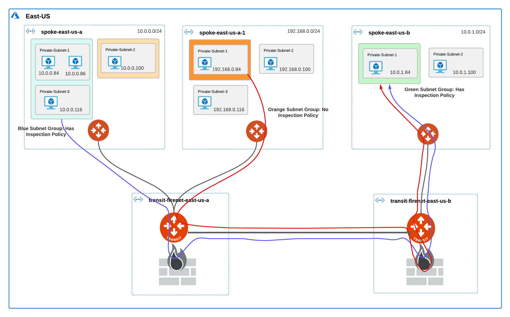

.. meta::
   :description: Secure Edge
   :keywords: Edge, Edge Gateway, ESXi, EaaG, Edge ZTP

=================================
Aviatrix Secure Edge FAQ
=================================

What is Aviatrix Secure Edge?
-----------------------------

Aviatrix Secure Edge has a virtual form factor that lets you deploy an Edge Gateway as a standard virtual machine (VM). It is designed to enable enterprises migrating to the cloud to integrate their on-premises footprint as spokes into the enterprise Cloud backbone. The result is secure, seamless connectivity to locations at the Edge of your network such as data centers, remote sites, provider locations, branch offices, and retail stores.

By extending the Aviatrix data plane to the Edge of the network, you can use Aviatrix Controller and Aviatrix CoPilot to manage orchestration, visibility, and operational capabilities. You can deploy an Edge Gateway using Aviatrix Controller, the VMware ESXi host server, and the VMware vSphere management console. Benefits include:

- Virtual form factor that integrates with the existing Cloud orchestration platform
- Go-to platform for all branch, off-prem, and on-prem hybrid connectivity
- Centralized control plane across on-premises and multi-cloud networks that also reduces on-premises hardware and operating costs
- Single pane of glass for visibility, monitoring, and troubleshooting from Controller
- Parity with hardware-based Edge gateway solutions
- Encrypted connectivity and routing between clouds with a private path that uses standard architecture
- Zero-touch provisioning (ZTP) that supports automated provisioning 
- High Performance Encryption (HPE) supported over public and private networks for AWS and Azure

What are the use cases for the Aviatrix Edge Gateway?
-----------------------------------------------------
You can deploy the Edge Gateway in an on-premises location with connectivity over a private network or as a secure gateway supporting locations at the Edge of your network. The diagrams below illustrate examples of Edge Gateway deployed in a private and public network.

|image|

|image|

What are the requirements to run the Edge Gateway?
--------------------------------------------------

The Edge Gateway requires the following:

- Aviatrix Controller 6.7
- VMware vCenter Server (optional)
- VMware ESXi OVA file (provided by Aviatrix)
- VMware ESXi Versions: 6.7 or 7.0.1
- VMware vSwitch: Standard is supported

The Aviatrix Edge can run on the VMware ESXi Hypervisor. VMware ESXi runs on PCs with x86-based CPUs. You can use the same hypervisor to run several VMs.

You can use the VMware vSphere Web Client to access the ESXi host directly or to access a vCenter Server. The vCenter Server can manage this ESXi host and can start/stop the Aviatrix Edge Gateway.

.. note::
   Oversubscription of host resources can lead to a reduction of performance and your instance could become unstable. We recommend that you follow the guidelines and the best practices for your host hypervisor.

For more information about installing VMware vSphere products, refer to the VMware product documentation.

CPU and Memory Configurations
^^^^^^^^^^^^^^^^^^^^^^^^^^^^^

+-----------------+------------------+----------------------+
| Deployment Type | Hardware Profile | Storage Requirements |
+=================+==================+======================+
| Small           | 2CPU - 4GB       | 64 GB                |
+-----------------+------------------+----------------------+
| Medium          | 4CPU - 8GB       | 64 GB                |
+-----------------+------------------+----------------------+
| Large           | 8CPU - 16GB      | 64 GB                |
+-----------------+------------------+----------------------+
| X-Large         | 16CPU - 32GB     | 64 GB                |
+-----------------+------------------+----------------------+

Additional Resources
^^^^^^^^^^^^^^^^^^^^

The following additional resources are needed for every Aviatrix Edge VM instance.

- VMXNET3 driver for all interfaces
- SATA disk controller
- 64 GB data storage space

How do I deploy Secure Edge?
----------------------------

To deploy Secure Edge, follow the workflow in `Deploying Aviatrix Secure Edge 1.0 for VMware ESXi <http://docs.aviatrix.com/HowTos/secure_edge_workflow.html>`_.

.. disqus::
