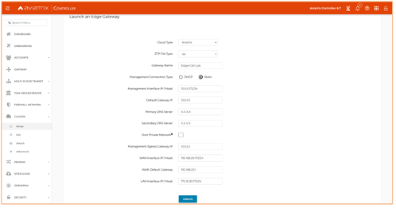
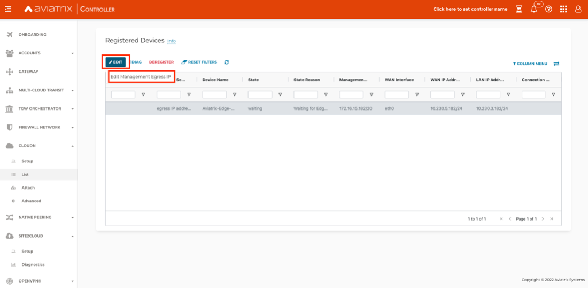
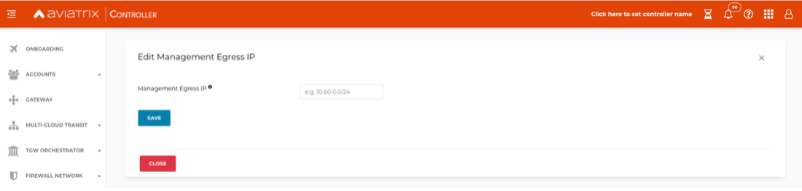
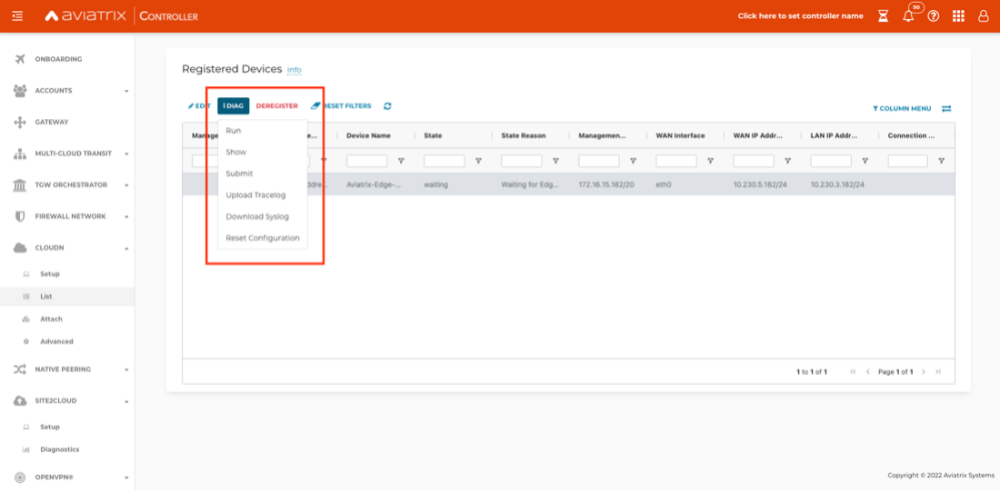
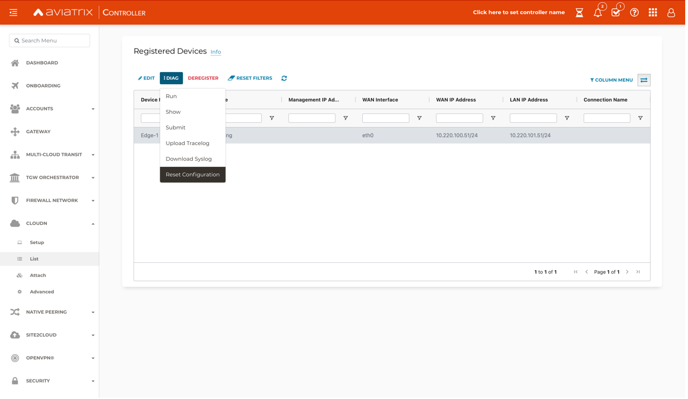
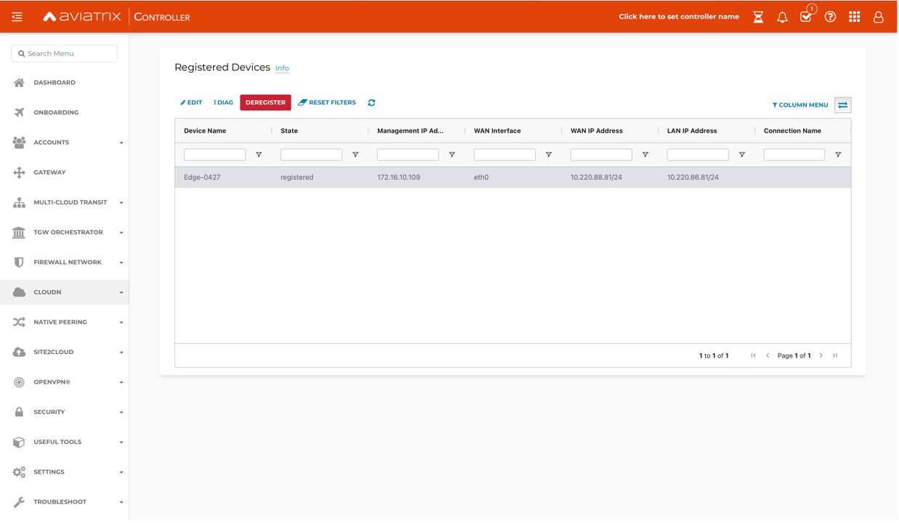
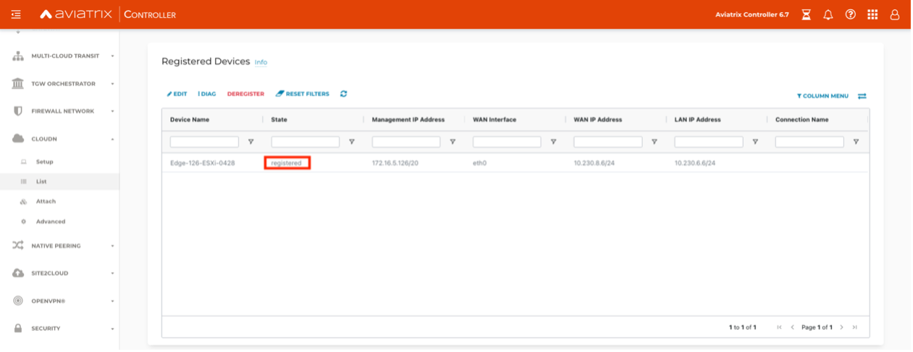

.. meta::
   :description: Secure Edge Deployment
   :keywords: Edge, Edge Gateway, EaaG, Edge ZTP, VMware ESXi

==================================================
Deploying Aviatrix Secure Edge 1.0 for VMware ESXi
==================================================

This document provides step-by-step instructions for deploying Aviatrix Secure Edge in a private or public cloud network. Aviatrix Secure Edge has a virtual form factor that lets you deploy an Edge Gateway as a standard virtual machine (VM). The instructions in this document show you how to set up an Edge Gateway in VMware ESXi. 

For deployment diagrams and additional information, refer to `Aviatrix Secure Edge FAQ <http://docs.aviatrix.com/HowTos/secure_edge_faq.html>`_.

Prerequisites
-------------

Secure Edge 1.0 requires the following:

- Aviatrix Controller 6.7
- VMware vCenter Server (optional)
- VMware ESXi OVA file (provided by Aviatrix)
- VMware ESXi Versions: 6.7 or 7.0.1

The Aviatrix Edge can run on the VMware ESXi Hypervisor. VMware ESXi runs on x86-based CPU platforms.  

For more information about installing VMware vSphere products, refer to the VMware product documentation.

CPU and Memory Configurations
-----------------------------

+-----------------+------------------+----------------------+
| Deployment Type | Hardware Profile | Storage Requirements |
+=================+==================+======================+
| Small           | 2CPU - 4GB       | 64 GB                |
+-----------------+------------------+----------------------+
| Medium          | 4CPU - 8GB       | 64 GB                |
+-----------------+------------------+----------------------+
| Large           | 8CPU - 16GB      | 64 GB                |
+-----------------+------------------+----------------------+
| X-Large         | 16CPU - 32GB     | 64 GB                |
+-----------------+------------------+----------------------+

.. note::
   Oversubscription of host resources can lead to a reduction of performance and your instance could become unstable. We recommend that you follow the guidelines and the best practices for your host hypervisor.

To deploy an Edge Gateway, perform these steps.

#. `Configure an Edge Gateway in VMware ESXi <http://docs.aviatrix.com/HowTos/secure_edge_workflow.html#configuring-an-edge-gateway-in-vmware-esxi>`_.

#. `Setup the Edge Gateway in Aviatrix Controller <http://docs.aviatrix.com/HowTos/secure_edge_workflow.html#setting-up-an-edge-gateway-in-aviatrix-controller>`_.

#. `Attach the ISO image to the Edge Virtual Machine <http://docs.aviatrix.com/HowTos/secure_edge_workflow.html#attaching-the-iso-image-to-the-edge-virtual-machine>`_.

#. `Attach the Edge Gateway to the Transit Gateway <http://docs.aviatrix.com/HowTos/secure_edge_workflow.html#attaching-an-edge-gateway-to-a-transit-gateway>`_.

Configuring an Edge Gateway in VMware ESXi
------------------------------------------

To configure an Edge Gateway in VMware ESX, follow these steps.

#. Download the ESXi OVA file from Aviatrix Support: `<https://support.aviatrix.com/downloads>`_.
   Use your login credentials to view the support download section or contact your Aviatrix account team.
#. Log into VMware vSphere web client to access the ESXi host.
   You can use vSphere web client to manage ESXi host, launch a VM, mount ISO files, and start and stop the Aviatrix Edge Gateway.
#. To load OVA into the ESXi using vSphere, go to: **ESXI** > **Virtual Machines** > **Create/Register VM**.
#. Select **Deploy a virtual machine from an OVF or OVA file**. Click **Next**.
#. Enter a name for the Edge VM and drag the OVA file into the blue pane. Click **Next**.

   |secure_edge_ova_load_file|

#. Select the storage device for the instance you created (the OVA is installed in this instance). Click **Next**.
#. In the Deployment options window, enter the network interface mappings and select the Deployment type. Refer to the pull-down menu or see `CPU and Memory Configuration <http://docs.aviatrix.com/HowTos/secure_edge_workflow.html#cpu-and-memory-configurations>`_.

   |secure_edge_ova_deploy_options|

#. Click **Next**.
#. In the Ready to complete window, click **Finish**.

Setting Up an Edge Gateway in Aviatrix Controller
------------------------------------------------

#. Log in to Aviatrix Controller 6.7.
#. Go to **CLOUDN** > **Setup**.
#. In the Launch an Edge Gateway page, enter the following Edge name and IP information as needed:

   a. Cloud Type is always set to **Aviatrix**. 
   b. In Gateway Name, enter a name for the new Edge Gateway.
   c. For ZTP File Type, select **ISO**.

      .. note::
         The ISO file is the equivalent of the Zero-Touch Provisioning (ZTP) token. ZTP allows network engineers to remotely deploy and provision network devices at remote locations.

   d. For Management Connection Type, select DHCP or Static, depending on your environment. 
      
      steps (e-i) are applicable only for static IP configuration on the management interface.

   e. IP and DNS Settings: Enter using the applicable format. For example, if the Edge Gateway's WAN IP is 10.1.1.151, enter 10.1.1.151/24 or whatever your netmask is. 
   f. For Management Interface IP, enter the management interface IP/mask for the Edge VM.
   g. For Default Gateway IP, enter the IP address of the Default Gateway for the Management Subnet.
   h. For Primary DNS Server, enter the DNS server IP address.
   i. For Secondary DNS server, enter the DNS server IP address, this field is optional.
   j. Check **Over Private Network** if the Edge management connection to Controller is over a private network. Leave it unchecked if the connection is over the public internet.
   k. For Management Egress IP, enter the IP address  of the Edge VM visible to the Controller (this IP is optional and can be added later).
      This field adds a security bypass filter rule for the incoming traffic on TCP/443 to your Controller.
   l. For WAN interface IP/ Mask, enter the interface IP/mask for the Edge VM.
   m. For WAN Default Gateway, enter the IP address of the Edge WAN interface.
   n. For LAN interface IP / Mask, enter the interface IP/mask for the Edge VM. 

      The image below shows the Launch an Edge Gateway configuration when you do not select **Over Private Network**.

      |secure_edge_launch_gateway|

#. Click **Create**. Aviatrix Controller prompts you to download the ISO file.

Attaching an Edge Gateway to a Transit Gateway
----------------------------------------------

Any time you deploy an Edge Gateway, you must attach it to a Transit Gateway. Follow these steps for an initial deployment or when you deploy an Edge Gateway that you reset.

#. In Aviatrix Controller, go to **CLOUDN** > **List**.
#. In Registered Devices, locate the Edge VM you created. Confirm the Edge VM was successfully registered. If the registration was successful, the status in the State column will show registered.

   |secure_edge_registered_devices|

#. To attach the Edge Gateway to the Transit Gateway, go to **Controller** > **CLOUDN** > **Attach**.
#. In step 2, Attach Device to Cloud, complete the following fields:  

   .. note::
      If you are connecting over a public network, WAN discovery is currently mandatory.

   a. For **Device Name**, select the registered Edge Gateway.
   b. For **Aviatrix Transit Gateway**, select the transit gateway you want the Edge Gateway to connect to.
   c. For **Connection Name**, enter the name for this connection.
   d. For **Aviatrix Transit Gateway BGP ASN**, enter the ASN for your transit gateway.
   e. For **Device’s BGP ASN**, enter the ASN for your Edge Gateway.
   f. For **Device’s LAN Interface Neighbor’s IP**, enter the Neighbor’s LAN interface IP.
   g. For **Device’s LAN Interface Neighbor’s BGP ASN**, enter the Neighbor’s LAN interface BGP ASN.
   h. For **Over Private Network**, leave the box unchecked if you are building the tunnel over the public internet
      
      |secure_edge_attach_device|

#. Click **Attach**.
#. Navigate back to **CLOUDN** > **List**. Once the tunnel is successfully built, the Edge Gateway status in the **State** column changes from registered to attached. 

Attaching the ISO Image to the Edge Virtual Machine
---------------------------------------------------

.. note::
   * The ZTP ISO file can only be used for a single Edge VM instance, and only one time for that instance. 
   * The ZTP token expires after 24 hours. If you wait too long to boot up the VM with the attached ISO image, it will not work.  In that case, delete the Edge Gateway in the Controller UI and create a brand-new Edge Gateway to receive a new ISO file.

#. Upload the ISO file you downloaded from Aviatrix Controller to your VMware datastore.
#. In vSphere, select the Edge VM you created and click **Edit settings**.
#. Select the **Virtual Hardware** tab.

   .. note::
      Step 4 (Connect at power on) and step 8 (Reboot) below are not required when you attach the ISO to the VM for the first time. If the VM is powered on at the time you attach the ISO, select the datastore ISO file and save the configuration to make the ISO file available to ZTP. 

#. To load the ISO to the virtual CD drive, next to Status, check **Connect at power on**. 
#. Next to CD/DVD Drive 1, click the down arrow and select **Datastore ISO file** from the pull-down menu.
#. Next to the CD/DVD Media field, click **Browse**. Select the ISO file you downloaded.

   |secure_edge_edit_settings|

#. Click **Save**.
#. Reboot the Edge VM.

Edit or View an Edge Gateway Configuration
------------------------------------------

#. To edit the Management Egress IP, select the gateway and click **EDIT**. This opens an option to provide the Management Egress IP.

   |secure_edge_mgmt_egress_ip|

#. Update the Egress Management IP and click **SAVE**.

   |secure_edge_update_egress_ip|

#. To run and show diagnostics, upload Tracelog, download Syslog, and reset configuration, select the Edge Gateway and click **DIAG**.

   |secure_edge_run_diag|

Deregistering and Reregistering an Edge Gateway
-----------------------------------------------

Resetting an Edge Gateway's Configuration from Aviatrix Controller
^^^^^^^^^^^^^^^^^^^^^^^^^^^^^^^^^^^^^^^^^^^^^^^^^^^^^^^^^^^^^^^^^^

An Edge Gateway can be deregistered from the Aviatrix Controller only when it is in the **registered** state. If the gateway is in any other state, its configuration needs to be reset to remove it from the Aviatrix Controller.

To reset an Edge Gateway's configuration:

#. Navigate to **CLOUDN** > **List**. 
#. Select the Edge Gateway. Click **DIAG**. In the drop-down list of options, select **Reset Configuration**.

   |secure_edge_reset_config|

If you reset an Edge Gateway when it is in the **check** state, you also need to reset its configuration on the Edge virtual machine. To do this, log in to the Edge Gateway’s Clish command line interface and execute the **reset_config** command. This resets the Edge virtual machine to its factory settings. The Edge virtual machine can now be treated as a new Edge virtual machine.

Deregistering an Edge Gateway from Aviatrix Controller
^^^^^^^^^^^^^^^^^^^^^^^^^^^^^^^^^^^^^^^^^^^^^^^^^^^^^^

To deregister an Edge Gateway from the Aviatrix Controller, the Edge Gateway must be in **registered** state. To reset Edge Gateway configuration, refer to `Resetting an Edge Gateway's Configuration from Aviatrix Controller <http://docs.aviatrix.com/HowTos/secure_edge_workflow.html#resetting-an-edge-gateways-configuration-from-aviatrix-controller>`_.

To deregister an Edge Gateway:

#. Navigate to **CLOUDN** > **List**.
#. Select the Edge Gateway, and click **DEREGISTER**.
   
   |secure_edge_deregister|

Register an Edge Gateway Again with the Aviatrix Controller
-----------------------------------------------------------

You can register an Edge virtual machine as a new Edge Gateway after it has been deregistered from the Aviatrix Controller or after you reset it to the factory settings.

You must follow the steps in Launching an Edge Gateway in Aviatrix Controller and download the ISO file for your new Edge Gateway.

#. To Attach the new ISO file to your Edge virtual machine, upload the ISO file to your VMware datastore.
#. Power OFF the Edge virtual machine.
#. In vSphere, select the Edge VM and click **Edit**.
#. Select the Virtual Hardware tab.
#. Expand the CD/DVD Drive 1 section.
#. Next to CD/DVD Drive 1, click the down arrow and select **Datastore ISO file** from the pull-down menu.
#. Next to the CD/DVD Media field, click **Browse**. Select the new ISO file that you uploaded to the datastore.
#. Next to the Status field, check the box that says Connect at power on.
#. Check the Connect box next to Datastore ISO file.

   |secure_edge_attach_iso|

#. Click Save to save this configuration and configure the Edge VM.
#. Power ON the Edge VM.
#. Make sure the new ISO file is connected to the CD/DVD Drive 1 of the Edge VM.

   |secure_edge_hardware_config|

#. Now the Edge VM is ready to be registered with the Aviatrix Controller.

Register with the Aviatrix Controller by using the Clish Console
----------------------------------------------------------------

If you are reusing an Edge VM, ZTP will not be triggered automatically after you attach the new ISO file to the Edge VM. It needs to be triggered manually via Clish.

#. Use the Edge VM’s vSphere serial console to log in to the Edge VM’s Clish command line interface.
#. Execute the register command and wait for the command to complete. 
#. If the Edge Gateway registration is successful, you should see a success message. If the gateway registration fails, you will see a message with the next steps to troubleshoot the failure.

Access Requirements
-------------------

The following access needs to be permitted from the Edge Gateway: 

- MGMT: TCP 443 access to the Aviatrix Controller’s public IP address 
- MGMT: TCP 443 access to the Aviatrix Controller’s private IP address (only permit this access if you selected **Over Private Network** for management IP connectivity) 
- WAN: UPD 500/4500 access 

Attaching a Reset Edge Gateway to a Transit Gateway
---------------------------------------------------

Any time you deploy an Edge Gateway, you must attach it to a Transit Gateway. To attach the Edge Gateway you reset, follow the steps in `Attaching an Edge Gateway to a Transit Gateway <http://docs.aviatrix.com/HowTos/secure_edge_workflow.html#attaching-an-edge-gateway-to-a-transit-gateway>`_.

Troubleshooting
---------------

You can use the Clish commands below to troubleshoot the Edge Gateway.

To run Clish on the Edge Gateway, log in with the username **admin**.

+-----------------------------------+--------------------------------------------------------+
| Command                           | Description                                            |
+===================================+========================================================+
| change_console_password           | Changes the password for the CLI login.                |
+-----------------------------------+--------------------------------------------------------+
| diagnostics                       | Show gateway diagnostics from                          |
|                                   | /home/ubuntu/cloudx-aws/avx_edge_status.json, which is |
|                                   | written by register process or reset_config process.   |
+-----------------------------------+--------------------------------------------------------+
| logout                            | Log out of the console.                                |
+-----------------------------------+--------------------------------------------------------+
| ping [-c count] [dest]            | Ping destination, optional parameter ping packet count.|
|                                   | The default is 5.                                      |
+-----------------------------------+--------------------------------------------------------+
| reboot                            | Reboot the system.                                     |
+-----------------------------------+--------------------------------------------------------+
| register                          | Register with the Controller.                          |
+-----------------------------------+--------------------------------------------------------+
| reset_config                      | Deregister and reset to factory default.               |
+-----------------------------------+--------------------------------------------------------+
| set_controller_ip [controller_ip] | Set controller ip, usually performed after controller  |
|                                   | migration when controller ip changed.                  |
+-----------------------------------+--------------------------------------------------------+
| set_lan addr [lan_cidr]           | Set LAN interface CIDR.                                |
+-----------------------------------+--------------------------------------------------------+
| set_lan mtu [lan_mtu]             | Set LAN interface MTU.                                 |
+-----------------------------------+--------------------------------------------------------+
| set_wan addr [wan_cidr]           | Set WAN interface CIDR.                                |
+-----------------------------------+--------------------------------------------------------+
| set_wan gateway [gateway_ip]      | Set WAN gateway IP.                                    |
+-----------------------------------+--------------------------------------------------------+
| set_wan mtu [wan_mtu]             | Set WAN interface MTU.                                 |
+-----------------------------------+--------------------------------------------------------+
| show_interfaces                   | Show output from the command “ifconfig -a | more”.     |
+-----------------------------------+--------------------------------------------------------+
| show_routes                       | Show output from the command “ip route show table all”.|
+-----------------------------------+--------------------------------------------------------+
| test connect                      | Test TLS and port 443 connection to controller.        |
+-----------------------------------+--------------------------------------------------------+
| test dns [host_name]              | Test DNS availability.                                 |
+-----------------------------------+--------------------------------------------------------+
| test port                         | Test controller port 443 reachability.                 |
+-----------------------------------+--------------------------------------------------------+
| unlock                            | Unlock console and enter Linux shell.                  |
+-----------------------------------+--------------------------------------------------------+

.. |secure_edge_ova_load_file| image:: CloudN_workflow_media/secure_edge_ova_load_file.png
   :scale: 40%

.. |secure_edge_ova_deploy_options| image:: CloudN_workflow_media/secure_edge_ova_deploy_options.png
   :scale: 40%

.. |secure_edge_edit_settings| image:: CloudN_workflow_media/secure_edge_edit_settings.png
   :scale: 40%

.. |secure_edge_attach_iso| image:: CloudN_workflow_media/secure_edge_attach_iso.png
   :scale: 40%

.. |secure_edge_attach_device| image:: CloudN_workflow_media/secure_edge_attach_device.png
   :scale: 40%

.. |secure_edge_hardware_config| image:: CloudN_workflow_media/secure_edge_hardware_config.png
   :scale: 40%

.. disqus::
