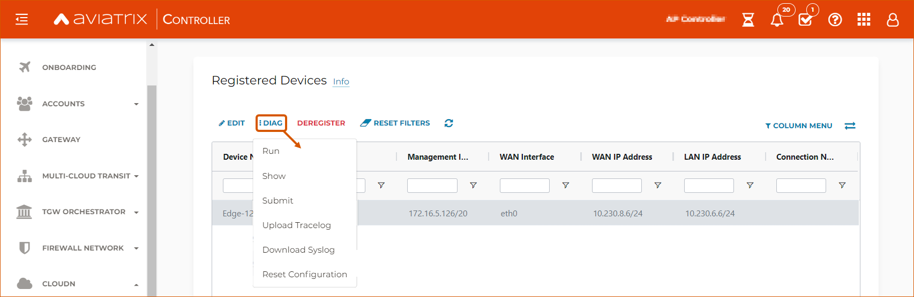

.. meta::
   :description: Secure Edge Deployment
   :keywords: Edge, Edge Gateway, EaaG, Edge ZTP, VMware ESXi

==================================================
Deploying Aviatrix Secure Edge 1.0 for VMware ESXi
==================================================

Aviatrix Secure Edge has a virtual form factor that lets you deploy an Edge Gateway as a standard virtual machine (VM). This document provides step-by-step instructions for deploying Aviatrix Secure Edge in a private or public Cloud network. The instructions in this document show you how to set up an Edge Gateway in VMware ESXi. 

For deployment diagrams and additional information, refer to `Aviatrix Secure Edge FAQ <http://docs.aviatrix.com/HowTos/secure_edge_faq.html>`_.

Prerequisites
-------------

Aviatrix Secure Edge 1.0 requires the following:

- Aviatrix Controller 6.7. For instructions on how to upgrade to Aviatrix Controller 6.7, refer to `Upgrading the Aviatrix Cloud Network Platform <http://docs.aviatrix.com/HowTos/selective_upgrade.html>`_.
- VMware vCenter Server (optional)
- VMware ESXi OVA file
- VMware ESXi Versions: 6.7 or 7.0.1

The Aviatrix Edge can run on the VMware ESXi Hypervisor. VMware ESXi runs on x86-based CPU platforms.  

For more information about installing VMware vSphere products, refer to the VMware product documentation.

Requesting a VMware ESXi OVA File
^^^^^^^^^^^^^^^^^^^^^^^^^^^^^^^^^

Before you begin the deployment of the Edge Gateway, submit a request to Aviatrix Support for a link to the VMware ESXi OVA file. You will use the OVA file to deploy the Edge virtual machine in VMware ESXi.

1. Log in to the Aviatrix Support Portal: `<https://aviatrix.zendesk.com>`_.

2. Select **Submit a request**.

3. In the **Subject** field, enter **Requesting access to Edge image**.

4. In the **Description** field, enter the physical address of the location where you will install the Edge VM(s), such as a data center, headend, co-location site, or office. If you are installing Edge VMs at more than one location, provide the following information for each physical location:

    - Physical Address (Do not enter a P.O.Box.)
    - City
    - State or Locality
    - Zip Code or Postal Code
    - Country

5. Click **Submit**. Aviatrix Support will respond with a link you can use to download the OVA file.

Access Requirements
-------------------

The Aviatrix Controller requires access to the following ports for Edge Gateway deployment. You must allow access on these ports on your firewall.

- MGMT: TCP 443 access to the Aviatrix Controller’s public IP address 
- MGMT: TCP 443 access to the Aviatrix Controller’s private IP address (only permit this access if you selected **Over Private Network** for management IP connectivity) 
- WAN: UPD 500/4500

Virtual Machine CPU and Memory Configurations
---------------------------------------------

The following table provides CPU and memory configuration guidelines of the virtual machine instance for the Aviatrix Edge Gateway deployment. 

+-----------------+------------------+----------------------+
| Deployment Type | Hardware Profile | Storage Requirements |
+=================+==================+======================+
| Small           | 2CPU - 4GB       | 64 GB                |
+-----------------+------------------+----------------------+
| Medium          | 4CPU - 8GB       | 64 GB                |
+-----------------+------------------+----------------------+
| Large           | 8CPU - 16GB      | 64 GB                |
+-----------------+------------------+----------------------+
| X-Large         | 16CPU - 32GB     | 64 GB                |
+-----------------+------------------+----------------------+

Oversubscription of host resources can lead to a reduction of performance and your instance could become unstable. We recommend that you follow the guidelines and the best practices for your host hypervisor.

Deploying an Edge Gateway in VMware ESXi
------------------------------------------

To deploy an Edge Gateway in VMware ESXi, follow these steps.

1. `Deploy the Edge virtual machine in VMware ESXi <http://docs.aviatrix.com/HowTos/secure_edge_workflow.html#deploying-an-edge-gateway-in-vmware-esxi>`_.

2. `Set up the Edge Gateway in Aviatrix Controller <http://docs.aviatrix.com/HowTos/secure_edge_workflow.html#setting-up-an-edge-gateway-in-aviatrix-controller>`_.

3. `Attach the ISO image to the Edge virtual machine <http://docs.aviatrix.com/HowTos/secure_edge_workflow.html#attaching-the-iso-image-to-the-edge-virtual-machine>`_.

4. `Attach the Edge Gateway to the Transit Gateway <http://docs.aviatrix.com/HowTos/secure_edge_workflow.html#attaching-an-edge-gateway-to-a-transit-gateway>`_.

Deploying the Edge Virtual Machine in VMware ESXi
^^^^^^^^^^^^^^^^^^^^^^^^^^^^^^^^^^^^^^^^^^^^^^^^^

To deploy the Edge virtual machine in VMware ESXi, follow these steps. 

1. Download the ESXi OVA file by using the link provided to you by Aviatrix Support. Refer to `Requesting a VMware ESXi OVA File <http://docs.aviatrix.com/HowTos/secure_edge_workflow.html#requesting-a-vmware-esxi-ova-file>`_.

2. Log into VMware vSphere Web client to access the ESXi host.

   You can use vSphere Web client to manage ESXi host, launch a VM, mount ISO files, and start and stop the Aviatrix Edge Gateway.

3. To load the OVA file into the ESXi using vSphere, go to: **ESXI** > **Virtual Machines** > **Create/Register VM**.

4. Select **Deploy a virtual machine from an OVF or OVA file**. Click **Next**.

5. Enter a name for the Edge VM and drag the OVA file into the blue pane. Click **Next**.

   |secure_edge_ova_load_file|

6. In the Select storage page, select the storage device for the instance you created (the OVA is installed in this instance). Click **Next**.

7. In the Deployment options window, enter the network interface mappings and select the Deployment type. (Refer to the pull-down menu or see `Virtual Machine CPU and Memory Configurations <http://docs.aviatrix.com/HowTos/secure_edge_workflow.html#virtual-machine-cpu-and-memory-configurations>`_.)

   |secure_edge_ova_deploy_options|

8. Click **Next**.

9. In the Ready to complete page, click **Finish**.

Setting Up an Edge Gateway in Aviatrix Controller
^^^^^^^^^^^^^^^^^^^^^^^^^^^^^^^^^^^^^^^^^^^^^^^^^

.. note::
   You must have port 443 open to the IP address of the Aviatrix Controller. For the required access for Edge Gateway deployment, refer to `Access Requirements <http://docs.aviatrix.com/HowTos/secure_edge_workflow.html#access-requirements>`_.

To set up an Edge Gateway in Aviatrix Controller, follow these steps.

1.  Log in to Aviatrix Controller 6.7.

2.  Go to **CLOUDN** > **Setup**.

3.  In the Launch an Edge Gateway page, enter the following Edge name and IP information:

    a.  Cloud Type is always set to **Aviatrix**.
 
    b.  In **Gateway Name**, enter a name for the new Edge Gateway.

    c.  For **ZTP File Type**, select **ISO**.

        .. note::
         The ISO file is the equivalent of the Zero-Touch Provisioning (ZTP) token. ZTP allows network engineers to remotely deploy and provision network devices at remote locations.

    d.  For **Management Connection Type**, select DHCP or Static, depending on your environment. 
      
    .. note::
      Steps (e-m) are applicable only for static IP configuration on the management interface.
      For IP and DNS settings, enter using the applicable format. For example, if the Edge Gateway's WAN IP is 10.1.1.151, enter 10.1.1.151/24 or what your netmask is.
 
    e.  For **Management Interface IP/Mask**, enter the management interface IP/mask for the Edge VM.

    f.  For **Default Gateway IP**, enter the IP address of the Default Gateway for the Management Subnet.

    g.  For **Primary DNS Server**, enter the DNS server IP address.

    h.  For **Secondary DNS server**, enter the DNS server IP address, this field is optional.

    i.  For **Over Private Network**, check the box if the Edge management connection to Controller is over a private network. Leave it unchecked if the connection is over the public internet.

    j.  For **Management Egress Gateway IP**, enter the IP address  of the Edge VM visible to the Controller (this IP is optional and can be added later).

       This field adds a security bypass filter rule for the incoming traffic on TCP/443 to your Controller.

    k.  For **WAN Interface IP/Mask**, enter the interface IP/mask for the Edge VM.

    l.  For **WAN Default Gatewa**, enter the IP address of the Edge WAN interface.

    m.  For **LAN Interface IP/Mask**, enter the interface IP/mask for the Edge VM. 

      The image below shows the Launch an Edge Gateway configuration when you do not select **Over Private Network**.

      |secure_edge_launch_gateway_a|

4. Click **Create**. Aviatrix Controller prompts you to download the ISO file.

Attaching the ISO Image to the Edge Virtual Machine
^^^^^^^^^^^^^^^^^^^^^^^^^^^^^^^^^^^^^^^^^^^^^^^^^^^

.. note::
   * The ZTP ISO file can only be used for a single Edge VM instance, and only one time for that instance. 
   * The ZTP token expires after 24 hours. If you wait too long to boot up the VM with the attached ISO image, it will not work.  In that case, delete the Edge Gateway in the Controller UI and create a new Edge Gateway to receive a new ISO file.

1. Upload the ISO file you downloaded from Aviatrix Controller to your VMware datastore.

2. In vSphere, select the Edge VM you created and click **Edit settings**.

3. Select the **Virtual Hardware** tab.

4. Next to CD/DVD Drive 1, click the down arrow and select **Datastore ISO file** from the pull-down menu.

5. To load the ISO to the virtual CD drive, next to **Status**, check **Connect at power on**.
 
6. Next to the CD/DVD Media field, click **Browse**. Select the ISO file you downloaded.

   |secure_edge_edit_settings|

   .. note::
      **Connect at power on** (step 4) is required when you attach the ISO image to the VM for the first time. If the VM is powered on at the time you attach the ISO image, select the **Datastore ISO file** and save the configuration to make the ISO available to ZTP.

7. Click **Save**.

Attaching an Edge Gateway to a Transit Gateway
^^^^^^^^^^^^^^^^^^^^^^^^^^^^^^^^^^^^^^^^^^^^^^

After you deploy an Edge Gateway, you must attach it to a Transit Gateway.

1. In Aviatrix Controller, go to **CLOUDN** > **List**.

2. In Registered Devices, locate the Edge VM you created. Confirm that the Edge VM was successfully registered. If the registration was successful, the status in the **State** column will show registered.

   |secure_edge_registered_devices_a|

   If the VM was not successfully registered, follow these troubleshooting steps.

      a. Confirm you have network connectivity from the Edge Gateway to the Controller.

      b. Confirm any firewall and security rules (such as security groups) that allow traffic to and from the Controller.

      c. If steps a) and b) do not resolve the issue, reset the Edge Gateway configuration and try again.

      If these steps fail, contact Aviatrix Support at `Aviatrix Support Portal <https://support.aviatrix.com>`_.

3. To attach the Edge Gateway to the Transit Gateway, go to **Controller** > **CLOUDN** > **Attach**.

4. In step 2, **Attach Device to Cloud**, complete the following fields:  

   .. note::
      If you are connecting over a public network, WAN discovery is currently mandatory.

   a. For **Device Name**, select the registered Edge Gateway.

   b. For **Aviatrix Transit Gateway**, select the Transit Gateway you want the Edge Gateway to connect to.

   c. For **Connection Name**, enter a name for this connection.

   d. For **Aviatrix Transit Gateway BGP ASN**, enter the ASN for your Transit Gateway.

   e. For **Device’s BGP ASN**, enter the ASN for your Edge Gateway.

   f. For **Device’s LAN Interface Neighbor’s IP**, enter the Neighbor’s LAN interface IP.

   g. For **Device’s LAN Interface Neighbor’s BGP ASN**, enter the Neighbor’s LAN interface BGP ASN.

   h. For **Over Private Network**, leave the box unchecked if you are building the tunnel over the public internet.
      
      |secure_edge_attach_device_a|

5. Click **Attach**.

6. Navigate back to **CLOUDN** > **List**. Once the tunnel is successfully built, the Edge Gateway status in the **State** column changes from registered to attached. 

Editing or Viewing an Edge Gateway Configuration
------------------------------------------------

1. To edit the Management Egress IP, select the Edge Gateway and click **EDIT**.

   |secure_edge_mgmt_egress_ip_a|

2. Update the Egress Management IP and click **SAVE**.

   |secure_edge_update_egress_ip_a|

3. To run and show diagnostics, upload Tracelog, download Syslog, and reset configuration, select the Edge Gateway and click **DIAG**.

   |secure_edge_run_diag_a|

Deregistering and Reregistering an Edge Gateway
-----------------------------------------------

An Edge Gateway can be deregistered from the Aviatrix Controller only when it is in the **registered** state. If the gateway is in any other state, its configuration needs to be reset first to remove it from the Aviatrix Controller.

Deregistering an Edge Gateway from Aviatrix Controller
^^^^^^^^^^^^^^^^^^^^^^^^^^^^^^^^^^^^^^^^^^^^^^^^^^^^^^

To deregister an Edge Gateway from the Aviatrix Controller, the Edge Gateway must be in **registered** state. To reset Edge Gateway configuration, refer to `Resetting an Edge Gateway's Configuration from Aviatrix Controller <http://docs.aviatrix.com/HowTos/secure_edge_workflow.html#resetting-edge-gateway-configuration-from-aviatrix-controller>`_.

To deregister an Edge Gateway:

1. Navigate to **CLOUDN** > **List**.

2. Select the Edge Gateway, and click **DEREGISTER**.
   
   |secure_edge_deregister_a|

Resetting Edge Gateway Configuration from Aviatrix Controller
^^^^^^^^^^^^^^^^^^^^^^^^^^^^^^^^^^^^^^^^^^^^^^^^^^^^^^^^^^^^^

To reset an Edge Gateway's configuration:

1. Navigate to **CLOUDN** > **List**.

2. Select the Edge Gateway. Click **DIAG**. In the drop-down list of options, select **Reset Configuration**.

   |secure_edge_reset_config_a|

If you reset an Edge Gateway when it is in the **check** state, you also need to reset its configuration on the Edge virtual machine. To do this, log in to the Edge Gateway’s Clish command line interface and execute the **reset_config** command. This resets the Edge virtual machine to its factory settings. The Edge virtual machine can now be treated as a new Edge virtual machine.

Reregistering an Edge Gateway with Aviatrix Controller
------------------------------------------------------

You can register an Edge virtual machine as a new Edge Gateway after it has been deregistered from the Aviatrix Controller or after you reset it to the factory settings. 

To reregister an Edge Gateway, do the following.

1. `Download and attach the ISO file to the Edge virtual machine <http://docs.aviatrix.com/HowTos/secure_edge_workflow.html#downloading-and-attaching-the-iso-file-to-the-edge-virtual-machine>`_.

2. `Register the Edge virtual machine with the Aviatrix Controller <http://docs.aviatrix.com/HowTos/secure_edge_workflow.html#registering-the-edge-virtual-machine-with-the-aviatrix-controller>`_.

3. `Attach the Edge Gateway to the Transit Gateway <http://docs.aviatrix.com/HowTos/secure_edge_workflow.html#attaching-a-reset-edge-gateway-to-a-transit-gateway>`_.

Downloading and Attaching the ISO file to the Edge Virtual Machine
^^^^^^^^^^^^^^^^^^^^^^^^^^^^^^^^^^^^^^^^^^^^^^^^^^^^^^^^^^^^^^^^^^

To register an Edge Gateway after it has been deregistered from the Aviatrix Controller, do the following.

1. Download the ISO file for your new Edge Gateway by following the steps in `Setting up an Edge Gateway in Aviatrix Controller <http://docs.aviatrix.com/HowTos/secure_edge_workflow.html#setting-up-an-edge-gateway-in-aviatrix-controller>`_.

2. To Attach the new ISO file to your Edge virtual machine, upload the ISO file to your VMware datastore.

3. Power OFF the Edge virtual machine.

4. In vSphere, select the Edge VM and click **Edit**.

5. Select the Virtual Hardware tab.

6. Expand the CD/DVD Drive 1 section.

7. Next to **CD/DVD Drive 1**, click the down arrow and select **Datastore ISO file** from the pull-down menu. Check the **Connect** box next to Datastore ISO file.

8. Next to the **Status** field, check the **Connect at power on** box.

9. Next to the **CD/DVD Media** field, click **Browse**. Select the new ISO file that you uploaded to the datastore.

   |secure_edge_attach_iso|

10. Click **Save** to save this configuration and configure the Edge VM.

11. Power ON the Edge VM.

12. Ensure the new ISO file is connected to the CD/DVD Drive 1 of the Edge VM.

   |secure_edge_hardware_config|

   The Edge VM is ready to be registered with the Aviatrix Controller.

Registering the Edge Virtual Machine with the Aviatrix Controller
^^^^^^^^^^^^^^^^^^^^^^^^^^^^^^^^^^^^^^^^^^^^^^^^^^^^^^^^^^^^^^^^^

If you are reusing an Edge VM, ZTP is not triggered automatically after you attach the new ISO file to the Edge VM. It must be triggered manually by using the Clish console.

1. Use the Edge VM’s vSphere serial console to log in to the Edge VM’s Clish command line interface.

2. Execute the **register** command and wait for the command to complete.
 
3. If the Edge Gateway registration is successful, you should see a success message. If the gateway registration fails, you will see a message with the next steps to troubleshoot the failure.
   
   The Edge Gateway can now be attached to the Transit Gateway.

Attaching a Reset Edge Gateway to a Transit Gateway
---------------------------------------------------

After you deploy an Edge Gateway that you reset, you attach it to a Transit Gateway.
To attach the Edge Gateway to a Transit Gateway, follow the steps in `Attaching an Edge Gateway to a Transit Gateway <http://docs.aviatrix.com/HowTos/secure_edge_workflow.html#attaching-an-edge-gateway-to-a-transit-gateway>`_.

Selective Gateway Upgrade for Secure Edge
-----------------------------------------

The Aviatrix Secure Edge base OS is not upgradeable. To update the base OS to a newer version, you can only deploy a newer version of the Secure Edge image to a new VM to replace it.

As Secure Edge base OS is not field upgradeable, Secure Edge does not support selective gateway image update and software rollback.

Troubleshooting
---------------

You can use the Clish commands below to troubleshoot the Edge Gateway.

To run Clish on the Edge Gateway, log in with the username **admin**.

+-----------------------------------+--------------------------------------------------------+
| Command                           | Description                                            |
+===================================+========================================================+
| change_console_password           | Changes the password for the CLI login.                |
+-----------------------------------+--------------------------------------------------------+
| diagnostics                       | Show gateway diagnostics from                          |
|                                   | /home/ubuntu/cloudx-aws/avx_edge_status.json, which is |
|                                   | written by register process or reset_config process.   |
+-----------------------------------+--------------------------------------------------------+
| logout                            | Log out of the console.                                |
+-----------------------------------+--------------------------------------------------------+
| ping [-c count] [dest]            | Ping destination, optional parameter ping packet count.|
|                                   | The default is 5.                                      |
+-----------------------------------+--------------------------------------------------------+
| reboot                            | Reboot the system.                                     |
+-----------------------------------+--------------------------------------------------------+
| register                          | Register with the Controller.                          |
+-----------------------------------+--------------------------------------------------------+
| reset_config                      | Deregister and reset to factory default.               |
+-----------------------------------+--------------------------------------------------------+
| set_controller_ip [controller_ip] | Set controller ip, usually performed after controller  |
|                                   | migration when controller ip changed.                  |
+-----------------------------------+--------------------------------------------------------+
| set_lan addr [lan_cidr]           | Set LAN interface CIDR.                                |
+-----------------------------------+--------------------------------------------------------+
| set_lan mtu [lan_mtu]             | Set LAN interface MTU.                                 |
+-----------------------------------+--------------------------------------------------------+
| set_wan addr [wan_cidr]           | Set WAN interface CIDR.                                |
+-----------------------------------+--------------------------------------------------------+
| set_wan gateway [gateway_ip]      | Set WAN gateway IP.                                    |
+-----------------------------------+--------------------------------------------------------+
| set_wan mtu [wan_mtu]             | Set WAN interface MTU.                                 |
+-----------------------------------+--------------------------------------------------------+
| show_interfaces                   | Show output from the command “ifconfig -a | more”.     |
+-----------------------------------+--------------------------------------------------------+
| show_routes                       | Show output from the command “ip route show table all”.|
+-----------------------------------+--------------------------------------------------------+
| test connect                      | Test TLS and port 443 connection to controller.        |
+-----------------------------------+--------------------------------------------------------+
| test dns [host_name]              | Test DNS availability.                                 |
+-----------------------------------+--------------------------------------------------------+
| test port                         | Test controller port 443 reachability.                 |
+-----------------------------------+--------------------------------------------------------+
| unlock                            | Unlock console and enter Linux shell.                  |
+-----------------------------------+--------------------------------------------------------+

Tech Notes About BGP and Routing
--------------------------------

If the connectivity to the Cloud Service Provider (CSP) is over a private network:  

- The edge (WAN) router runs a BGP session to VGW (AWS) where the edge router advertises an Edge Gateway WAN subnet network, and the VGW advertises the Transit VPC CIDR. 

- The Edge Gateway LAN interface runs a BGP session to the edge router where the edge router advertises the on-prem network address range to Edge Gateway LAN interface. 

- The Edge Gateway WAN interface runs a BGP session to the Transit Gateway in the Transit VPC where Transit Gateway advertises all Spoke VPC CIDRs to the Edge Gateway, and the Edge Gateway advertises on-prem network to the Transit Gateway. 

If the connectivity to the CSP is over a public network: 

- The Edge Gateway LAN and WAN interfaces do not use public IP addresses. The interfaces rely on the edge router or Firewall NAT function and Internet connectivity. 

- The Edge Gateway LAN interface runs a BGP session to the edge router where the edge router advertises the on-prem network address range to the Edge Gateway LAN interface. 

- The Edge Gateway WAN interface runs a BGP session to the Transit Gateway in the Transit VPC/VNET where the Transit Gateway advertises all Spoke VPC/VNET CIDRs to the Edge Gateway, and the Edge Gateway advertises the on-prem network to the Transit Gateway.

.. |secure_edge_ova_load_file| image:: CloudN_workflow_media/secure_edge_ova_load_file.png
   :scale: 80%

.. |secure_edge_ova_deploy_options| image:: CloudN_workflow_media/secure_edge_ova_deploy_options.png
   :scale: 80%

.. |secure_edge_edit_settings| image:: CloudN_workflow_media/secure_edge_edit_settings.png
   :scale: 50%

.. |secure_edge_attach_iso| image:: CloudN_workflow_media/secure_edge_attach_iso.png
   :scale: 40%

.. |secure_edge_hardware_config| image:: CloudN_workflow_media/secure_edge_hardware_config.png
   :scale: 40%

.. disqus::
