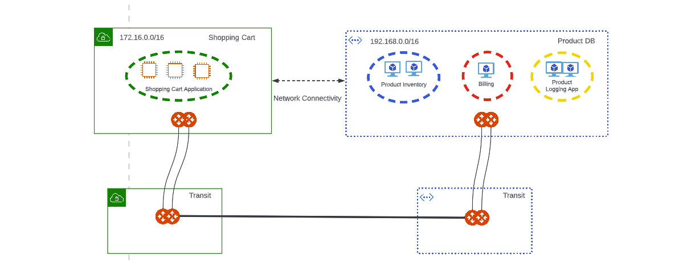

.. meta::
  :description: Aviatrix Micro-Segmentation
  :keywords: security,micro-segmentation,AWS,Azure

=========================================
Secure Networking with Micro-Segmentation
========================================= 

Micro-segmentation provides granular network security policy for distributed applications in the Cloud. Micro-segmentation enables network policy enforcement between application domains (app domains) you define in a single cloud or across multiple clouds. Users can configure policies to filter traffic between the applications residing in these domains.

|microseg_topology|

Use cases where you might implement micro-segmentation are:

- Workload isolation: in a typical tiered application, you may want to isolate tiers that do not require access to each other. For example, in a Shopping Cart application, there could be workloads for product inventory, billing, and a Product Logging app. Since the Shopping Cart application does not need to communicate with the Product Logging app, this traffic should be blocked.
- Quarantine compromised machines: You can isolate a compromised machine by placing it in its own app domain and blocking communication to that domain.

Micro-Segmentation Components
=============================== 

Micro-segmentation introduces two important configuration components—-app domains and policies. 

App Domains
--------------
An app domain is a grouping of workloads, subnets, or VPC/VNets that require a uniform policy enforcement. For example, all servers running the product inventory database (as per the above workload isolation use case) can form an app domain. A Cloud resource can be part of multiple app domains. 

When you create your app domains, you can classify them based on:

- CSP resource tags: these tags identify resources you can group. This is the preferred classification method, as this automatically includes new resources created in the Cloud with the same set of tags.
- Resource attributes: classify by account or region.
- IP addresses or CIDRs: for resources that are not tagged, you can directly specify IP addresses or CIDRs.

  .. note::
	Aviatrix Gateway IP addresses will not be included in any app domain, even if an app domain filter matches an Aviatrix Gateway IP address. If a subnet or VPC/VNet is added to an app domain, the Aviatrix Gateway IP addresses are removed from the corresponding CIDRs.

Policies
------------
After creating app domains, you create policies that consist of rules, to define the access control to apply on the traffic between those app domains. In the above workload isolation use case, all traffic (i.e., ports and protocols) between the ShoppingCart application and the Product Logging app must be blocked (Denied). You can decide which rules to enforce, and if you want to log the actions related to a rule. These rules are enforced (if enabled) on your Spoke gateways, and are executed against the Spoke gateways in the order that they are shown in the rule list. 

Prerequisites
-----------------
Before applying micro-segmentation:

- Your version of CoPilot must be 2.0 or greater.
- Your version of Aviatrix Controller must be 6.7 or greater.
- Gateways must have their image updated to version 6.7 or greater.
- Network reachability should be configured between the VPCs that contain applications that require connectivity. You configure network reachability using Connected Transit/MCNS. See `here <https://docs.aviatrix.com/HowTos/transit_advanced.html#connected-transit>`_ for more information.
- If you plan to use CSP tags in your app domains, Cloud resources must be tagged appropriately.

Configuring Micro-Segmentation
=============================== 

This section describes the micro-segmentation functional area of Aviatrix CoPilot.

Creating App Domains 
-----------------------
An app domain contains one or more filters to identify CSP endpoints that map to an app domain. A filter specifies resource matching criteria. Matching criteria could be a CSP tag; a resource attribute (such as account name or region); or a list of IP prefixes. All conditions within the filter must be satisfied to be matched. A tag or resource attribute-based filter must be associated with a resource type (VPC/VNet, subnet, or VM). 

1. In CoPilot, navigate to Security > Micro-Segmentation > App Domain.
2. Click +ADD DOMAIN.
3. Enter a name for the app domain.
4. If you want to add a resource type (VPC/VNet, virtual machine, or subnet), follow the below steps. If you want to enter IP addresses or CIDR ranges for your app domain, go to step 5.

	a. Click +Resource Type and select VPC/VNet, Virtual Machines, or Subnet. 
	b. Enter the matching criteria for resources that will be part of this app domain. 
	c. All CSP tags that you have defined for your Cloud resources are present in the list for you to select from. Some examples of tags are: Backup, Controller, Aviatrix-Created-Resource, and Type.
	d. If needed, add another resource type. Typically you will only have resources of the same type in an app domain (for example, you can have more than one VM based filter).
	e. You can also select resource attributes (Account Name and Region) if you want to match against all resources within an account or region. The values for the selected condition(s) are populated automatically.
	f. After entering your resource type, you can use the Preview Resources toggle switch to see the selected resources that map to the app domain. 

5. If you prefer not to use specific tags in your resources, enter the VPC/VNet IP addresses or CIDRs in the field provided. Traffic across CIDRs between two app domains in the same VPC/VNet is not subject to micro-segmentation policies.
6. Click Save. The new app domain is now in the App Domain list.

From here you can:

- Click the app domain name to view it in read-only format
- Click the pen icon to edit the app domain
- See how many rules reference each app domain

Creating Policies 
---------------------
After creating your app domains, you create policies (that consist of rules) to filter traffic sent between the selected source and destination app domains. The rules are executed in the order they appear in the list. 

An app domain traffic flow can belong to more than one rule. If this occurs, the priority of the rule determines the action that is taken first. 

1. In CoPilot, navigate to Security > Micro-Segmentation > Policies.
2. On the Policies tab, click +RULE. 
3. Enter a name for the rule.
4. Select the Source App Domains -- these domains originate (bi-directional) traffic.
5. Select the Destination App Domains -- these domains terminate (bi-directional) traffic.

A micro-segmentation rule is inherently bi-directional, which means that traffic originating from source app domains can reach destination app domains, and vice versa. An exception to this rule is that TCP connections initiated from the destination to the source will not be matched.

6. Select if the rule is allowed or denied. This determines the action to be taken on the traffic.
7. If the Enforcement slider is On (the default), the rule is enforced in the data plane. If the Enforcement slider is off, the packets are only watched. This allows you to observe if the traffic impacted by this rule causes any inadvertent issues (such as traffic being dropped). 
8. If the Logging slider is On, information (such as five-tuple, source/destination MAC address, etc.) related to the action is logged. Since logging uses a lot of disk space, be careful when enabling logging on your rules. It is best to enable logging for a short period of time while you are debugging, and then disable logging again when you are finished.
9. Select the protocol used: TCP, UDP, ICMP, or Any. If you select TCP or UDP you can enter a port number or port range.
	
As per the workload isolation use case above (blocking traffic between the Shopping Cart application and the Product Logging app), the rule would look like this:

- Source app domain: Shopping Cart application
- Destination app domain: Product Logging app
- Action: Deny
- Protocol: Any
- Ports: 0-65535 (Any)
- Logging: Off
- Enforcement: On

10. Determine the rule order by selecting the following in the Place Rule list:

- Above, Below, Top, or Bottom. If you select Above or Below, you must select the existing rule that is affected by the position of the new rule.
- Priority; you then enter a Priority Number for the rule. If an existing rule already has that priority, it is bumped down in the list. Zero (0) is the highest priority number. 

After the rule is created you can click the arrow icon next to that rule in the Policies table to change the priority.

11. Click Save in Drafts. 
12. Make additional modifications as needed by clicking the pencil icon next to the rule.
13. You can then review, commit, or discard the rule changes. 

Retaining Log Files
-------------------
To configure how many days to keep your micro-segmentation logs, in CoPilot navigate to Settings > Advanced Settings and scroll down to Index Retention Manager. Use the slider next to Micro-segmentation Logs to select the number of days to retain your logs (default is five days).

Viewing Raw Logs
----------------
Micro-segmentation supports per-packet logging when logging is enabled on a policy. For more information on consuming the raw logs, click `here <https://docs.aviatrix.com/HowTos/AviatrixLogging.html#id7>`_.

Viewing Rule Statistics
-------------------------
You can open a previously created rule to view the statistics related to the execution of that particular rule. You can view traffic statistics from the last hour, week, or month, or a custom time period. The resulting graph indicates if the traffic is Observed, Enforced & Allowed, or Enforced & Denied.

Creating a Default Policy
-------------------------
As a best zero trust security practice, you should add a deny rule that blocks traffic from all app domains to the universal 0.0.0.0/0 app domain. For example, if app domains A and B are configured to talk to each other, you may not want app domain C to be able to talk to app domain A or B. Creating this default rule helps with locking down configured app domains. This should be the last rule in the list.

Policy Monitor
--------------
Under Security > Micro-segmentation > Policies > Policy Monitor, you can filter packet logs for rules with logging enabled to determine why a rule may not be working as intended. You can filter based on the following information: timestamp, rule, source/destination IPs, protocol, source/destination port, action (allowed or dropped), and if the rule is enforced. The table refreshes every 15 seconds, and you can also refresh the table manually.

CoPilot throttles the logs for each connection shown in Policy Monitor to one packet per minute in each direction.

Configuring the Polling Interval
================================
The Aviatrix Controller periodically polls your CSPs to gather and inventory its resources. For example, if you modified your CSP tags, you may want to poll data more frequently so that CoPilot reflects those changes.

In CoPilot navigate to Settings > Advanced Settings > Micro-Segmentation Settings> CSP Resource Poll Interval and enter the desired polling interval in minutes (default is 60). This can be a value between 1-180. Click Save.

You can manually trigger a poll to fetch resources directly from your CSPs by clicking the Refetch CSP Resources button on the Micro-Segmentation tab. The poll may take several minutes to complete depending on the size of your environment. 

Limitations
===========

- In 6.7 micro-segmentation is only supported on AWS and Azure. Support for other clouds is not available in this release.
- You can configure up to 500 app domains.
- You can have up to 3000 unique CIDRs per app domain.
- You can configure up to 20 filters per app domain (OR/ANY filters that are not the CIDR type).
- You can configure up to ten ALL/AND match criteria per filter.
- You can create up to 64 rules per policy.
- The total number of CIDRs in all app domains cannot exceed 10,000.
- Traffic between two app domains in the same VPC/VNet is not subject to micro-segmentation rules/policies.

