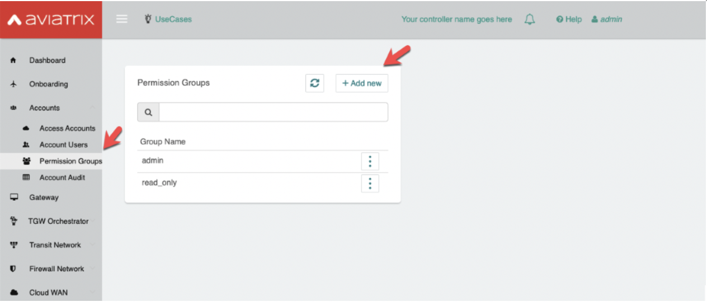
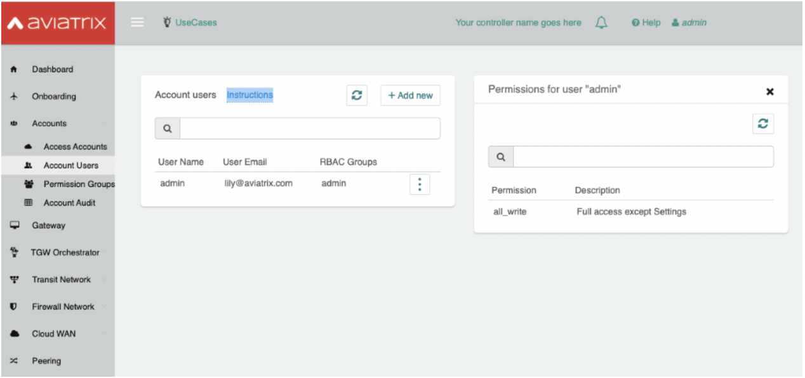
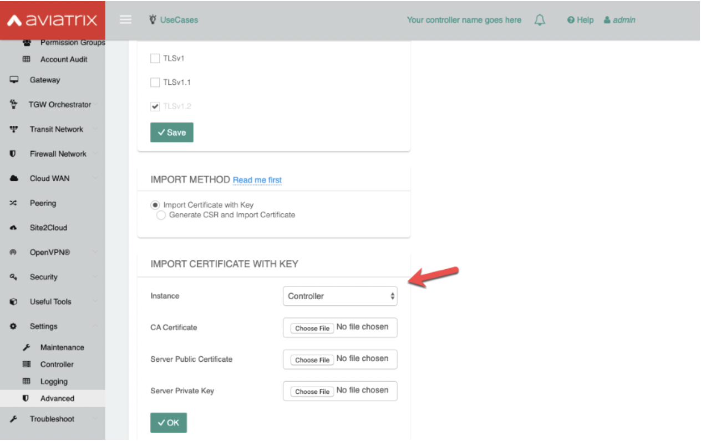
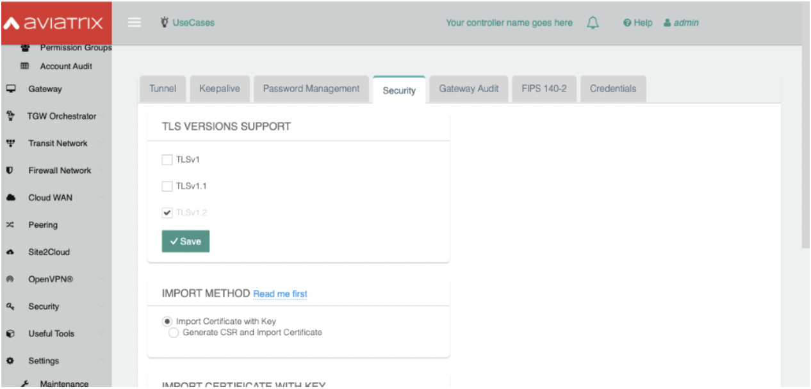

*************
Security FAQs
*************

Browse Questions
=================

`Is customer data contained in the customer's AWS account?`_

`Will the controller and gateway need to reach out to Aviatrix to receive commands or send routing data to Aviatrix?`_

`Do we need a controller in each cloud environment (i.e., one for AWS, one for Azure, etc.)? If not, how do we do multi-cloud traffic steering?`_

`How are Aviatrix instances hardened?`_

`Does Aviatrix Controller have a database running?`_

`How does a Gateway device communicate/authenticate to the controller?`_

`Is Aviatrix SOC2 certified?`_

`Is Aviatrix PCI-DSS compliant?`_

`Is Aviatrix HIPAA compliant?`_

`Is Aviatrix FedRamp compliant?`_

`Is Aviatrix software in compliance with Section 508, IT Accessibility Standards?`_

`Is Aviatrix FIPS 140-2 certified?`_

`Can Aviatrix software support GovCloud implementation?`_

`Do Aviatrix Controller and Gateway instances support running an anti-malware agent?`_

`Is it possible to do OS disk encryption on Aviatrix Gateway instances without taking the Gateway down?`_

`Can a customer create their own custom hardened image for the Aviatrix Controller or Gateway instances?`_

`Can we install tools on the Aviatrix Gateway instances for monitoring network traffic and resource consumption?`_

`Can we patch the Aviatrix Controller and Gateway instances using our Systems Manager agent?`_

`Does Aviatrix implement Secure Coding and Development practices to ensure that the software is not vulnerable to DDoS, SQL Injection and/or Cross Site Scripting Attacks?`_

`Does Aviatrix software support IKEv2?`_

`Does Aviatrix software support role-based access control (RBAC)?`_

`What IAM policy is required to use Aviatrix?`_

`Can I use a custom SSL Certificate for the Controller and Gateway instances?`_

`How is data encrypted during transmission from source Controller to destination Gateway?`_

Is customer data contained in the customer's AWS account?
---------------------------------------------------------

Yes, all Aviatrix AMI is deployed in the customer’s private cloud environment.

Will the controller and gateway need to reach out to Aviatrix to receive commands or send routing data to Aviatrix?
---------------------------------------------------------------------------------------------------------------------------------------

No, customers' configuration data is never accessed by Aviatrix. The only time Aviatrix receives information from a customer is:  

  * When a customer pushes log data to our encrypted customer S3 bucket for technical support.
  
  * For customers using a BYOL license, the license activity (acquisition and retiring a license) is validated to the Aviatrix license server.  

Do we need a controller in each cloud environment (i.e., one for AWS, one for Azure, etc.)? If not, how do we do multi-cloud traffic steering?  
---------------------------------------------------------------------------------------------------------------------------------------

No, you don’t. One Aviatrix Controller manages cloud deployment in AWS, Azure, GCP, and OCI. Aviatrix Controller launches Gateways in each cloud and orchestrates policies to build network segmentation and secure connectivity.

How are Aviatrix instances hardened?
------------------------------------

The Aviatrix Controller and Gateway instances are virtual machines using Ubuntu OS which is maintained specifically for Aviatrix for infrastructure services. All OS patches go through our full QA process and are managed in the releases of the Aviatrix software.

  * Users cannot login to Aviatrix Controller or Gateway instances, as SSH access is disabled. 
  
  * Both Controller and Gateway instances have hard disk encryption, using AWS Elastic Block Storage (EBS) encryption. For more information, see AWS' documentation: https://docs.aviatrix.com/HowTos/FAQ.html#encrypt-controller-ebs-volume and https://docs.aws.amazon.com/AWSEC2/latest/UserGuide/EBSEncryption.html. 
  
  * Aviatrix Gateway instances' inbound security group only opens to the Controller EIP on port 443. See additional detail here `How do I secure the Controller access? <https://docs.aviatrix.com/HowTos/FAQ.html#how-do-i-secure-the-controller-access>`_
  

Does Aviatrix Controller have a database running?
-------------------------------------------------

Controller instances have a local MongoDB database installed, however this is not acccessible to end users.

How does a Gateway device communicate/authenticate to the controller?  
-------------------------------------------------------------------------------------------------------------------------------------------------------------------

Controllers send messages to your SQS or via HTTPS to the Gateway. Gateways pull messages from SQS.   

Is Aviatrix SOC2 certified?
---------------------------

Yes, Aviatrix is SOC2 Type 1 and Type 2 certified. 

Is Aviatrix PCI-DSS compliant?  
------------------------------

Aviatrix is not in-scope for PCI-DSS compliance. We do not process credit card information, nor do we have access to the customer’s data. Aviatrix software is deployed in the customer’s private network.

Is Aviatrix HIPAA compliant?
------------------------------

Aviatrix is not in-scope for HIPAA compliance. We do not process PHI/ePHI nor do we have access to the customer’s data. Aviatrix software is deployed in the customer’s private network. Internally, the company hires Third Party Administrator (TPA) for HR benefit services. We collect the business associate agreement for TPAs.   

Is Aviatrix FedRamp compliant?
------------------------------

Aviatrix is not in-scope for FedRamp compliance because it is not a SaaS product and Aviatrix software is installed in the federal network. However, Aviatrix is currently certified for SOC2 and we are also working on additional readiness for other frameworks such as NIST 800-171, ISO 27002, HIPAA and PCI.

Is Aviatrix software in compliance with Section 508, IT Accessibility Standards?
-------------------------------------------------------------------------------

Aviatrix covers Level A ready under the VPAT (Voluntary Product Accessibility Template) standards.   

Is Aviatrix FIPS 140-2 certified?  
---------------------------------

Yes. https://docs.aviatrix.com/HowTos/fips140-2.html  

Can Aviatrix software support GovCloud implementation?   
------------------------------------------------------

Yes. We support AWS GovCloud infrastructure.    

Do Aviatrix Controller and Gateway instances support running an anti-malware agent? 
--------------------------------------------------------------------------------------

Because Aviatrix is an appliance, we do not allow customer SSH access to install anti-malware software on the instances.  

Is it possible to do OS disk encryption on Aviatrix Gateway instances without taking the Gateway down?  
-------------------------------------------------------------------------------------------------------

No, customers are not allowed to add additional software code in Aviatrix Gateway instance. The instance is implemented with hard disk encryption using Elastic Block Store (EBS) encryption.  Below are additional details for this technology.  

  * https://docs.aws.amazon.com/AWSEC2/latest/UserGuide/EBSEncryption.html   
  
  * https://docs.aviatrix.com/HowTos/encrypt_ebs_volume.html  
  
  * https://docs.aviatrix.com/HowTos/encrypt_ebs_volume.html#how-to-encrypt-gateway-ebs-volume-via-aviatrix-controller 
  
Can a customer create their own custom hardened image for the Aviatrix Controller or Gateway instances?
-----------------------------------------------------------------------------------------------------

No. Because Aviatrix is an appliance, the instances are not accessible to install custom software.

Can we install tools on the Aviatrix Gateway instances for monitoring network traffic and resource consumption? 
----------------------------------------------------------------------------------------------------------------------

No, however, we support integrations to top SIEM platforms for your internal Threat/SOC operations. We currently support the following:

  * Remote syslog (recommended to use)  

  * AWS CloudWatch  

  * Splunk Enterprise  

  * Datadog  

  * Elastic Filebeat  

  * Sumo Logic  

  * Netflow  

See the Logging documentation for details on how to configure this: https://docs.aviatrix.com/HowTos/AviatrixLogging.html  

Can we patch the Aviatrix Controller and Gateway instances using our Systems Manager agent?
---------------------------------------------------------------------------------

No, our instances are appliances and customer SSH access is disabled. To patch Aviatrix Controller and Gateway instances, customers need to log into their Controller management console and update to the latest Aviatrix version.  

Does Aviatrix implement Secure Coding and Development practices to ensure that the software is not vulnerable to DDoS, SQL Injection and/or Cross Site Scripting Attacks?
-----------------------------------------------------------------------------------------------------------------------------------------------------------------------------------------

Aviatrix security measures for SDLC include access, change, vulnerability, threat intelligence and risk management safeguards. To ensure we protect our software code from known attacks like CSS, SQL Injection, and DDOS, we run vulnerability scans prior to each release to detect and mitigate any possible attacks. We also work closely with security researchers to detect zero day threats and we work with Coalfire to anually perform source code review and independent penetration testing.  

Does Aviatrix software support IKEv2?
--------------------------------------

IKEv2 is currenty supported for site2cloud tunnels. IKEv2 for Transit is in our roadmap. 

Does Aviatrix software support role-based access control (RBAC)? 
----------------------------------------------------------------

Yes, RBAC in Aviatrix Controller is available in version 5.4 or greater. The default roles available out of the box are admin and read_only. Customers can add custom RBAC permission groups in the Aviatrix Controller, and assign users to an RBAC Group. See detail here: https://docs.aviatrix.com/HowTos/rbac_faq.html

|security_rbac_1|

|security_rbac_2|

What IAM policy is required to use Aviatrix?  
--------------------------------------------

Since Aviatrix is an appliance deployed in your AWS account, you will create your AWS IAM Policy. When you launch Aviatrix, some services will deploy an IAM Policy to operate, however, it is the customer’s responsibility to edit the policy to your internal policy. When you edit the policy, we recommend you perform internal testing. 

The default IAM Policies used for Aviatrix are documented here: https://docs.aviatrix.com/HowTos/customize_aws_iam_policy.html?highlight=iam%20policy#iam-policies-required-for-aviatrix-use-cases 

See a sample of how to edit your IAM Policy for Aviatrix: https://docs.aviatrix.com/HowTos/customize_aws_iam_policy.html 

Can I use a custom SSL Certificate for the Controller and Gateway instances?
----------------------------------------------------------------------------

Yes, you can. To implement the SSL Certificate for your controller, go to Setting > Advanced > Security sub tab. Note that SSL verification check is not enabled by default and should be enabled by a customer

|security_bulletin_faq_certificate|

How is data encrypted during transmission from source Controller to destination Gateway? 
--------------------------------------------------------------------------------------------

By default, data transfer is over a TCP connection with TLSv1.2 for encryption. Customers have the option to downgrade the TLS Version used due to internal dependency conflicts. You can configure this in Aviatrix Controller by clicking on Settings > Advanced > Security.

How does Aviatrix encrypt data in transit? 
--------------------------------------------------------------------------------------------
Aviatrix 6.5 and above, Aviatrix implements a secured framework based on PKI/X.509 protocol to communicate between Controller and Gateway. 

How does Aviatrix handle security patch?
--------------------------------------------------------------------------------------------
A security patch resolves software vulnerabilities and will be applied to the compatible software versions as stated in the release notes. When a patch is released, there will be a field notice to Aviatrix Controller via email.

How do I stay up to date with the latest security vulnerabilities?
--------------------------------------------------------------------------------------------
We recommend customers to deploy the latest image, upgrading to the latest software version, and staying on top of any security patch released. Guaranteeing security against vulnerabilities is a sustained effort and it is Aviatrix's policy to address them continuously. 

Does Aviatrix have a ISO 27002 Certification?
--------------------------------------------------------------------------------------------
We currently don't but this is on the roadmap for 4Q2021. 

|security_bulletin_faq_encrypted_transmission|

.. disqus::
