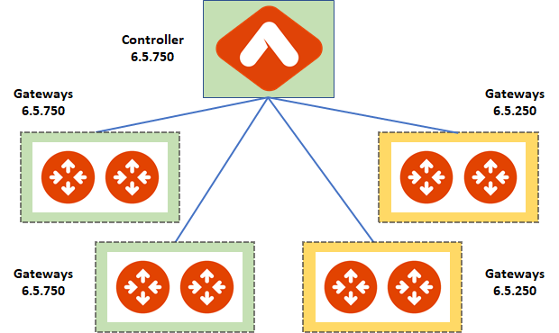
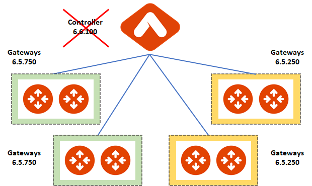
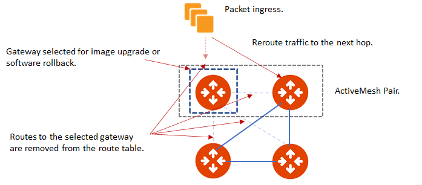

.. meta::
   :description: software upgrade of controller and gateways
   :keywords: hitless upgrade, selective upgrade, upgrade gateway software, no packet loss upgrade

=============================================
Upgrading the Aviatrix Cloud Network Platform
=============================================

.. important::

  Aviatrix strongly recommends you perform the tasks in the operations checklist including a dry run upgrade before upgrading your deployment of the Aviatrix network platform. Taking the time perform dry runs and backing up your Aviatrix Platform configuration reduces the potential for issues during the upgrade and allows you to easily restore your configuration if there are issues after the upgrade. Correct any issues you find during your preparation before proceeding with an Aviatrix upgrade. If you cannot resolve all issues after following the preparation and dry run procedures, please open a ticket with `Aviatrix Support <https://support.aviatrix.com/>`_.

Aviatrix encourages you to keep your platform controller and gateways up to date to ensure you are operating the most secure and highest performing versions available. To facilitate less disruptive upgrades and reduce maintenance windows Aviatrix provides a rolling selective upgrade process. You can choose to upgrade all Aviatrix gateways in all regions simultaneously or select specific gateways and regions to upgrade in logical groups conforming to your network update policies and maintenance windows. 

Perform all preparatory tasks and verify all prerequisites are satisfied before performing Aviatrix upgrades. For more information, see Preparing to Upgrade the Aviatrix Network Platform.

You can perform the following operations:
  
* Performing a Platform Software Upgrade Dry Run
* Performing a Gateway Software Upgrade Dry Run
* Upgrading the Platform Software
* Upgrading the Gateway Software
* Rolling Back the Gateway Software
* Upgrading the Gateway Image

Incremental upgrades are only available in Aviatrix 6.5 and later releases. If you are upgrading from a release prior to 6.5, the system automatically upgrades all gateways in the Aviatrix network. For more information, see `Upgrading from 6.4.x and Earlier Releases <https://docs.aviatrix.com/HowTos/inline_upgrade.html>`_.

Understanding Aviatrix Upgrades
-------------------------------

There are two types of upgrades for the Aviatrix Platform and gateways:

* **Software Upgrade** Platform and gateway software upgrades replace the relevant Aviatrix controller and gateway packages, configuration files, and binaries without disrupting network traffic or replacing the gateways. All software upgrades are hitless.
* **Image Upgrade** Gateway image upgrades replace the current gateways. Traffic throughput is briefly disrupted during image upgrades.

There are two types of patch updates:

* **Security Patches** Security patches are released when security updates to underlying software components become available. Most security patches are hitless. Review the release notes for the patch to discover if the upgrade is hitless or disruptive. 
* **Software Patches** Software patches are released to address compatibility issues when they arise. You should apply the patches to the Aviatrix system when they become available if you are using any applications or configurations affected by the patch.  Most software patches are hitless. Review the release notes for the patch to discover if the upgrade is hitless or disruptive. 

Understanding Release Numbers
-----------------------------

Aviatrix release numbers follow the Major.Minor.Build format. For example, the release number 6.5.100 indicates:

* 6 is the major release number.
* 5 is the minor release number.
* 100 is the build number.

Each release type has different functionality parameters.   

* **Major** Includes new features and updates that affect the platform infrastructure and user interfaces. 
* **Minor** Includes modified and new small features and updates that may affect the platform infrastructure and user interfaces. 
* **Build** Corrected issues and feature enhancements. 

Valid Upgrade Paths
-------------------

When you initiate an upgrade Aviatrix automatically presents the most recently published build for the selected major or minor release version. You cannot select the build number for any upgrades. For example, if you are upgrading from 6.5.x to 6.6.x you automatically receive the latest build of version 6.6.

**Upgrading Build Version Paths**

When you upgrade from one build version of a minor release to another build of the same minor release, the available version may skip over previously released build numbers. For example, you could upgrade from 6.6.100 to the latest build 6.6.900 and the system skips any intermediate builds.

Valid upgrade path to a new build.

|upgrade.build.release|

**Upgrading Minor Release Version Paths**

When you upgrade from one minor version of a major release to another minor version of the same major release, you cannot skip over minor release versions. You must upgrade each minor release sequentially.  For example, if you are upgrading from 6.5.current to 6.8.latest you must first upgrade to the intermediate releases 6.6.latest and 6.7.latest. 

Valid upgrade paths to a new minor release. The current build is the build you are currently running. The latest build is latest available build available on the Aviatrix server.

|upgrade.minor.release|

**Upgrading Major Release Version Paths**

When you upgrade from one major release to another major release, you cannot skip over major release versions. You must upgrade each major release sequentially.  For example, if you are upgrading from 6.current to 8.latest you must first upgrade to the intermediate release 7.latest. 

Valid upgrade path to a new major release. The current build is the build you are currently running. The latest build available on the Aviatrix server.

|upgrade.major.release|

Rules for Upgrading the Platform and Gateways
---------------------------------------------

In addition to satisfying the requirements and following recommendations in the Operations Checklist, you must follow these rules when you are upgrading your Aviatrix Platform.

*  Upgrade the platform controller before upgrading the individual gateways. Platform controller versions cannot be behind gateway versions. 
*  All gateways must be running the same version as the platform controller before you can upgrade the platform controller.
*  Follow the valid upgrade paths.

The following example demonstrates a selective upgrade from build 6.5.250 to 6.5.750.

#. The Aviatrix Platform Controller and all gateways are running 6.5.250.
#. The Aviatrix Platform Controller is upgraded to 6.5.750.
#. Some gateways are upgraded to 6.5.750, some gateways continue to run 6.5.250.

|upgrade.mixed.versions|

4. Operations are normal and no conflicts are detected.
5. Gateways still running 6.5.250 are then upgraded to 6.5.750 and all gateways and the platform controller are running the same version.

The following example demonstrates an attempted upgrade from 6.5.250 to 6.6.100.

#. Aviatrix Platform Controller and all gateways are running 6.5.250.
#. The Aviatrix Platform Controller is upgraded to 6.5.750.
#. Some gateways are upgraded to 6.5.750, some gateways continue to run 6.5.250.
#. You attempt to upgrade the Aviatrix Platform Controller from 6.5.750 to 6.6.100 without first upgrading the remaining 6.5.250 gateways to 6.5.750.  
#. The upgrade criteria are not satisfied, and the operation fails because all gateways connected to the platform controller are not upgraded to the same version as the platform controller. All gateways must be running the same version as the platform controller before you can upgrade the platform controller.

|upgrade.mixed.versions.fail|

**Note:** The ability to run different gateway software versions facilitates rolling upgrades and software rollback functions. Running different software versions in your network is not a valid operational design implementation. 

Rolling Back Gateway Software
-----------------------------

You can roll back gateway software upgrades to the previous version, you cannot roll back platform controller upgrades. Gateway software rollbacks are briefly disruptive because the gateway is replaced. The gateway image version may also change during the software rollback. If the gateway to be rolled back is running the same image version before and after upgrading, when you roll back to the older software version the system creates a new gateway with the same image and the older software version.

Upgrading OpenVPN Users
-----------------------

Most upgrades do not impact connected OpenVPN users. In some cases, OpenVPN service needs to be restarted as part of software upgrade. For example, upgrading to a new SSL version for security patch. In these cases, connected OpenVPN users are disconnected and need to reconnect after the upgrade. If a release requires stopping and restarting the service, the information is included in the release notes.

Rollbacks do disrupt services. If there is only one OpenVPN gateway in service, all user connections are lost and users cannot reconnect until the gateway is available. If there are other OpenVPN gateways available, the disconnected users can attempt to log in again and land on the available gateways.

Upgrading HA Gateways in an Active Mesh Topology
------------------------------------------------

Gateway traffic is briefly affected and there is a drop in throughput when you perform a gateway image upgrade, and when a gateway software upgrade is rolled back. If Aviatrix ActiveMesh mode is enabled and only one gateway in an ActiveMesh pair is selected for upgrade, the system gracefully drains the traffic away from one of the gateways so it can be replaced. If both gateways in an ActiveMesh pair are selected, the gateways are replaced simultaneously without any additional safeguards.

* If the gateway has BPG peers, the BGP process is shut down and the protocol reconverges to elect alternatives routes. 
* The tunnel interfaces are shut down. The controller recalculates alternatives routes and distributes them to the gateways within the Aviatrix network. 
* If the selected gateway is a spoke, the controller modifies the underlay cloud routing table of the selected gateway that was acting as the next hop for the default route or RFC1918 routes. The HA peer is selected as the next hop.

|upgrade.gateway.reroute|

Preparing to Upgrade the Aviatrix Network Platform
--------------------------------------------------

Aviatrix recommends you perform the tasks in the Operations Checklist before upgrading your deployment of the Aviatrix network platform. Taking the time perform dry runs and backing up your Aviatrix Platform configuration reduces the potential for issues during the upgrade and allows you to easily restore your configuration if there are issues after the upgrade. Correct any issues you find during your preparation before proceeding with an Aviatrix upgrade.

**Upgrade Operations Checklist**
--------------------------------

Understanding the Release Contents
----------------------------------

To understand the contents and potential impact of upgrading to specific software release, see `Aviatrix Controller and Gateway Image Release Notes <https://docs.aviatrix.com/HowTos/Controller_and_Software_Release_Notes.html>`_.

To understand the contents and potential impact of upgrading to specific image release, see `Aviatrix Controller and Gateway Image Release Notes <https://docs.aviatrix.com/HowTos/image_release_notes.html>`_.

**Verify DNS Settings**

The Aviatrix Controller must have a reliable DNS resolution service available. Aviatrix recommends using the default 8.8.8.8 for the DNS IP address. Using the default address is not required, but your network must be able to resolve public names and have uninterrupted access to the DNS name resolver. 

**AWS and Azure DNS Settings**

If the controller is running on AWS or Azure, you can go to the controller Settings for the DNS and Disable the VPC or VNET DNS Server to force the controller to use 8.8.8.8.

Verify Public Internet Access
-----------------------------

Verify access to the public internet from the Aviatrix Controller. The controller must be open for inbound traffic on port 443 and outbound traffic on port 22. Aviatrix recommends you enable security groups to restrict access. Go to the Network tab on the Diagnostics page under Troubleshooting and perform the following tasks.

* Ping a widely known public hostname or IP address with the Controller Utility. 
* Ping www.security.aviatrix.com form port 443 with the Network Connectivity Utility.
* Ping www.github.com from port 443 with the Network Connectivity Utility.
* Ping www.github.com from port 22 with the Network Connectivity Utility.

Verify Account Permissions and Access
-------------------------------------

Go to the Accounts page and perform the following tasks.

* Go to the Accounts Audit tab under Accounts and perform an Account Audit. Correct any reported issues.
* Verify all accounts can access all connected cloud resources. 
* Verify the Aviatrix primary access account is available and that the account credentials are valid.
* The IAM policies must be configured as recommended by Aviatrix. For more information, see Controller Instance Requirements. 
* If you are migrating your Aviatrix Platform Controller to a new image, verify the new image has all required accounts and permissions before migrating the controller. If you are restoring an image from a backup, the required accounts and permissions should all be available. Migration operations fail if there is not at least one Aviatrix backup file available.

Verify Controller and Gateway Status
------------------------------------

Go to the Controller Dashboard and check the status of the Aviatrix Platform Controller and gateways.

* Verify all gateways are up and the status is green.
* Verify all tunnels are up and the status is green.

AWS Specific Upgrade Checklist
------------------------------

**Verify Controller HA Version**

You should be running the latest version of the Controller HA application before upgrading. If there is a newer version of Controller HA available, you should upgrade by disabling and reenabling the Controller HA feature. For more information, see https://docs.aviatrix.com/HowTos/controller_ha.html .

**Verify Controller HA is Enabled**

If you use Controller HA do not disable your HA configuration before upgrading the platform controller or gateways. If you do disable Controller HA before upgrading, the system deploys a new controller and restores the most recent backup.

**Settings for t2 and t3 Instances**

If your Aviatrix Controller is in AWS and running on a t2 or t3 instance type and you are planning a platform image upgrade, you must set the T2/T3 Unlimited attribute to enabled.  For more information, see https://docs.aws.amazon.com/AWSEC2/latest/WindowsGuide/burstable-performance-instances-unlimited-mode-concepts.html. 

Back Up the Controller Configuration
------------------------------------

Always backup your Aviatrix platform configuration before performing an upgrade. For more information, see Controller Backup and Restore.  Aviatrix recommends you clean up the bucket or folder where you store your controller backup configuration files. Only keep the 3 most recent configuration files and archive or delete the rest.

Perform a Dry Run Upgrade
-------------------------

Aviatrix recommends you perform a dry run upgrade on the platform controller and gateways before you execute the upgrade. A dry run is a sanity and health check that verifies there are no potential upgrade restrictions or conflicts before upgrading the software on the platform controller and selected gateways. Network issues, version conflicts, and other upgrade blocker issues are reported. Review the dry run upgrade results and correct any issues before proceeding with the upgrade. 

Upgrade Parameter Definitions
-----------------------------

**Platform Upgrade Window Parameter Definitions**

- **Previous Version** Previous version of the controller. 
- **Current Version** Current version of the controller. 
- **Kernel Version** Version of the controller's Linux kernel. 
- **Release Versions** The upgrade path between the currently running version of the controller and the latest release available on the Aviatrix release server. For example, if you are running Aviatrix Platform 6.4.321 and the latest release available on the release server is 6.6.123 the Release Version field displays: UserConnect-6.6.123 (6.5,6.6). This indicates you must successively upgrade to 6.5 then upgrade to 6.6 to bring the platform up to the latest available version. 
- **Target Release Version** New version of the Aviatrix Platform to which you are upgrading. If you do not specify a release number, the system automatically selects the latest build of the major and minor release currently running on the platform controller. The version cannot be a version earlier than the release currently running on the platform controller.  

**Selective Gateway Upgrade Window Parameter Definitions**

- **Current Version** Current software version running on the gateway. 
- **Previous Version** If the gateway has never been upgraded there is no version number. If the gateway has been upgraded at least once, this is the software version the gateway ran before the last upgrade. 
- **Target Version** Software version to which the gateway can be upgraded. It is the same version as the current version of the platform controller.
- **Previous Image Version** If the gateway OS has never been upgraded there is no version number. If the gateway OS has been upgraded at least once, this is the image version the gateway ran before the last upgrade. 
- **Current Image Version** Current version of the gateway underlying OS. 
- **Target Image Version** Every gateway software version matches a unique recommended OS version that may change over time. This version is determined by a compatibility matrix. This field displays the OS version that will be used in case of an OS upgrade.
- **Kernel Version** Version of the gateway OS kernel. 
- **Rollback Version** Software version to which the gateway can be rolled back. It is the same version as the previous version of the platform controller. 
- **Rollback Image Version** OS version that will be used in case of a gateway software rollback. Depending on the system compatibility matrix, this version can be higher, lower, or the same OS version currently running on the gateway. 
- **Account** Account attached to the gateway.
- **Cloud** Cloud provider hosting the gateway.
- **Region** Cloud region where the gateway is deployed.
- **Gateway Type** Gateway persona: transit, spoke, or standalone.
- **Gateway Role** Primary or secondary.

Performing a Platform Software Upgrade Dry Run
----------------------------------------------

To perform a platform software upgrade dry run:

#. Click on Settings in the Aviatrix Controller main menu and select Maintenance.
#. Optional. In the Platform Upgrade window, enter the target major and minor release number in the Release Version field. For example, 6.5. If you do not specify a release number, the system automatically selects the latest build of the major and minor release currently running on the platform controller.
#. Click on Dry Run.
#. After the progress meter closes, review the information in the Upgrade Result window.

* If there are no errors, you can continue with the upgrade process. 
* If there are errors, you must resolve them before continuing with the upgrade.

#. Close the Upgrade Result window.

Performing a Gateway Software Upgrade Dry Run
----------------------------------------------

To perform a gateway software upgrade dry run:

#. Click on Settings in the Aviatrix Controller main menu and select Maintenance. Gateways can only be upgraded to the latest version of the platform controller software. The system automatically selects the platform controller current software version and the compatible gateway image version for that software version. 
#. In the Selective Gateway Upgrade window, click on Dry Run. 
#. After the progress meter closes, review the information in the Upgrade Result window.
#. If there are no errors, you can continue with the upgrade process. 
#. If there are errors, you must resolve them before continuing with the upgrade.
#. Close the Upgrade Result window.

Upgrading the Platform Software 
-------------------------------

To perform a platform software upgrade:

#. Click on Settings in the Aviatrix Controller main menu and select Maintenance.
#. Optional. In the Platform Upgrade window, enter the target major and minor release number in the Release Version field. For example, 6.5. If you do not specify a release number, the system automatically selects the latest build of the major and minor release currently running on the platform controller.
#. In the Platform Upgrade window, click on Platform Upgrade. You can follow the status in the progress window. You are logged out of the controller after the upgrade.
#. After the upgrade, log in to the controller. 
#. Verify the upgrade by reviewing the Current Version in the Platform Upgrade window.

Upgrading the Gateway Software
------------------------------

To perform a gateway software upgrade:

#. Click on Settings in the Aviatrix Controller main menu and select Maintenance.
#. In the Selective Gateway Upgrade window, select the gateways to be upgraded. The system automatically selects the platform controller current version for you.
#. Click on Software Upgrade. You can follow the status in the progress window.
#. Verify the gateway upgrade by reviewing the gateway information in the Current Version column.

Rolling Back the Gateway Software
---------------------------------

Gateway software rollbacks are briefly disruptive. You can only roll back the gateway software to the previous platform controller version running on the gateway. To perform a gateway software rollback:

#. Click on Settings in the Aviatrix Controller main menu and select Maintenance.
#. In the Selective Gateway Upgrade window, select the gateways to be rolled back. The system automatically selects the platform controller previous version for the rollback target. 
#. Click on Software Rollback. You can follow the status in the progress window.
#. Verify the gateway software rollback by reviewing the gateway information in the Current Version column.

Upgrading the Gateway Image
---------------------------

Traffic is briefly disrupted during the image upgrade in cluster configurations. 

**Note:** If ActiveMesh mode is not enabled or you are or running ActiveMesh 1.0, please open an Aviatrix Support ticket before attempting an upgrade.

To perform a gateway image upgrade:

#. Click on Settings in the Aviatrix Controller main menu and select Maintenance.
#. In the Selective Gateway Upgrade window, select the gateways to be upgraded.  The system automatically selects the platform controller current software version and the compatible gateway image version for that software version.  
#. Click on Image Upgrade. You can follow the status in the progress window.
#. Verify the gateway upgrade by reviewing the gateway information in the Current Image Version column.

Troubleshooting
---------------

In rare cases where the controller and a group of gateways are selected for upgrade and a fatal bug is discovered in the new software, a situation where the controller and gateways are stuck running different versions could develop. If this condition occurs assistance from Aviatrix Support is required.
For example:

* A controller and gateways are running version 6.5.200.
* You upgrade the controller and a subset of gateways to 6.5.300.
* You rollback the gateways to 6.5.200 because of a bug in the 6.5.300 software. 
* Now the controller is running 6.5.300 and all gateways are running 6.5.200, and the gateways cannot be upgraded to 6.5.300 because of the bug.
* The bug is resolved in controller version 6.5.400, so you want to upgrade to 6.5.400 to resolve the issue. However, this is not supported because the controller and gateways must be running the same software version before the controller can be upgraded.
* In this corner case, you must contact Aviatrix Support to upgrade the controller to the newer ver-sion. Support will diagnose the issue and provide the API operation required to perform the con-troller upgrade.

