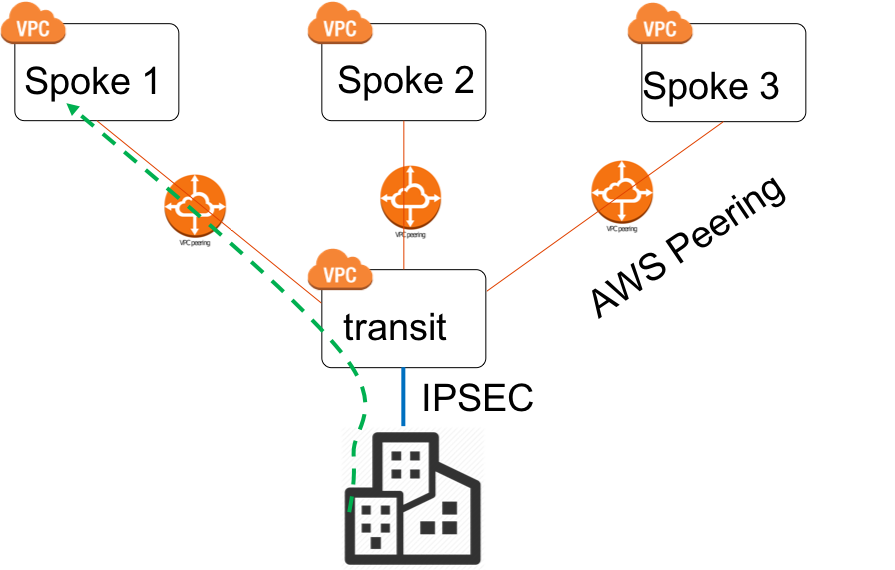
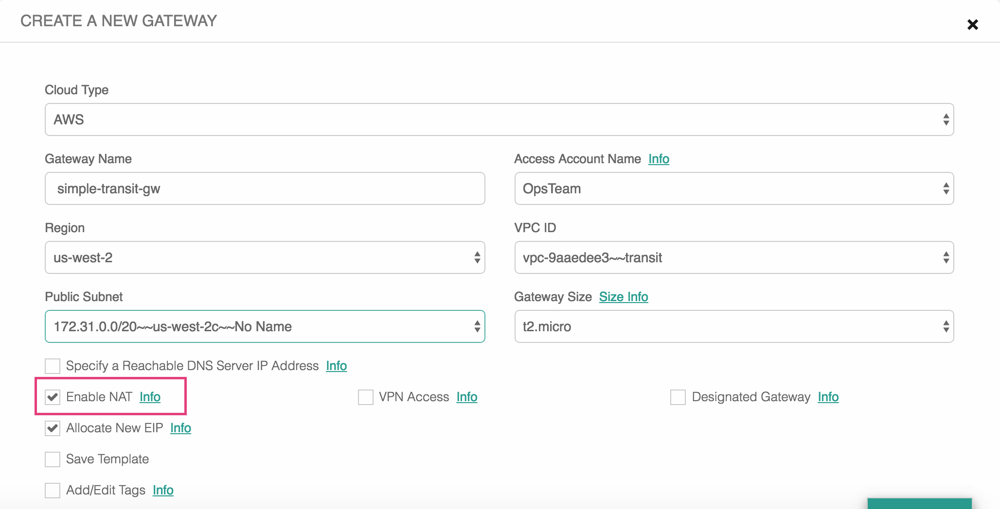
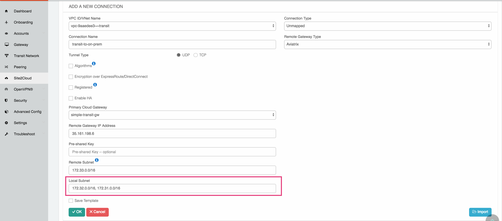
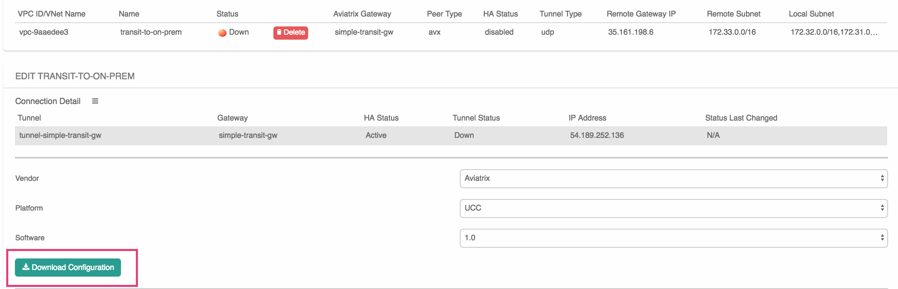
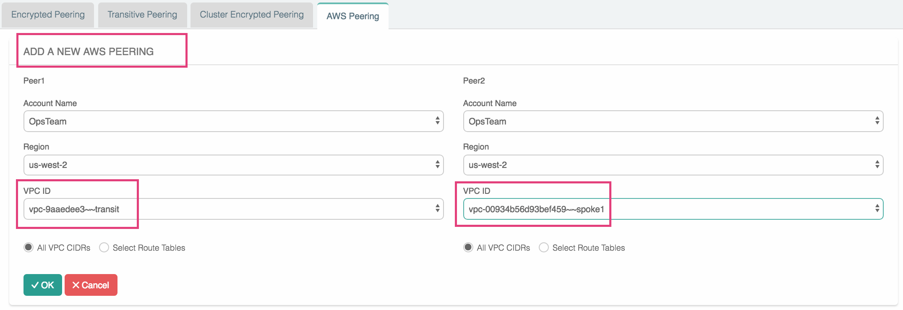
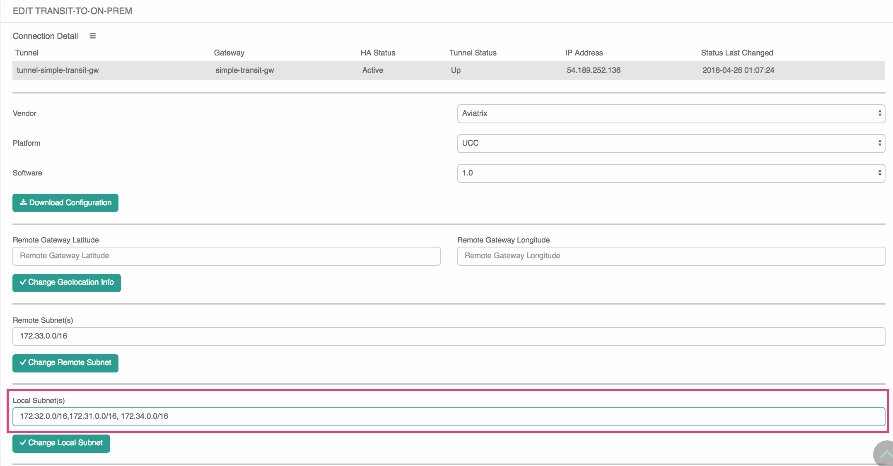

=================================================================
How to Connect Office to Multiple AWS VPCs with AWS Peering
=================================================================

This document describes a common use case where a customer 
needs  
to connect her on-prem office to a group of VPCs securely so that developers can 
connect to the instances in VPC and work on applications. 

In this case, the customer does not want to build an IPSEC tunnel to each VPC, nor does she want to build a full blown `Global Transit Network <http://docs.aviatrix.com/HowTos/transitvpc_workflow.html>`_.

|simpletransit|

Fortunately since traffic is always initiated from the on-prem office as there are no servers in the office, there is a simple solution to connect many VPCs with one single IPSEC tunnel by leveraging the Aviatrix Site2Cloud feature and AWS Peering.  

Below are the steps to configure. 

Planning and Prerequisites
---------------------------

 1. If you have not launched an Aviatrix Controller, start with the `Aviatrix startup guide <http://docs.aviatrix.com/StartUpGuides/aviatrix-cloud-controller-startup-guide.html>`_
 #. If this is your first time using Aviatrix, make sure you go through the Aviatrix Controller on-boarding process. 

1. Launch a gateway in the transit VPC
-------------------------------------------

Go to the Gateway page to launch a gateway in the transit VPC that servers to move traffic between a Spoke VPC and on-prem network.
The gateway must be launched on a public subnet where its associated route table has a route 0.0.0.0/0 that points to AWS IGW. 

.. important::
   Make sure you enable NAT when launch the gateway in the transit vpc.

==========================================      ==========
**Setting**                                     **Value**
==========================================      ==========
Cloud Type                                      AWS
Gateway Name                                    simple-transit-gw
Account Name                                    OpsTeam
Region                                          us-west-2
VPC ID                                          transit VPC ID
Public Subnet                                   The public subnet where the transit GW instance is deployed
Gateway Size                                    GW `instance size <http://docs.aviatrix.com/HowTos/gateway.html#select-gateway-size>`_
Specify a Reachable DNS Servier IP Address      Leave it unselected
Enable NAT				        check
Add/Edit Tags                                   `Additional AWS Tags <http://docs.aviatrix.com/HowTos/gateway.html#add-edit-tags>`_ for the Transit GW instance
==========================================      ==========

Below is a screenshot of the setup. Note that NAT is enabled.

|transit-gw-launch|

2. Setup a Site2Cloud tunnel to on-prem office
--------------------------------------------------

After the gateway is launched successfully, go to Site2Cloud to create a new IPSEC tunnel between the 
transit VPC and on-prem office. 

==========================================      ==========
**Setting**                                     **Value**
==========================================      ==========
VPC ID/VNet Name                                transit vpc in the drop down
Connection Type                                 Unmapped
Connection Name                                 a unique name to identify the connection
Remote Gateway Type                             select one type from a drop down
Tunnel Type                                     select UDP
Algorithm                                       leave it unchecked
Encryption over ExpressRoute/DX                 leave it unchecked
Enable HA                                       leave it unchecked
Primary Cloud Gateway                           select the transit gateway launched in step 1
Remote Gateway IP Address                       the public IP address of the on-prem firewall device
Pre-shared Key                                  leave it unchecked
Remote Subnet                                   the on-prem office CIDR list separated by comma
Local Subnet                                    all spoke VPC CIDR list separated by comma
Save Template                                   leave it unchecked
==========================================      ==========

Below is a screenshot of the setup. Note that the local subnet is a list of all Spoke VPC CIDRs. 

|transit-to-on-prem|

3. Download the Configuration Template 
---------------------------------------

After the above Site2Cloud connection is created, select the connection. Select a Vendor Generic if the on-prem 
firewall device is not Aviatrix nor Cisco. Click Download Configuration.

|download-s2c-config|

After you download the IPSEC configuration template, use the template to configure your on-prem device. 

4. Connect Spoke to Transit
----------------------------

Once the site2cloud tunnel is up, it's time to use AWS Peering to build connectivity between 
a Spoke VPC and the transit VPC. 

Go to Peering -> AWS Peering, click New Peering. Select a spoke VPC and the transit VPC, and click OK. 

The AWS Peering will be established and the routing tables will be programmed by the Controller. 

|aws-peering|

5. Congratulations!
------------------------------------------------

Now you can test connectivity by initiating a "Ping" or "SSH" from office host machine or your laptop to an EC2 instance in a Spoke VPC. 

6. Add More Spoke VPCs
---------------------------------------

Each time you add a new Spoke VPC, you need to edit the site2cloud tunnel to include the new Spoke VPC CIDR in the remote CIDR field, as shown below. Similarly, you may need to edit your on-prem device to include the new Spoke VPC. 

|edit-transit-to-onprem-for-spoke2|

.. disqus::
