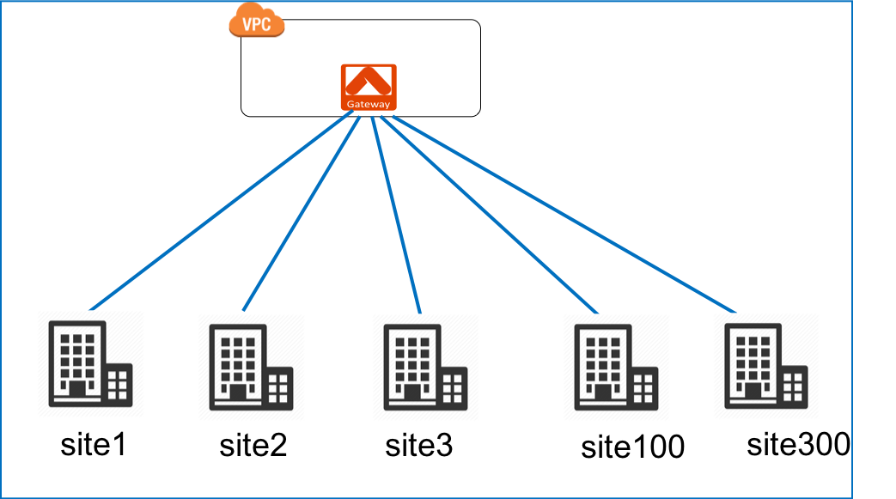
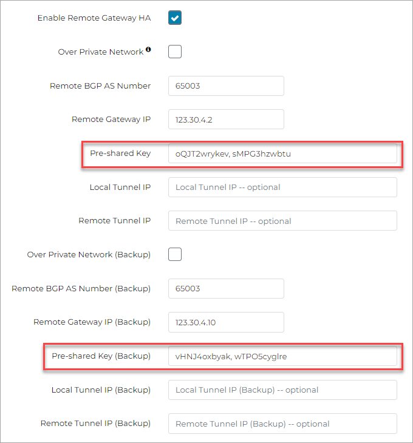

.. raw:: html

   

=================================
Site2Cloud IPsec VPN Instructions
=================================

Overview
========

The Aviatrix Site2Cloud feature supports connectivity between its Gateways in the cloud and on-premise routers, as shown below.  This document outlines how to establish connectivity between an Aviatrix Gateway in AWS, Azure, or GCP and your on-premise router or firewall.

|site2cloud_new|

.. note::
	If you are planning to use certificate-based authentication for your Site2Cloud connection, ensure that you have already generated and exported the external device CA certificate `as described here <https://docs.aviatrix.com/HowTos/site2cloud-cacert.html>`_.

Configuration Workflow
=========================

Create Site2Cloud Connection
----------------------------

#. Log in to your Aviatrix Controller.
#. Select Site2Cloud in the left navigation bar.
#. Click **+ Add New** near the top of the Site2Cloud tab.
#. Under Add a new connection, select the VPC ID where this tunnel will terminate in the cloud.
#. See the below sections for information on configuring the connection.

Connection Type
^^^^^^^^^^^^^^^

Select Mapped or Unmapped as the Connection Type. You should select Unmapped unless the Local Subnet and the Remote Subnet overlap.

If you select the Mapped option in conjunction with the `Forward Traffic to Transit Gateway option <#forward-traffic-to-transit-gateway>`_ (possible after you configure your Site2Cloud connection, under the Edit options), bi-directional traffic flow occurs. 

Mapped
++++++

If you select Mapped, configure the following:

- remote Subnet (real): specify a list of the destination network CIDRs, separated by comma, that will be encrypted (for example, 10.10.1.0/24, 10.10.2.0/24).
- Remote Subnet (virtual): specify a list of virtual remote network CIDRs that are mapped to the real remote subnet (for example, for the real CIDRs listed above, you can have these virtual remote subnets: 192.168.1.0/24, 192.168.2.0/24).
- Local Subnet (real): specify a list of the source network CIDRs, separated by comma, that will be encrypted. If left blank, the full CIDR is used. If you enter a value, make sure you include the VPC/VNet as well. These Local Subnets are advertised to Remote Subnets that the Site2Cloud connection can reach. Examples of real local subnets are 172.16.1.0/24, 172.16.2.0/24.
- Local Subnet (virtual): specify a list of virtual local network CIDRs that are mapped to the real local subnet (for example, for the real CIDRs listed above for the real local subnet, you can have these virtual local subnets: 192.168.7.0/24, 192.168.8.0/24).

.. important::

  If the Local Subnet field is outside of gateway VPC/VNet, you need to open the gateway inbound security groups to allow the Local Subnet network CIDR ranges. 

.. note::
	If you enter multiple real subnets, you must configure an equal number of virtual subnets. One-to-one mapping is supported if both sides are configured properly. The Remote and Local Subnet fields can contain multiple values. Use a comma to separate the values. If the Local Subnet field is outside the gateway VPC/VNet, you must open the gateway inbound security groups to allow the Local Subnet network CIDR ranges.

Here is an example of one-to-one mapping:

      | Remote Subnet(Real): 10.1.7.10/32      
      | Remote Subnet(Virtual): 172.16.7.10/32
      |
      | Local Subnet(Real): 10.1.7.15/32
      | Local Subnet(Virtual): 192.168.7.45/32

Enter the Connection Name and click **OK**.

Custom Mapping
++++++++++++++

If you select the Custom Mapped checkbox after selecting the Mapped option, more complex Site2Cloud configurations are possible. You can have locally initiated traffic flows only, remotely initiated traffic flows only, and differing NAT translation based on these local/remote initiated flows. 

Remote Gateway Type
^^^^^^^^^^^^^^^^^^^

   +-------------------------------+------------------------------------------+
   | Type                          | Description                              |
   +===============================+==========================================+
   | Generic                       | Use this option for most third-party     |
   |                               | routers and firewalls.                   |
   +-------------------------------+------------------------------------------+
   | AWS VGW                       | For terminating on an AWS Virtual Private|
   |                               | Gateway, select this option.             |
   +-------------------------------+------------------------------------------+
   | Azure VPN                     | For terminating on Azure VPN Services    |
   +-------------------------------+------------------------------------------+
   | Aviatrix                      | When terminating on an Aviatrix CloudN   |
   |                               | on-premise gateway.                      |
   +-------------------------------+------------------------------------------+
   | SonicWall                     |                                          |
   +-------------------------------+------------------------------------------+

Authentication Type
^^^^^^^^^^^^^^^^^^^

You can authenticate the connection using Pre-Shared Key (PSK) or certificate-based authentication.

PSK-Based 
+++++++++

If you select PSK-based authentication, you can provide the Pre-Shared Key. A Pre-Shared Key is a string of random characters that is used to authenticate the IPsec tunnel connection between the Aviatrix Gateway and your on-premise router or firewall. You must ensure that this key is the same as the Pre-Shared Key that is configured for your on-premise firewall or router. 

For Site2Cloud ActiveMesh connections, where both the local Aviatrix Gateway and remote on-premise router or firewall have high availability (HA) enabled, four IPsec tunnels are created (Local gateway to remote router/firewall, local HA gateway to remote router/firewall, local gateway to remote HA router/firewall, local HA gateway to remote HA router/firewall). If you want the tunnels that are created to have different PSK values, you will need to enter the PSKs separated by a comma.

|s2c_pre_shared_key|

.. note::
     - A comma denotes two separate PSK values. Do not include a comma in a single PSK string.
     - The double quote ASCII character (“) is not allowed. A tunnel connection cannot be established if the PSK string contains double quote character.

Certificate-Based
+++++++++++++++++

If you select Cert-based authentication:

- In the Remote CA Certificate field select the certificate you uploaded from your Palo Alto VM-Series firewall as per `these instructions <https://docs.aviatrix.com/HowTos/site2cloud-cacert.html>`_.
- Enter the SAN/Remote Identifier. The format depends on the device you are connecting to. For example, for an on-prem Aviatrix gateway the format will be the DNS from the server certificate (such as gw-54-210-118-19).

See `here <https://docs.aviatrix.com/HowTos/site2cloud-cacert.html>`_ for more details on Site2Cloud certificate-based authentication.

Tunnel Type
^^^^^^^^^^^

Select Policy-based or Route-based. If you select the latter, you must enter the local and remote tunnel IP.
If you selected the Mapped Connection Type, only Route-based is supported. 

Algorithms
^^^^^^^^^^

If the Algorithms checkbox is unmarked, the default values will be used.  If it is checked, you can set any of the fields defined below.

   +-------------------------------+
   | Field                         |
   +===============================+
   | Phase 1 Authentication        |
   +-------------------------------+
   | Phase 1 DH Groups             |
   +-------------------------------+
   | Phase 1 Encryption            |
   +-------------------------------+
   | Phase 2 Authentication        |
   +-------------------------------+
   | Phase 2 DH Groups             |
   +-------------------------------+
   | Phase 2 Encryption            |
   +-------------------------------+

IKEv2
^^^^^

Select the option to connect to the remote site using IKEv2 protocol. This is the recommended protocol. 

.. note::
	If you configure IKEv1 in a Site2Cloud connection that uses certificate-based authentication and is connecting to another Aviatrix device, you must add the intermediate CA's in addition to the root CA. When an intermediate CA is renewed and re-authentication is attempted, the Site2Cloud connection will go down until you add the new certificate.

Enabling HA
^^^^^^^^^^^

Select this option to to create a backup/failover connection in case the primary connection fails. If you select this option you can also select the Enable Single IP HA check box, which allows you to use the same EIP to bring up the backup tunnel (supported for AWS and Azure only).

If mapped NAT is enabled, HA in Site2Cloud is not supported.

If you have the following configuration you can select the Same Pre-shared Key as primary check box, which means the backup tunnel uses the same pre-shared key as the primary.

- Enable HA check box selected
- Enable Single IP HA checkbox not selected
- PSK-based authentication selected

If the Enable HA checkbox is selected, you can enter a Pre-shared Key for the back-up (HA) gateway. Also if this checkbox is selected, you must enter the Remote Gateway IP address of the backup gateway (.hagw). 

Enable Single IP HA
^^^^^^^^^^^^^^^^^^^

When you select the Enable Single IP HA check box, you also need to select the Backup Gateway. The backup gateway should be the .hagw created at Gateway > Edit > Gateway for High Availability Peering.  

Over Private Network
^^^^^^^^^^^^^^^^^^^^

Select this option if your underlying infrastructure is a private network, such as AWS Direct Connect or Azure Express Route. When this option is selected, BGP and IPSEC run over private IP addresses.

Primary Cloud Gateway
^^^^^^^^^^^^^^^^^^^^^

Select the Gateway where the tunnel will terminate in this VPC. 

Remote Gateway IP address
^^^^^^^^^^^^^^^^^^^^^^^^^

Enter the IP address of the device.

Editing the Site2Cloud Connection
=================================

Once a connection is created, you can download the configuration or edit parameters. To do this, select Site2Cloud in the left pane and select the connection you just created.

Local Identifier
---------------------

By default, Aviatrix configures gateway's public IP as the Local Identifier. User can adjust these settings to the gateway's private IP.

Remote Identifier
-------------------------
Aviatrix only supports IP_ADDRESS and KEY_ID as the IKE identity type for the remote identifier in the pre-shared key authentication. The IP_ADDRESS must be a valid IPv4 IP address. The KEY_ID is a remote device ID during the key authentication.

By default, Aviatrix configures the public IPv4 address of the peer device as the Remote Identifier for pre-shared key authentication. You can adjust this setting to the private IPv4 address of the peer device.

If you enter string(s) other than an IPv4 address or empty string(""), the string(s) you entered is treated as Key_ID. If KEY_ID value is not correct, this field validation will fail.

If you are unsure about this field's value, enter an empty string("") to skip the validation of this field.

Download Configuration
------------------------

You can generate a remote site configuration template. This template file contains the gateway public IP address, VPC CIDR, pre-shared secret and encryption algorithm. You can import the information to your remote router/firewall configuration. 

.. note::
	If the remote gateway is an Aviatrix CloudN, go to the Site2Cloud Setup page in the Controller, import the downloaded configuration file, and click OK.

To download a configuration:

1. After creating a Site2Cloud connection, select the remote site device from the table on the Setup Site2Cloud Connection page and click **Edit**.
#. In the Download Configuration area, select your remote site device from the Vendor menu, or use the Generic/Vendor Independent template (you select Generic for anything that is not an Aviatrix gateway. If you are connecting two Aviatrix gateways, you select Aviatrix as the vendor).

- If you select a Generic vendor, the Platform field is populated as Generic, and the Software field is populated with Vendor Independent.
- If you select the Aviatrix vendor, the Platform is populated with UCC, and the Software version is 1.0.
- If you select a specific hardware vendor (such as Cisco), available platforms belonging to that vendor are displayed in the Platform field, and the Software field is populated with related software versions.

How to use this downloaded configuration:

- If connecting two Aviatrix gateways, you import the downloaded configuration when creating the other side of the tunnel. Gateways can be in different Controllers or the same Controller). See `here <https://docs.aviatrix.com/HowTos/site2cloud_aviatrix.html#configure-tunnel-from-gateway-a-to-gateway-b>`_ for more information. 
- If connecting an Aviatrix gateway to a firewall or other on-prem vendor, use the downloaded configuration information to populate the necessary information in your firewall UI. 

Dead Peer Detection
---------------------

This field is not applicable to a Site2Cloud connection established by `Transit Network workflow <https://docs.aviatrix.com/HowTos/transitvpc_workflow.html>`_. 

Dead Peer Detection (DPD) is a standard mechanism (RFC 3706) between IPsec tunnels to send periodic messages to ensure the remote site is up. 

By default, DPD detection is enabled. 

================   ===============    ===============        
Field              Value              Description                 
================   ===============    ===============     
Delay              >= 1               Keepalive timer (in seconds)
Retry Delay        >= 1               How long should the tunnel wait before declaring keep alive failed. (in seconds)
Maxfail            >= 1               Number of tries before considering the peer is dead. 
================   ===============    ===============     

Active Active HA
-------------------

Allow Site2Cloud gateways to support Active-Active mode where both tunnels are up and packets are routed to both gateways via respective VPC/VNet route tables. 

To enable this, go to Site2Cloud, edit the connection on the Setup page, scroll down to Active Active HA, and click **Enable**.

Forward Traffic to Transit Gateway
-----------------------------------

Typically you enable the **Forward Traffic to Transit Gateway** option when you have a Site2Cloud connection that has overlapping CIDRs. This forwarding ensures that traffic is sent between on-prem routers and local Spoke and Transit gateways. 

In most cases customers will enable this so that their on premise traffic is forwarded.

For more information view the explanation `in this scenario <https://docs.aviatrix.com/HowTos/overlapping_network_solutions.html#scenario-4-multi-sites-overlap-in-aviatrix-transit-deployment>`_. 

This option is only available for route-based IPSec paired with Mapped NAT. 

Event Triggered HA
-------------------

Event Trigger HA is a new mechanism to reduce the convergence time. To configure, go to Site2Cloud > select a connection, click **Edit**. 
Scroll down to Event Triggered HA and click **Enable**. 

Jumbo Frame
-------------

Jumbo Frame improves the performance between an Aviatrix Transit gateway and CloudN or an Aviatrix Edge Gateway.

.. note::
     - Jumbo Frame feature is only supported on private connections that support Jumbo Frame.
     - Jumbo Frame is not supported for Transit Gateway connections to other devices such as, firewalls and routers.
     - Jumbo Frame is supported with High Performance Encryption and BGP over IPsec and BGP over GRE connections only. High Performance Encryption must be enabled on all gateways in the end-to-end path of the traffic flow.
     - Jumbo Frame is supported for AWS and OCI only; it is not supported for Azure and GCP.

To configure:

1. Navigate to Site2Cloud > select a connection and click **Edit**. 
#. Scroll down to Jumbo Frame and click **Enable**. 

Clear Sessions
-------------------

Clear Session allows to reset all the active sessions on a selected Site2Cloud connection:

1. Navigate to Site2Cloud > select a connection and click **Edit**. 
#. Scroll down to Clear Sessions and click **Clear**.

Periodic Ping
--------------------

In very rare cases Site2Cloud tunnels may fail to pass traffic if the tunnel is dormant for a long period of time. This is not an issue with the Aviatrix Gateways and can usually be traced to misconfigurations on the remote device. To compensate for this Periodic Ping was developed to maintain a steady flow of traffic across the tunnel. 

For configuration steps read the full article here:  `Periodic Ping <https://docs.aviatrix.com/HowTos/periodic_ping.html>`_

Network Device Support
======================

Aviatrix Site2Cloud supports all types of on-prem firewall and router devices that 
terminate VPN connection. Below are configuration examples to specific devices. 

    - `Azure VPN Gateway <./avxgw_azurevpngw_site2cloud.html>`_
    - `AWS VGW <./site2cloud_awsvgw.html>`_
    - `pfSense IPsec VPN <./CloudToPfSense.html>`__
    - `Palo Alto Next-Gen Firewall (PAN) <./S2C_GW_PAN.html>`__
    - `Check Point Firewall <./S2C_GW_CP.html>`__
    - `Cisco ASA <./S2C_GW_ASA.html>`__
    - `FortiGate <./site2cloud_fortigate.html>`__
    - `Cisco Meraki MX64 <./site2cloud_meraki.html>`__
    - `Cisco ISR <./S2C_GW_IOS.html>`__
    - `Cisco Meraki vMX100 <./site2cloud_meraki_vmx100.html>`_
    - `Aviatrix Gateway <./site2cloud_aviatrix.html>`_

Additional Use Cases
=====================

Real-world use cases sometimes require a combination of Site2Cloud and other features, such as `SNAT <https://docs.aviatrix.com/HowTos/gateway.html#source-nat>`_ and `DNAT <https://docs.aviatrix.com/HowTos/gateway.html#destination-nat>`_. 

Here are a few documents in the Tech Notes session that demonstrate how you can solve some of them. 

  - `Site2Cloud with customized SNAT <https://docs.aviatrix.com/HowTos/s2c_vgw_snat.html>`_.
  - `Site2Cloud for overlapping IP addresses <https://docs.aviatrix.com/HowTos/s2c_overlapping_subnets.html>`_.
  - `Site2Cloud to public IP addresses <https://docs.aviatrix.com/HowTos/s2c_for_publicIP.html>`_.
  - `How to build site to site connection <https://docs.aviatrix.com/HowTos/site_to_site_vpn.html>`_
  - `Connecting offices to multiple VPCs using AWS Peering <https://docs.aviatrix.com/HowTos/simpletransit.html>`_
  - `Connect Networks with Overlap CIDRs <https://docs.aviatrix.com/HowTos/connect_overlap_cidrs.html>`_
  - `Connect Overlapping VPC to On-prem <https://docs.aviatrix.com/HowTos/connect_overlap_vpc_via_VGW.html>`_

Troubleshooting
===============

To check a tunnel state, go to Site2Cloud. The tunnel status appears next to the connection.

Diagnostics and troubleshooting options are available in the **Diagnostics** tab.  You must first select the connection, and then select an **Action**, followed by **OK**.

.. |site2cloud_new| image:: site2cloud_media/site2cloud_new.png
   :scale: 50%

.. disqus::
