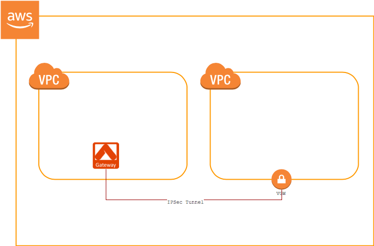
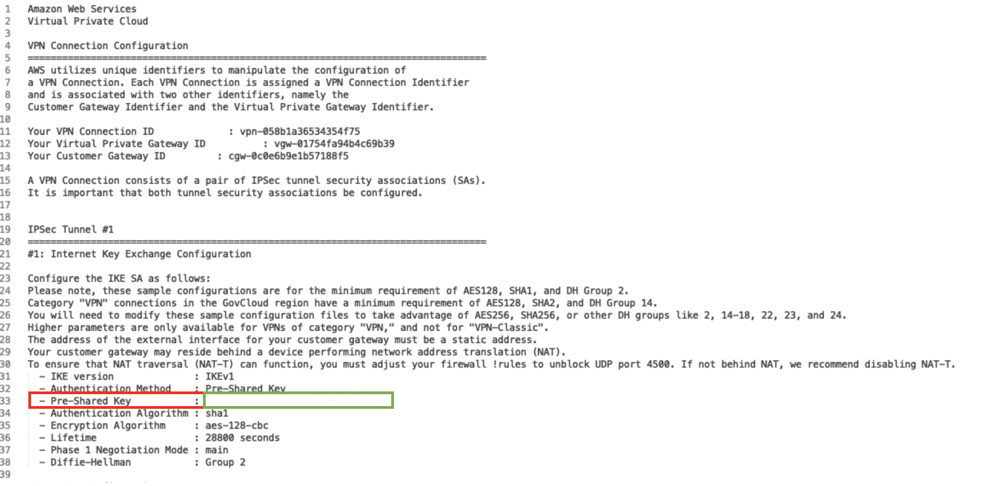
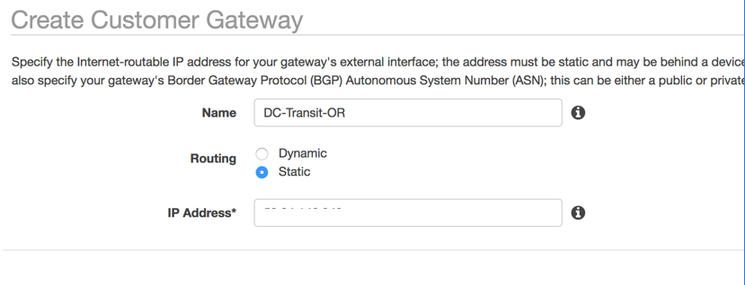
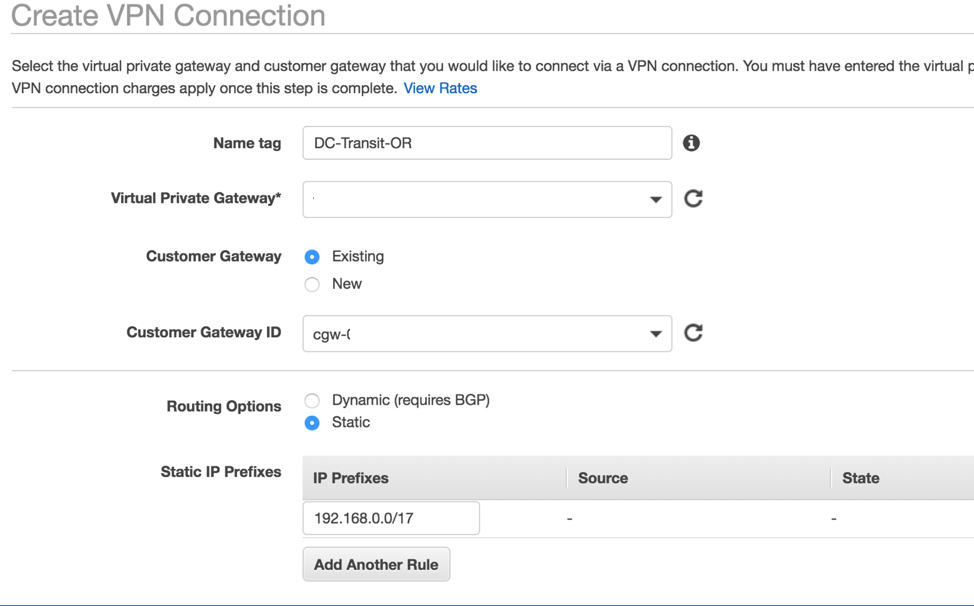
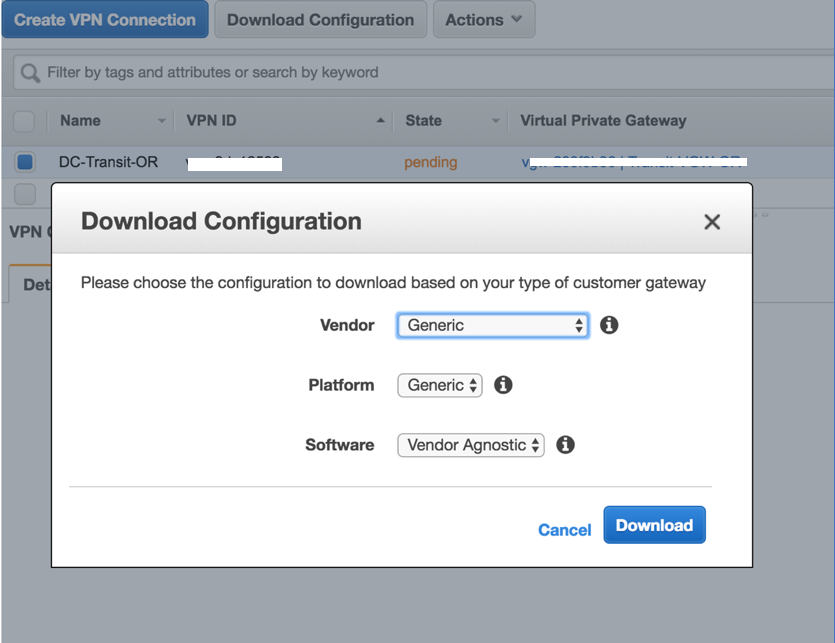
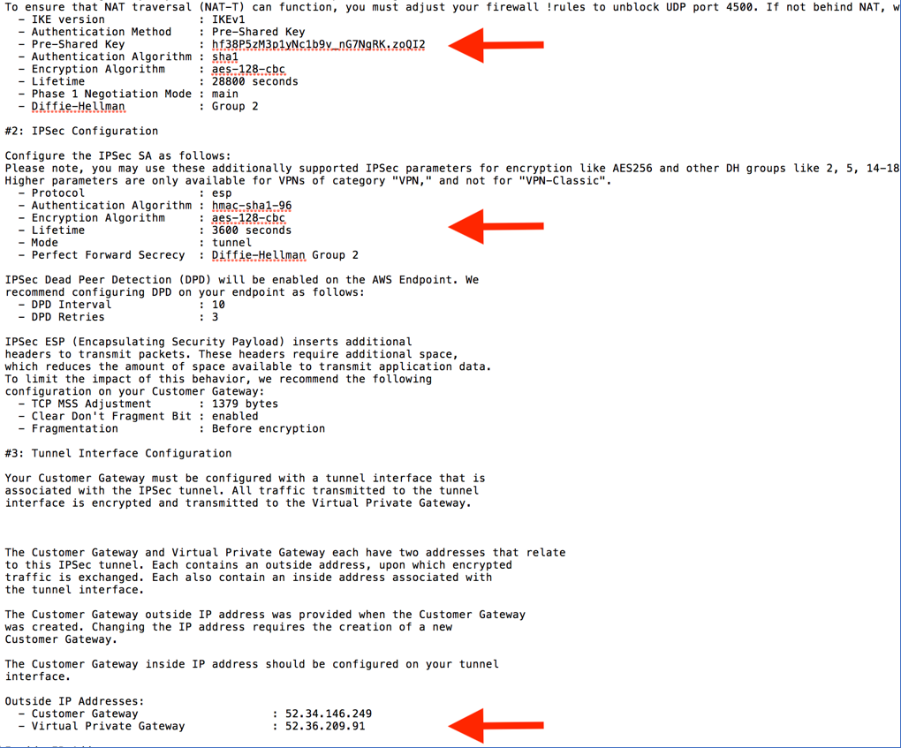
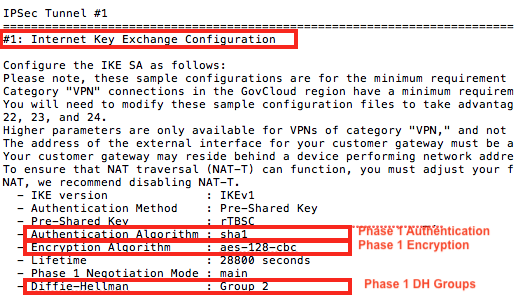
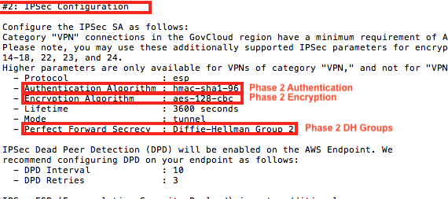
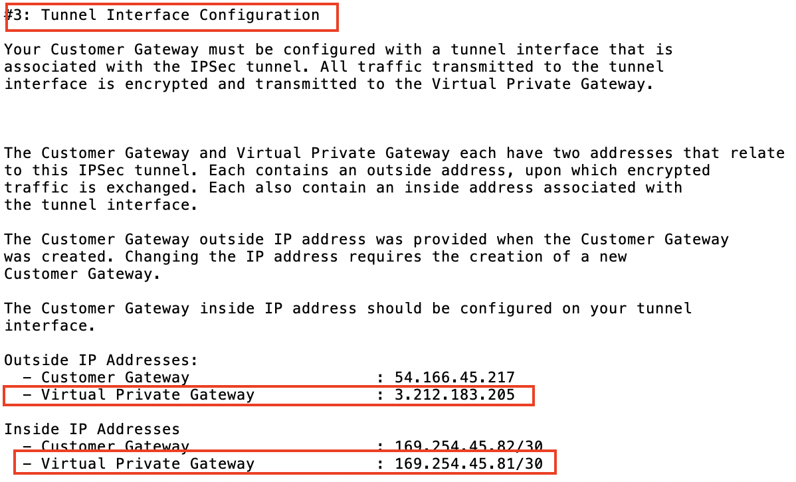

.. raw:: html

   

=====================================================================
Aviatrix Gateway to AWS VGW
=====================================================================

Overview
-----------------

This document describes how to configure an IPsec tunnel between an Aviatrix Gateway and an AWS Virtual Private Gateway (VGW).

|gw2vgw|

Deployment Guide
----------------------------

For this use case, we will configure the AWS VGW VPN connection first and then download the configuration from AWS and import it into Aviatrix.

Create the VPN Connection
+++++++++++++++++++++++++

.. note::

   **Prerequisites**

   #. You have a VGW created and attached to a VPC.
   #. You have an Aviatrix Gateway provisioned in a different VPC.  You will need this gateway's public IP address for the steps below.

#. Log in to your AWS `VPC Dashboard <https://console.aws.amazon.com/vpc/home>`__ in the region where your VGW is located
#. Create a new `Customer Gateway <https://console.aws.amazon.com/vpc/home#CreateCustomerGateway>`__.

   |awscg|

   +------------------------------+-------------------------------------------+
   | Field                        | Description                               |
   +------------------------------+-------------------------------------------+
   | Name                         | Enter any name here                       |
   +------------------------------+-------------------------------------------+
   | Routing                      | Select **Static**                         |
   +------------------------------+-------------------------------------------+
   | IP Address                   | Enter the Aviatrix Gateway's public IP    |
   +------------------------------+-------------------------------------------+

#. Create a `VPN Connection <https://console.aws.amazon.com/vpc/home#CreateVpnConnection:>`__.

   |awsvpn|

   +------------------------------+-------------------------------------------+
   | Field                        | Description                               |
   +------------------------------+-------------------------------------------+
   | Name                         | Enter any name here                       |
   +------------------------------+-------------------------------------------+
   | Virtual Private Gateway      | Select your VGW                           |
   +------------------------------+-------------------------------------------+
   | Customer Gateway             | Select **Existing**                       |
   +------------------------------+-------------------------------------------+
   | Routing Options              | Select **Static**                         |
   +------------------------------+-------------------------------------------+
   | Static IP Prefixes           | Enter the CIDR(s) of the VPC where the    |
   |                              | Aviatrix Gateway resides.                 |
   +------------------------------+-------------------------------------------+
   | Tunnel Options               | Leave blank/default                       |
   +------------------------------+-------------------------------------------+

#. Select the VPN you just created and click the **Download Configuration** button along the top.  At the dialog, select **Generic** for the Vendor, **Generic** for the Platform and **Vendor Agnostic** for the Software.

#. Click **Download Configuration**.  You will use this file to create the other side of the tunnel.

   |awsdownloadvpnconfig|

Configuring Aviatrix
++++++++++++++++++

#. Log in to your Aviatrix Controller.
#. Follow the steps in `this </HowTos/site2cloud.html>`__ guide.  Use this table for specific field values.

   +-------------------------------+------------------------------------------+
   | Field                         | Description                              |
   +===============================+==========================================+
   | VPC ID/VNet Name              | Select the Aviatrix Gateway VPC or VNet  |
   |                               | from the drop down.                      |
   +-------------------------------+------------------------------------------+
   | Connection Type               | Unmapped                                 |
   +-------------------------------+------------------------------------------+
   | Remote Gateway Type           | AWS VGW                                  |
   +-------------------------------+------------------------------------------+
   | Algorithms                    | Checked                                  |
   +-------------------------------+------------------------------------------+

#. Populate the remaining fields.

   +-------------------------------+------------------------------------------+
   | Field                         | Description                              |
   +===============================+==========================================+
   | Remote Gateway IP Address     | Enter the value that matches the value   |
   |                               | Tunnel Interface Configuration           |
   |                               | > **Outside IP Addresses**               |
   |                               | > **Virtual Private Gateway**            |
   +-------------------------------+------------------------------------------+
   | Pre-shared Key                | Enter the value that matches the value   |
   |                               | `Internet Key Exchange Configuration`    |
   |                               | > **Pre-Shared Key**                     |
   +-------------------------------+------------------------------------------+
   | Remote Subnet                 | Remote subnet is usually the cloud       |
   |                               | networks                                 |
   |                               | for eg., Spoke VPC which onprem wants to |
   |                               | reach to  (10.20.0.0/20)                 |
   +-------------------------------+------------------------------------------+

   |tunnelconfig|

Test
----------

Once complete, test the communication using the tunnel.

Troubleshooting
-------------------------

Wait 2-3 minutes for the tunnel to come up.  If it does not come up within that time, check the IP addresses to confirm that they are accurate.  Additional troubleshooting is available in the **Diagnostics** tab.

Appendix: Enable HA
-------------------------------

You can enable HA for Aviatrix Site2Cloud connection to AWS VGW. Please add the following extra steps to the configuration.

Creating an Aviatrix HA Gateway
+++++++++++++++++++++++++++

Before creating a Site2Cloud connection, follow `this <https://docs.aviatrix.com/Solutions/gateway_ha.html>`__ guide's
**Backup Gateway and Tunnel HA** section to create an Aviatrix HA gateway in the same VPC.

Creating a VPN Connection Between VGW and the Aviatrix HA Gateway
+++++++++++++++++++++++++++++++++++++++++++++++++++++++++++++++++++++++++++++++++

From the AWS console, create a new VPN connection between VGW and Aviatrix HA Gateway.

#. Create a new Customer Gateway for Aviatrix HA Gateway:

   +------------------------------+-------------------------------------------+
   | Field                        | Description                               |
   +------------------------------+-------------------------------------------+
   | Name                         | Enter any name here                       |
   +------------------------------+-------------------------------------------+
   | Routing                      | Select **Static**                         |
   +------------------------------+-------------------------------------------+
   | IP Address                   | Enter the Aviatrix HA Gateway's public IP |
   +------------------------------+-------------------------------------------+

#. Create a new VPN connection for Aviatrix HA Gateway:

   +------------------------------+-------------------------------------------+
   | Field                        | Description                               |
   +------------------------------+-------------------------------------------+
   | Name                         | Enter any name here                       |
   +------------------------------+-------------------------------------------+
   | Virtual Private Gateway      | Select the same VGW using for primary     |
   |                              | VPN connection                            |
   +------------------------------+-------------------------------------------+
   | Customer Gateway             | Select CGW your just created for HA       |
   +------------------------------+-------------------------------------------+
   | Routing Options              | Select **Static**                         |
   +------------------------------+-------------------------------------------+
   | Static IP Prefixes           | Enter the CIDR(s) of the VPC where the    |
   |                              | HA Aviatrix Gateway resides.              |
   +------------------------------+-------------------------------------------+
   | Tunnel Options               | Leave blank/default                       |
   +------------------------------+-------------------------------------------+

#. Download the configuration for this new VPN connection just like you did earlier for the primary VPN connection.

Create Aviatrix Site2Cloud Connection with HA
+++++++++++++++++++++++++++++++++++++++++++++

From Aviatrix Controller UI > Site2Cloud page, click **+ Add New**, under **Add a New Connection**, make sure **Enable HA** is checked.

Additional fields are displayed when checked.

.. note::

   VPN information for backup needs to be obtained from the downloaded configuration
   of AWS VPN connection between VGW and Aviatrix HA Gateway. Follow the same steps
   you did for primary connection.

+-----------------------------------+------------------------------------------+
| Field                             | Description                              |
+===================================+==========================================+
| Backup Gateway                    | Select the Aviatrix HA Gateway you just  |
|                                   | created                                  |
+-----------------------------------+------------------------------------------+
| Remote Gateway IP Address(Backup) | Enter the value that matches the value   |
|                                   | `Tunnel Interface Configuration`         |
|                                   | > **Outside IP Addresses**               |
|                                   | > **Virtual Private Gateway**            |
+-----------------------------------+------------------------------------------+
| Pre-shared Key(Backup)            | Enter the value that matches the value   |
|                                   | `Internet Key Exchange Configuration`    |
|                                   | > **Pre-Shared Key**                     |
+-----------------------------------+------------------------------------------+
.. |presharedkey|

Other fields should be filled as instructed in above section **Configure Aviatrix**.

.. disqus::
