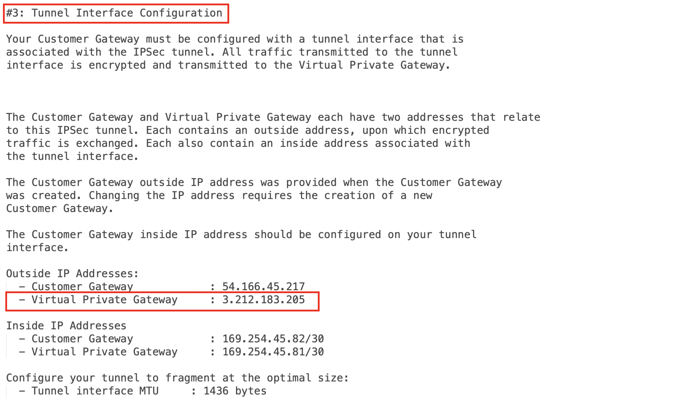

.. meta::
   :description: Site2Cloud (Aviatrix Gateway - AWS VGW)
   :keywords: aviatrix, site2cloud, aws, vgw

.. raw:: html

   

=====================================================================
Aviatrix Gateway to AWS VGW
=====================================================================

Overview
--------
This document describes how to configure an IPsec tunnel between an Aviatrix Gateway and an AWS Virtual Private Gateway (VGW).

|gw2vgw|

Deployment Guide
----------------

For this use case, we will configure the AWS VGW VPN connection first and then download the configuration from AWS and import it into Aviatrix.

Create the VPN Connection
+++++++++++++++++++++++++

.. note::

   **Prerequisites**

   #. You have a VGW created and attached to a VPC
   #. You have an Aviatrix Gateway provisioned in a different VPC.  You will need this gateway's public IP address for the steps below.

#. Login to your AWS `VPC Dashboard <https://console.aws.amazon.com/vpc/home>`__ in the region where your VGW is located
#. Create a new `Customer Gateway <https://console.aws.amazon.com/vpc/home#CreateCustomerGateway>`__

   |awscg|

   +------------------------------+-------------------------------------------+
   | Field                        | Description                               |
   +------------------------------+-------------------------------------------+
   | Name                         | Enter any name here                       |
   +------------------------------+-------------------------------------------+
   | Routing                      | Select **Static**                         |
   +------------------------------+-------------------------------------------+
   | IP Address                   | Enter the Aviatrix Gateway's public IP    |
   +------------------------------+-------------------------------------------+

#. Create a `VPN Connection <https://console.aws.amazon.com/vpc/home#CreateVpnConnection:>`__

   |awsvpn|

   +------------------------------+-------------------------------------------+
   | Field                        | Description                               |
   +------------------------------+-------------------------------------------+
   | Name                         | Enter any name here                       |
   +------------------------------+-------------------------------------------+
   | Virtual Private Gateway      | Select your VGW                           |
   +------------------------------+-------------------------------------------+
   | Customer Gateway             | Select **Existing**                       |
   +------------------------------+-------------------------------------------+
   | Routing Options              | Select **Static**                         |
   +------------------------------+-------------------------------------------+
   | Static IP Prefixes           | Enter the CIDR(s) of the VPC where the    |
   |                              | Aviatrix Gateway resides.                 |
   +------------------------------+-------------------------------------------+
   | Tunnel Options               | Leave blank/default                       |
   +------------------------------+-------------------------------------------+

#. Select the VPN you just created and click the **Download Configuration** button along the top.  At the dialog, select **Generic** for the `Vendor`, **Generic** for the `Platform` and **Vendor Agnostic** for the `Software`

#. Follow the steps in `this </HowTos/site2cloud.html>`__ guide.  Use this table for specific field values

   +-------------------------------+------------------------------------------+
   | Field                         | Description                              |
   +===============================+==========================================+
   | VPC ID/VNet Name              | Select **Gateway A** VPC or VNet from the|
   |                               | drop down.                               |
   +-------------------------------+------------------------------------------+
   | Remote Gateway Type           | Aviatrix                                 |
   +-------------------------------+------------------------------------------+
   | Registered                    | Leave unchecked                          |
   +-------------------------------+------------------------------------------+
   | Primary Cloud Gateway         | Select **Gateway A** from the list       |
   +-------------------------------+------------------------------------------+
   | Remote Gateway IP Address     | Enter the public IP address of           |
   |                               | **Gateway B**.                           |
   +-------------------------------+------------------------------------------+
   | Pre-shared Key                | Leave blank and Aviatrix will generate   |
   +-------------------------------+------------------------------------------+

#. Once complete, select the newly created tunnel in the list
#. Select **Aviatrix** for `Vendor`, **UCC** for `Platform` and **1.0** for `Software`.
#. Click **Download Configuration**.  You will use this file to create the other side of the tunnel.

   |awsdownloadvpnconfig|

Configure Aviatrix
++++++++++++++++++

#. Login to your Aviatrix Controller
#. Follow the steps in `this </HowTos/site2cloud.html>`__ guide.  Use this table for specific field values

   +-------------------------------+------------------------------------------+
   | Field                         | Description                              |
   +===============================+==========================================+
   | VPC ID/VNet Name              | Select the Aviatrix Gateway VPC or VNet  |
   |                               | from the drop down.                      |
   +-------------------------------+------------------------------------------+
   | Connection Type               | Unmapped                                 |
   +-------------------------------+------------------------------------------+
   | Remote Gateway Type           | AWS VGW                                  |
   +-------------------------------+------------------------------------------+
   | Algorithms                    | Checked                                  |
   +-------------------------------+------------------------------------------+

#. Open the configuration file from the previous section.  Scroll to the **#1: Internet Key Exchange Configuration** section.

   **Phase 1 Configuration**

   +-------------------------------+------------------------------------------+
   | Field                         | Description                              |
   +===============================+==========================================+
   | Phase 1 Authentication        | Select the value that matches the value  |
   |                               | `Internet Key Exchange Configuration`    |
   |                               | > **Authentication Algorithm**           |
   +-------------------------------+------------------------------------------+
   | Phase 1 DH Groups             | Select the value that matches the value  |
   |                               | `Internet Key Exchange Configuration`    |
   |                               | > **Diffie-Hellman**                     |
   +-------------------------------+------------------------------------------+
   | Phase 1 Encryption            | Select the value that matches the value  |
   |                               | `Internet Key Exchange Configuration`    |
   |                               | > **Encryption Algorithm**               |
   +-------------------------------+------------------------------------------+

   |avxphase1config|

#. Open the configuration file from the previous section.  Scroll to the **#2: IPSec Configuration** section.

   **Phase 2 Configuration**

   +-------------------------------+------------------------------------------+
   | Field                         | Description                              |
   +===============================+==========================================+
   | Phase 2 Authentication        | Select the value that matches the value  |
   |                               | `IPSec Configuration`                    |
   |                               | > **Authentication Algorithm**           |
   +-------------------------------+------------------------------------------+
   | Phase 2 DH Groups             | Select the value that matches the value  |
   |                               | `IPSec Configuration`                    |
   |                               | > **Perfect Forward Secrecy**            |
   +-------------------------------+------------------------------------------+
   | Phase 2 Encryption            | Select the value that matches the value  |
   |                               | `IPSec Configuration`                    |
   |                               | > **Encryption Algorithm**               |
   +-------------------------------+------------------------------------------+

   |avxphase2config|

#. Populate the remaining fields.

   +-------------------------------+------------------------------------------+
   | Field                         | Description                              |
   +===============================+==========================================+
   | Remote Gateway IP Address     | Enter the value that matches the value   |
   |                               | `Tunnel Interface Configuration`         |
   |                               | > **Outside IP Addresses**               |
   |                               | > **Virtual Private Gateway**            |
   +-------------------------------+------------------------------------------+
   | Pre-shared Key                | Enter the value that matches the value   |
   |                               | `Internet Key Exchange Configuration`    |
   |                               | > **Pre-Shared Key**                     |
   +-------------------------------+------------------------------------------+

   |tunnelconfig|
   
Test
----

Once complete, test the communiation using the tunnel

Troubleshooting
---------------

Wait 2-3 minutes for the tunnel to come up.  If it does not come Up within that time, check the IP addresses to confirm they are accurate.  Additional troubleshooting is available in the **Diagnositics** tab.

.. |gw2vgw| image:: s2c_vgw_media/gw_to_vgw.png
   :scale: 50%

.. |awscg| image:: s2c_vgw_media/aws_cg.png
.. |awsvpn| image:: s2c_vgw_media/aws_vpn.png
.. |awsdownloadvpnconfig| image:: s2c_vgw_media/aws_download_vpn_config.png
.. |awsvpnconfig| image:: s2c_vgw_media/aws_vpn_config.png
.. |avxphase1config| image:: s2c_vgw_media/avx_phase_1_config.png
.. |avxphase2config| image:: s2c_vgw_media/avx_phase_2_config.png

                          
