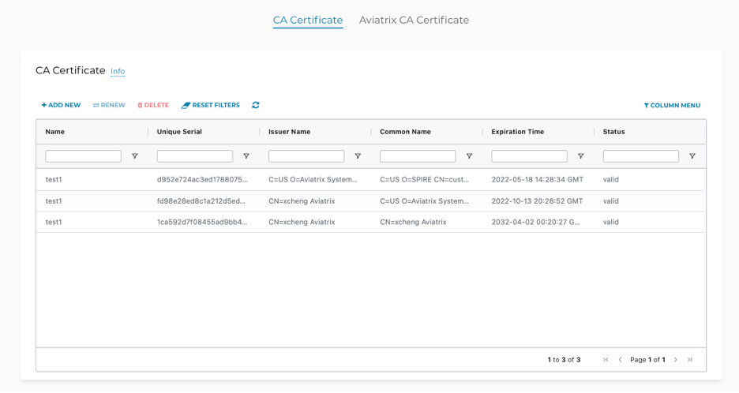

.. meta::
   :description: Site2Cloud CA Certificate
   :keywords: Site2Cloud, certificate, CA certificate, authentication

===========================================
Site2Cloud Certificate-Based Authentication
===========================================

If you want to use certificate-based authentication when establishing a Site2Cloud connection between your Aviatrix gateways, or between an Aviatrix gateway and an external device, you use the CA Certificate tab to:

- Add external device CA certificates
- Download the Aviatrix gateway CA certificate so that you can provide it to the external device

The external device CA certificates must be available before you `configure the Site2Cloud connection <https://docs.aviatrix.com/HowTos/site2cloud.html>`_.

On the external device side, you:

- obtain the IPsec VPN gateway device certificate 
- export the Trusted Root CA certificate for use in the Site2Cloud configuration 
- import the Aviatrix CA certificate (downloaded from the CA Certificate tab)
- use the information in the downloaded Site2Cloud configuration file to configure your tunnels/interfaces

On the Aviatrix side, you:

- configure the Site2Cloud connection

  - select the remote certificate (generated from the external device) when prompted
  - enter the remote identifier when prompted (depends on the external device; typically the Remote Identifier is the value of the common name or subject field in the VPN gateway device certificate) 

- export the Aviatrix CA certificate 
- download the Site2Cloud configuration you just created, to use when configuring tunnels/interfaces on your external device
 
Currently only the Palo Alto VM-Series firewall is supported as an external device. See `here <https://docs.aviatrix.com/HowTos/S2C_GW_PAN.html>`_ for more information on certificate-based authentication using this firewall.

For information on using certificate-based authentication between two Aviatrix gateways, see `here <https://docs.aviatrix.com/HowTos/site2cloud_aviatrix.html>`_.

|ca-cert|

Adding a CA Certificate 
-----------------------

After you obtain the CA certificate from your external device, you must upload it on the CA Certificate tab before creating your Site2Cloud connection.

1. In the Aviatrix Controller, navigate to SITE2CLOUD > CA Certificate.
#. On the CA Certificate tab, click ADD.
#. Under Add Certificate, in the Tag Name field, enter a unique name for the certificate. 
#. Select the CA certificate to upload.
#. Click OK.

If you have received an email notification that a CA certificate is about to expire, or one of the certificates is showing as Invalid on the CA Certificate list, you use the above procedure to add the new certificate. You must then delete the expired certificate.

.. important::

  You cannot switch to another certificate after the Site2Cloud connection has been created.

Downloading the Aviatrix CA Certificate
----------------------------------------

You must download the Aviatrix CA certificate and upload it to your external device (or Aviatrix gateway) for the Site2Cloud connection to work. 

Navigate to SITE2CLOUD > CA Certificate > Aviatrix CA Certificate to download the cloud gateway CA certificate.

Deleting a Certificate
----------------------

You must delete a certificate if it has expired. These certificates show as 'invalid' in the CA Certificate table.

Only admin users can delete certificates.

1. In the Aviatrix Controller, navigate to SITE2CLOUD > CA Certificate.
#. On the CA Certificate tab, select the certificate and click DELETE.

.. important::

  You should not delete the certificate while it is in use; this will bring down the Site2Cloud connection.

Limitations
-----------

- Only the Palo Alto VM-Series firewall is supported in this version of Site2Cloud cert-based authentication.
- Only the Elliptic Curve DSA algorithm is supported in this version when creating a certificate in the Palo Alto VM-Series UI.
- Only the PEM certificate file type is supported in this version. 
- You can only use one certificate group (all the certificates with the same tag name) per Site2Cloud connection.
- You can only roll back the platform version if the previous version supports certificate-based authentication (not supported prior to 6.8).
- The Aviatrix OpenVPN® feature cannot be used in conjunction with Site2Cloud certificate-based authentication.

.. disqus::