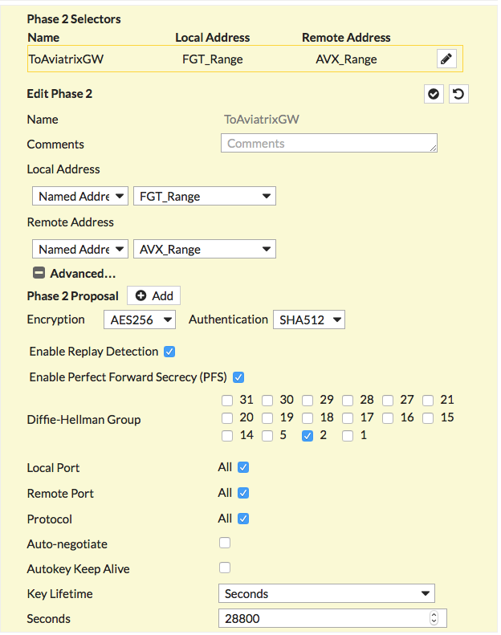
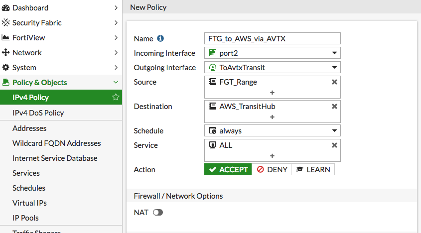

.. meta::
   :description: Site2Cloud (Aviatrix Gateway - FortiGate)
   :keywords: fortigate, aviatrix, site2cloud

.. role:: orange

.. raw:: html

   

=====================================================================
Site2Cloud (Aviatrix Gateway - FortiGate)
=====================================================================

Overview
--------
This document describes how to configure an IPsec tunnel between an Aviatrix Gateway and a FortiGate firewall using Aviatrix Site2Cloud.

#. Configure a `Site2Cloud tunnel <#fg-s2c-avtx-start>`__ in Aviatrix Controller
#. Configure `VPN tunnel <#fg-s2c-fg-start>`__ and related components in FortiGate Firewall

.. _fg_s2c_avtx_start:

Aviatrix Configuration
----------------------

Add a Site2Cloud tunnel in Aviatrix Controller
++++++++++++++++++++++++++++++++++++++++++++++

Follow the steps in `this </HowTos/site2cloud.html>`__ guide.

.. tip::

   Download the configuration to aid in the creation of the tunnel in FortiGate.  Select **Generic** for `Vendor` and `Platform` and **Vendor independent** for `Software`.

.. _fg_s2c_fg_start:

FortiGate Configuration
-----------------------

Configure Named Address Ranges in FortiGate
+++++++++++++++++++++++++++++++++++++++++++

Under **Policy & Objects** > **Addresses**, create 2 new addresses:

**AWS_Cloud**

   +-------------------------------+------------------------------------------+
   | Field                         | Expected Value                           |
   +===============================+==========================================+
   | Name                          | AWS_Cloud                                |
   +-------------------------------+------------------------------------------+
   | Type                          | Subnet                                   |
   +-------------------------------+------------------------------------------+
   | Subnet / IP Range             | CIDR matching the range specified in     |
   |                               | tunnel configuration (remote to FG)      |
   +-------------------------------+------------------------------------------+
   | Interface                     | any                                      |
   +-------------------------------+------------------------------------------+

**Shared_With_AWS**

   +-------------------------------+------------------------------------------+
   | Field                         | Expected Value                           |
   +===============================+==========================================+
   | Name                          | Shared_With_AWS                          |
   +-------------------------------+------------------------------------------+
   | Type                          | Subnet                                   |
   +-------------------------------+------------------------------------------+
   | Subnet / IP Range             | CIDR matching the range specified in     |
   |                               | tunnel configuration (local to FG)       |
   +-------------------------------+------------------------------------------+
   | Interface                     | any                                      |
   +-------------------------------+------------------------------------------+

Create an IPsec tunnel on FortiGate
+++++++++++++++++++++++++++++++++++

#. Login to your FortiGate dashboard.
#. In the `VPN` menu, select `IPsec Tunnels`.
#. Click `+ Create New`
#. Populate the fields according to your preferences.  The important fields are (with :orange:`extra emphasis` on a few key fields):

   **VPN Setup**
   
   +-------------------------------+------------------------------------------+
   | Field                         | Expected Value                           |
   +===============================+==========================================+
   | Name                          | Any value                                |
   +-------------------------------+------------------------------------------+
   | Template Type                 | Custom                                   |
   +-------------------------------+------------------------------------------+
   
   |imageNewVPN|
   
   **Network**
   
   +-------------------------------+------------------------------------------+
   | Field                         | Expected Value                           |
   +===============================+==========================================+
   | IP Version                    | IPv4                                     |
   +-------------------------------+------------------------------------------+
   | Remote Gateway                | Static IP Address                        |
   +-------------------------------+------------------------------------------+
   | IP Address                    | :orange:`Public IP address of Aviatrix`  |
   |                               | :orange:`Gateway`                        |
   +-------------------------------+------------------------------------------+
   | Interface                     | Select the appropriate port/interface    |
   +-------------------------------+------------------------------------------+
   | Local Gateway                 | Disabled                                 |
   +-------------------------------+------------------------------------------+
   | Mode Config                   | Unchecked                                |
   +-------------------------------+------------------------------------------+
   | NAT Traversal                 | Any value                                |
   +-------------------------------+------------------------------------------+
   | Keepalive Frequency           | Any value                                |
   +-------------------------------+------------------------------------------+
   | Dead Peer Detection           | On Demand                                |
   +-------------------------------+------------------------------------------+
   
   |imageSection1|
   
   **Authentication**
   
   +-------------------------------+------------------------------------------+
   | Field                         | Expected Value                           |
   +===============================+==========================================+
   | Method                        | Pre-shared Key                           |
   +-------------------------------+------------------------------------------+
   | Pre-shared Key                | Enter the value from the downloaded      |
   |                               | configuration or the value typed in      |
   |                               | to the field in Aviatrix Site2Cloud      |
   +-------------------------------+------------------------------------------+
   | :orange:`IKE Version`         | :orange:`1`                              |
   +-------------------------------+------------------------------------------+
   | IKE Mode                      | Main (ID protection)                     |
   +-------------------------------+------------------------------------------+
   
   |imageSection2|
   
   **Phase 1 Proposal**
   
   +-------------------------------+------------------------------------------+
   | Field                         | Expected Value                           |
   +===============================+==========================================+
   | Encryption                    | Match value specified in Aviatrix S2C    |
   +-------------------------------+------------------------------------------+
   | Authentication                | Match value specified in Aviatrix S2C    |
   +-------------------------------+------------------------------------------+
   | Diffie-Hellman Groups         | Match value specified in Aviatrix S2C    |
   +-------------------------------+------------------------------------------+
   | Key Lifetime (seconds)        | 28800                                    |
   +-------------------------------+------------------------------------------+
   | Local ID                      |                                          |
   +-------------------------------+------------------------------------------+
   
   |imageSection3|
   
   **XAUTH**
   
   +-------------------------------+------------------------------------------+
   | Field                         | Expected Value                           |
   +===============================+==========================================+
   | Type                          | Disabled                                 |
   +-------------------------------+------------------------------------------+
   
   |imageSection4|
   
   **Phase 2 Selectors**
   
   *New Phase 2*
   
   +-------------------------------+------------------------------------------+
   | Field                         | Expected Value                           |
   +===============================+==========================================+
   | Name                          | Any string value                         |
   +-------------------------------+------------------------------------------+
   | Comments                      | Any string value                         |
   +-------------------------------+------------------------------------------+
   | Local Address                 | Named Address - **Shared_With_AWS**      |
   +-------------------------------+------------------------------------------+
   | Remote Address                | Named Address - **AWS_Cloud**            |
   +-------------------------------+------------------------------------------+
   
   *Advanced*
   
   +-------------------------------+------------------------------------------+
   | Field                         | Expected Value                           |
   +===============================+==========================================+
   | Encryption                    | Match value specified in Aviatrix S2C    |
   +-------------------------------+------------------------------------------+
   | Authentication                | Match value specified in Aviatrix S2C    |
   +-------------------------------+------------------------------------------+
   | Diffie-Hellman Groups         | Match value specified in Aviatrix S2C    |
   +-------------------------------+------------------------------------------+
   | Key Lifetime                  | Seconds                                  |
   +-------------------------------+------------------------------------------+
   | Seconds                       | 28800                                    |
   +-------------------------------+------------------------------------------+
   
   |imageSection5|
   
#. Click `OK`

Configure IPv4 Policy
+++++++++++++++++++++

In **Policy & Objects**, select **IPv4 Policy**.  Create 2 new IPv4 policies.  One for outbound traffic from FortiGate (`Shared_With_AWS`) to Aviatrix (`AWS_Cloud`).  And, another for inbound traffic from Aviatrix (`AWS_Cloud`) gateway to FortiGate (`Shared_With_AWS`).

.. note::

   Be sure to select **accept** for `action` and select **all** for `service`

   |imageIPv4Policy|

Add a Static Route
++++++++++++++++++

In **Network** > **Static Routes**, add a new static route for traffic destined to `AWS_Cloud` to use the VPN tunnel.

|imageStaticRoute|

Bring Up IPSec Monitor
++++++++++++++++++++++

In **Monitor** > **IPSec Monitor**, select the Aviatrix tunnel, and click **Bring Up**.

Test
----

Once complete, test the communiation using the tunnel

.. |imageNewVPN| image:: site2cloud_fortigate_media/FG_NewVPN.png
.. |imageSection1| image:: site2cloud_fortigate_media/FG_section1.png
.. |imageSection2| image:: site2cloud_fortigate_media/FG_section2.png
.. |imageSection3| image:: site2cloud_fortigate_media/FG_section3.png
.. |imageSection4| image:: site2cloud_fortigate_media/FG_section4.png

.. |imageStaticRoute| image:: site2cloud_fortigate_media/FG_static_route.png

