=====================================================================
Aviatrix Gateway to FortiGate
=====================================================================

Overview
--------
This document describes how to configure an IPsec tunnel between an Aviatrix Gateway and a FortiGate firewall using Aviatrix Site2Cloud. This task is divided into two parts:

#. Configure a `Site2Cloud tunnel <#fg-s2c-avtx-start>`__ in the Aviatrix Controller.
#. Configure a `VPN tunnel <#fg-s2c-fg-start>`__ and related components in the FortiGate Firewall.

.. _fg_s2c_avtx_start:

Aviatrix Configuration
-----------------------------

Adding a Site2Cloud tunnel in the Aviatrix Controller
++++++++++++++++++++++++++++++++++++++++++++++

Follow the steps in `this </HowTos/site2cloud.html>`__ guide.

.. tip::

   Download the configuration to aid in the creation of the tunnel in FortiGate. The configuration can be downloaded from the **Aviatrix Controller > Site2Cloud > Select the connection created earlier > Download Configuration**. Select **Generic** for Vendor and Platform and **Vendor independent** for Software.

.. _fg_s2c_fg_start:

|imagedownloadconfiguration|

FortiGate Configuration
-----------------------------------

The configuration and screenshots below make the following three assumptions:

* There are 2 interfaces on the FortiGate:

  * Interface port1 is an externally facing interface.
  * Interface port2 is an internally facing interface.

* You have a subnet in AWS, Azure, or GCP in a VPC/VNet that has an Aviatrix Gateway. This subnet is defined as "10.0.0.0/16" for the examples below but it can be any valid CIDR range.

  .. note::
     In the examples below we refer to this range as **AWS_Cloud**.

* You have a subnet behind your FortiGate firewall that will be accessible in the cloud.  This subnet is defined as "172.16.0.0/20" in the examples below but it can be any valid CIDR range.

  .. note::
     In the examples below, we refer to this range as **Shared_With_AWS**.

Configuring Named Address Ranges in FortiGate
+++++++++++++++++++++++++++++++++++++++++++

Access the FortiGate Dashboard, then, under **Policy & Objects** > **Addresses**, create two new addresses:

**AWS_Cloud**

   +-------------------------------+------------------------------------------+
   | Field                         | Expected Value                           |
   +===============================+==========================================+
   | Name                          | AWS_Cloud                                |
   +-------------------------------+------------------------------------------+
   | Type                          | Subnet                                   |
   +-------------------------------+------------------------------------------+
   | Subnet / IP Range             | CIDR matching the range specified in     |
   |                               | tunnel configuration (remote to FortiGate)      |
   +-------------------------------+------------------------------------------+
   | Interface                     | Any                                      |
   +-------------------------------+------------------------------------------+
   | Show in Address List          | Enabled                                  |
   +-------------------------------+------------------------------------------+
   | Static Route Configuration    | Enabled                                  |
   +-------------------------------+------------------------------------------+

|imageawscloudconfig|

**Shared_With_AWS**

   +-------------------------------+------------------------------------------+
   | Field                         | Expected Value                           |
   +===============================+==========================================+
   | Name                          | Shared_With_AWS                          |
   +-------------------------------+------------------------------------------+
   | Type                          | Subnet                                   |
   +-------------------------------+------------------------------------------+
   | Subnet / IP Range             | CIDR matching the range specified in     |
   |                               | tunnel configuration (local to FortiGate)       |
   +-------------------------------+------------------------------------------+
   | Interface                     | Any                                      |
   +-------------------------------+------------------------------------------+
   | Show in Address List          | Enabled                                  |
   +-------------------------------+------------------------------------------+
   | Static Route Configuration    | Enabled                                  |
   +-------------------------------+------------------------------------------+

|imagesharedwithawsconfig|

Creating an IPsec Tunnel on FortiGate
+++++++++++++++++++++++++++++++++++

#. Log in to the FortiGate and access the Dashboard.
#. In the VPN menu, select **IPsec Wizard**.
#. Change the Template Type to "Custom."
#. Enter any value as the Name. For this example, we are using "ToAviatrixGW."
#. Click **Next >**.
#. Fill out the Network fields as recommended below: 

   **VPN Setup**
   
   +-------------------------------+------------------------------------------+
   | Field                         | Expected Value                           |
   +===============================+==========================================+
   | Name                          | Any Value                                |
   +-------------------------------+------------------------------------------+
   | Template Type                 | Custom                                   |
   +-------------------------------+------------------------------------------+
   
   |imagevpnwizard|
   
   **Network**
   
   +-------------------------------+------------------------------------------+
   | Field                         | Expected Value                           |
   +===============================+==========================================+
   | IP Version                    | IPv4                                     |
   +-------------------------------+------------------------------------------+
   | Remote Gateway                | Static IP Address                        |
   +-------------------------------+------------------------------------------+
   | IP Address                    | Public IP address of Aviatrix Gateway    |
   +-------------------------------+------------------------------------------+
   | Interface                     | Select the Appropriate Port/Interface    |
   +-------------------------------+------------------------------------------+
   | Local Gateway                 | Disabled                                 |
   +-------------------------------+------------------------------------------+
   | Mode Config                   | Unmark this checkbox                     |
   +-------------------------------+------------------------------------------+
   | NAT Traversal                 | Enable                                   |
   +-------------------------------+------------------------------------------+
   | Keepalive Frequency           | Any value                                |
   +-------------------------------+------------------------------------------+
   | Dead Peer Detection           | On Demand                                |
   +-------------------------------+------------------------------------------+
   | Forward Error Correction      | Unmark this checkbox                     |
   +-------------------------------+------------------------------------------+
   | Advanced Options              | Disabled                                 |
   +-------------------------------+------------------------------------------+
   
   |imagenetworkconfig|
   
   **Authentication**
   
   +-------------------------------+------------------------------------------+
   | Field                         | Expected Value                           |
   +===============================+==========================================+
   | Method                        | Pre-shared Key                           |
   +-------------------------------+------------------------------------------+
   | Pre-shared Key                | Enter the value from the downloaded      |
   |                               | configuration or the value typed in      |
   |                               | to the field in Aviatrix Site2Cloud      |
   +-------------------------------+------------------------------------------+
   | IKE Version                   | 1                                        |
   +-------------------------------+------------------------------------------+
   | IKE Mode                      | Main (ID protection)                     |
   +-------------------------------+------------------------------------------+
   
   |imageauthentication|
   
   **Phase 1 Proposal**

   .. important::
      The following values from the Aviatrix Site2Cloud configuration are needed below:
      
      #. In the Aviatrix Controller, select the Site2Cloud configuration created earlier.
      #. Click |imageThreeLines| next to Connect Detail.

      |imageconnectiondetails|
   
   +-------------------------------+------------------------------------------+
   | Field                         | Expected Value                           |
   +===============================+==========================================+
   | Encryption                    | Match value specified in Aviatrix S2C    |
   |                               | configuration (Phase 1 Encryption)       |
   +-------------------------------+------------------------------------------+
   | Authentication                | Match value specified in Aviatrix S2C    |
   |                               | configuration (Phase 1 Authentication)   |
   +-------------------------------+------------------------------------------+
   | Diffie-Hellman Group          | Match value specified in Aviatrix S2C    |
   |                               | configuration (Phase 1 DH Groups)        |
   +-------------------------------+------------------------------------------+
   | Key Lifetime (seconds)        | 28800                                    |
   +-------------------------------+------------------------------------------+
   | Local ID                      | Leave Blank                              |
   +-------------------------------+------------------------------------------+
   
   |imagephase1proposal|

   **XAUTH**
   
   +-------------------------------+------------------------------------------+
   | Field                         | Expected Value                           |
   +===============================+==========================================+
   | Type                          | Disabled                                 |
   +-------------------------------+------------------------------------------+
   
   |imagexauth|
   
   **Phase 2 Selectors**
   
   *New Phase 2*
   
   +-------------------------------+------------------------------------------+
   | Field                         | Expected Value                           |
   +===============================+==========================================+
   | Name                          | Any String Value                         |
   +-------------------------------+------------------------------------------+
   | Comments                      | Any String Value                         |
   +-------------------------------+------------------------------------------+
   | Local Address                 | Named Address - **Shared_With_AWS**      |
   +-------------------------------+------------------------------------------+
   | Remote Address                | Named Address - **AWS_Cloud**            |
   +-------------------------------+------------------------------------------+

   |imagephase2selector|

   *Advanced*

   .. important::
      The following values from the Aviatrix Site2Cloud configuration are needed below:
      
      #. In the Aviatrix Controller, select the Site2Cloud configuration created earlier.
      #. Click |imageThreeLines| next to Connection Detail.

      |imageconnectiondetails2|

   +-------------------------------+------------------------------------------+
   | Field                         | Expected Value                           |
   +===============================+==========================================+
   | Encryption                    | Match value specified in Aviatrix S2C    |
   |                               | configuration (Phase 2 Encryption)       |
   +-------------------------------+------------------------------------------+
   | Authentication                | Match value specified in Aviatrix S2C    |
   |                               | configuration (Phase 2 Authentication)   |
   +-------------------------------+------------------------------------------+
   | Diffie-Hellman Group          | Match value specified in Aviatrix S2C    |
   |                               | configuration (Phase 2 DH Groups)        |
   +-------------------------------+------------------------------------------+
   | Key Lifetime                  | Seconds                                  |
   +-------------------------------+------------------------------------------+
   | Seconds                       | 3600                                    |
   +-------------------------------+------------------------------------------+
   
   |imagephase2advanced|
   
#. Click **OK**.

Configuring IPv4 Policy
+++++++++++++++++++++

In **Policy & Objects**, select **IPv4 Policy**.
Create two new IPv4 policies:

* Outbound traffic from FortiGate (Shared_With_AWS) to Aviatrix (AWS_Cloud)

  |imageip4outboundpolicy|

* Inbound traffic from Aviatrix (AWS_Cloud) to FortiGate (Shared_With_AWS)

  |imageip4inboundpolicy|

.. note::
   The reference to port2 in the screenshots should be replaced with your own interface name that represents the internal facing interface.

.. note::

   Be sure to select **accept** for "action" and select **all** for "service."

Adding a Static Route
++++++++++++++++++

From the FortiGate UI: navigate to Network > Static Routes , add a new static route for traffic destined to "AWS_Cloud" to use the VPN tunnel.

|imagestaticroute|

.. note::
   If Named Address is disabled, be sure that you enabled Static Route Configuration on the Address configuration.

   |imageaddressstaticconfig|

Bringing Up IPsec Monitor
++++++++++++++++++++++++++

From the FortiGate UI: In **Monitor** > **IPsec Monitor**, select the Aviatrix tunnel and click **Bring Up**.

Test
----

Once complete, test the communication using the tunnel.

Troubleshooting
---------------

**Error Message**

``failed to get valid proposal``

``no suitable proposal found``

**Solution**

Check that the Phase 1 authentication, encryption, and Diffie-Hellman groups match on both sides.

::
  
  If you are experiencing low IPsec throughput, you may want to configure two commands on the Fortigate.
  
  config system global
  set ipsec-asic-offload disable
  end
  
  configure system global
  set ipsec-hmac-offload disable
  end

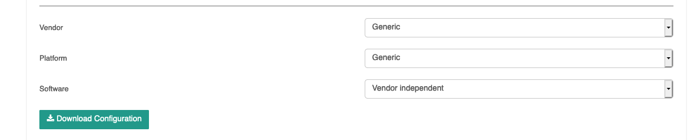
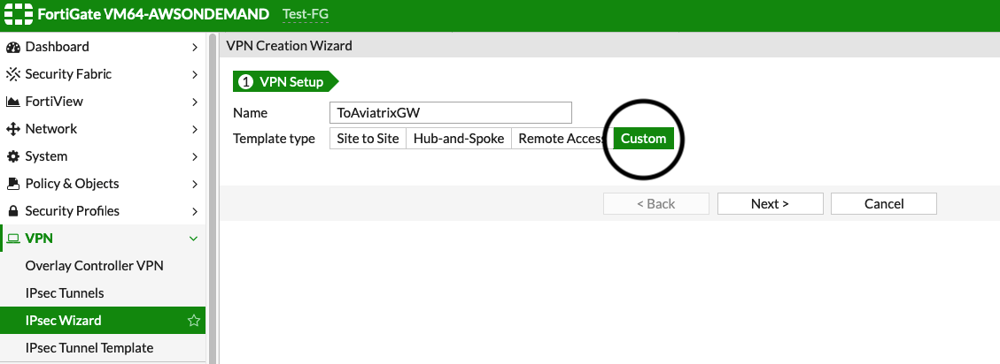
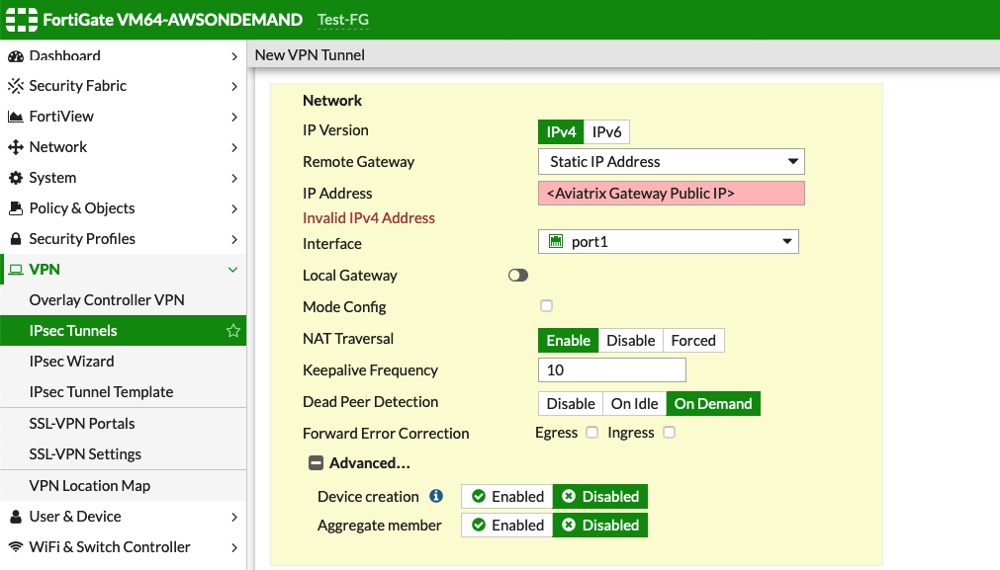
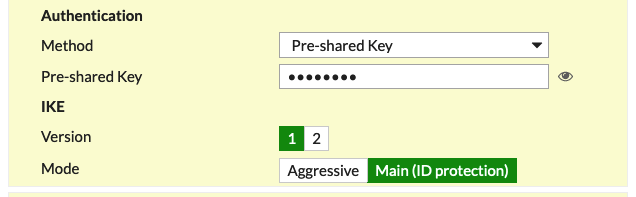
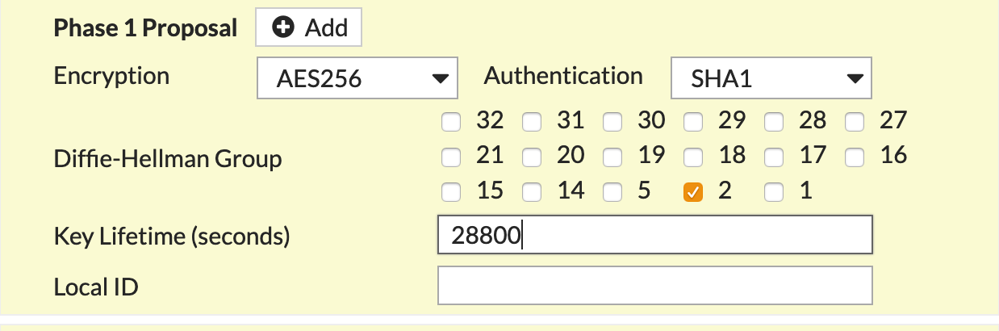
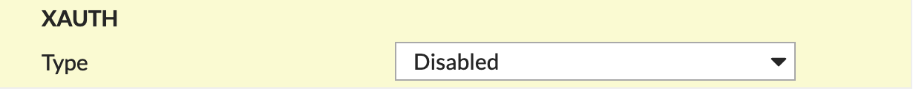
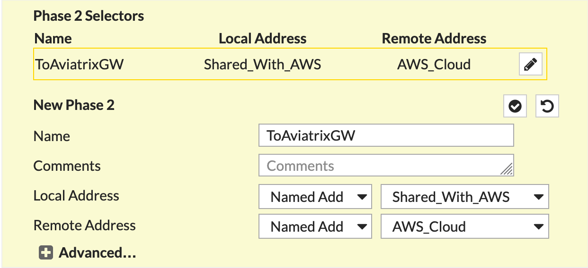
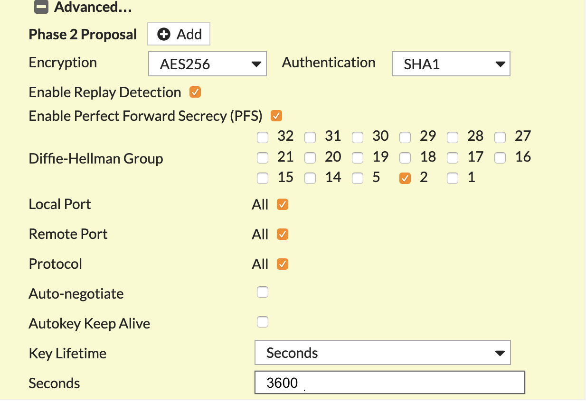
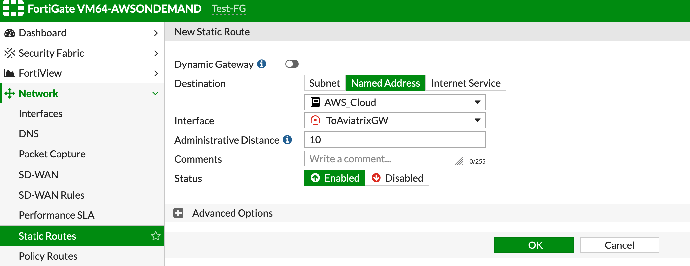
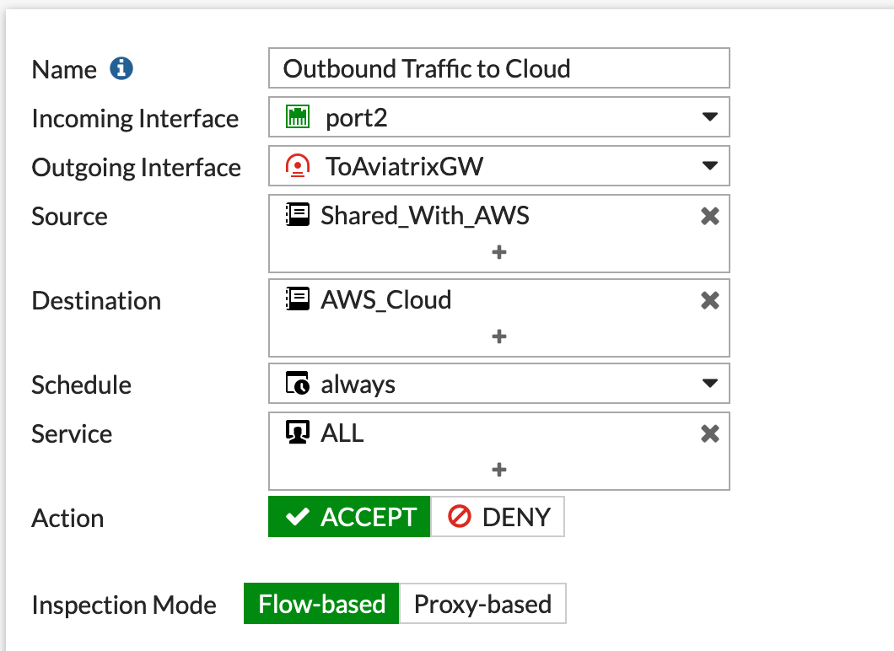
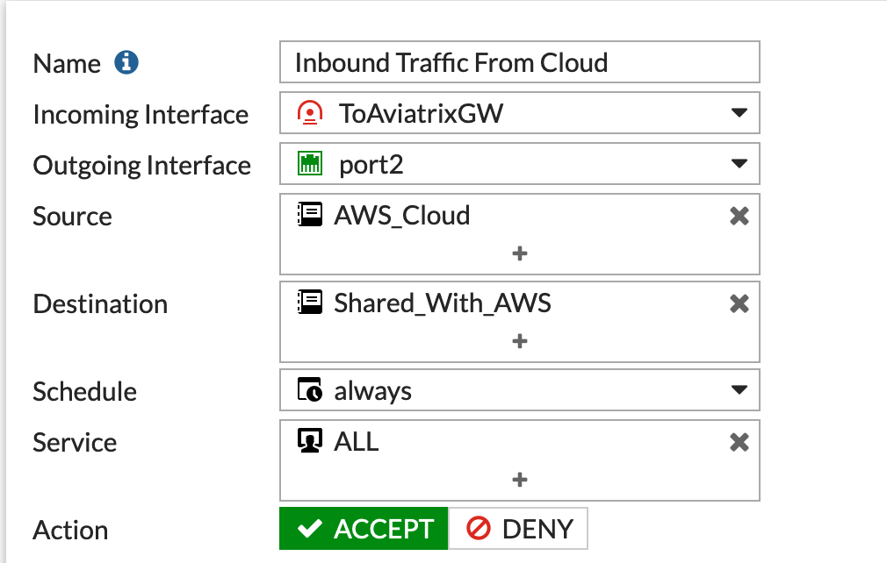
.. |imageThreeLines| image:: site2cloud_fortigate_media/three_lines.png
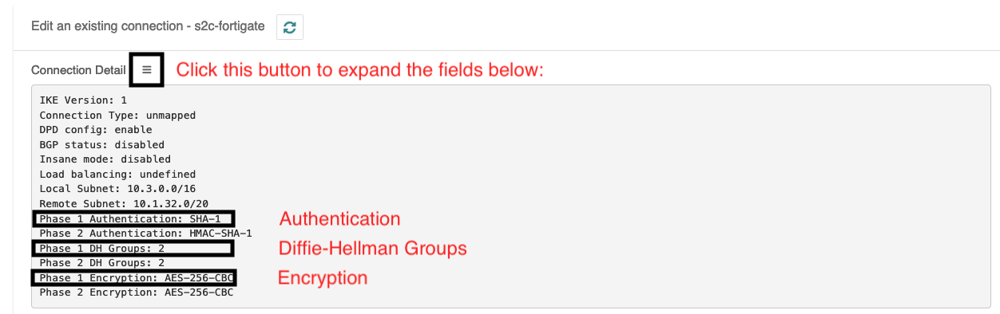
.. |imageconnectiondetails2| image:: site2cloud_fortigate_media/connectiondetails2.png
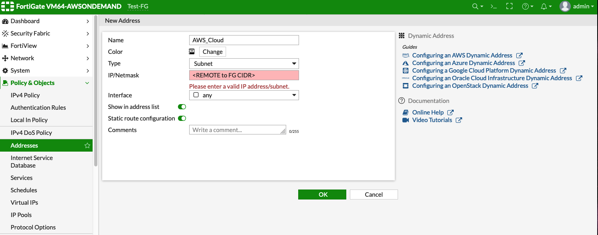
.. |imageawscloudconfig| image:: site2cloud_fortigate_media/aws_cloud_config.png
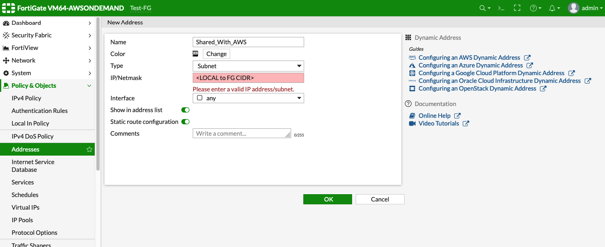
