.. meta::
   :description: Site2Cloud (Aviatrix Gateway - FortiGate)
   :keywords: fortigate, aviatrix, site2cloud

=====================================================================
Site2Cloud (Aviatrix Gateway - FortiGate)
=====================================================================

Overview
--------
This document describes how to configure an IPsec tunnel between an Aviatrix Gateway and a FortiGate firewall using Aviatrix Site2Cloud.

#. Configure a `Site2Cloud tunnel <#fg-s2c-avtx-start>`__ in Aviatrix Controller
#. Configure `VPN tunnel <#fg-s2c-fg-start>`__ and related components in FortiGate Firewall

.. _fg_s2c_avtx_start:

Aviatrix Configuration
----------------------

Add a Site2Cloud tunnel in Aviatrix Controller
++++++++++++++++++++++++++++++++++++++++++++++

Follow the steps in `this </HowTos/site2cloud.html>`__ guide.

.. tip::

   Download the configuration to aid in the creation of the tunnel in FortiGate.  Select **Generic** for `Vendor` and `Platform` and **Vendor independent** for `Software`.

.. _fg_s2c_fg_start:

FortiGate Configuration
-----------------------

The configuration and screenshots below assume the following:

* There are 2 interfaces on the FortiGate:

  * Interface `port1` is an externally facing interface
  * Interface `port2` is an internally facing interface

* You have a subnet in AWS, Azure, or GCP in a VPC (VNet or Project) that has an Aviatrix Gateway.  This subnet is defined as `10.0.0.0/16` for the example below but it can be any valid CIDR range.

  .. note::
     In the examples below we refer to this range as **AWS_Cloud**.

* You have a subnet behind your FortiGate firewall that will be accessible in the cloud.  This subnet is defined as `172.16.0.0/20` in the examples below but it can be any valid CIDR range.

  .. note::
     In the examples below we refer to this range as **Shared_With_AWS**

Configure Named Address Ranges in FortiGate
+++++++++++++++++++++++++++++++++++++++++++

Under **Policy & Objects** > **Addresses**, create 2 new addresses:

**AWS_Cloud**

   +-------------------------------+------------------------------------------+
   | Field                         | Expected Value                           |
   +===============================+==========================================+
   | Name                          | AWS_Cloud                                |
   +-------------------------------+------------------------------------------+
   | Type                          | Subnet                                   |
   +-------------------------------+------------------------------------------+
   | Subnet / IP Range             | CIDR matching the range specified in     |
   |                               | tunnel configuration (remote to FG)      |
   +-------------------------------+------------------------------------------+
   | Interface                     | any                                      |
   +-------------------------------+------------------------------------------+
   | Show in Address List          | Enabled                                  |
   +-------------------------------+------------------------------------------+
   | Static Route Configuration    | Enabled                                  |
   +-------------------------------+------------------------------------------+

**Shared_With_AWS**

   +-------------------------------+------------------------------------------+
   | Field                         | Expected Value                           |
   +===============================+==========================================+
   | Name                          | Shared_With_AWS                          |
   +-------------------------------+------------------------------------------+
   | Type                          | Subnet                                   |
   +-------------------------------+------------------------------------------+
   | Subnet / IP Range             | CIDR matching the range specified in     |
   |                               | tunnel configuration (local to FG)       |
   +-------------------------------+------------------------------------------+
   | Interface                     | any                                      |
   +-------------------------------+------------------------------------------+
   | Show in Address List          | Enabled                                  |
   +-------------------------------+------------------------------------------+
   | Static Route Configuration    | Enabled                                  |
   +-------------------------------+------------------------------------------+

Create an IPsec tunnel on FortiGate
+++++++++++++++++++++++++++++++++++

#. Login to your FortiGate dashboard.
#. In the `VPN` menu, select `IPsec Tunnels`.
#. Click `+ Create New`
#. Populate the fields according to your preferences. 

   **VPN Setup**
   
   +-------------------------------+------------------------------------------+
   | Field                         | Expected Value                           |
   +===============================+==========================================+
   | Name                          | Any value                                |
   +-------------------------------+------------------------------------------+
   | Template Type                 | Custom                                   |
   +-------------------------------+------------------------------------------+
   
   |imageNewVPN|
   
   **Network**
   
   +-------------------------------+------------------------------------------+
   | Field                         | Expected Value                           |
   +===============================+==========================================+
   | IP Version                    | IPv4                                     |
   +-------------------------------+------------------------------------------+
   | Remote Gateway                | Static IP Address                        |
   +-------------------------------+------------------------------------------+
   | IP Address                    | Public IP address of Aviatrix Gateway    |
   +-------------------------------+------------------------------------------+
   | Interface                     | Select the appropriate port/interface    |
   +-------------------------------+------------------------------------------+
   | Local Gateway                 | Disabled                                 |
   +-------------------------------+------------------------------------------+
   | Mode Config                   | Unchecked                                |
   +-------------------------------+------------------------------------------+
   | NAT Traversal                 | Recommended: Enable                      |
   +-------------------------------+------------------------------------------+
   | Keepalive Frequency           | Any value                                |
   +-------------------------------+------------------------------------------+
   | Dead Peer Detection           | On Demand                                |
   +-------------------------------+------------------------------------------+
   
   |imageSection1|
   
   **Authentication**
   
   +-------------------------------+------------------------------------------+
   | Field                         | Expected Value                           |
   +===============================+==========================================+
   | Method                        | Pre-shared Key                           |
   +-------------------------------+------------------------------------------+
   | Pre-shared Key                | Enter the value from the downloaded      |
   |                               | configuration or the value typed in      |
   |                               | to the field in Aviatrix Site2Cloud      |
   +-------------------------------+------------------------------------------+
   | IKE Version                   | 1                                        |
   +-------------------------------+------------------------------------------+
   | IKE Mode                      | Main (ID protection)                     |
   +-------------------------------+------------------------------------------+
   
   |imageSection2|
   
   **Phase 1 Proposal**

   .. important::
      The following values from the Aviatrix Site2Cloud configuration are needed below:
      
      #. In the Aviatrix Controller, select the Site2Cloud configuration created earlier
      #. Click |imageThreeLines| next to `Connect Detail`

      |imageS2CPh1Detail|
   
   +-------------------------------+------------------------------------------+
   | Field                         | Expected Value                           |
   +===============================+==========================================+
   | Encryption                    | Match value specified in Aviatrix S2C    |
   |                               | configuration (Phase 1 Encryption)       |
   +-------------------------------+------------------------------------------+
   | Authentication                | Match value specified in Aviatrix S2C    |
   |                               | configuration (Phase 1 Authentication)   |
   +-------------------------------+------------------------------------------+
   | Diffie-Hellman Group          | Match value specified in Aviatrix S2C    |
   |                               | configuration (Phase 1 DH Groups)        |
   +-------------------------------+------------------------------------------+
   | Key Lifetime (seconds)        | 28800                                    |
   +-------------------------------+------------------------------------------+
   | Local ID                      |                                          |
   +-------------------------------+------------------------------------------+
   
   |imageSection3|

   **XAUTH**
   
   +-------------------------------+------------------------------------------+
   | Field                         | Expected Value                           |
   +===============================+==========================================+
   | Type                          | Disabled                                 |
   +-------------------------------+------------------------------------------+
   
   |imageSection4|
   
   **Phase 2 Selectors**
   
   *New Phase 2*
   
   +-------------------------------+------------------------------------------+
   | Field                         | Expected Value                           |
   +===============================+==========================================+
   | Name                          | Any string value                         |
   +-------------------------------+------------------------------------------+
   | Comments                      | Any string value                         |
   +-------------------------------+------------------------------------------+
   | Local Address                 | Named Address - **Shared_With_AWS**      |
   +-------------------------------+------------------------------------------+
   | Remote Address                | Named Address - **AWS_Cloud**            |
   +-------------------------------+------------------------------------------+

   |imagePhase2Top|

   *Advanced*

   .. important::
      The following values from the Aviatrix Site2Cloud configuration are needed below:
      
      #. In the Aviatrix Controller, select the Site2Cloud configuration created earlier
      #. Click |imageThreeLines| next to `Connect Detail`

      |imageS2CPh2Detail|

   +-------------------------------+------------------------------------------+
   | Field                         | Expected Value                           |
   +===============================+==========================================+
   | Encryption                    | Match value specified in Aviatrix S2C    |
   |                               | configuration (Phase 2 Encryption)       |
   +-------------------------------+------------------------------------------+
   | Authentication                | Match value specified in Aviatrix S2C    |
   |                               | configuration (Phase 2 Authentication)   |
   +-------------------------------+------------------------------------------+
   | Diffie-Hellman Group          | Match value specified in Aviatrix S2C    |
   |                               | configuration (Phase 2 DH Groups)        |
   +-------------------------------+------------------------------------------+
   | Key Lifetime                  | Seconds                                  |
   +-------------------------------+------------------------------------------+
   | Seconds                       | 28800                                    |
   +-------------------------------+------------------------------------------+
   
   |imagePhase2Adv|
   
#. Click `OK`

Configure IPv4 Policy
+++++++++++++++++++++

In **Policy & Objects**, select **IPv4 Policy**.
Create 2 new IPv4 policies:

* Outbound traffic from FortiGate (`Shared_With_AWS`) to Aviatrix (`AWS_Cloud`)

  |imageOutboundPolicy|

* Inbound traffic from Aviatrix (`AWS_Cloud`) to FortiGate (`Shared_With_AWS`)

  |imageInboundPolicy|

.. note::
   The reference to `port2` in the screenshots should be replaced with your own interface name that represents the internal facing interface.

.. note::

   Be sure to select **accept** for `action` and select **all** for `service`

Add a Static Route
++++++++++++++++++

In **Network** > **Static Routes**, add a new static route for traffic destined to `AWS_Cloud` to use the VPN tunnel.

|imageStaticRoute|

.. note::
   If `Named Address` is disabled.  Be sure you enabled `Static Route Configuration` on the Address configuration.

   |imageAddressStaticConfig|

Bring Up IPSec Monitor
++++++++++++++++++++++

In **Monitor** > **IPSec Monitor**, select the Aviatrix tunnel, and click **Bring Up**.

Test
----

Once complete, test the communiation using the tunnel

Troubleshooting
---------------

**Error Message**

``failed to get valid proposal``

``no suitable proposal found``

**Solution**

Check that the Phase 1 authentication, encryption, and DH groups match on both sides

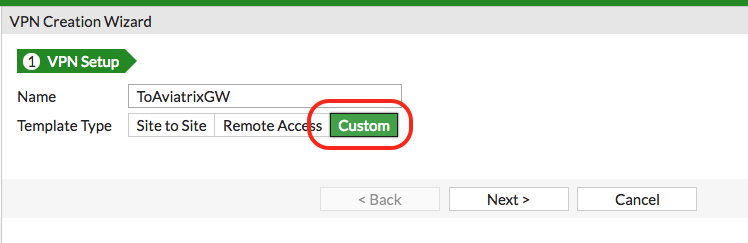
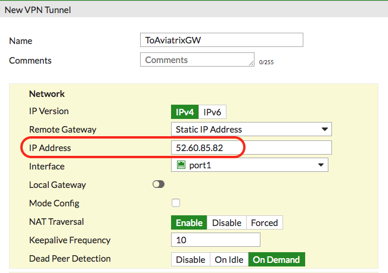
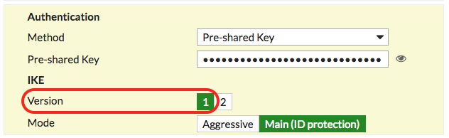
.. |imageSection3| image:: site2cloud_fortigate_media/FG_section3.png
.. |imageSection4| image:: site2cloud_fortigate_media/FG_section4.png
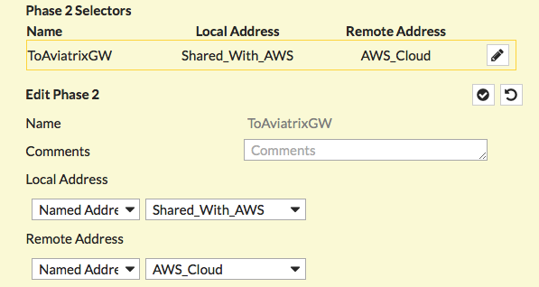
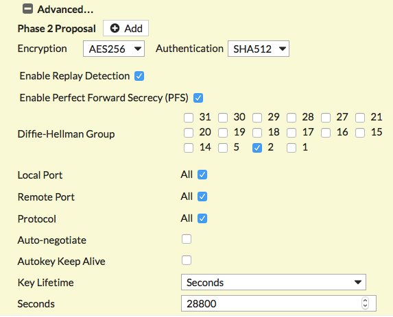
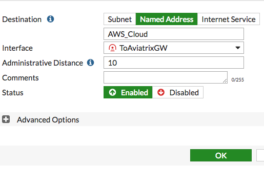
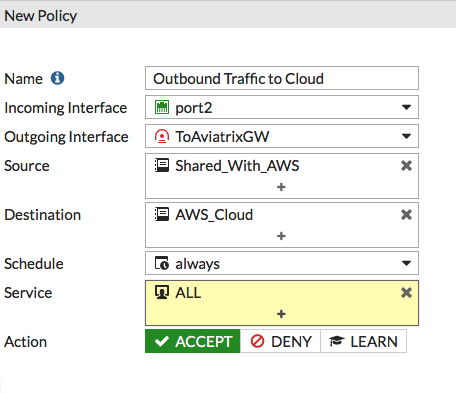
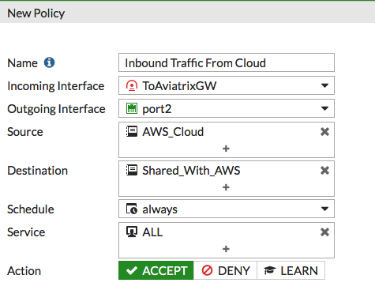
.. |imageThreeLines| image:: site2cloud_fortigate_media/three_lines.png
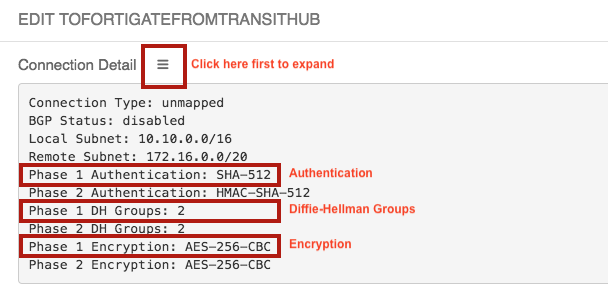
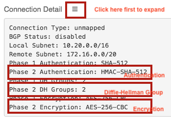
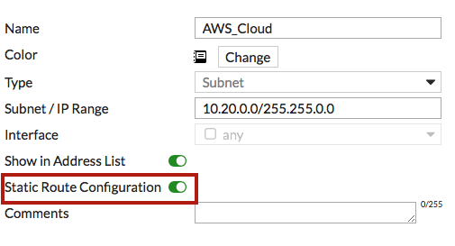
