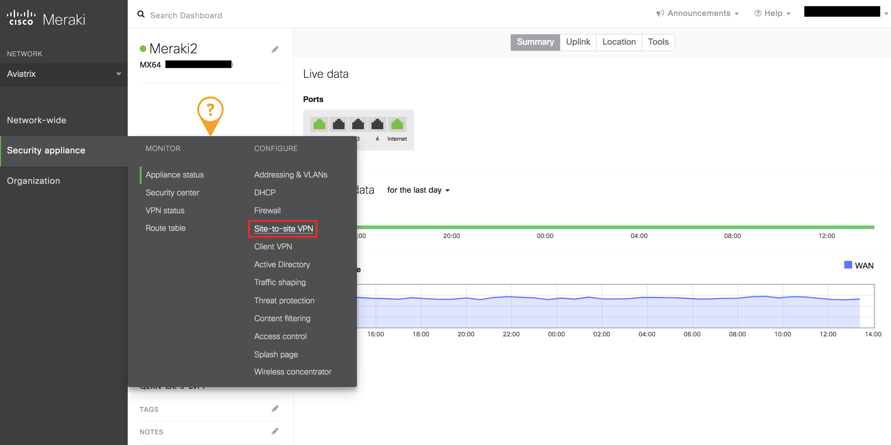
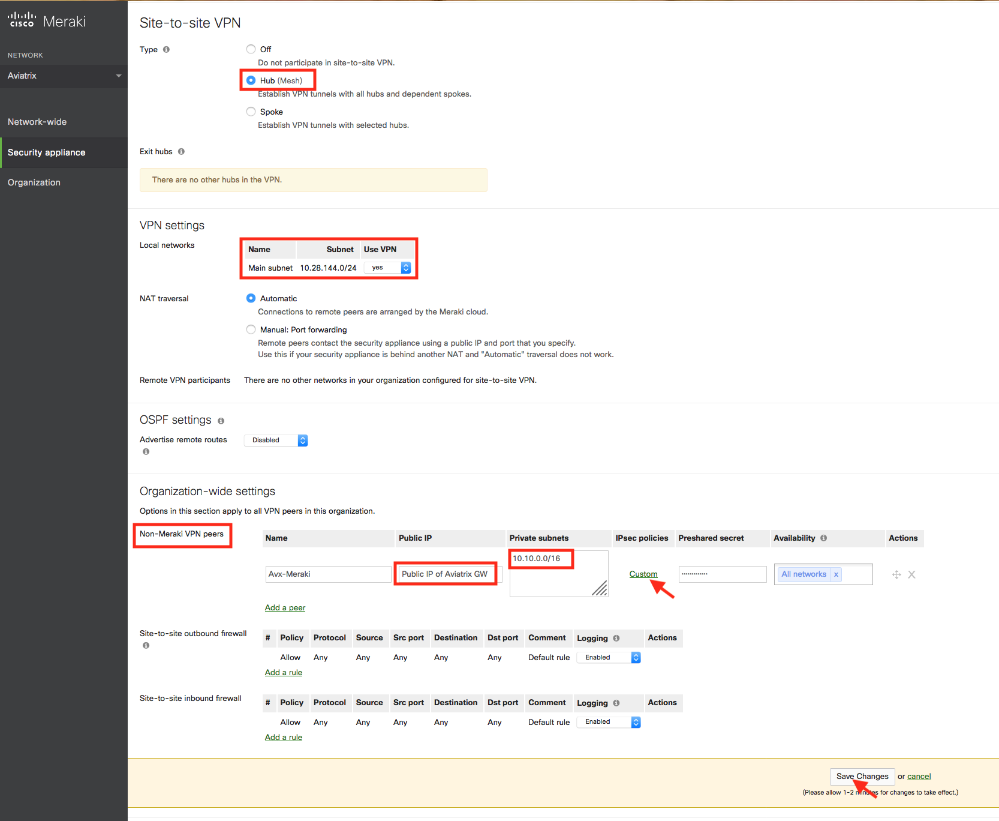
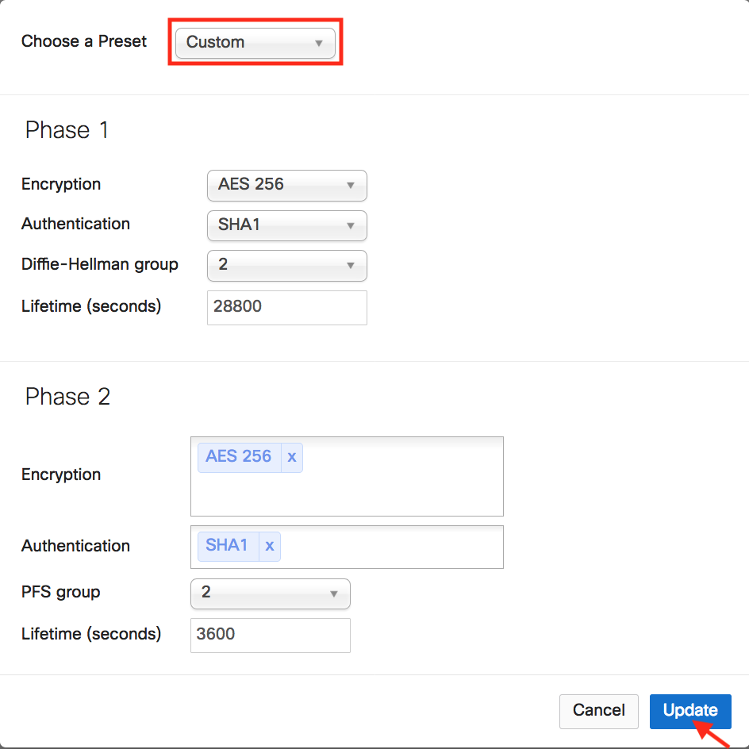
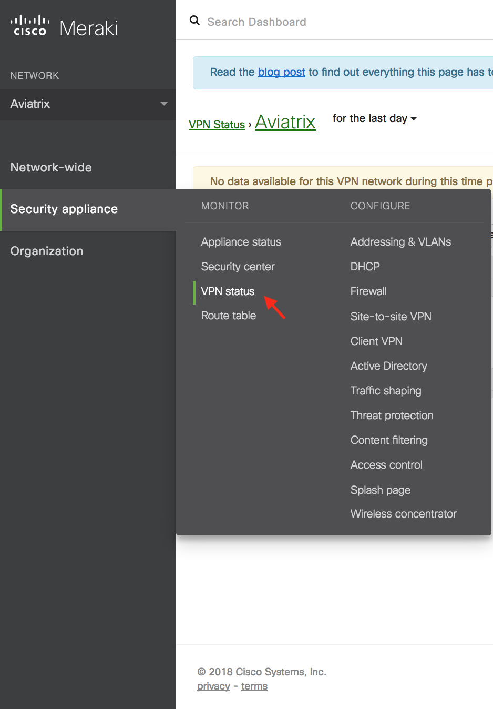
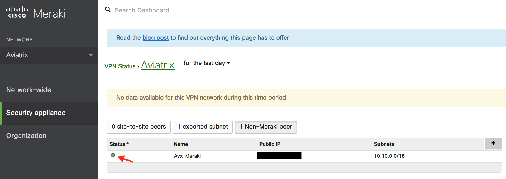

.. meta::
   :description: Site2Cloud (Aviatrix Gateway - Meraki MX64)
   :keywords: meraki, aviatrix, site2cloud

=====================================================================
Aviatrix Gateway to Meraki MX64
=====================================================================

Overview
-----------------

This document describes how to create an IPsec tunnel between an Aviatrix Gateway and a Meraki MX64 using Aviatrix Site2Cloud.

The network setup is as follows: 

**VPC/VNet1 (with Aviatrix Gateway)**

    *VPC/VNet1 CIDR: 10.10.0.0/16*
    
    *VPC/VNet1 Subnet CIDR (public subnet for AWS, GCP, or OCI): 10.10.0.0/24*
    
**On-prem (with Meraki MX64)**

    *On-prem CIDR: 10.28.144.0/24*
    

Adding a Site2Cloud Tunnel in Aviatrix Controller
------------------------------------------------------------

1. Log in to your Aviatrix Controller.
2. Select Site2Cloud on the left navigation bar.
3. Click on **+ Add New** near the top of the Site2Cloud tab.
4. Under Add a New Connection, enter the following:

  +-------------------------------+------------------------------------------+
  | Field                         | Expected Value                           |
  +===============================+==========================================+
  | VPC ID / VNet Name            | Select the VPC/VNet where this tunnel    |
  |                               | will terminate in the cloud.             |
  +-------------------------------+------------------------------------------+
  | Connection Type               | Unmapped unless there is an              |
  |                               | overlapping CIDR block.                  |
  +-------------------------------+------------------------------------------+
  | Connection Name               | Name this connection.  This connection   |
  |                               | represents the connectivity to the       |
  |                               | edge device.                             |
  +-------------------------------+------------------------------------------+
  | Remote Gateway Type           | Generic                                  |
  +-------------------------------+------------------------------------------+
  | Tunnel Type                   | UDP                                      |
  +-------------------------------+------------------------------------------+
  | Algorithms                    | Unmark this checkbox                     |
  +-------------------------------+------------------------------------------+
  | Encryption over ExpressRoute/ | Unmark this checkbox                     |
  | Direct Connect                 |                                         |
  +-------------------------------+------------------------------------------+
  | Enable HA                     | Unmark this checkbox                     |
  +-------------------------------+------------------------------------------+
  | Primary Cloud Gateway         | Select the Gateway where the tunnel will |
  |                               | terminate in this VPC/VNet.              |
  +-------------------------------+------------------------------------------+
  | Remote Gateway IP Address     | IP address of the Meraki M64 device.     |
  +-------------------------------+------------------------------------------+
  | Pre-shared Key                | Optional.  Enter the pre-shared key for  |
  |                               | this connection.  If nothing is entered  |
  |                               | one will be generated for you.           |
  +-------------------------------+------------------------------------------+
  | Remote Subnet                 | Enter the CIDR representing the network  |
  |                               | behind the Meraki MX64 that this tunnel  |
  |                               | supports.                                |
  +-------------------------------+------------------------------------------+
  | Local Subnet                  | The CIDR block that should be advertised |
  |                               | on Meraki M64 for the cloud network      |
  |                               | (will default to the VPC/VNet CIDR block)|
  +-------------------------------+------------------------------------------+

5. Click **OK**,

6. Click on this newly created Site2Cloud connection and select Vendor **Aviatrix** to **Download Configuration** so that you can copy and paste the pre-shared key into your Meraki configuration later.

Configuring Site-to-site VPN in Meraki MX64
---------------------------------------------------------

1. Log in to your Meraki dashboard.
2. In the Security appliance menu, select **Site-to-site VPN** under the Configure section.

   |meraki01|

3. Configure your Meraki MX64 and add a peer according to the screenshot below.

   |meraki02|

4. Click **Custom** in the IPsec Policies to create a custom policy that matches the Aviatrix Site2Cloud configuration that was previously downloaded.

   |meraki03|

5. Click **Update** to save the Custom policy.

6. Click **Save Changes**.

7. In the Security appliance menu, click **VPN Status** under the Monitor section.

   |meraki04|

8. Send traffic from the on-prem Meraki MX64 internal network to the Aviatrix Gateway VPC/VNet. Verify that VPN Status is green under the Non-Meraki peer tab. 

   |meraki05|

.. disqus::

