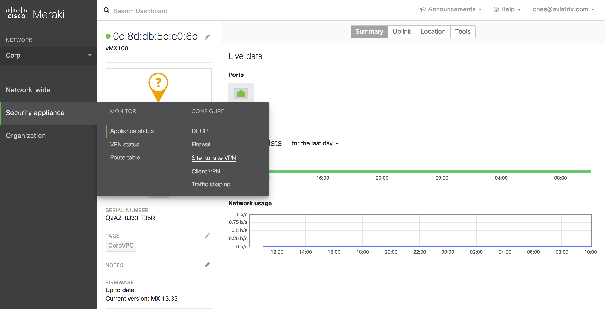
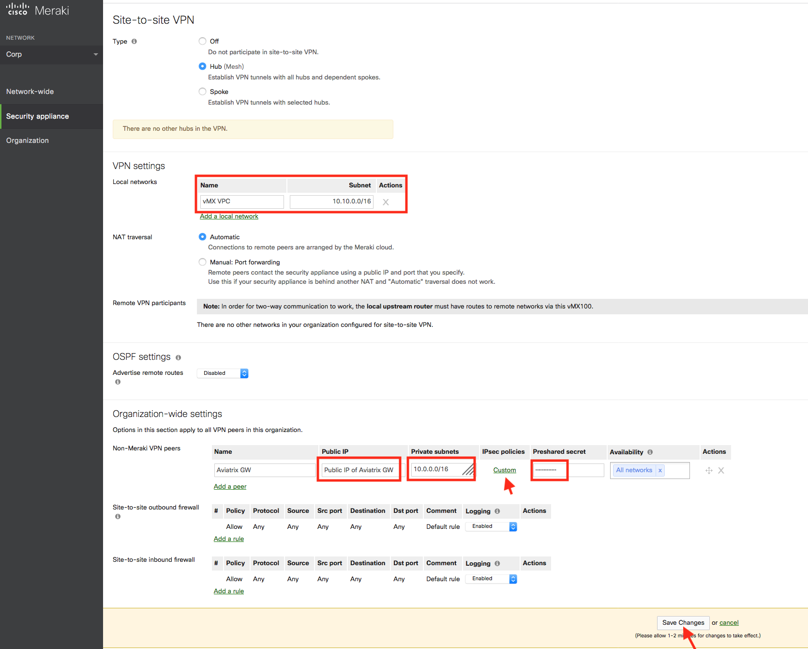
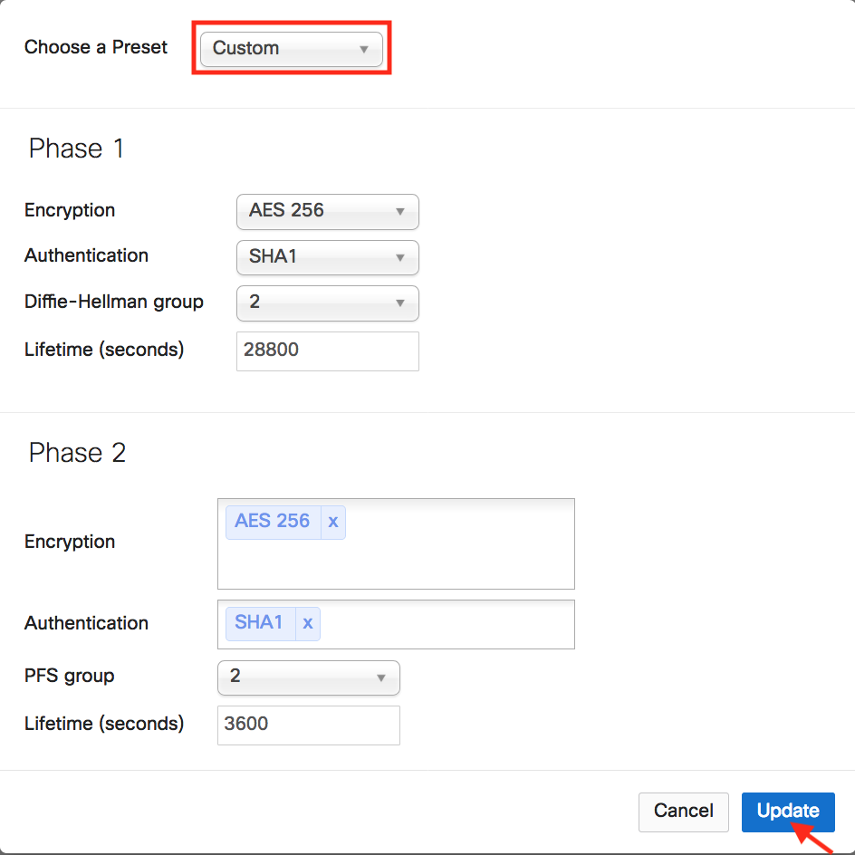
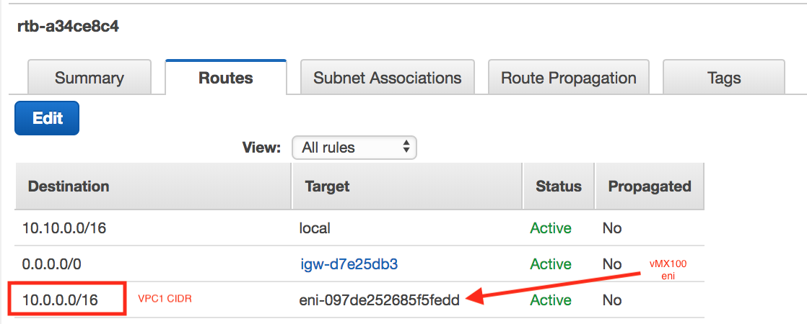
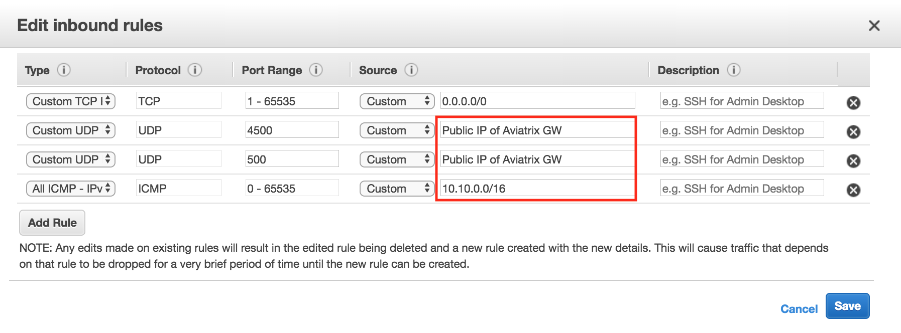
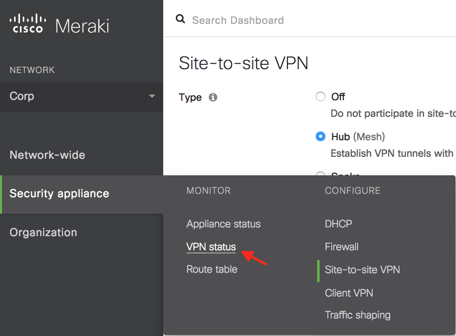
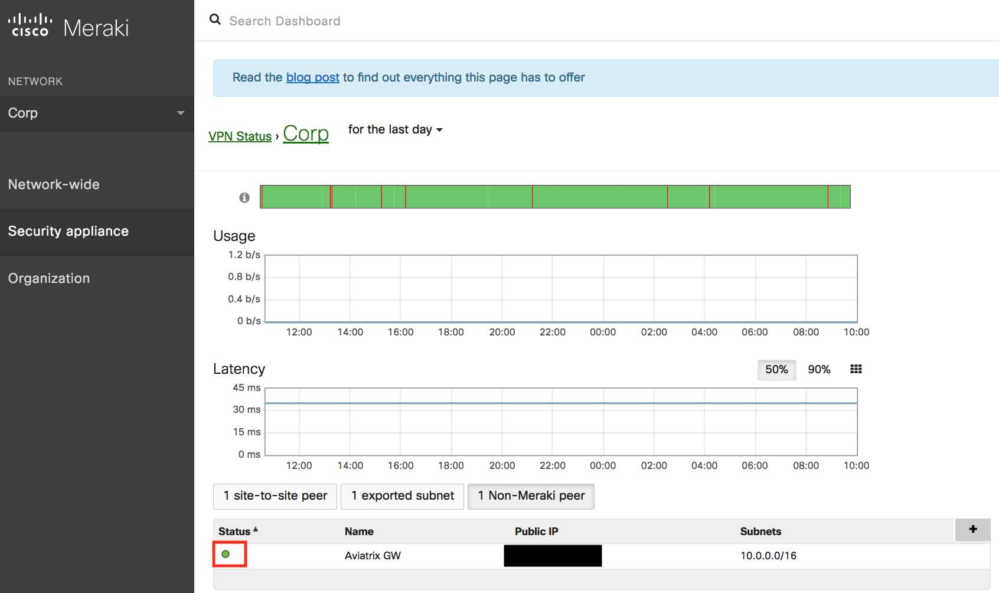
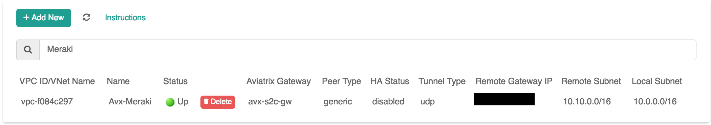

.. meta::
   :description: Site2Cloud (Aviatrix Gateway - Meraki vMX100)
   :keywords: meraki, aviatrix, site2cloud

=====================================================================
Aviatrix Gateway to Meraki vMX100
=====================================================================

Overview
---------------------

This document describes how to create an IPsec tunnel between an Aviatrix Gateway and a Meraki vMX100 using Aviatrix Site2Cloud.

The network setup is as follows:

**VPC/VNet1 (with Aviatrix Gateway)**

    *VPC/VNet1 CIDR: 10.0.0.0/16*
    
    *VPC/VNet1 Subnet (public for AWS, GCP, or OCI): 10.0.0.0/24*
    
**VPC/VNet2 (with Meraki vMX100)**

    *VPC/VNet2 CIDR: 10.10.0.0/16*

    *VPC/VNet2 Subnet (public for AWS, GCP, or OCI): 10.10.0.0/24*
    

Adding a Site2Cloud Tunnel in Aviatrix Controller
-----------------------------------------------------------------

1. Log in to your Aviatrix Controller.
2. Select Site2Cloud on the left navigation bar.
3. Click **+ Add New** near the top of the Site2Cloud tab.
4. Under Add a New Connection, enter the following:

  +-------------------------------+------------------------------------------+
  | Field                         | Expected Value                           |
  +===============================+==========================================+
  | VPC ID / VNet Name            | Select the VPC/VNet where this tunnel will    |
  |                               | terminate in the cloud.                  |
  +-------------------------------+------------------------------------------+
  | Connection Type               | Unmapped unless there is an            |
  |                               | overlapping CIDR block.                  |
  +-------------------------------+------------------------------------------+
  | Connection Name               | Name this connection.  This connection   |
  |                               | represents the connectivity to the       |
  |                               | edge device.                             |
  +-------------------------------+------------------------------------------+
  | Remote Gateway Type           | Generic                                |
  +-------------------------------+------------------------------------------+
  | Tunnel Type                   | UDP                                    |
  +-------------------------------+------------------------------------------+
  | Algorithms                    | Unmark this checkbox                         |
  +-------------------------------+------------------------------------------+
  | Encryption over ExpressRoute/ | Unmark this checkbox                                |
  | Direct Connect                |                                          |
  +-------------------------------+------------------------------------------+
  | Enable HA                     | Unmark this checkbox                               |
  +-------------------------------+------------------------------------------+
  | Primary Cloud Gateway         | Select the Gateway where the tunnel will |
  |                               | terminate in this VPC/VNet.                   |
  +-------------------------------+------------------------------------------+
  | Remote Gateway IP Address     | Public IP of the Meraki vMX100.          |
  +-------------------------------+------------------------------------------+
  | Pre-shared Key                | Optional. Enter the pre-shared key for  |
  |                               | this connection. If nothing is entered  |
  |                               | one will be generated for you.           |
  +-------------------------------+------------------------------------------+
  | Remote Subnet                 | Enter the VPC/VNet2 CIDR representing the     |
  |                               | network behind the Meraki vMX100 that    |
  |                               | this tunnel supports.                    |
  +-------------------------------+------------------------------------------+
  | Local Subnet                  | The VPC/VNet1 Subnet block that should be     |
  |                               | advertised on Meraki vMX100 for the      |
  |                               | cloud network (will default to the VPC/VNet   |
  |                               | CIDR block).                             |
  +-------------------------------+------------------------------------------+

5. Click **OK**.

6. Click on this newly created Site2Cloud connection and select Vendor **Aviatrix** to Download Configuration so that you can copy and paste the pre-shared key into the Meraki configuration later.

Configuring Site-to-site VPN in Meraki vMX100
-----------------------------------------------------------

1. Log in to your Meraki dashboard.

2. In the Security appliance menu, select **Site-to-site VPN** under the Configure section.

   |meraki_vmx01|

3. Configure your Meraki vMX100 and add a peer according to the screenshot below.

   |meraki_vmx02|

4. Click on **Custom** in the IPsec Policies to create a custom policy that matches the Aviatrix Site2Cloud configuration that was previously downloaded.

   |meraki_vmx03|

5. Click **Update** to save the Custom policy.

6. Remember to click **Save Changes**.

7. Go to AWS and update the VPC/VNet2 (Meraki vMX100 instance) route table to make sure traffic destined to VPC/VNet1 (Aviatrix Gateway) is pointed to the vMX100 eni.

   |meraki_vmx04|

8. At the AWS console, please allow UDP port 500 and 4500 from the public IP of the Aviatrix Gateway in the vMX100's security group. For testing purposes, you may want to allow ICMP traffic from its local network 10.10.0.0/16 as well.

   |meraki_vmx05|

7. In the Security appliance menu, click **VPN Status** under the Monitor section.

   |meraki_vmx06|

8. Send traffic from the Meraki vMX100 VPC/VNet2 internal network to Aviatrix Gateway VPC/VNet1. Verify that the VPN Status is green under the Non-Meraki peer tab. 

   |meraki_vmx07|

9. Log in to the Aviatrix Controller and browse to the Site2Cloud page to confirm that the connection is UP. 

   |meraki_vmx08|

.. disqus::

