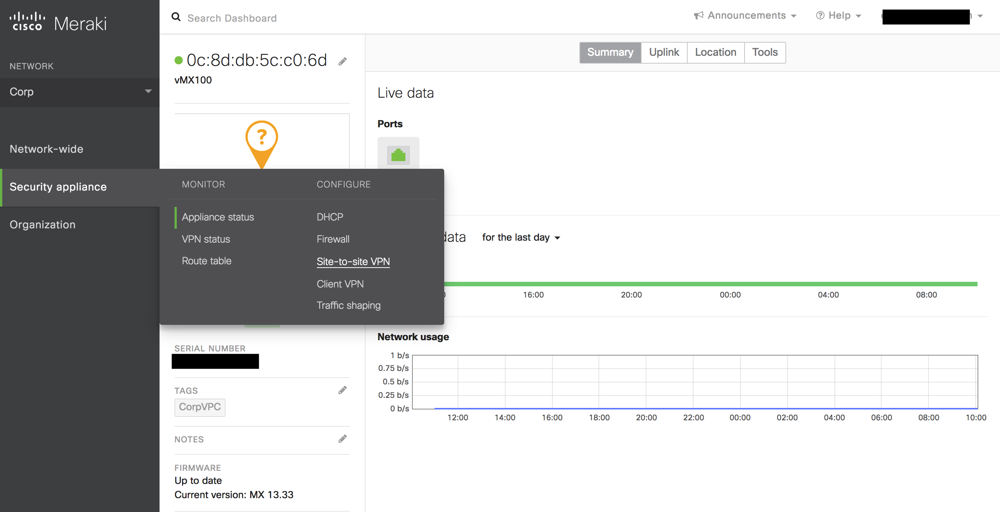

.. meta::
   :description: Site2Cloud (Aviatrix Gateway - Meraki vMX100)
   :keywords: meraki, aviatrix, site2cloud

=====================================================================
Site2Cloud (Aviatrix Gateway - Meraki vMX100)
=====================================================================

Overview
--------
This document describes how to create an IPsec tunnel between an Aviatrix Gateway and a Meraki vMX100 using Aviatrix Site2Cloud.

Network setup is as following:

**VPC1 (with Aviatrix Gateway)**

    *VPC1 CIDR: 10.0.0.0/16*
    
    *VPC1 Public Subnet: 10.0.0.0/24*
    
**VPC2 (with Meraki vMX100)**

    *VPC2 CIDR: 10.10.0.0/16*

    *VPC2 Public Subnet: 10.10.0.0/24*
    

Add a Site2Cloud tunnel in Aviatrix Controller
-----------------------------------------------
1. Login to your Aviatrix Controller.
2. Select the Site2Cloud navigation item on the left navigation bar.
3. Click on `+ Add New` near the top of the `Site2Cloud` tab.
4. Under `Add a New Connection`, enter the following:

  +-------------------------------+------------------------------------------+
  | Field                         | Expected Value                           |
  +===============================+==========================================+
  | VPC ID / VNet Name            | Select the VPC where this tunnel will    |
  |                               | terminate in the cloud.                  |
  +-------------------------------+------------------------------------------+
  | Connection Type               | `Unmapped` unless there is an            |
  |                               | overlapping CIDR block.                  |
  +-------------------------------+------------------------------------------+
  | Connection Name               | Name this connection.  This connection   |
  |                               | represents the connectivity to the       |
  |                               | edge device.                             |
  +-------------------------------+------------------------------------------+
  | Remote Gateway Type           | `Generic`                                |
  +-------------------------------+------------------------------------------+
  | Tunnel Type                   | `UDP`                                    |
  +-------------------------------+------------------------------------------+
  | Algorithms                    | Unchecked                                |
  +-------------------------------+------------------------------------------+
  | Encryption over ExpressRoute/ | Unchecked                                |
  | DirectConnect                 |                                          |
  +-------------------------------+------------------------------------------+
  | Enable HA                     | Unchecked                                |
  +-------------------------------+------------------------------------------+
  | Primary Cloud Gateway         | Select the Gateway where the tunnel will |
  |                               | terminate in this VPC.                   |
  +-------------------------------+------------------------------------------+
  | Remote Gateway IP Address     | Public IP of the Meraki vMX100.          |
  +-------------------------------+------------------------------------------+
  | Pre-shared Key                | Optional.  Enter the pre-shared key for  |
  |                               | this connection.  If nothing is entered  |
  |                               | one will be generated for you.           |
  +-------------------------------+------------------------------------------+
  | Remote Subnet                 | Enter the VPC2 CIDR representing the     |
  |                               | network behind the Meraki vMX100 that    |
  |                               | this tunnel supports.                    |
  +-------------------------------+------------------------------------------+
  | Local Subnet                  | The VPC1 Subnet block that should be     |
  |                               | advertised on Meraki vMX100 for the      |
  |                               | cloud network (will default to the VPC   |
  |                               | CIDR block).                             |
  +-------------------------------+------------------------------------------+

5. Click `OK`

6. Click on this newly created Site2Cloud connection and select Vendor Aviatrix to `Download Configuration` so that you can copy and paste the preshared-key into Meraki configuration later.

Configuring Site-to-site VPN in Meraki vMX100
---------------------------------------------

1. Login to your Meraki dashboard.

2. In the `Security appliance` menu, select `Site-to-site VPN` under `Configure` section.

   |meraki_vmx01|

3. Configure your Meraki vMX100 and add a peer according to the screenshot below.

   |meraki_vmx02|

4. Click on Custom in the IPsec Policies to create a custom policy that matches Aviatrix Site2Cloud configuration that was previously downloaded.

   |meraki_vmx03|

5. Click `Update` to save the Custom policy.

6. Remember to click on Save Changes.

7. Go to AWS console and update the VPC2 (Meraki vMX100 instance) route table to make sure traffic destined to VPC1 (Aviatrix gateway) is pointed to the vMX100 eni.

   |meraki_vmx04|

8. At the AWS console, please allow UDP port 500 and 4500 from public ip of Aviatrix gateway in the vMX100's security group. For testing purpose, you may want to allow ICMP traffic from its local network 10.10.0.0/16 as well.

   |meraki_vmx05|

7. In the `Security appliance` menu, click on `VPN Status` under `Monitor` section.

   |meraki_vmx06|

8. Send traffic from Meraki vMX100 VPC2 internal network to Aviatrix gateway VPC1. Verify that VPN Status is green under Non-Meraki peer tab. 

   |meraki_vmx07|

9. Login to Aviatrix Controller UI, browse to Site2Cloud page to confirm the connection is UP. 

   |meraki_vmx08|

.. |meraki_vmx02| image:: site2cloud_meraki_vmx100_media/meraki_vmx02.png

.. |meraki_vmx04| image:: site2cloud_meraki_vmx100_media/meraki_vmx04.png
.. |meraki_vmx05| image:: site2cloud_meraki_vmx100_media/meraki_vmx05.png
.. |meraki_vmx06| image:: site2cloud_meraki_vmx100_media/meraki_vmx06.png

