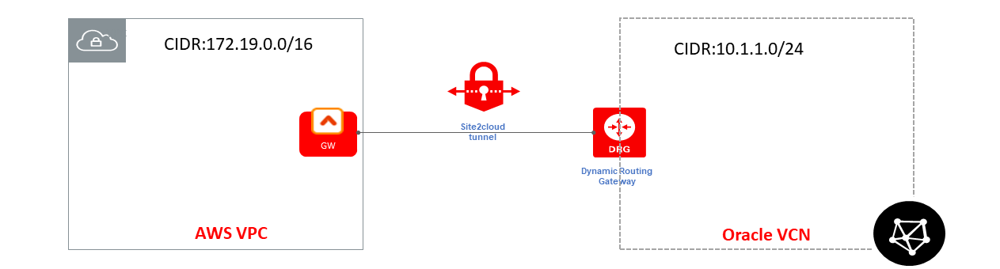
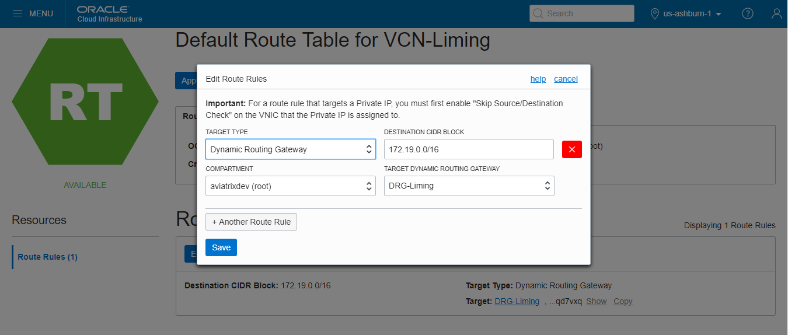
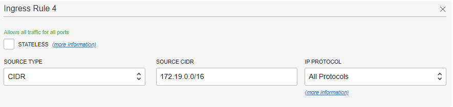
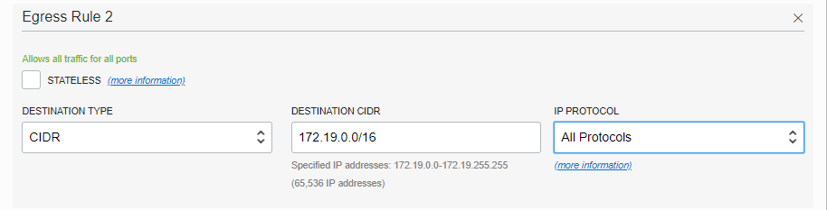
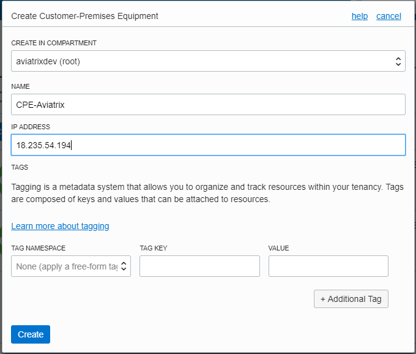
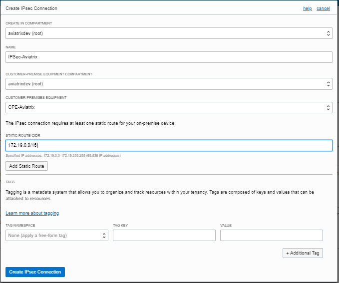
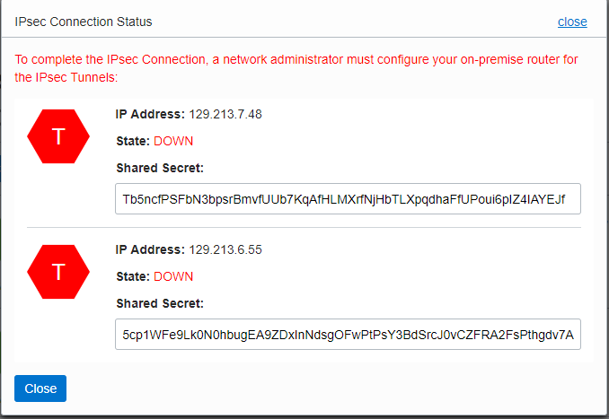
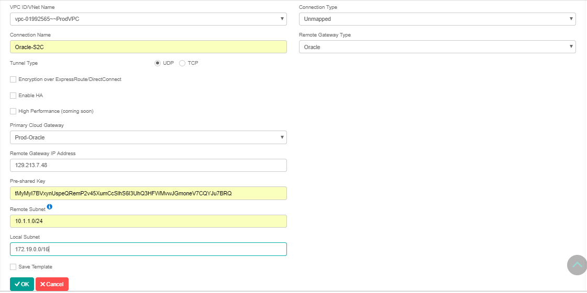
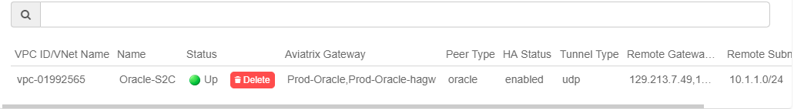

.. meta::
   :description: Site2Cloud (Aviatrix Gateway - Oracle DRG)
   :keywords: aviatrix, site2cloud, oracle, drg

.. raw:: html

   

=====================================================================
Aviatrix Gateway to Oracle DRG
=====================================================================

Overview
-------------------

This document describes how to configure an IPsec tunnel between an Aviatrix Gateway and an Oracle Dynamic Routing Gateway (DRG).

|gw2drg|

Deployment Guide
----------------------------------

For this use case, we will create an IPsec connection from DRG first and then configure a Site2Cloud connection at the Aviatrix Controller.

Creating an IPsec Connection from DRG
++++++++++++++++++++++++++++++++++++

.. note::

   **Prerequisites**

   #. You have a DRG created and attached to a VCN.
   #. You have an Aviatrix Gateway provisioned in a VPC/VNet.  You will need this gateway's public IP address and its VPC/VNet CIDR for the steps below.

#. Log in to your Oracle Cloud Console and create a route rule for the DRG.

    We need to modify the desired route table and create a route rule to take any traffic destined for the Aviatrix Gateway's VPC/VNet CIDR and route it to the DRG.

      #. Under **Core Infrastructure**, go to **Networking** and click **Virtual Cloud Networks**.
      #. Click your VCN.
      #. Select the desired route table(s) for your VCN.
      #. Click **Edit Route Rules**.
      #. Create a new route rule as following and save it.

         +--------------------------------+--------------------------------------------------------+
         | Field                          | Description                                            |
         +================================+========================================================+
         | Target Type                    | Dynamic Route Gateway                                  |
         +--------------------------------+--------------------------------------------------------+
         | Destination CIDR Block         | Aviatrix GW's VPC/VNet CIDR (172.19.0.0/16 in this     |
         |                                | example)                                               |
         +--------------------------------+--------------------------------------------------------+
         | Target Dynamic Routing Gateway | Select the desired existing DRG                        |
         +--------------------------------+--------------------------------------------------------+

   |vcn_route_table|

#. Log in to your Oracle Cloud Console and create security rules.

    We will edit the security list associated with your VCN subnets. We need to add two new rules: one ingress rule for
    traffic coming from the Aviatrix Gateway's VPC/VNet and one egress rule for traffic destinating to the Aviatrix Gateway's VPC/VNet.

      #. Under **Core Infrastructure**, go to **Networking** and click **Virtual Cloud Networks**.
      #. Click your VCN.
      #. Select the desired security list(s) associated with your subnets.
      #. Click **Edit All Rules**.
      #. In **Allowed Rule for Ingress** section, enter the following values to create a rule to allow incoming traffic from Aviatrix Gateway's VPC/VNet.

         +--------------------------------+--------------------------------------------------------+
         | Field                          | Description                                            |
         +================================+========================================================+
         | Source Type                    | CIDR                                                   |
         +--------------------------------+--------------------------------------------------------+
         | Source CIDR                    | Aviatrix GW's VPC/VNet CIDR (172.19.0.0/16 in this     |
         |                                | example)                                               |
         +--------------------------------+--------------------------------------------------------+
         | IP Protocols                   | All Protocols                                          |
         +--------------------------------+--------------------------------------------------------+

         |vcn_security_rule_ingress|

      #. In **Allowed Rule for Egress** section, enter the following values to create a rule to allow outgoing traffic to the Aviatrix Gateway's VPC/VNet.

         +--------------------------------+--------------------------------------------------------+
         | Field                          | Description                                            |
         +================================+========================================================+
         | Destination Type               | CIDR                                                   |
         +--------------------------------+--------------------------------------------------------+
         | Destination CIDR               | Aviatrix GW's VPC/VNet CIDR (172.19.0.0/16 in this     |
         |                                | example)                                               |
         +--------------------------------+--------------------------------------------------------+
         | IP Protocols                   | All Protocols                                          |
         +--------------------------------+--------------------------------------------------------+

         |vcn_security_rule_egress|

#. Create a CPE object.

    In this task, we create the CPE object, which is a logical representation of the Aviatrix Gateway.

      #. Under **Core Infrastructure**, go to **Networking** and click **Customer-Premises Equipment**.
      #. Click **Create Customer-Premises Equipment**.
      #. Enter the following values and click **Create**.

         +------------------------------+---------------------------------------------+
         | Field                        | Description                                 |
         +==============================+=============================================+
         | Create in Compartment        | Leave as is (the VCN's compartment)         |
         +------------------------------+---------------------------------------------+
         | Name                         | A descriptive name for the CPE object       |
         +------------------------------+---------------------------------------------+
         | IP Address                   | Public IP address of Aviatrix Gateway       |
         +------------------------------+---------------------------------------------+
         | Tags                         | Optional                                    |
         +------------------------------+---------------------------------------------+

         |cpe|

#. From the DRG, create an IPsec connection to the CPE object.

   #. Under **Core Infrastructure**, go to **Networking** and click **Dynamic Routing Gateways**.
   #. Click the DRG created earlier.
   #. Click **Create IPsec Connection**.
   #. Enter the following values and click **Create IPsec Connection**.

      +-----------------------------------------+--------------------------------------------------------+
      | Field                                   | Description                                            |
      +=========================================+========================================================+
      | Create in Compartment                   | Leave as is (the VCN's compartment)                    |
      +-----------------------------------------+--------------------------------------------------------+
      | Name                                    | A descriptive name for the IPsec connection            |
      +-----------------------------------------+--------------------------------------------------------+
      | Customer-Premises Equipment Compartment | Leave as is (the VCN's compartment)                    |
      +-----------------------------------------+--------------------------------------------------------+
      | Customer-Premises Equipment             | Select the CPE object created earlier                  |
      +-----------------------------------------+--------------------------------------------------------+
      | Static Route CIDR                       | Aviatrix GW's VPC/VNet CIDR (172.19.0.0/16 in this     |
      |                                         | example)                                               |
      +-----------------------------------------+--------------------------------------------------------+
      | Tags                                    | Optional                                               |
      +-----------------------------------------+--------------------------------------------------------+

      |ipsec_connection|

   #. Once the IPsec connection enters the **Available** state, click the **Action** icon (three dots), and then click **Tunnel Information**.
      Please copy the **IP Address** of the VPN headend and the **Shared Secret** for configuring a Site2Cloud connection at the Aviatrix Controller.

      |ipsec_info|

#. Log in to the Aviatrix Controller.

#. Follow the steps in `this </HowTos/site2cloud.html>`__ guide.  Use this table for specific field values.

   +-------------------------------+-----------------------------------------------------------------+
   | Field                         | Description                                                     |
   +===============================+=================================================================+
   | VPC ID/VNet Name              | Select the Aviatrix Gateway's VPC/VNet                          |
   +-------------------------------+-----------------------------------------------------------------+
   | Connection Type               | Unmapped                                                        |
   +-------------------------------+-----------------------------------------------------------------+
   | Connection Name               | A descriptive name for the Site2Cloud connection                |
   +-------------------------------+-----------------------------------------------------------------+
   | Remote Gateway Type           | Oracle                                                          |
   +-------------------------------+-----------------------------------------------------------------+
   | Tunnel Type                   | UDP                                                             |
   +-------------------------------+-----------------------------------------------------------------+
   | Encryption over ExpressRoute/ | Unchecked                                                       |
   | Direct Connect                |                                                                 |
   +-------------------------------+-----------------------------------------------------------------+
   | Enable HA                     | Unchecked                                                       |
   +-------------------------------+-----------------------------------------------------------------+
   | Primary Cloud Gateway         | Select the desired Aviatrix Gateway                             |
   +-------------------------------+-----------------------------------------------------------------+
   | Remote Gateway IP Address     | Enter the **IP Address** copied from Oracle IPsec connection    |
   +-------------------------------+-----------------------------------------------------------------+
   | Pre-shared Key                | Enter the **Shared Secret** copied from Oracle IPsec connection |
   +-------------------------------+-----------------------------------------------------------------+
   | Remote Subnet                 | Enter Oracle VCN's CIDR (10.1.1.0/24 in this example)           |
   +-------------------------------+-----------------------------------------------------------------+
   | Local Subnet                  | Enter Aviatrix Gateway's VPC/VNet CIDR (Or leave it blank)      |
   +-------------------------------+-----------------------------------------------------------------+

   |s2c_config|
   
Test
--------

Once complete, test the communication using the tunnel by sending traffic between instances in the Aviatrix Gateway's VPC/VNet and Oracle VCN.

Log in to the Aviatrix Controller and go to the **Site2Cloud** page. Verify that the Site2Cloud connection created above is "Up" in Status.

|s2c_status|

Troubleshooting
----------------------

Wait 2-3 minutes for the tunnel to come up. If it does not come up within that time, check the IP addresses to confirm they are accurate. Additional troubleshooting is available in the **Diagnostics** tab.

Appendix: Enable HA
------------------------------

You can enable HA for an Aviatrix Site2Cloud connection to Oracle DRG. Please add following extra steps to the configuration.

|gw2drg-ha|

Creating an Aviatrix HA Gateway
+++++++++++++++++++++++++++

Before creating a Site2Cloud connection, follow `this <https://docs.aviatrix.com/Solutions/gateway_ha.html>`__ guide's
**Backup Gateway and Tunnel HA** section to create Aviatrix HA gateway in the same VPC/VNet.

Creating a Second IPsec Connection Between the Same DRG and Aviatrix HA Gateway
++++++++++++++++++++++++++++++++++++++++++++++++++++++++++++++++++++++++++++++++++++++++++++++++++++++++

From the Oracle Cloud console, create a second IPsec connection between the same DRG and Aviatrix HA Gateway.

#. Create a new CPE at Oracle Cloud Console for the Aviatrix HA Gateway:

     +------------------------------+----------------------------------------------------+
     | Field                        | Description                                        |
     +==============================+====================================================+
     | Create in Compartment        | Leave as is (the VCN's compartment)                |
     +------------------------------+----------------------------------------------------+
     | Name                         | A descriptive name for the second CPE object       |
     +------------------------------+----------------------------------------------------+
     | IP Address                   | Public IP address of Aviatrix HA Gateway           |
     +------------------------------+----------------------------------------------------+
     | Tags                         | Optional                                           |
     +------------------------------+----------------------------------------------------+

#. Create a new IPsec connection at Oracle Cloud Console for the Aviatrix HA Gateway:

     +-----------------------------------------+--------------------------------------------------------+
     | Field                                   | Description                                            |
     +=========================================+========================================================+
     | Create in Compartment                   | Leave as is (the VCN's compartment)                    |
     +-----------------------------------------+--------------------------------------------------------+
     | Name                                    | A descriptive name for the second IPsec connection     |
     +-----------------------------------------+--------------------------------------------------------+
     | Customer-Premises Equipment Compartment | Leave as is (the VCN's compartment)                    |
     +-----------------------------------------+--------------------------------------------------------+
     | Customer-Premises Equipment             | Select the second CPE object created earlier           |
     +-----------------------------------------+--------------------------------------------------------+
     | Static Route CIDR                       | Aviatrix GW's VPC/VNet CIDR (172.19.0.0/16 in this     |
     |                                         | example)                                               |
     +-----------------------------------------+--------------------------------------------------------+
     | Tags                                    | Optional                                               |
     +-----------------------------------------+--------------------------------------------------------+

#. Once the second IPsec connection enters the **Available** state, click the **Action** icon (three dots), and then
   click **Tunnel Information**. Please copy the **IP Address** of the VPN headend and the **Shared Secret**.

Create Aviatrix Site2Cloud Connection with HA
+++++++++++++++++++++++++++++++++++++++++++++

From the Aviatrix Controller > Site2Cloud page, click **+ Add New**. Under **Add a New Connection**, make sure the **Enable HA** checkbox is marked.

Additional fields are displayed when checked. All other fields should have the same values as corresponding ones **without HA**.

+-----------------------------------+-----------------------------------------------------------------+
| Field                             | Description                                                     |
+===================================+=================================================================+
| Backup Gateway                    | Select the Aviatrix HA Gateway just created                     |
+-----------------------------------+-----------------------------------------------------------------+
| Remote Gateway IP Address(Backup) | Enter the IP Address copied from the second IPsec connection    |
+-----------------------------------+-----------------------------------------------------------------+
| Pre-shared Key(Backup)            | Enter the Shared Secret copied from the second IPsec connection |
+-----------------------------------+-----------------------------------------------------------------+

.. |gw2drg-ha| image:: s2c_drg_media/gw2drg-ha.png

.. disqus::

