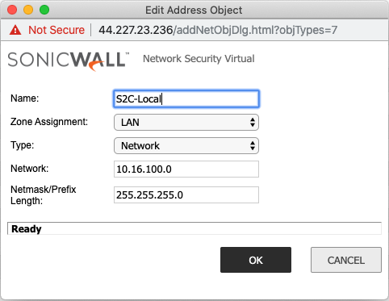
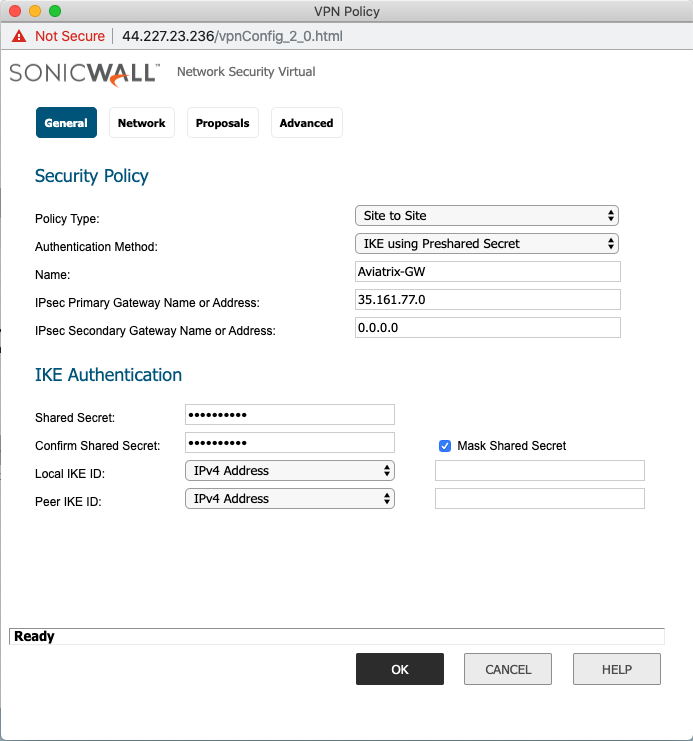
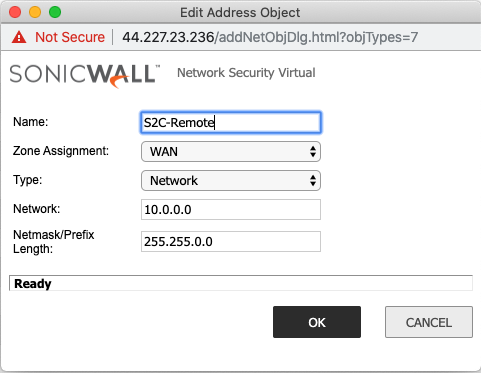
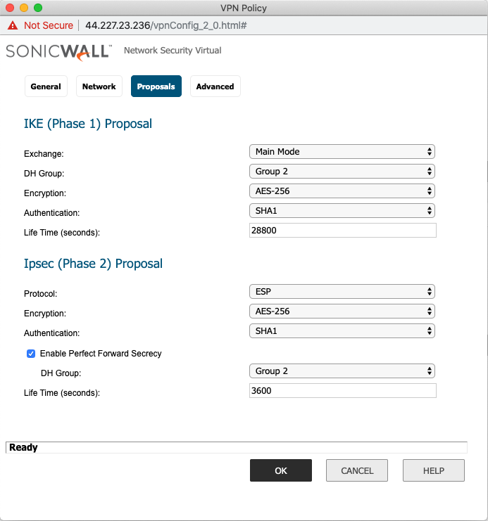
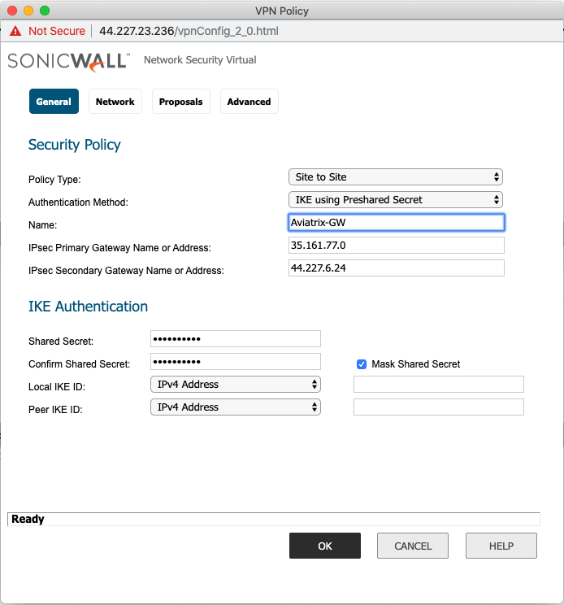

.. meta::
   :description: Site2Cloud connection between Aviatrix Gateway and Sonicwall
   :keywords: Site2cloud, site to cloud, aviatrix, ipsec vpn, tunnel, sonicwall

============================================
Aviatrix Gateway to Sonicwall
============================================

This document describes how to build an IPsec tunnel based Site2Cloud connection between Aviatrix Gateway and Sonicwall.

The network setup is as follows:

**VPC/VNet-AVX (with Aviatrix Gateway)**

    *VPC/VNet CIDR: 10.0.0.0/16*

**On-Prem (with Sonicwall)**

    *On-Prem Network CIDR: 10.16.100.0/24*
   
Creating a Site2Cloud Connection at the Aviatrix Controller
======================================================

1. Go to Gateway > New Gateway to launch an Aviatrix Gateway at the subnet (public subnet in AWS, GCP, or OCI) of VPC/VNet-AVX. Collect Gateway's public IP addresses (35.161.77.0 in this example).
2. Go to the Site2Cloud page and click **Add New** to create a Site2Cloud connection.

===============================     =================================================================
  **Field**                         **Value**
===============================     =================================================================
  VPC ID/VNet Name                  Choose VPC/VNet ID of VPC-AVX
  Connection Type                   Unmapped
  Connection Name                   Arbitrary (e.g. avx-sonicwall-s2c)
  Remote Gateway Type               Sonicwall
  Tunnel Type                       UDP
  Algorithms                        Unmark this checkbox
  IKEv2                             Unmark this checkbox
  Encryption over DirectConnect     Unmark this checkbox
  Enable HA                         Unmark this checkbox
  Primary Cloud Gateway             Select Aviatrix Gateway created above
  Remote Gateway IP Address         Public IP of Sonicwall (66.7.242.225 in this example)
  Pre-shared Key                    Optional (auto-generated if not entered)
  Remote Subnet                     10.16.100.0/24 (On-Prem Network CIDR)
  Local Subnet                      10.0.0.0/16
===============================     =================================================================

Creating Address Objects for the VPN subnets
========================================

Navigate to Network > Address Objects > click **Add**.

Creating an Address Object for the Local Network
-------------------------------------------------------------------

===============================     =================================================================
  **Field**                         **Value**
===============================     =================================================================
   Name                             Arbitrary e.g. Site2Cloud-local
   Zone                             LAN
   Type                             Network
   Network                          The LAN network range
   Network Mask/Prefix              e.g. 255.255.255.0
===============================     =================================================================

   |image0|

Creating an Address Object for the Cloud Network
---------------------------------------------------------------

===============================     =================================================================
  **Field**                         **Value**
===============================     =================================================================
Name                                Arbitrary e.g. site2cloud-cloud
Zone                                WAN
Type                                Network
Network                             The Cloud network range
Network Mask/Prefix                 e.g. 255.255.0.0
===============================     =================================================================

   |image2|

Configuring the VPN Tunnel
======================================================

Navigate to VPN > Settings > click **Add**.

On the **General** tab fill in the following fields:

===============================     =================================================================
  **Field**                         **Value**
===============================     =================================================================
Policy Type                         Site to site
Authentication Method               IKE using Preshared Secret
Name                                Arbitrary (e.g. Aviatrix-GW)
IPsec Primary Gateway Address       The public IP of the Aviatrix Gateway
IPsec Secondary Gateway Address     The public IP of the Aviatrix HA Gateway if configured
Shared Secret                       Arbitrary
Confirm Shared Secret               Re-enter Shared Secret
Local IKE ID                        Leave blank
Peer IKE ID                         Leave blank
===============================     =================================================================

   |image1|

Assigning the Local and Remote Address Objects to the Tunnel
-------------------------------------------------------------------------------

Select the **Network** tab and select the Address objects created above.

Choose local network from list: e.g. Site2Cloud-local.

1. Select the **Proposals** tab and set the IKE and IPsec values.

===============================     =================================================================
  **Field**                         **Value**
===============================     =================================================================
Exchange                            Main Mode
DH Group                            Group2
Encryption                          AES-256
Authentication                      SHA1
Life Time (seconds)                 28800
===============================     =================================================================

IPsec (Phase 2) Proposals

===============================     =================================================================
  **Field**                         **Value**
===============================     =================================================================
Protocol                            ESP
Encryption                          AES-256
Authentication                      SHA1
Enable Perfect Forward Secrecy      Mark this checkbox
DH Group                            Group 2
Life Time (seconds)                 3600
===============================     =================================================================

   |image4|

* Note - If Secondary Peer IP is configured, then Peer IKE ID must be left blank or else failover will not work properly.
   |image5|

Advanced Settings
--------------------------------

* Click the **Advance** tab.
* Mark the **Enable Keep Alive** checkbox.
* Click **OK** to save.

|image3|

.. |image4| image:: s2c_sonicwall/VPN%20Policy%202019-12-04%2012-35-26.4.png

.. disqus::
