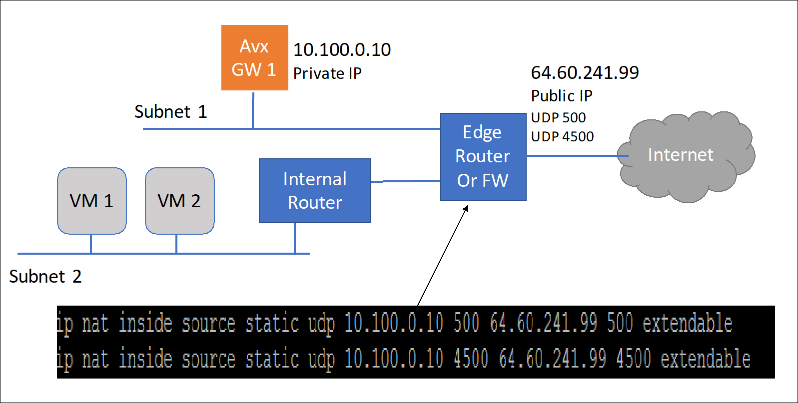
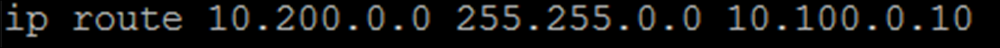
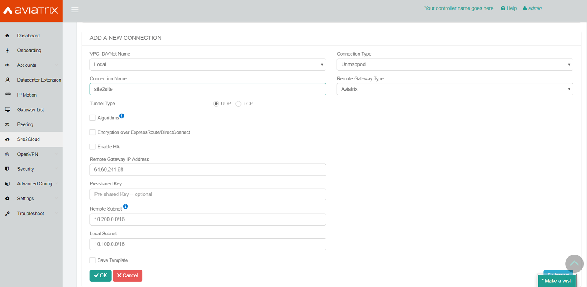
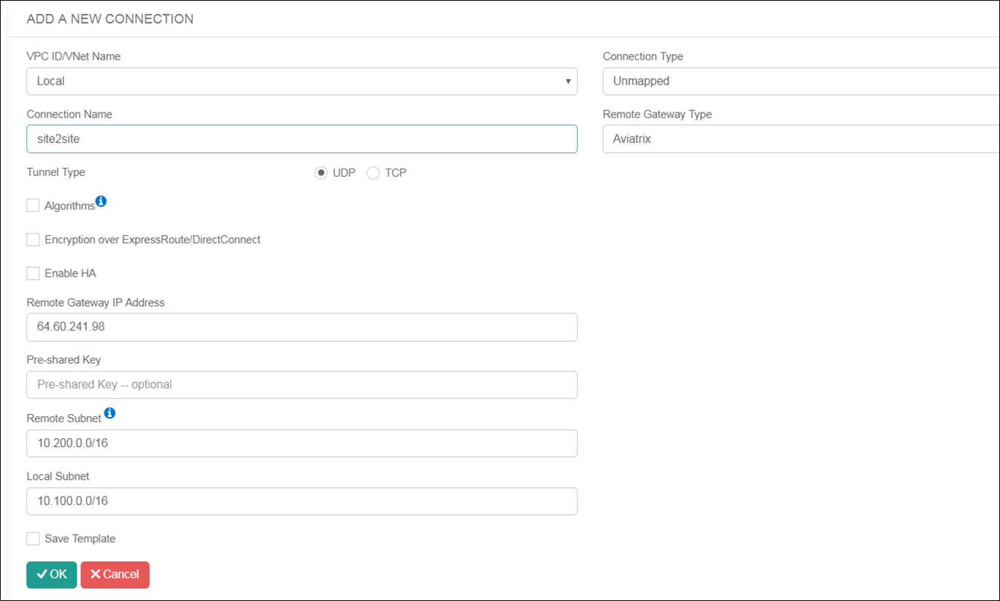
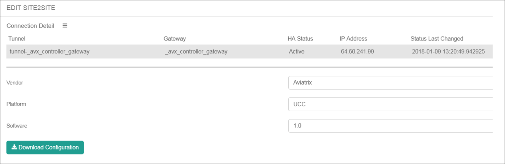
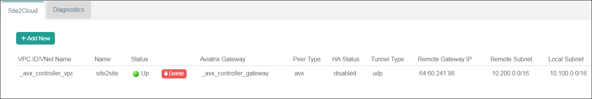



======================================================================================
Using Aviatrix to Build a Site to Site IPsec VPN Connection
======================================================================================

Aviatrix gateways can be used to connect one site to another. This solution requires one Aviatrix gateway in each location that needs to be connected. These on-premise gateways can be deployed as virtual machines on VMware, KVM or Hyper-V.

|

Environment Requirements
---------------------------------------------------------

An Aviatrix Site to Site IPSEC tunnel is accomplished by one gateway initiating the session with the other gateway. For this to work at least one of the Aviatrix virtual appliances needs to accessible via a public IP address. This can be accomplished by setting up at the public IP address on the edge router in the on-premise network and configuring NAT from that public IP address to the Aviatrix VM with a 1-1 IP address NAT. The only ports that need to be forwarded from the edge router to the VM are UDP ports 500 and 4500.

|image1|

On the other site, the second gateway does not need a public IP assigned to the Aviatrix gateway. This second gateway will reach outbound to the first Aviatrix GW (GW1)

The last requirement is to configure static routes in the internal routers (default gateway of the Aviatrix VM) in both the sites. This static route should send traffic destined to the other site to the Aviatrix GW as the next hop.

|image2|

|image3|

|

Steps to Configure IPSec connectivity
---------------------------------------------------------

+ **Step 1: Install Aviatrix gateway in each site.**

Download and install the Aviatrix Gateways VMs by following the instructions in this `document <http://docs.aviatrix.com/StartUpGuides/CloudN-Startup-Guide.html>`__

+ **Step 2: Configure Site2Cloud in Gateway 1**

.. Note:: In the Aviatrix terminology, Site2Cloud is the name of the feature that enables connections from one site (or datacenter) to other sites (including cloud environments).

..

**a.** Log into the Web UI of the first Gateway (GW1).

**b.** Click on Site2Cloud in the navigation pane.

**c.** Click on Add New Connection button.

    |image4|

**d.** Fill out the details in the Site2Cloud form as shown below.
    i. Remote Gateway IP as the public IP of the other Site
    ii. The Remote Subnet is the CIDR (or comma separated CIDRs) of the other site
    iii. Local Subnet is the CIDRs in the local site.

|image5|

**e.** Click OK. You will see the connection listed in the Site2Cloud UI.

**f.** Click on the connection from the list. You will see “Edit Site2Site” options appear under the list.

|image6|

**g.** Select Aviatrix in the Vendor dropdown.

**h.** Click on Download Configuration button. This will download a text file (.txt) to your local machine.

**i.** Log in to Gateway 2’s web UI on the other site (GW2).

**j.** Go to the Site2Cloud page

**k.** Click on Add New Connection

**l.** Locate the Import button at the bottom of the screen.

**m.** Select the text file you downloaded from the other Gateway. This will auto populate the details in the form.

**n.** Click “OK”

**o.** This will start the IPsec negotiations between both gateways. You should see the connection status change to “Up” within a few minutes.

|image7|

Please reach out to info@aviatrix.com if you have any questions.

.. |image3| image:: site_to_site_vpn_media/img_03.png
    :scale: 30%

.. disqus::    
