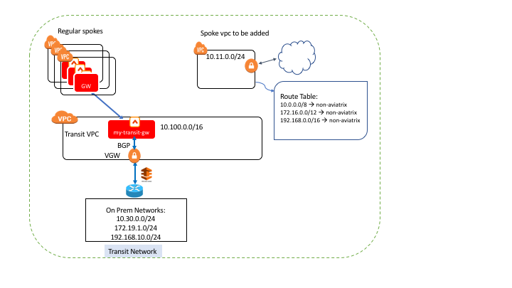
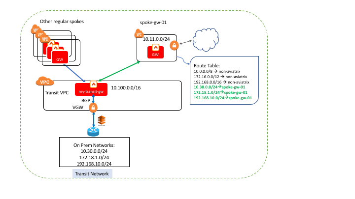



.. meta::
   :description: Deploy a spoke that skip rfc1918 route programming
   :keywords: site2cloud, VGW, AWS Global Transit Network, Aviatrix Transit Network, RFC1918

===========================================================================================
Deploying Spoke without Programming RFC1918 Routes 
===========================================================================================

When an Aviatrix Controller deploys a Spoke gateway, it programs RFC1918 routes automatically into the AWS 
route tables. 

However there are cases where the RFC1918 routes were already programmed to point to non Aviatrix instances, 
therefore, the
normal workflow does not work and requires some exception handling via APIs. 

This tech note demonstrates how to deploy an Aviatrix spoke without programming RFC1918 routes in its VPC by using
Aviatrix APIs.

|

Environment Requirements
---------------------------------------------------------

An Aviatrix Transit Network has been deployed. The spoke VPC to be connected has its route table with already programmed RFC1918 routes for other purposes.
We need to connect this spoke VPC to the Aviatrix Transit Network so that the instance in this spoke VPC can talk to the
instance of On-Prem.

|image1|

.. note::

   RFC1918 routes are 10.0.0.0/8, 172.16.0.0/12, 192.168.0.0/16

|

The following steps use an Aviatrix API to deploy a spoke attaching to a transit network but skipping RFC1918 routes programming.

Steps to Deploy A Spoke Skipping RFC1918 Route Programming
-----------------------------------------------------------

Step 1: Login to Controller with Valid Username and Password
~~~~~~~~~~~~~~~~~~~~~~~~~~~~~~~~~~~~~~~~~~~~~~~~~~~~~~~~~~~~~~~~

Example Request:

::

    # curl -k --data "action=login" --data "username=admin" --data "password=Aviatrix123!" "https://10.123.123.123/v1/api"

Example Response:

::

    {
      "return": true,
      "results": "User login:admin in account:admin has been authorized successfully — Please check email confirmation.",
      "CID": "57e098ed708a8"

    }

Step 2: Launch an Aviatrix Spoke Gateway Using API with Option skip_rfc1918
~~~~~~~~~~~~~~~~~~~~~~~~~~~~~~~~~~~~~~~~~~~~~~~~~~~~~~~~~~~~~~~~~~~~~~~~~~~~

With option skip_rfc1918 set to "yes", this new spoke gateway will not program RFC1918 routes to its VPC's route tables.

Example Request:

::

    # curl -k --data "action=create_spoke_gw" --data "CID=XXXXXXXXXX" --data "account_name=my-aws" --data "cloud_type=1" --data "region=us-west-1" --data "vpc_id=vpc-abcd123~~spoke-vpc-01" --data "public_subnet=10.11.0.0/24~~us-west-1b~~spoke-vpc-01-pubsub" --data "gw_name=spoke-gw-01" --data "gw_size=t2.micro" --data "dns_server=8.8.8.8" --data "nat_enabled=no" --data "tags=k1:v1,k2:v2" --data "skip_rfc1918=yes" "https://CONTROLLER_IP/v1/api"

Example Response:

::

    {
        "return": true,
        "results": "Successfully created Gateway spoke-gw-01. Congratulations!!"
    }

Step 3: Program Specific Routes for On-Prem Networks
~~~~~~~~~~~~~~~~~~~~~~~~~~~~~~~~~~~~~~~~~~~~~~~~~~~~~

Using Aviatrix API to program specific routes for On-Prem networks points to the new spoke gateway we just created.

.. note::

   We only need to program on-prem networks which fall into the RFC1918 scope. For NON-RFC1918 public networks, they will be automatically programmed by the Aviatrix Controller.

Example Request:

::

    # curl -k --data "action=add_routes_to_spoke_vpc" --data "CID=XXXXXXXXXX" --data "gateway_name=spoke-gw-01" --data "cidr_list=10.30.0.0/24,172.18.1.0/24,192.168.10.0/24" "https://YOUR_CONTROLLER_IP/v1/api"

Example Response:

::

    {
        "return": true,
        "results": "Successfully added routes to spoke VPC."
    }

Step 4: Attach Spoke to Transit Gateway
~~~~~~~~~~~~~~~~~~~~~~~~~~~~~~~~~~~~~~~~~

You can either use the controller UI or API to complete this step. Here the API method is given as below:

Example Request:

::

    #curl -k --data "action=attach_spoke_to_transit_gw" --data "spoke_gw=spoke-gw-01" --data "transit_gw=my-transit-gw" --data "CID=XXXXX" "https://CONTROLLER_IP/v1/api?"

Example Response:

::

    {
        "return": true,
        "results": "Successfully joined spoke-gw-01 to my-transit-gw."
    }

Now you have completed deployment of the spoke to the transit network without programming the RFC1918 in its VPC route tables.

|image2|

Step 5: Attach more Spokes to Transit Gateway
~~~~~~~~~~~~~~~~~~~~~~~~~~~~~~~~~~~~~~~~~~~~~~

If you have more spokes that you need to attach to a transit gateway in this way, repeat steps 2-4.

Step 6: Update of On-Prem Networks
~~~~~~~~~~~~~~~~~~~~~~~~~~~~~~~~~~~~~~~

Whenever any new On-Prem networks (in RFC1918 scope) are added, you need to use the API of step 3 above to program new routes
into the spoke's VPC. If any On-Prem network is removed, you need to use the following API to delete the specific route
for that network.

Example Request:

::

    # curl -k --data "action=delete_routes_from_spoke_vpc" --data "CID=XXXXXXXXXX" --data "gateway_name=spoke-gw-01" --data "cidr_list=192.168.10.0/24" "https://YOUR_CONTROLLER_IP/v1/api"

Example Response:

::

    {
        "return": true,
        "results": "Successfully deleted routes to spoke VPC."
    }

.. note::

   Only routes specified in the API that also point to the Aviatrix spoke gateway specified in the API will be deleted.

Test Connections between New Spoke and On-Prem
----------------------------------------------

Ping from any Ubuntu VM in this spoke VPC to any Ubuntu VM from On-Prem.

.. disqus::
