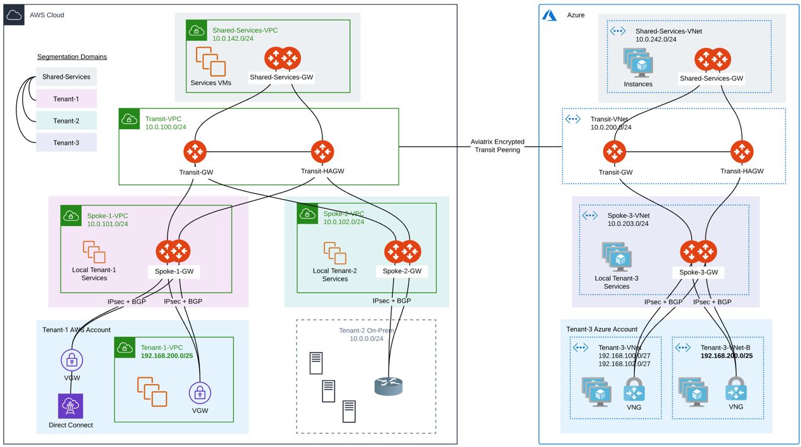
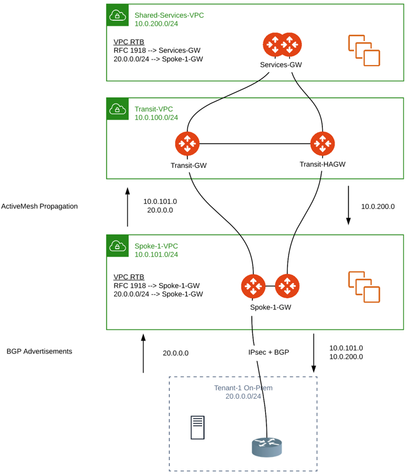

==============================================================
Aviatrix Spoke Gateway to External Devices (BGP-Enabled Spoke)
==============================================================

You can connect an external device (External (or 3rd Party) Router/Firewall) to Aviatrix spoke gateways that are enabled with BGP (and NAT).

BGP is run on top of a site to cloud (S2C) connection that terminates on active-mesh spoke gateways.

This document focuses on the External Device connecting the Aviatrix Spoke GW that is enabled with BGP.

Using BGP-enabled spoke gateways is currently supported for AWS Commercial and Azure Commercial cloud service providers, including Government regions.

.. note::

   BGP-enabled spokes are introduced in release 6.6. Spoke gateways created prior to Aviatrix release 6.6 cannot be enabled for BGP (you enable BGP at gateway creation). Rollback to release 6.5 Aviatrix gateways is not possible if there is at least one BGP-enabled Spoke Gateway.

What is a use case for connecting a BGP-enabled spoke gateway to an external router?
------------------------------------------------------------------------------------

Prior to Aviatrix release 6.6, you could enable BGP only on Aviatrix transit gateways (not spoke gateways). For software as a service (SaaS) providers with certain architectures, this meant having to deploy transit gateways for each of their tenants to enable the tenant to connect to their in-cloud network. 

By using BGP-enabled spoke gateways in their network architecture, SaaS providers can solve several requirements:

-   **Requirement**: Connect a large number of tenants \(1000+\).

    **Solution**: Distribute the tenants across Spoke Gateways, for horizontal scaling and blast radius minimization.

-   **Requirement**: Provide both dedicated tenant services, and shared services.

    **Solution**: Host dedicated services in tenant-specific Spoke VPCs. Host shared services in common Spoke VPCs.

-   **Requirement**: Onboard the tenants with BGP: dynamic control plane that fits their operational model.

    **Solution**: Terminate BGP on the tenant Spoke Gateways.

-   **Requirement**: Handle overlapping IPs across tenants, and between tenants and shared services.

    **Solution**: Use NAT on the tenant Spoke Gateways.

-   **Requirement**: Maintain isolation across tenants.

    **Solution**: Use segmentation domains on the tenant Spoke Gateways.

-   **Requirement**: Provide the highest throughput to tenant services.

    **Solution**: Horizontal scaling. Tenant services are directly hosted in the Spoke VPC where BGP terminates. They are directly accessed by tenants, without the Transit layer to be a bottleneck.

|spokegw_external_saas_sol|

How does using a BGP-enabled spoke to an external device work? 
--------------------------------------------------------------

The Aviatrix Spoke GW runs a BGP session to an external router to dynamically exchange routes. It also establishes an IPSEC tunnel to the router for packet forwarding (BGP is run over IPsec only). BGP is run on top of a S2C connection that terminates on active-mesh spoke gateways. All spoke gateways must be active mesh (no standalone gateway). Each spoke gateway must have a unique Autonomous System (AS) number.

Note the following points:

Fully integrated with ActiveMesh 2.0 control plane.

Route-based only.

Active/Active HA is supported towards ActiveMesh and towards on-prem with ECMP across multiple BGP connections. Active/Standby S2C is also supported.

Co-existence of BGP S2C with static S2C connections under the same Spoke GW is supported. 

FireNet is supported. The inspection policy is the entire Spoke Gateway including all the BGP routes (not individual S2C BGP sessions).

The following features are not supported on a BGP-enabled spoke gateway in the current (6.6) release:

-   ActiveMesh 1.0.
-   Mapped NAT.
-   Manual Spoke Encrypted peering.
-   User VPN.
-   CloudWAN.
-   Stateful Firewall.
-   Private S3.
-   Egress transit.
-   Customize Spoke VPC Routing Table.
-   Private VPC Default Route.
-   Skip Public VPC Route Table.
-   Select Route Tables upon Spoke Gateway Attachment to Transit.

The following features configured on a Transit Gateway take no effect on a Spoke VPC equipped with a BGP-enabled Spoke Gateway (they still work for any other Spoke VPC):

-   Customize Attached Spoke VPC Routing Table.
-   Exclude Learned CIDRs to Spoke VPC.

|spokegw_external_ex_arch|

Interactions with Segmentation Domains
~~~~~~~~~~~~~~~~~~~~~~~~~~~~~~~~~~~~~~

When using BGP-enabled spoke gateways, SaaS providers can use segmentation domains per spoke gateway to enforce isolation across tenants. When segmentation domains are set per BGP-enabled spoke gateway, the site to cloud (S2C) BGP connection respects the domain of the spoke gateway for traffic enforcement and route advertisement.

All S2C connections on a given spoke gateway belong to the spoke gateway domain (currently, you cannot have different S2C connections on a given spoke gateway be assigned to different domains).

In the current release:

-   BGP routes of a tenant are always advertised to all other tenants connected with S2C BGP under the same Spoke Gateway. No segmentation policies can control that. Connection Manual BGP Advertised Network List can control it.
-   BGP routes of a tenant are propagated into ActiveMesh based on the connection policies of the spoke gateway.
-   ActiveMesh routes are advertised over BGP based on the connection policies of the Spoke.

Interactions with NAT
~~~~~~~~~~~~~~~~~~~~~

In the current release, the following applies for NAT and BGP-enabled spoke gateways:

-   Customized NAT under Gateway config is supported (mapped NAT under S2C config is not currently supported).
-   S2C BGP connections are available as option in the NAT connection.
-   ActiveMesh connections are available in the NAT connection but ONLY for non-HPE spoke gateways.
-   Many:1 and 1:1 NAT are possible.
-   Active/Active HA for both gateways and S2C connections (with flow affinity) is supported.

Route Propagation
~~~~~~~~~~~~~~~~~

Spoke VPC CIDR + BGP prefixes received on the Spoke GW are propagated into ActiveMesh (Subnets outside of RFC 1918 are programmed on the VPC RTBs).

All CIDRs known to ActiveMesh (Spoke VPCs for all regions and clouds + BGP prefixes + custom advertisements, etc.) are advertised over BGP on the Spoke GW S2C BGP connections.

|bgp_spoke_route_propagation|

Connected Transit
~~~~~~~~~~~~~~~~~

The propagation of BGP routes learned on a Spoke GW to other Spoke GWs under the same Transit complies with Connected Transit.

If Connected Transit = Disabled, those routes are not propagated to other Spoke GWs under the same Transit.

In this example, 192.168.200.0/25 learned via BGP on Spoke-1-GW is not propagated to Spoke-2-GW:

|bgp_spoke_connected_transit|

How do I configure a BGP spoke gateway and connect it to external router?
----------------------------------------------------------------------------------------------

This section describes how to:

-   Create a Spoke Gateway that is BGP enabled.
-   Create the S2C BGP tunnel (build a site-to-cloud IPsec BGP attachment for the newly created spoke).
-   Configure your router with the connection details.
-   Configure additional settings.

Step 1: Create a BGP-Enabled Spoke Gateway
~~~~~~~~~~~~~~~~~~~~~~~~~~~~~~~~~~~~~~~~~~

To create a BGP-enabled spoke gateway:

.. note::

   In the current release (6.6), BGP must be enabled at the creation of the Spoke GW. Spoke GWs created pre-6.6 cannot be enabled with BGP. A Spoke GW enabled with BGP has a few restrictions compared to a non-BGP Spoke. See the section above "How does using a BGP-enabled spoke to an external device work?" for information about restrictions.

1.  Log in to the Aviatrix Controller.

2.  From the sidebar, expand the Multi-Cloud Transit option, and then select **Setup**.

3.  Click on **Spoke** at the top of the workflow page.

    The Launch an Aviatrix Spoke Gateway page opens.

4.  Specify your information in step 1 and ensure you click the **Enable BGP** checkbox also:

    -   Gateway Name: Specify the name for your spoke gateway.
    -   Region: Select the region in which you want to deploy the spoke.
    -   VPC ID:
    -   Click **Enable BGP**.

5.  Click **Create**.

6.  (Optional) Enable HA for the spoke gateway.

    When HA is enabled, a second Spoke GW will be launched. For best practice, the HA GW should be launched on a different public subnet in a different Availability Zone.

    Note: If the Spoke GW is connected to VGW, you cannot disable Spoke GW HA.

7.  Scroll back up to the top of the Launch an Aviatrix Spoke Gateway workflow page.

8.  Click **External Connection**.

    Now that you've created the Spoke Gateway, you can connect it to the external device (device in an on-prem network). In this case, you will build a site-to-cloud (S2C) BGP over IPsec connection as instructed in the next section.

Step 2: Create the S2C BGP Tunnel
~~~~~~~~~~~~~~~~~~~~~~~~~~~~~~~~~

To create the S2C BGP tunnel:

1.  In the Multi-Cloud Transit Workflow > Setup > External Connection, select **External Device**.

    You use the External Device option on the Spoke Gateway to build a BGP tunnel directly to the on-prem device for exchanging routes with a remote site.

2. Select **BGP** so that the Spoke GW runs dynamic routing with remote site.

3. Select **IPsec** to run BGP and build an IPsec connection to a remote site.

4. Specify the rest of the parameters (defined below) and click **Connect**.

Fill the parameters and click OK. For ActiveMesh design notes, check out `ActiveMesh Design Notes <https://docs.aviatrix.com/HowTos/activemesh_design_notes.html#configuration-notes>`_.

============================   ==========
**Setting**                    **Value**
============================   ==========
External Device                Select this option to build a connection to a remote site. 
BGP                            Select BGP if the Spoke GW runs dynamic routing with remote site.
Static Remote Route-Based      Select this option the remote site supports route-based VPN with static configuration.
IPsec                          Select this option to run BGP and build a IPSEC connection to a remote site.
Transit VPC Name               The Transit VPC ID where Transit GW was launched.
Connection Name                A unique name to identify the connection to external device. 
Aviatrix Gateway BGP ASN       The BGP AS number the Spoke GW will use to exchange routes with the external device.
Primary Aviatrix Gateway       The Spoke GW you created.
Algorithms                     Optional parameters. Leave it unselected if you don't know.
IKEv2                          Select the option to connect to the remote site using IKEv2 protocol.
Enable Remote Gateway HA       Select HA if there are two external devices. 
Over Private Network           Select this option if your underlying infrastructure is private network, such as AWS Direct Connect and Azure Express Route. See "How does it work" section for more details. When this option is selected, BGP and IPSEC run over private IP addresses.
BGP Remote AS Number           When BGP is selected, the BGP AS number the external device will use to exchange routes Aviatrix Spoke GW.
Remote Gateway IP              IP address of the remote device. 
Pre-shared Key                 Optional parameter. Leave it blank to let the pre-shared key to be auto generated. 
Local Tunnel IP                Optional parameter. This field is for the tunnel inside IP address of the Spoke gateway. Leave it blank.  
Remote Tunnel IP               Optional parameter. This field is for the tunnel inside IP address of the External device. Leave it blank. 
Over Private Network(Backup)   Select this option if HA is enabled. 
BGP Remote ASN (Backup)        When BGP is selected, the remote ASN for backup should be the same as the primary remote ASN. 
Remote Gateway IP (Backup)     IP address of the remote device. If "Private Network" is selected, enter the private IP address of the external device.
Pre-shared Key (Backup)        Optional parameter. Leave it blank to let the pre-shared key to be auto generated. 
Local Tunnel IP (Backup)       Optional parameter. This field is for the tunnel inside IP address of the Spoke gateway. Leave it blank.  
Remote Tunnel IP (Backup)      Optional parameter. This field is for the tunnel inside IP address of the External device. Leave it blank. 
============================   ==========

Step 3: Configure the external device
~~~~~~~~~~~~~~~~~~~~~~~~~~~~~~~~~~~~~

To configure the external device:

1.  From the sidebar, expand the Site2Cloud option, and then select **Setup**.

    From the list of connections, take note that the Status of the connection you created to the external device is Down.

2.  From the table, click on the name of the connection you created to the external device (for example, Spoke-S2C-IPsec-T2Router) and then click **Edit**.

    The Connection Detail page opens.

3.  For Vendor, select the device you are using (any device that is capable of running IPsec and BGP).

    (For example, **Cisco**.)

4.  For Platform, select the applicable platform for the chosen device.

    (For example, **ISR, ASR, or CSR**.)

5.  Click **Download Configuration**.

    Open the downloaded Aviatrix Site2Cloud configuration template. 

6.  Apply the following changes on your external device configuration (for example, on your CiscoASA) to configure the on-prem device with IPSEC tunnel and BGP:

    Crypto Policy Number

    Tunnel Number with Tunnel Source

    Make similar changes on the configuration of the backup tunnel. 

    |spokegw_bgp_external_device_config| 

Step 4: Verify status of connection is UP
~~~~~~~~~~~~~~~~~~~~~~~~~~~~~~~~~~~~~~~~~

(Verify status of connection is Up) After configuring the router, the tunnel should change the status from down to up. Go back to the controller Site2Cloud option Setup page and click the refresh icon. Verify the status of your connection is now Up.

Step 5: Verify the BGP routes
~~~~~~~~~~~~~~~~~~~~~~~~~~~~~

(To verify the BGP routes) On the controller, from the sidebar, expand the Multi-Cloud Transit option and then select **BGP**. Under Diagnostics, select the Gateway name (of the BGP-enabled spoke). From the predefined show list, select **show ip bgp** to verify the BGP Routes.

Step 6: Customize spoke advertised VPC CIDRs
~~~~~~~~~~~~~~~~~~~~~~~~~~~~~~~~~~~~~~~~~~~~

You can customize spoke advertised VPC CIDRs for your BGP-enabled spoke gateway. The CIDRs are propagated into ActiveMesh and into BGP as belonging to the Spoke Gateway shown in the example. 

The actual Spoke VPC CIDR is not advertised by default, but you can add it to the list.

ActiveMesh propagation: those CIDRs are combined with the BGP prefixes received on the S2C BGP connection(s) of the Spoke GW.

BGP advertisement: those CIDRs are combined with all other ActiveMesh CIDRs from the Aviatrix transit.

|spokegw_external_custom_adv_cidrs|

Step 7: Set Up approval for gateway learned CIDR
~~~~~~~~~~~~~~~~~~~~~~~~~~~~~~~~~~~~~~~~~~~~~~~~

You can set up approval for gateway learned CIDRs for your BGP-enabled spoke gateways. You must select Gateway mode (connection-level route approval is currently not supported). Route approval completely blocks a BGP prefix to even be considered by the control plane. Prefixes blocked are not programmed in the gateway route table.

|bgp_spoke_learned_cidr_appr|

Step 8: Set Up BGP Route Control
~~~~~~~~~~~~~~~~~~~~~~~~~~~~~~~~

1.  From the sidebar, expand the Multi-Cloud Transit option, and then select **Advanced Config**.

2.  At the top of the page, click  **Edit Spoke**.

3.  Select the BGP enabled spoke gateway.

4.  Specify the parameters to suit your business requirements (they are similar to BGP controls on transit gateways):

    Local AS Number  
    
    BGP ECMP
    
    Active-Standby
    
    Gateway Manual BGP Advertised Network List 

    Connection Manual BGP Advertised Network List 

(Disconnect) To disconnect the external device
~~~~~~~~~~~~~~~~~~~~~~~~~~~~~~~~~~~~~~~~~~~~~~

To disconnect the external device from the BGP-enabled Spoke GW:

1.  Log in to Aviatrix Controller.

2.  From the sidebar, expand the Multi-Cloud Transit option, and then select **Setup**.

3.  In the Multi-cloud Transit Network Workflow page, click the **Detach** option.

4.  In Aviatrix Spoke Gateway, select the Spoke GW you created from the list menu.

5.  Click **Detach**.

.. disqus::
