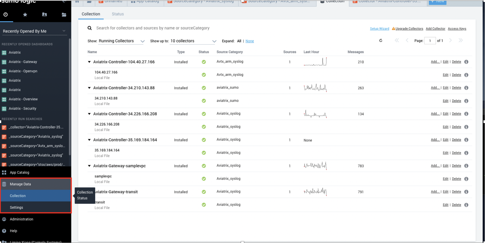
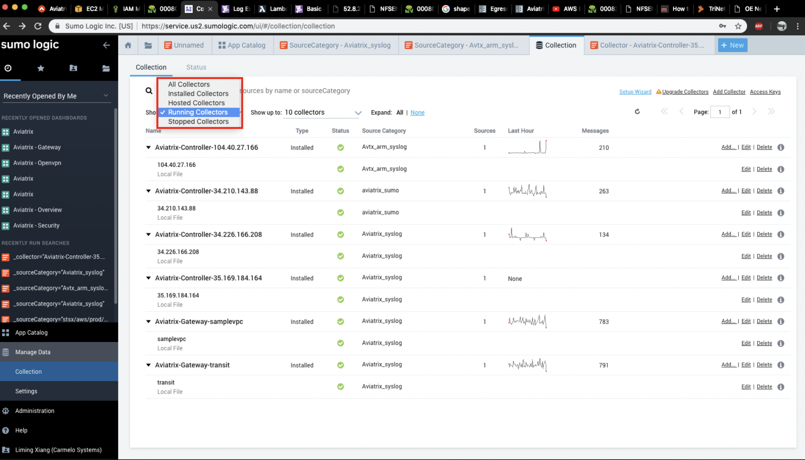
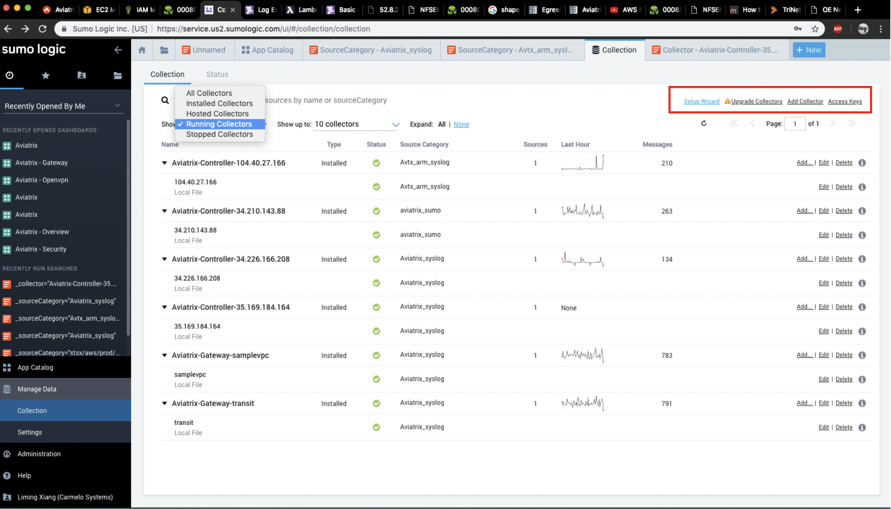
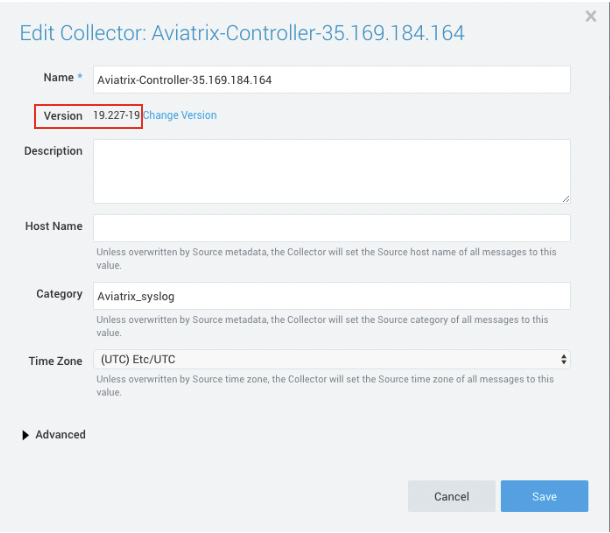
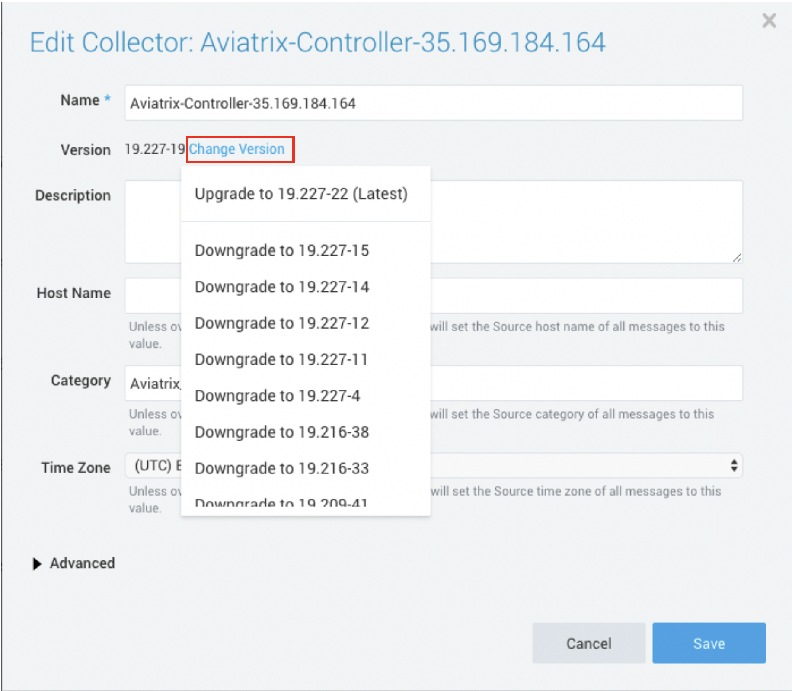

.. raw:: html

    <meta name="robots" content="noindex, nofollow, noarchive, nosnippet, notranslate, noimageindex">
====================================================================================================================================================================================
Steps to check the version of SumoLogic Collectors on the Sumologic Servers(UI) and also Upgrade/Downgrade the version of the Collectors from the WebUI of Sumologic Servers
====================================================================================================================================================================================

1: Login to the Sumologic server
    a.	On the left pane Click on manage Data and then Collection
    b.	You will be displayed the Controllers/gateways you are running

    |image1|

2.Click -> Show ->Running Collectors
     Note: Upgrade wont work if your Controller/Gateway is not running.

    |image2|

3. On the top right there is an option to upgrade all the Collectors. It will upgrade the collectors on all the Gateways and Controllers running.

    |image3|

4. If you want to know the version running on the individual collectors follow the below steps:
     a. Click on the individual Collector (either gateway or Controller).
     b. You will be displayed the Version number running on individual Collector.

    |image4|

5. To change the version or upgrade the version only on one particular Collector click on change version as shown below and then upgrade/downgrade to the version as per your requirement.

    |image5|

