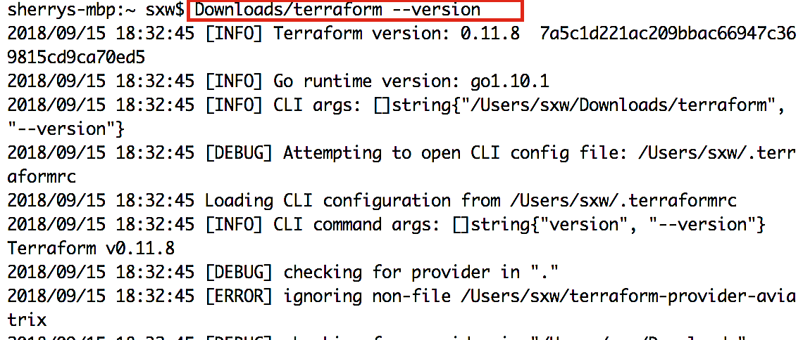

.. meta::
   :description: Aviatrix Terraform provider tutorial
   :keywords: AWS, Aviatrix Terraform provider, VPC, Transit network

===========================================================================================
Aviatrix Terraform Tutorial
===========================================================================================

This document will walk you through the steps to make use of the Aviatrix Terraform provider. As an example, an Aviatrix gateway will be launched.
It is assumed that Terraform is already set up. If so, skip steps 1 and 2.

1. Download Terraform Package
-------------------------------------

Terraform is delivered as a zip file in binary. Click `here <https://www.terraform.io/downloads.html>`_, select your respective OS and simply download the package as you would for any software.

For Mac, Terraform is also present in `Homebrew <https://brew.sh/>`_. Perform ``brew install terraform`` to install Terraform (Skip step 2 if done this way).

Once it is downloaded, double click to unzip the file. The executable file terraform should be
in your Downloads folder. (This will be used as an example in this document)

For Unix systems, open a terminal, type the command ``./Downloads/terraform --version``, and you should see output similar to the following image:

|setup_tf|

For Windows, the command is ``terraform.exe --version``

2. Setup Execution Path (only when not using package manager)
------------------------------

If you are running the Terraform binary file after simply downloading it, you will need to execute it using the full path.

Assuming it's downloaded into your ``$HOME/Downloads`` directory, run

::

  $ ~/Downloads/terraform

3. Download and Install Go
----------------------------------

Aviatrix Terraform Provider requires you to download Go, the software that the Terraform Provider is written in.

Follow the instructions listed `here <https://golang.org/doc/install>`_ to download and install Go, as shown below:

|go_install|

For Mac, Go is also present in `Homebrew <https://brew.sh/>`_. Perform ``brew install go`` to install Go.

4. Download and Build Aviatrix Terraform Provider
-------------------------------------------------------

After you have installed Go, follow the steps below:

4.1 Create a directory go, setup `GOPATH <https://github.com/golang/go/wiki/SettingGOPATH>`_.

Example for Unix/Linux:
::

  $ cd
  $ mkdir go
  $ export GOPATH=$HOME/go

Line 3 can also be made permanent:
Edit ~/.bash_profile by appending line "export GOPATH=$HOME/go", and then run the command ``source ~/.bash_profile`` for the GOPATH path to take effect.

For Windows, GOPATH and other environment variables can be edited from System Properties.

4.2 Download the `Aviatrix Terraform Provider repo <https://github.com/golang/go/wiki/SettingGOPATH>`_:

::

  $ mkdir -p $GOPATH/src/github.com/terraform-providers
  $ cd $GOPATH/src/github.com/terraform-providers
  $ git clone https://github.com/AviatrixSystems/terraform-provider-aviatrix

To clone on Windows:

::

  mkdir %GOPATH%\src\github.com\terraform-providers\terraform-provider-aviatrix
  cd %GOPATH%\src\github.com\terraform-providers\terraform-provider-aviatrix
  git clone https://github.com/AviatrixSystems/terraform-provider-aviatrix

4.3 Build the Provider:

::

  $ cd $GOPATH/src/github.com/terraform-providers/terraform-provider-aviatrix
  $ make fmt
  $ make build

to build on Windows, run:

::

  cd %GOPATH%\src\github.com\terraform-providers\terraform-provider-aviatrix
  go fmt
  go install

4.4 Activate the Provider by adding the following to ~/.terraformrc. If the file ~/.terraformrc does not exist, you need to create one by adding the text below:

::

  providers {
    "aviatrix" = "$GOPATH/bin/terraform-provider-aviatrix"
  }

For Windows, the file should be at '%APPDATA%\terraform.rc'. Do not change $GOPATH to %GOPATH%

5. Prepare Aviatrix Controller
--------------------------------

Follow the `Aviatrix Controller Startup Guide <https://docs.aviatrix.com/StartUpGuides/aviatrix-cloud-controller-startup-guide.html>`_ to launch a Controller and go through the Onboarding process.

Once Onboarding is completed, a `primary account <https://docs.aviatrix.com/HowTos/onboarding_faq.html#what-is-the-aviatrix-primary-access-account>`_ should be created. This primary account will be used to launch a gateway.

Create a Terraform configuration file, for example, "aviatrix_gateway_test.tf", copy and paste the
the below text into the file. Be sure to modify the parameters to suit your environment accordingly.

::

  # specify aviatrix as the provider with these parameters:
  # controller_ip - public IP address of the controller
  # username - login user name, default is admin
  # password - password

  provider "aviatrix" {
      controller_ip = "35.5.26.157"
      username = "admin"
      password = "ControllerPSWD#"
  }

  # Launch a gateway with these parameters:
  # cloud_type - Enter 1 for AWS. Only AWS is currently supported.
  # account_name - Aviatrix account name to launch GW with.
  # gw_name - Name of gateway.
  # vpc_id - AWS VPC ID.
  # vpc_reg - AWS VPC region.
  # vpc_size - Gateway instance size
  # vpc_net - VPC subnet CIDR where you want to launch GW instance

  resource "aviatrix_gateway" "testGW" {
      account_name = "for-create2"
      cloud_type = 1
      gw_name = "testGW1"
      vpc_id = "vpc-01dd5643eca66486c"
      vpc_reg = "us-west-2"
      vpc_size = "t2.micro"
      vpc_net = "172.34.0.0/24"
  }

6. Run the Terraform Configuration
-----------------------------------

In the directory where the Terraform configuration file resides, run ``terraform init`` command to prepare the new configuration file.

::

  $ terraform init

Then run ``terraform plan`` command to see what will be executed.

::

  $ terraform plan

Finally, run ``terraform apply`` command to launch the gateway.

::

  $ terraform apply

When the above command finishes, you can login to your Aviatrix Controller console, navigate to the Gateway page and see that the new gateway with the name "testGW1" has been successfully launched.

7. Simple Troubleshooting
--------------------------

A simple Terraform debug method is to set TF_LOG level in ~/.bash_profile, as shown in the below example (remember to run command ``source ~/.bash_profile`` after editing .bash_profile):

::

  export TF_LOG=TRACE

With this log set to TRACE, you should see TRACE and ERROR when running Terraform commands. Pay attention to ERRORs if a Terraform command is not successful.

8. More Examples
-----------------

To see what resources are provided, check out `Aviatrix Terraform Provider <https://docs.aviatrix.com/HowTos/aviatrix_terraform.html>`_.

To see more examples, read on `Setup Aviatrix Transit Network with Terraform <https://docs.aviatrix.com/HowTos/Setup_Transit_Network_Terraform.html>`_.

9. Contribute to the Community
--------------------------------

Aviatrix Terraform Provider is an `open source project <https://github.com/AviatrixSystems/terraform-provider-aviatrix>`_. All reviews, comments and contributions are welcome.

Enjoy!

.. |go_install| image:: tf_aviatrix_howto_media/go_install.png
   :scale: 30%

.. disqus::
