.. meta::
   :description: Aviatrix Terraform Export Feature
   :keywords: AWS, Aviatrix Terraform provider, terraform, terraform provider, api

===========================================================================================
Aviatrix Terraform: Export
===========================================================================================

This document will walk you through how the Aviatrix's Terraform Export feature works.
It is assumed that the user has experience using Terraform, and has the Aviatrix Terraform
Provider set up.

To learn more about Terraform, click `here <https://www.terraform.io/intro/index.html>`_.

To learn how to set up the Terraform environment for Aviatrix, click `here <https://docs.aviatrix.com/HowTos/tf_aviatrix_howto.html>`_.

Aviatrix Terraform resource and data source documentation may be found `here <https://docs.aviatrix.com/HowTos/aviatrix_terraform.html>`_.

Further questions? Please visit our Support Center for Terraform `here <https://docs.aviatrix.com/Support/support_center_terraform.html>`_.

Use Case:
---------------------------

The Aviatrix Terraform Export feature allows users to export their current Controller
configurations (resources) into Terraform files (``.tf``) and import them into their
Terraform environment, facilitating an easy transition to using Terraform to manage
their infrastructure.

**DISCLAIMER :** Export functionality is only available on Controller v4.3+ and is
currently in beta and does not support every resource and its complete functionality.

Example:
---------------------------

In this example, we will use VPN profiles that were created through the Controller
and export them into ``.tf`` files for an easy import into our Terraform environment.

Step 1
  Assume we have the following VPN profiles already created (pictured below), prior to the transition
  to using Terraform for infrastructure management.

  |profile1_in_controller|

  |profile2_in_controller|

Step 2
  In order to bring in existing resources into the environment for Terraform management,
  we must use ``terraform import``.

  The current implementation of Terraform import
  can only import resources into the state, but does not generate a configuration file
  (see HashiCorp's documentation `here <https://www.terraform.io/docs/import/index.html>`_
  regarding this issue.)

  This is where Aviatrix's Terraform Export feature is used. We can use this
  feature to generate not only the necessary configuration files, but also a shell script
  with the necessary commands to automatically import those existing resources for you.

  Simply navigate with the sidebar: **Useful Tools** > **Export to Terraform**.
  Under the **Exporter** column, click the **Download TF** button for the corresponding
  resource(s) you want to export.

  .. note::

    If you have multiple resources or want to manage your entire infrastructure through Terraform,
    you may export your entire current configuration by clicking the **Download All** button
    located in the top right corner of the page.

  In our case, we will select *vpn_profile* and download the zip file.

  |how_to_export|

Step 3
  Navigate to the directory where the zip was downloaded to and unzip the file.
  There should be a folder with 2 files:
    ``vpn_profile.tf`` and
    ``vpn_profile_import.sh``

  If we open ``vpn_profile.tf``, we can see that the exact configurations as seen
  on the Controller are properly exported into the ``.tf`` file.

  |profile1_tf|

  |profile2_tf|

Step 4
  For simplicity's sake, we will use this folder/ directory as the Terraform environment to manage
  our VPN profiles. If you prefer to set up your overall infrastructure differently,
  feel free to move those 2 files into your preferred directory before proceeding.

  If you have not already, create a ``provider.tf`` as seen below, providing your
  Aviatrix Controller credentials.

  (This can also be specified in the ``vpn_profile.tf``
  instead, but as best practice, it is better to decouple components, especially credentials,
  from your variable or configuration files):

  |provider_tf|

Step 5
  In your preferred directory, in order to initialise the directory as a Terraform
  environment, run: ``terraform init``.

  Then run the shell script with the command: ``sh vpn_profile_import.sh``

  |import_profile|

Step 6
  Congratulations! Your *vpn_profile(s)* have been successfully imported into
  Terraform and can now be easily managed through code.

  You may verify that configured files are the same as our Controller configuration
  by running ``terraform plan`` to catch deltas between our local Terraform state
  and the Controller state. You may use ``terraform show`` to see your state.

  |verify_import1|

  |verify_import2|

Addendum
---------------------------
Now managing your *vpn_profile(s)* is as simple as modifying your exported ``vpn_profile.tf``
file and doing ``terraform plan`` to see your changes, and ``terraform apply`` to
implement those changes. Changes can range from modifying existing profiles, removing them or
adding new ones.

As seen below, continuing from our above example, we are changing *vpn_profile_1* and removing one of the policies, and
adding a new profile in ``vpn_profile.tf``.

|edit_profile_tf1|

|edit_profile_tf2|

Going back to Terminal, by simply doing a ``terraform plan`` (1st picture), we see that Terraform detects
the changes we want to make. If we are satisfied with these changes, we can go ahead and do
``terraform apply`` (2nd picture).

|terraform_apply_edit1|

|terraform_apply_edit2|

We can again verify these new changes by doing a ``terraform plan`` to catch deltas
between our new state and the Controller state, as well as a ``terraform show`` to view
the state.

|terraform_apply_verify1|

|terraform_apply_verify2|

We can also go to the Controller and confirm that a new profile, *profile Name3*, has indeed
been created, and the edit to *profile Name1* has been implemented.

|terraform_apply_verify3|

|terraform_apply_verify4|

The steps described in the **Addendum** can be applied and used for management of any supported resource
in their respective ``.tf`` file(s).

.. Image Gallery References
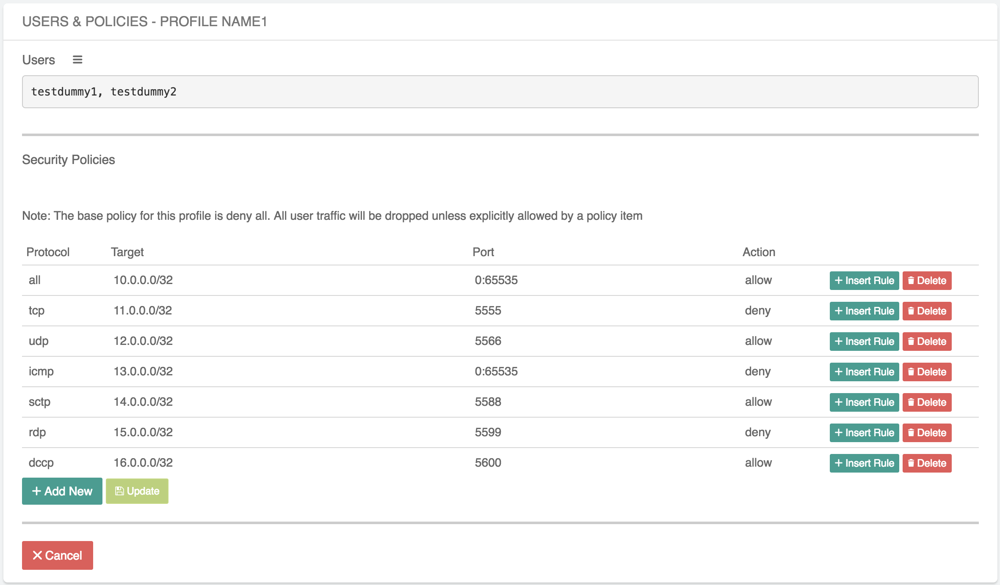
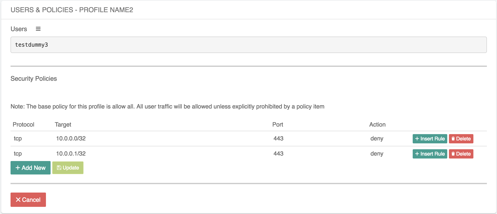

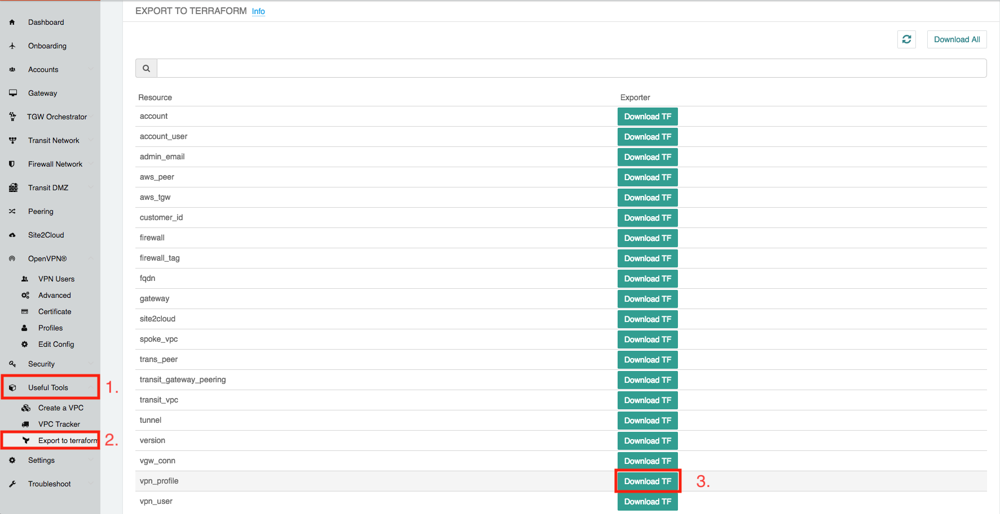

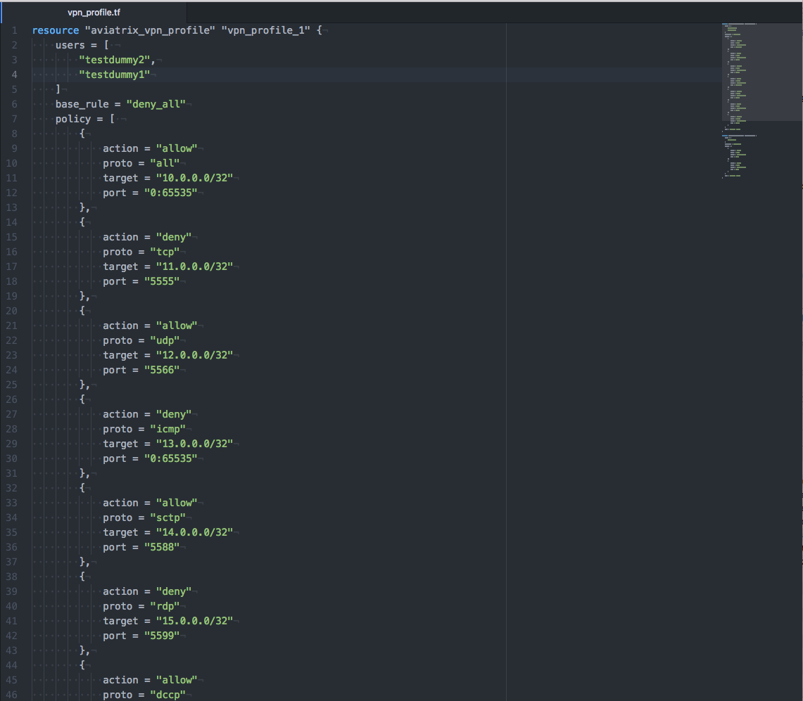
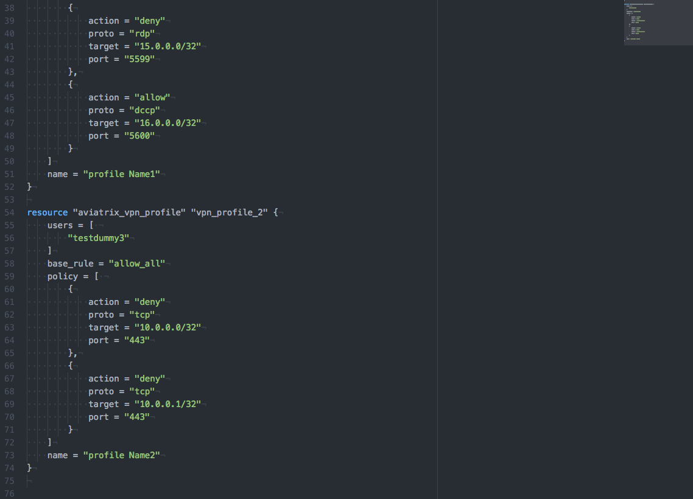

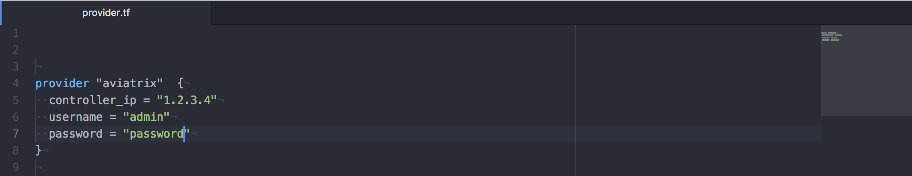

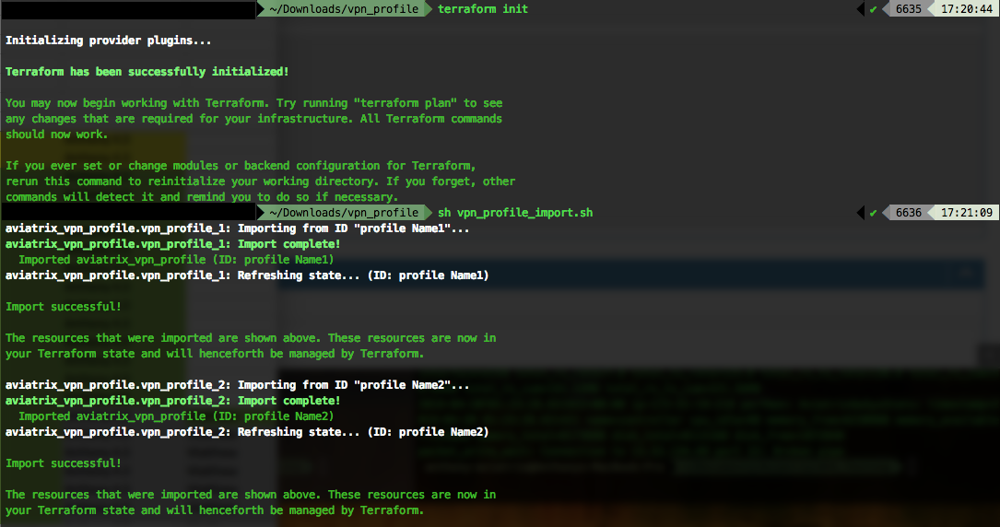

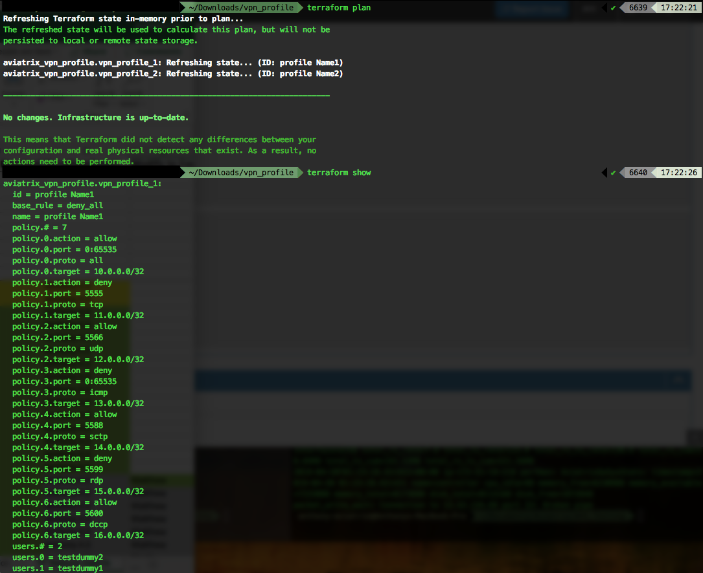
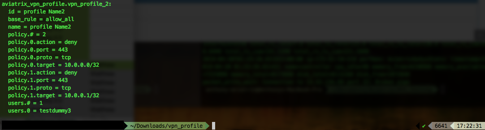

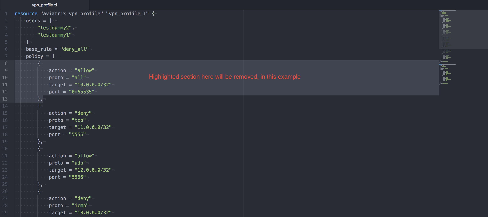
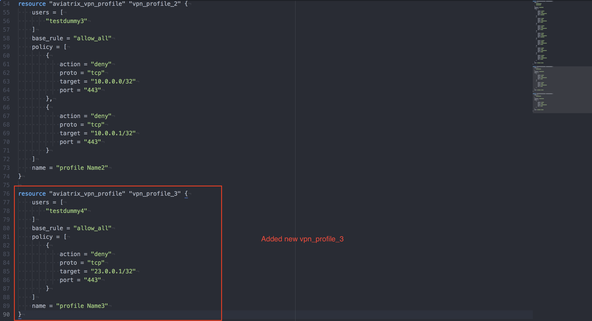

.. |terraform_apply_edit1| image:: tf_export_media/terraform_apply_edit1.png
   :scale: 100%
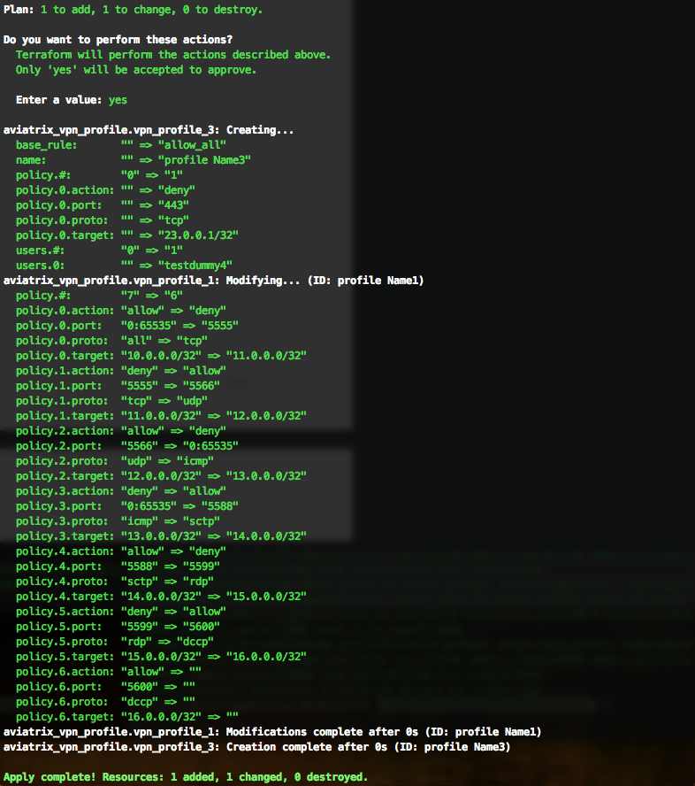

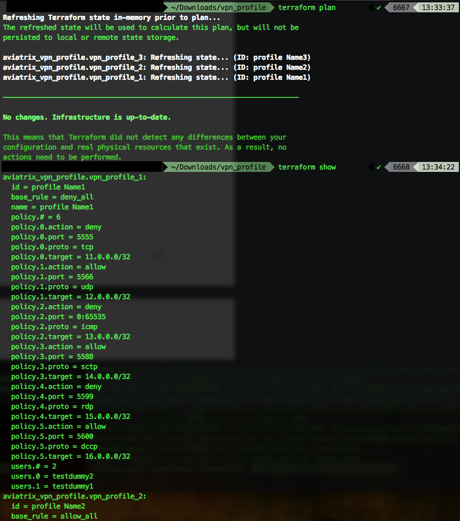
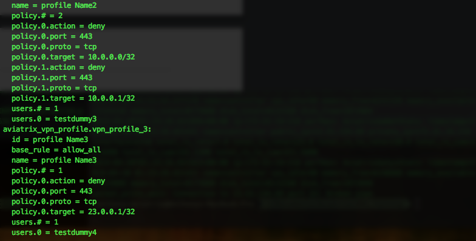
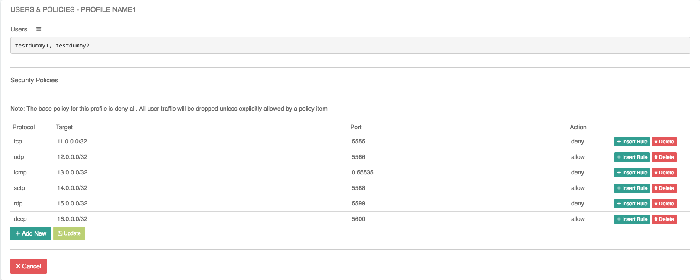
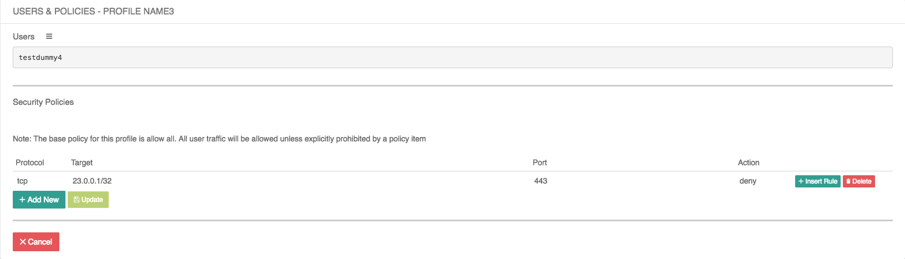

.. disqus::
