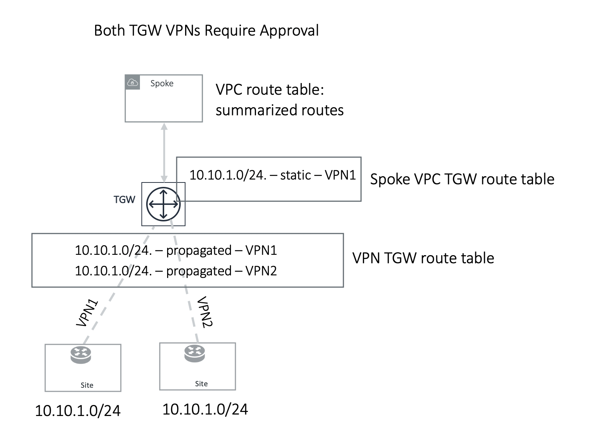
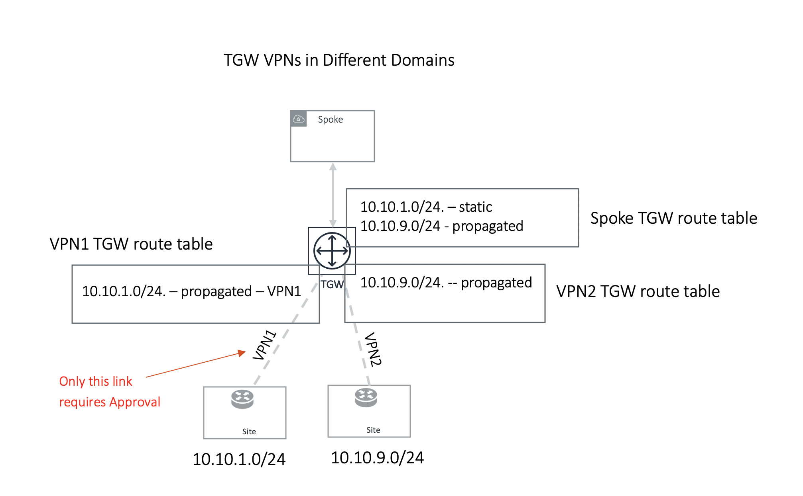

.. meta::
  :description: TGW Orchestrator Overview
  :keywords: Transit Gateway, AWS Transit Gateway, AWS TGW, TGW orchestrator, Aviatrix Transit network

============================================================
TGW Approval
============================================================

TGW VPN and TGW DXGW dynamically learn BGP routes from remote peering. The Aviatrix Controller periodically pulls the TGW 
route table and propagates these routes to the Spoke VPCs route table that has connection policies to the VPN. 

There may be scenarios where you require an approval process before the learned CIDRs propagation take place. 
For example, a specific TGW VPN may be connected to a partner network and you need to make sure undesirable routes, such as the default route (0.0.0.0/0) are not 
propagated into your own network and accidentally bring down the network.  

|tgw_approval|

Approval is enabled on a per TGW VPN and TGW DXGW basis. When Approval is enabled on a TGW VPN, 
dynamically learned routes trigger an email to the Aviatrix Controller admin. The Controller admin can log in into the Controller and navigate  to
**TGW Orchestrator > Approval**. Here, the admin sees the unapproved and already approved routes. Moving the routes from the Pending Learned CIDRs list to the Approved Learned CIDRs list allows those routes to be propagated. 

To enable Approval, go to **TGW Orchestrator > Approval**. Select the TGW and VPN/DXGW, and toggle **Learned CIDRs Approval** to Enabled.

How does it work?
---------------------

<<<<<<< Updated upstream
When the Approval feature is enabled, TGW route table route propagation to connected network domains is turned
off. That is, the TGW VPN/DXGW learned routes are statically programmed into the TGW route table of 
connected network domains after the routes are approved. 
=======
When Approval feature is enabled, TGW route table route propagation to the connected network domain is turned
off. That is, the TGW VPN/DXGW learned routes are statically programmed into the TGW route table of 
connected network omains after the routes are approved. 
>>>>>>> Stashed changes

This is illustrated in the following two examples. 

Example 1: Two TGW VPN/DXGW in the same domain
^^^^^^^^^^^^^^^^^^^^^^^^^^^^^^^^^^^^^^^^^^^^^^^^

|tgw_two_vpn_approval|

In the example above, two identical VPN CIDRs 10.10.1.0/24 are advertised to two TGW VPNs but are in the 
same domain. Both have Approval enabled. 
Whichever VPN attachment learns the CIDR first and is approved, its attachment is 
programmed into Spoke associated
TGW route table, in this case, VPN1 attachment is approved first and is programmed into the Spoke associated 
TGW route table. VPN2 CIDR should continue to remain in pending list. If VPN1 
withdraw route 10.10.1.0/24, you can initiate approval by moving the VPN2 pending CIDR to 
the approved panel, and this time it should be programmed. 

Example 2: One TGW VPN requires approval and another one does not
^^^^^^^^^^^^^^^^^^^^^^^^^^^^^^^^^^^^^^^^^^^^^^^^^^^^^^^^^^^^^^^^^^

|tgw_vpn_different_domains|

In the second example, TGW VPN2 link 10.10.9.0/24 is in a different domain and does not require
approval. Its route  is propagated to the Spoke TGW route table, 
while TGW VPN1 link 10.10.1.0/24 is statically 
programmed to Spoke TGW route table after approval is initiated by the customer. 

Note in the second example, if TGW VPN2 link advertises the same network CIDR 10.10.1.0/24, this CIDR will be propagated first and TGW VPN1 approval request will be rejected and the CIDR 10.10.1.0/24 from 
TGW VPN1 remains in the approval pending list. 

.. |tgw_approval| image:: tgw_overview_media/tgw_approval.png
   :scale: 30%

.. disqus::
