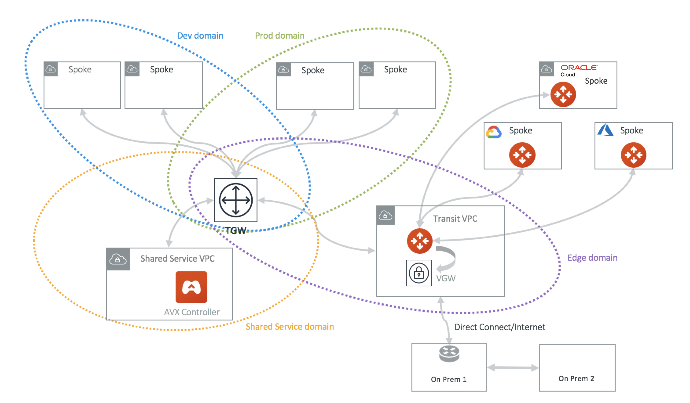

.. meta::
  :description: TGW Orchestrator Overview
  :keywords: Transit Gateway, AWS Transit Gateway, AWS TGW, TGW orchestrator, Aviatrix Transit network

============================================================
TGW Approval
============================================================

TGW VPN and TGW DXGW dynamically learns BGP routes from remote peer, Aviatrix Controller periodically pulls the TGW 
route table and propagate these routes to Spoke VPCs route table that have connection policy to the VPN. 

There are scenarios where you require an approval process before these learned CIDRs propagation take place. 
For example, a specific TGW VPN may be 
connected to a partner network and you need to make sure undesirable routes, such as the default route (0.0.0.0/0) are not 
propagated into your own network and accidentally bring down the network.  

|tgw_approval|

Approval is enabled on per TGW VPN and TGW DXGW bases. When Approval is enabled on a TGW VPN, 
dynamically learned routes trigger an email to the Controller admin. Controller admin logins in to the Controller and go to
TGW -> Approval, the admin should see the routes, both unapproved and already approved. Moving the routes from  
Pending Learned CIDRs panel to Approved Learned CIDRs panel allows those routes to be propagated. 

To enable Approval, go to TGW -> Approval. Select the TGW and VPN/DXGW, click Learned CIDRs Approval to enable. 

Design Considerations
-------------------------

TGW VPN/DXGW associated TGW route tables are automatically programmed when a new routes is learned by TGP BGP. In the current design, the corresponding TGW route
tables whose Security Domains are connected with the VPN/DXGW associated Security Domains are also auto propagated using the TGW route propagation capability. 

Therefore it is important these auto propagated routes do not overlap, or else packets may be routed to incorrect destinations.

.. important::

  When TGW Approval is enabled on a TGW, summary routes (the RFC-1918 routes) are not programmed into the attached Spoke VPC route tables. Instead, specific route entries are programmed into the VPC route table. If more than 50 route entries are anticipated, please make support request to AWS to allow for more route entries. Up to 1000 route entries can be requested. 

When Approval is disabled, all dynamically learned routes are automatically propagated to the Spokes. 

.. |security_domain| image:: tgw_overview_media/security_domain.png
   :scale: 30%

.. |domain_policy_diagram| image:: tgw_overview_media/domain_policy_diagram.png
   :scale: 30%

.. |tgw_view| image:: tgw_overview_media/tgw_view.png
   :scale: 30%

.. |tgw_transit_vpc_compare| image:: tgw_overview_media/tgw_transit_vpc_compare.png
   :scale: 30%

.. |tgw_transit_orchestrator_compare| image:: tgw_overview_media/tgw_transit_orchestrator_compare.png
   :scale: 30%

.. |edge_segmentation| image:: tgw_overview_media/edge_segmentation.png
   :scale: 30%

.. |tgw_approval| image:: tgw_overview_media/tgw_approval.png
   :scale: 30%

.. disqus::
