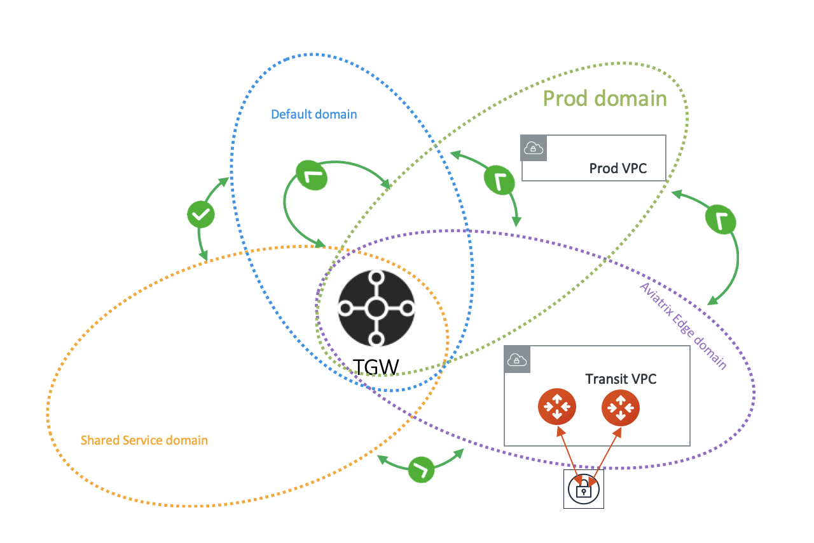
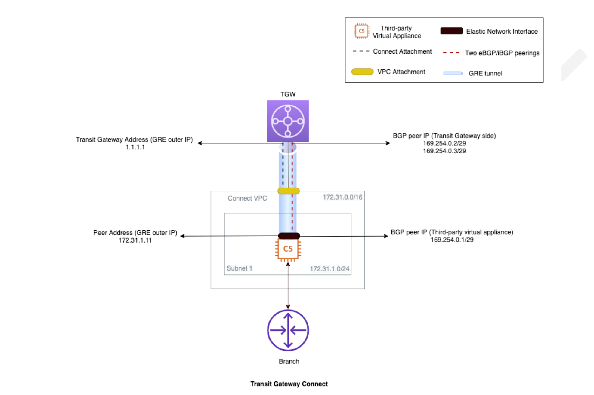

.. meta::
  :description: TGW Build
  :keywords: AWS Transit Gateway, Transit Gateway, AWS TGW, TGW orchestrator, Aviatrix Transit network, TGW Build

=========================================================
TGW Build
=========================================================

At the Build stage, you attach VPCs to an AWS Transit Gateway (TGW) and security domain. Each VPC can only be attached to one security domain. 

The AWS Transit Gateway (TGW) Orchestrator Build workflow is a one step instruction to attach a VPC to an AWS Transit Gateway and a security domain.

For background information, refer to the `TGW Orchestrator FAQ <https://docs.aviatrix.com/HowTos/tgw_faq.html>`_.

Before you can attach VPCs, you must have at least completed `Step 1 <https://docs.aviatrix.com/HowTos/tgw_plan.html#create-aws-tgw>`_ in Plan page. 

1. Attach VPC to TGW
-------------------------------------------

====================================================      ==========
**Setting**                                               **Value**
====================================================      ==========
Region                                                    Select a region where AWS Transit Gateway resides.
VPC Account                                               An `Aviatrix account <http://docs.aviatrix.com/HowTos/aviatrix_account.html#account>`_ that corresponds to an IAM role or account in AWS. 
VPC Name                                                  Select a VPC in the VPC Account.
TGW Account                                               Select an access account where AWS Transit Gateway resides. 
TGW Name                                                  The name of the AWS Transit Gateway in the AWS Transit Gateway Account. 
Security Domain Name                                      Select from a drop down menu domain. 
Advanced (Optional) Select Subnets                        Available in R4.3 and later. When selected, a drop down menu of VPC subnets appears for you to multi select subnets/AZs should be attached to the VPC. For a MAC keyboard, use Command key and select. For a Window's machine keyboard, use Control key and select. When not selected, Aviatrix Controller automatically select a subnet representing each AZ for the VPC attachment. 
Advanced (Optional) Customize Spoke VPC Routes            Available in R4.7 and later. When you customize the Spoke VPC route entries, no learned routes are programmed into the VPC route table. If you wish no route to be programmed by Aviatrix Orchestrator, enter 0.0.0.0/32.
Advanced (Optional) Select Route Tables                   Available in R5.0 and later. Only the selected route tables will participate in TGW Orchestrator, i.e., learned routes will be propagated to these route tables. 
Advanced (Optional) Disable Local Route Propagation       Available in R5.0 and later. When selected, the Spoke VPC CIDR is not propagated to the TGW route table. 
====================================================      ==========

For example, you can attach a VPC to prod_domain created at the Plan page, as shown below. 

|prod_vpc_attach|

2. Detach VPC from TGW
--------------------------------------------------

This step detaches a VPC from a AWS Transit Gateway and Domain. 

=========================================================
Build a TGW Connect Attachment
=========================================================

A *TGW Connect attachment* creates a connection between the Connect VPC, Connect Attachment, Transport Attachment and third-party appliances.

Note: Only VPC attachments to a TGW Connect attachment are supported.

TGW Connect Components
----------------------

**Connect VPC** - Central VPC containing EC2 instances running third-party virtual appliances that connect to the TGW over the Connect attachment. 
**Connect Attachment** - TGW attachment type that leverages the Transport TGW attachment (existing VPC as transport) for the third-party appliance to connect to the TGW. Generic Routing Encapsulation (GRE) tunneling protocol and Border Gateway Protocol (BGP) are supported over the Connect attachment. 
**Transport Attachment** - TGW attachment type (VPC attachment) used as the underlying transport by the Connect attachment. 
**Third-Party Appliances** - Third-party virtual router and gateway appliances running on an EC2 instance, in a Connect VPC that leverages VPC attachment as the transport. It establishes BGP peering with the TGW over a GRE tunnel using the Connect attachment. It is also responsible for exchanging traffic with the TGW over an encapsulation channel. 

In the following example, TGW CIDR block (1.1.1.0/24) is used as the Connect peer IP (GRE outer IP 1.1.1.1) on the TGW side.

|tgw_connect_vpc|

Building the TGW Connect
------------------------

1. Attach the Connect VPC to TGW using a VPC attachment.
2. Launch the third-party virtual appliances in the Connect VPC.
3. Configure a TGW CIDR block which will be used as the Connect peer IP (GRE outer IP) on the TGW side.
4. Create a Connect attachment on the TGW using VPC attachment as the Transport attachment.
5. Create a Connect peer (GRE tunnel) specifying the GRE and BGP parameters.
6. Add an additional Connect peer on the TGW attachment page.
7. Create a route in the appropriate VPC/Subnet route table for the third-party virtual appliances to connect with the TGW side Connect peer IP (GRE tunnel IP). You can use the *Edit Spoke VPC Customized Routes* feature to configure the route.
8. Complete the Connect peer configuration (GRE tunnel and BGP peering configuration) on the third-party virtual appliances. 

.. disqus::
