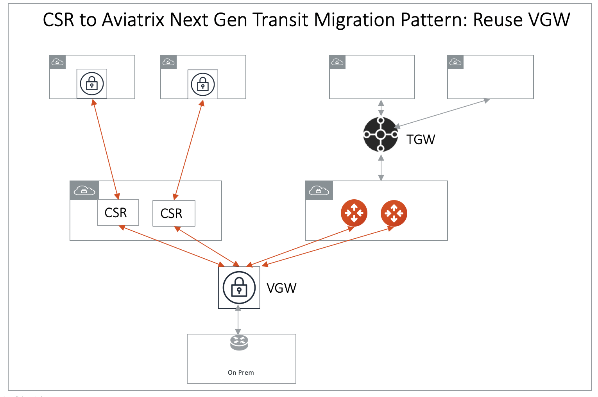
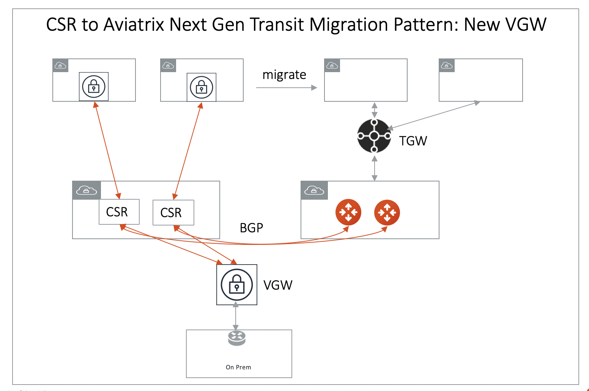

.. meta::
   :description: instructions on migrating from CSR to Aviatrix Transit Gateway
   :keywords: Transit Gateway, AWS Transit Gateway, TGW, CSR Migration

==============================================================
Migrating a CSR Transit to AWS Transit Gateway (TGW)
==============================================================

This document assumes that you have deployed a `CSR Transit solution <https://aws.amazon.com/answers/networking/aws-global-transit-network/>`_ with Transit hub CSR instances and VGWs 
in Spoke VPCs. The steps
below provide instructions to migrate a live CSR deployment to Aviatrix with the Transit Gateway Orchestrator.  

The objectives here are:

 - No change to any on-prem network.   
 - No change to the connectivity between AWS VGW and on-prem. (either over DX or over Internet or both)
 - Re-use AWS VGW deployed in CSR based Transit hub VPC if possible.
 - No change to existing VPC infrastructure.
 - Minimum operation downtime.

There are a couple of patterns during the migration phase, consider the one that meets your requirements. 

.. Note::

  This document assumes you have already `launched an Aviatrix Controller <http://docs.aviatrix.com/StartUpGuides/aviatrix-cloud-controller-startup-guide.html>`_.

..

Before the migration process starts,  plan out what network domains you need to create and which network domains should connect other domains. If you are not sure and need to transition, proceed. The network domains can be added and modified at any time. 

1. `Launch a Transit Gateway <https://docs.aviatrix.com/HowTos/tgw_plan.html#creating-an-aws-tgw>`_.
2. If you have plans for custom network domains, follow `these instructions <https://docs.aviatrix.com/HowTos/tgw_plan.html#creating-a-new-network-domain>`_ to create them. Then, `build connection policies <https://docs.aviatrix.com/HowTos/tgw_plan.html#building-your-domain-connection-policies>`_. If you do not intend to build custom network domains, skip this section. 
3. `Launch an Aviatrix Transit GW and enable HA in the Transit hub VPC <https://docs.aviatrix.com/HowTos/tgw_plan.html#setting-up-an-aviatrix-transit-gw>`_. As a best practice, create a new Transit hub VPC to deploy the Aviatrix Transit GW. 
4. This step has two options: 

- Option A: `Connect Aviatrix Transit GW to VGW <http://docs.aviatrix.com/HowTos/transitvpc_workflow.html#connect-the-transit-gw-to-aws-vgw>`_. At this point, VGW starts to advertise to the Aviatrix Transit GW. Make sure you specify a different "AS" number for the BGP session of the Aviatrix Transit GW connection to the VGW. Also note that if the Transit GW and the VGW are in the same account and same VPC, VGW must be detached from the VPC. 

A diagram for this migration path is shown below:

|tgw_csr_migrate_pattern1|

- Option B: Connect Aviatrix Transit GW to CSR. There are certain situations where you need to keep the CSR as the connection point to on-prem (for example, you need to use CSR route summarization feature to control routes to VGW to be under 100.). In such scenario, use `External Device <https://docs.aviatrix.com/HowTos/transitgw_external.html>`_ option in `Transit VPC workflow <https://docs.aviatrix.com/HowTos/transitvpc_workflow.html>`_ to create an IPSec and BGP connection to CSR, as shown in the diagram below. After all Spoke VPCs are migrated, delete the connection to CSR, connect the Aviatrix Transit GW to VGW. 

|tgw_csr_migrate_pattern2|

5. Remove a Spoke VPC. Select one Spoke VPC that has VGW deployed. Remove the VPC Transit Network tag. This will effectively detach the Spoke VPC from the CSR Transit Network. Make sure the above Spoke VPC CIDR route entry has been removed from the Transit Network.  
6. `Attach a Spoke VPC <https://docs.aviatrix.com/HowTos/tgw_build.html#attaching-a-vpc-to-a-tgw>`_ to the corresponding network domain. 
7. Repeat steps 5 and step 6 for the remaining Spoke VPCs. 
8. Remove the Transit Hub VGW CSR tag after all Spoke VPCs have been migrated to Aviatrix Transit GW. This effectively detaches the VGW from CSR. 

The effective operation downtime for each Spoke VPC is the time between the Transit Network tag being removed for the Spoke VPC and the Spoke VPC being attached to Aviatrix Transit GW. It should be a few minutes. 

.. disqus::
