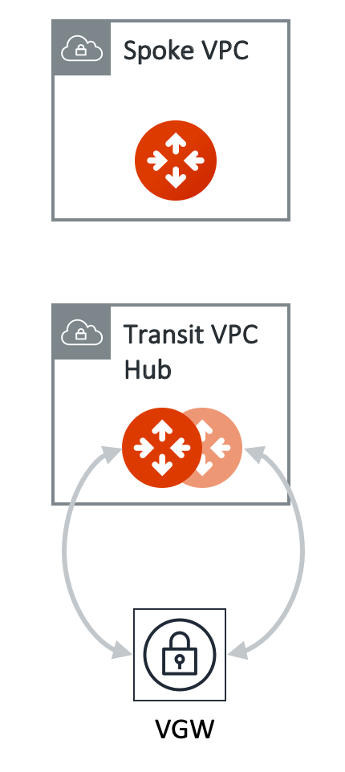

.. meta::
  :description: TGW Orchestrator Overview
  :keywords: AWS TGW, TGW orchestrator, Aviatrix Transit network

=========================================================
TGW Orchestrator Design Patterns
=========================================================

Default_Domain Design
--------------------------

If you just want a full mesh connectivity between VPCs and on-prem, you do not need to create any more domains. Just the built-in Default_Domain and Aviatrix_Edge_Domain for the full deployment, as shown below. 

|default_domain_design|

.. |tgw_overview| image:: tgw_overview_media/tgw_overview.png
   :scale: 30%

.. |default_domain_design| image:: tgw_overview_media/default_domain_design.png
   :scale: 30%

.. |image5| image:: transitvpc_workflow_media/AttachSpokeGW.png
   :scale: 50%

.. |image6| image:: transitvpc_workflow_media/AttachMoreSpoke.png
   :scale: 50%

.. disqus::
