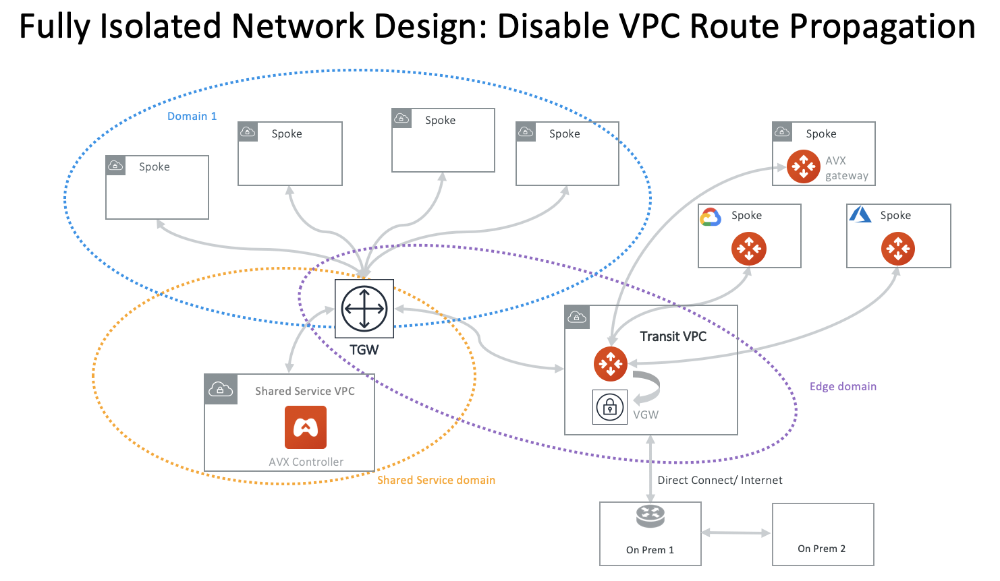
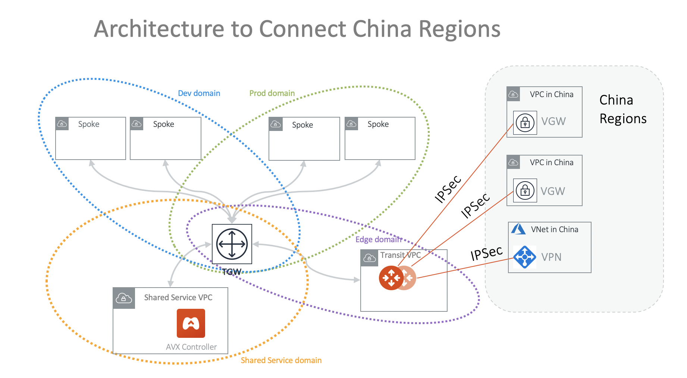
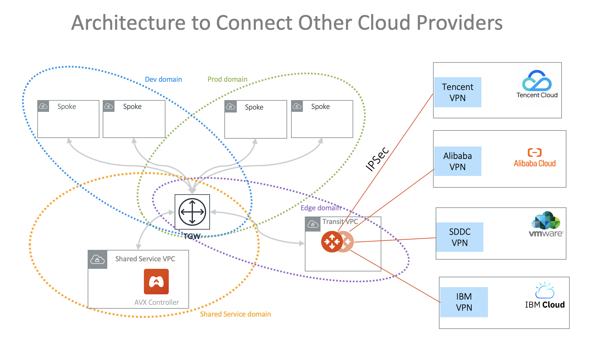

.. meta::
  :description: TGW Orchestrator Overview
  :keywords: Transit Gateway, AWS Transit Gateway, AWS TGW, TGW orchestrator, Aviatrix Transit network

=========================================================
TGW Design Patterns
=========================================================

Many design patterns exist to deploy your network with the AWS Transit Gateway Orchestrator. Here are some 
examples. 

.. important::

  While the design pattern diagrams use a single symbol to represent the Aviatrix gateways, all designs can be implemented with multi-AZ high availability.

Dev & Prod isolated design
---------------------------

If you like to build network segmentation between Dev/QA VPCs and Production VPCs, but require shared service VPC and
on-prem to reach each VPC, consider the diagram below.
diagram below.

|dev_prod_design|

In this network design, you need to create two custom Security Domains, Dev_Domain and Prod_Domain.

At the Plan page Step 2, select "Create Custom Security Domain" and fill in the information. Make sure you multi select Shared_Service_Domain and Aviatrix_Edge_Domain for "Connect to Security Domains". Apply this step for both Dev_Domain and Prod_Domain.

Dev & Prod isolated design with TGW Direct Connect or VPN
------------------------------------------------------------

Aviatrix integrates native TGW Direct Connect and VPN to connect to on-prem while allowing you 
to connect to multiple cloud as Spoke VPCs. 

|tgw_hybrid|

All-in-cloud with Multi Security Domains
-----------------------------------------

If you are only concerned about VPC to VPC segmentation, you can deploy Aviatrix Controller for 
an all-in-cloud segmented network, as shown below. 

|all-in-cloud| 

Connecting Transit Gateways in Multi Regions Multi Cloud
-----------------------------------------------------------

You can use Aviatrix Transit GWs to connect AWS Transit Gateways in multi regions and multi 
cloud deployment, as shown below. 

|multi-region|

TGW Orchestrator for cross region and multi cloud spoke
----------------------------------------------------------

You can extend the TGW to a different region with transit peering and then spokes in a different
cloud.

|multi_cloud_transit_peering|

Full mesh network design
--------------------------

If you like to build a full mesh network that allows all VPCs and on-prem to communicate with each other, you do not need to create any custom Security Domains. Simply use the built-in Default_Domain and Aviatrix_Edge_Domain for the deployment, as shown below. 

|default_domain_design|

At Plan page Step 2, select "Full mesh network". 

Fully Isolated network design - 1
-----------------------------------

If you would like to build a fully isolated network where no VPC can communicate with each other except to the shared service VPC and on-prem, you need to create a Security Domain for each VPC and connect each domain to the Shared_Service_Domain. 

|fully_isolated_network_design|

In this network design, you need to create a custom Security Domain for each VPC. 

If this design does not scale for you, consider the `Aviatrix Transit Network workflow <https://docs.aviatrix.com/HowTos/transitvpc_workflow.html>`_ where all VPCs are by default isolated to each other. 

Fully Isolated network design - 2
------------------------------------

An alternative design for a fully isolated deployment is to have a group of VPCs share one Security Domain but `disabling VPC
route propagation <https://docs.aviatrix.com/HowTos/tgw_build.html#attach-vpc-to-tgw>`_ when attaching a VPC, as shown 
in the diagram below. 

|fully_isolated_2|

The advantage of this design is to keep the Security Domains to minimum. You can specify connection policies for a domain
to communicate with another domain, such as Aviatrix Edge Domain or Aviatrix FireNet Domain, without the VPC in the domain 
being able to talk to each other. 

Fully Isolated network with multi sites VPN
---------------------------------------------

You can use TGW native VPN capability to connect to multi sites VPN. Since VPN connection is in Default Security Domain, you need to build connection policy
for each VPC domain.

|tgw_multi_sites|

Integrating with Distributed Egress Control Design
----------------------------------------------------------

For any of the TGW design patterns, you may deploy Aviatrix distributed Egress FQDN in each VPC. In this example, a full mesh
deployment is expanded to include Egress FQDN support, as shown below.

|default_egress|

Follow the instructions for `FQDN <https://docs.aviatrix.com/HowTos/FQDN_Whitelists_Ref_Design.html>`_ to deploy egress control function.

High Performance Transit - Insane Mode
---------------------------------------

Deploy an Aviatrix hardware appliance on-prem to achieve 10Gbps Transit Network throughput. 
Added benefit is that traffic over Direct Connect is encrypted. 

|insane-mode|

Firewall Network
------------------

Simplify and scale your firewall deployment with Aviatrix Firewall Network solution.
For more information, check out `Firewall Network FAQ <https://docs.aviatrix.com/HowTos/firewall_network_faq.html>`_.

|firewall_network|

TGW Native Hybrid Network
----------------------------

Aviatrix supports TGW VPN and TGW Direct Connect for connecting to remote site or on-prem network, as shown in the diagram below. 

|firenet|

Connecting to China Regions
----------------------------------------

If the majority of deployment is outside China regions, the best way to connect China region VPC or VNets are to 
use the cloud native AWS VGW or Azure VPN gateway and connect them to Aviatrix Transit Gateway by IPSec tunnels, as 
shown in the diagram below. This architecture applies to all other cloud providers that have presence in China regions. 
On the Aviatrix side, use the option `External Devices <https://docs.aviatrix.com/HowTos/transitgw_external.html>`_ when making the connection.

|tgw_china|

Connecting to Other Cloud Providers
-------------------------------------

To connect any network of a cloud provider that is not AWS, Azure, Google GCP and Oracle Cloud, use the native VPN gateway of these
cloud providers to build VPN tunnels to the Aviatrix Transit Gateway to connect to the rest of the deployment, as shown 
in the diagram below. On the Aviatrix side, use the option `External Devices <https://docs.aviatrix.com/HowTos/transitgw_external.html>`_ when making the connection.

|tgw_other_cloud| 

Extending Security Domains to on-prem Sites
----------------------------------------------

If the Aviatrix Transit Gateway connect to multiple sites over IPSec or GRE tunnels, the Security Domains can be
extended to each site as shown below, where Blue Domain in the cloud can only communicate with Site 2, Green 
Domain can only communicate with Site 1. Routes are only advertised within the domain and data traffic is segmented
by the Security Domains. 

|edge_seg|

.. |default_domain_design| image:: tgw_design_patterns_media/default_domain_design.png
   :scale: 30%

.. |default_egress| image:: tgw_design_patterns_media/default_egress.png
   :scale: 30%

.. |fully_isolated_network_design| image:: tgw_design_patterns_media/fully_isolated_network_design.png
   :scale: 30%

.. |dev_prod_design| image:: tgw_design_patterns_media/dev_prod_design.png
   :scale: 30%

.. |all-in-cloud| image:: tgw_design_patterns_media/all-in-cloud.png
   :scale: 30%

.. |multi-region| image:: tgw_design_patterns_media/multi-region.png
   :scale: 30%

.. |insane-mode| image:: tgw_design_patterns_media/insane-mode.png
   :scale: 30%

.. |transit-DMZ| image:: tgw_design_patterns_media/transit-DMZ.png
   :scale: 30%

.. |firewall_network| image:: firewall_network_faq_media/firewall_network.png
   :scale: 30%

.. |firenet| image:: firewall_network_media/firenet.png
   :scale: 30%

.. |edge_seg| image:: tgw_design_patterns_media/edge_seg.png
   :scale: 30%

.. disqus::
