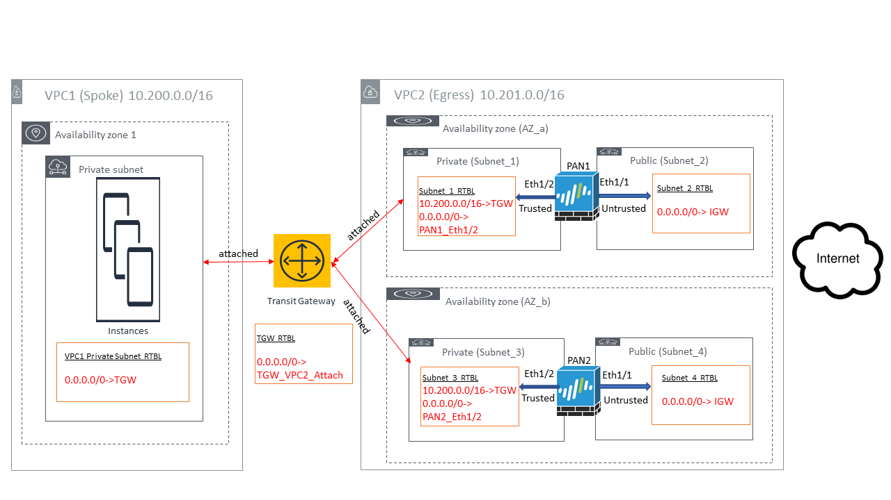

=============================================================
Transit Gateway Egress VPC Firewall Limitation Test Validation
=============================================================

Introduction
--------------

This document demonstrates that native Transit Gateway does not support multi AZ deployment for a centralized egress firewall.

AWS Transit Gateway allows spoke VPCs to send Internet bound traffic through firewall instance deployed in attached egress VPC.
However Transit Gateway
is not aware of the state of each firewall in different AZ in the egress VPC, therefore not able to switch over to
a different firewall instance when one fails.

Test Validation
----------------

The test setup is described in the following.

VPC1 is a Spoke VPC attached to Transit Gateway. There are three EC2 instances serving as Internet traffic sources.

VPC2 is an Egress VPC and has two Available Zones (AZs). Subnet_1 (private subnet) and Subnet_2 (public subnet)
are in AZ_a. Subnet_3 (private subnet) and Subnet_4 (public subnet) are in AZ_b. Both AZs (Subnet_1 in AZ_a and
Subnet_3 in AZ_b) are attached to the Transit Gateway. Subnet_1 is at the top of the Transit Gateway attachment list due to AZ_a is ahead
of AZ_b in alphabetical order.

Each AZ has one Palo Alto Networks (PAN) firewall instance. For PAN1, its eth1/1 interface is at Subnet_2 (public subnet) and its eth1/2
interface is at Subnet_1 (private subnet). For PAN2, its eth1/1 interface is at Subnet_4 (public subnet) and
its eth1/2 interface is at Subnet_3.

Subnets' VPC Route Tables (RTBL) are also displayed at the diagram.

|tgw_egress|

The VPC1's traffic will flow through Transit Gateway and Palo Alto Networks firewall before going to Internet. We verified the data
path in different scenarios and observed the following behaviors:

1. With both Subnet_1 and Subnet_3 attached to Transit Gateway, Transit Gateway forwards VPC1's Internet traffic from all three EC2
instances to PAN1. This is because PAN1's private subnet (Subnet_1) is at the top of the Transit Gateway's attachment list.
Transit Gateway does not load balance traffic between the two firewalls.

2. Stop PAN1 at AWS Console. VPC1's Internet traffic is blocked. Transit Gateway does not detect PAN1's health state and does not fail
over to PAN2 accordingly.

3. Restart PAN1 at AWS Console. VPC1's Internet traffic will resume by going through PAN1.

4. Stop PAN1 at AWS Console again. To resume the VPC1's traffic, we need to detach PAN1's private subnet (Subnet_1)
from Transit Gateway. After it, VPC1's traffic can flow through Transit Gateway and PAN2 before going to Internet.

5. Restart PAN1 at AWS Console and re-attach PAN1's private subnet (Subnet_1) to Transit Gateway. After it, VPC1's traffic
still flows through PAN2. Transit Gateway won't redirect the traffic to PAN1.

Summary
---------

Although Transit Gateway allows Internet bound traffic to be forwarded to firewall instances in an egress VPC, multi-AZ deployment for
such firewall service is not supported.

.. add in the disqus tag

.. disqus::
