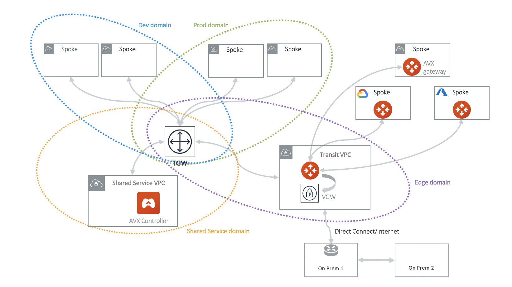
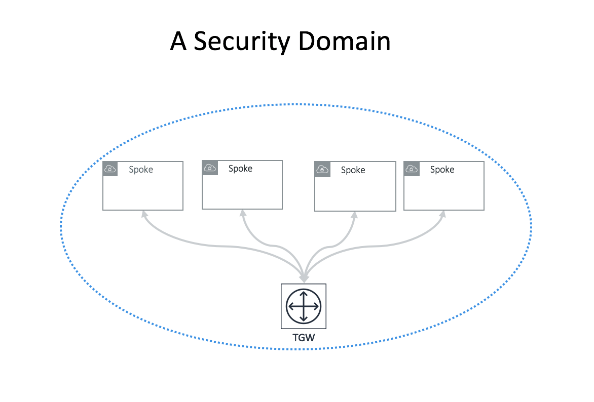
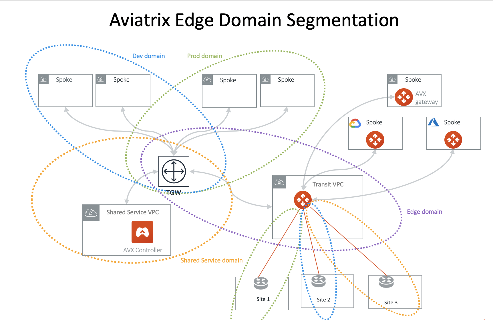
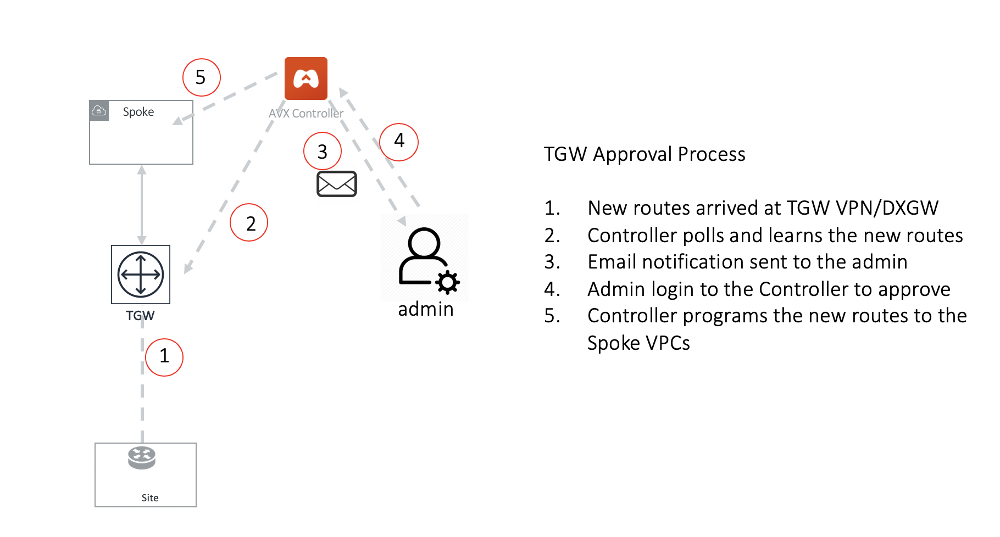

.. meta::
  :description: TGW Orchestrator Overview
  :keywords: Transit Gateway, AWS Transit Gateway, AWS TGW, TGW orchestrator, Aviatrix Transit network

============================================================
AWS TGW Orchestrator FAQ
============================================================

What is the AWS TGW Orchestrator?
------------------------------------------------------

.. note:: The AWS TGW Orchestrator is for AWS users only.

 1. Orchestrates VPC to VPC and on-prem to VPC connectivity via AWS Transit Gateway. 
 #. Automates AWS Resource Access Manager (RAM) for multi-account support. 
 #. Creates security boundaries between groups of VPCs to achieve network segmentation. 
 #. Out-of-the-box integration of AWS Transit Gateway and Direct Connect and Internet to re-use what has been built. 
 #. Provides `Insane Mode high performance <https://docs.aviatrix.com/HowTos/insane_mode.html>`_  and features rich hybrid network for connecting to on-prem.
 #. Supports Bring Your Own Firewall to TGW deployment for inline traffic inspection (`Firewall Network <https://docs.aviatrix.com/HowTos/firewall_network_faq.html>`_) 
 #. Orchestrate AWS TGW Inter Region Peering and expand the Security Domains to be global.  
 #. Advanced mode for end-to-end encryption where Aviatrix Gateways are deployed in the AWS Spoke VPCs and Azure Spoke VNets.

The AWS Transit Gateway Orchestrator is illustrated in the diagram below.

|tgw_overview|

In the above diagram, AWS VPCs are grouped into four domains: Dev domain, Prod domain, Shared Service domain and 
Aviatrix Edge domain. Each VPC in the same domain can communicate with each other via AWS Transit Gateway. VPCs in Prod domain cannot communicate 
with VPCs in Dev Domain, while all VPCs in Dev domain and Prod domain can communicate with Shared service domain and Aviatrix 
Edge domain. 

Through the Aviatrix Transit GW in the Aviatrix Edge domain, Spoke VPCs can communicate with on-prem over Direct Connect. 

In the deployment, the VPC in the Aviatrix Edge domain is a Spoke VPC from the Transit Gateway point of view. However, it serves as Transit VPC 
from the Aviatrix Transit Network point of view. No Aviatrix gateways are deployed in Spoke VPCs except in the Transit VPC. 

Aviatrix Transit GW serves as hub connecting to Azure and GCP networks. 

What is the Aviatrix TGW Orchestrator?
-------------------------------------------------------------

Aviatrix TGW Orchestrator builds the Transit Network that includes TGW attached Spoke VPCs.

Why should I use Transit Gateway Orchestrator?
-------------------------------------------------

AWS Transit Gateway Orchestrator simplifies, abstracts, and extends the latest AWS Transit Gateway service. Aviatrix Controller makes Transit Gateway-based Transit 
architecture deployable by overcoming `Transit Gateway limitations <https://docs.aviatrix.com/HowTos/aws_network_limits.html>`_. 

- **Functional Completeness** Aviatrix makes AWS Transit Gateway functionally deployable. The Orchestrator programs and updates both VPC route tables and TGW route tables so the routes are dynamically propagated to the Spoke VPCs. Read `this answer <https://docs.aviatrix.com/HowTos/tgw_faq.html#why-should-i-use-aviatrix-tgw-orchestrator-to-build-a-transit-network-architecture>`_ for more details.
- **Segmentation** The Orchestrator abstracts the route domain and route propagation concepts in Transit Gateway that allows you to create network segmentation by policy and intent. 
- **Multi-Account** The Orchestrator automates the AWS Resource Access Manager (RAM) to allow you to manage multi account VPC attachments to TGW.
- **Scaling** Aviatrix solution overcomes Transit Gateway route limits to scale the hybrid deployment to hundreds/thousands of VPCs. 
- **Hybrid** The Orchestrator extends the Transit Gateway capability to include Direct Connect support for connecting to on-prem data center. 
- **Multi Cloud Architecture** Aviatrix Controller creates and manages a multi-cloud global transit architecture with a single pane of glass. 

How does Transit Gateway (TGW)  Orchestrator compliment AWS Transit Gateway service?
-----------------------------------------------------------------------------------------------------------------

- **Dynamic Route Propagation** Using Aviatrix Orchestrator is the only guaranteed way to ensure your on-prem routes are properly propagated to Spoke VPCs. AWS Transit Gateway propagates VPC CIDR and IPsec VPN routes to the Transit Gateway route table. But the routes are not propagated to the VPC route table. It is the account owner's responsibility to program VPC route tables. Aviatrix Transit Gateway Orchestrator dynamically updates route entries in the VPC route tables. 

- **Policy Abstraction** An AWS Transit Gateway provides the capability to allow two Transit Gateway route tables to propagate routes to each other, but the actual route entry programming is left to the owner. Transit Gateway Orchestrator builds on that and allows customers to define policies that form a security boundary. 

- **Multi-Account Support** Automate the RAM resource sharing process to seamlessly manage multi-account VPC attachment. 

- **Troubleshooting** FlightPath allows a single pane of glass for troubleshooting connectivity with expert diagnostics capabilities. 

- **Hybrid and Multi-Cloud Support** Native AWS Transit Gateway VPN and Direct Connect support. Furthermore, Aviatrix allows customers to bridge multiple Transit Gateways together in different and public clouds. 

- **Traffic Visibility** Netflow log support for traffic between on-prem and all VPCs.

- **Stateful Firewall** Enforce security policy for all traffic between on-prem and all VPCs.

- **10Gbps Transit** Support 10Gbps Transit network throughput. 

How does Transit Gateway Orchestrator work with Transit VPC?
-------------------------------------------------------------

The Transit Gateway Orchestrator leverages the Aviatrix Transit Network workflow for the hybrid connectivity function to an on-prem data center and branches. It enables the Transit Gateway Orchestrator to connect with on-prem over Direct Connect or Internet. 

The Transit Gateway Orchestrator can also be used as a stand-alone function for orchestrating VPC to VPC connections.  

When using the Transit Gateway Orchestrator for hybrid connectivity, no gateways are deployed in the Spoke VPCs for hybrid function. 

How does the TGW Transit compare with Aviatrix VPC?
----------------------------------------------------------------

Transit VPC refers to the transit deployment model where an Aviatrix Gateway is deployed in a Spoke VPC. This is now called "advanced mode" in the AVX Transit. 

The Transit Gateway Orchestrator can be deployed with some Spoke VPCs run Aviatrix gateways. When is the right use case to run Aviatrix Spoke gateway?

 1. If you need a packet in flight to be encrypted, launch an Aviatrix gateway in the Spoke VPC. 
 #. If you need various NAT functions between Spoke and Transit VPC, use an Aviatrix gateway in the Spoke VPC. 
 #. If you need to obtain Netflow and log information from the Spoke and Transit, use Aviatrix gateway. 
 #. If you want to build a fully isolated Transit network where there is no inter-VPC connectivity by default. 

There is AWS CloudFormation and Terraform support for Transit Gateway. Why should I use Aviatrix Orchestrator?
--------------------------------------------------------------------------------------------------------------------------------------------

AWS CloudFormation for `Transit Gateway <https://docs.aws.amazon.com/AWSCloudFormation/latest/UserGuide/aws-resource-ec2-transitgateway.html>`_ is a resource construct for Transit Gateway. So is the `Terraform example<https://www.terraform.io/docs/providers/aws/r/ec2_transit_gateway_route_table.html>`_.

They are all useful solutions, but these constructs may not be sufficient to run your network. 

For example, a Transit Gateway does not propagate routes from on-prem to the VPC route table, meaning there is no guarantee that your VPC instances can reach a specific on-prem server or host. Even if you hard coded the list of CIDRs to shuffle them down to Transit Gateway, what happens when a new VLAN or Subnet is stood up on-prem. Who is going to notify you?

A modern distributed network either requires BGP to dynamically propagate the routes or a controller that dynamically updates the routes. No matter what approach you use, it is the only way to guarantee the network actually functions. At Aviatrix, we choose a software defined approach with our Controller. Unless you plan to develop a Controller like ours, you should consider using our product. 

Learn more about Transit Gateway limitations from `this link <https://docs.aviatrix.com/HowTos/aws_network_limits.html>`_.

What is a Security Domain?
-------------------------------------

A Security Domain is an Aviatrix enforced network of VPC members, where VPCs in the Security Domain can communicate with each other, and VPCs not in the security domain cannot communicate with VPCs in the Security Domain.

An Aviatrix Security Domain is an abstraction that builds upon the AWS Transit Gateway route table concept. One or more Spoke VPCs are members in  
a security domain.

|security_domain|

VPCs in a security domain can communicate with each other via a Transit Gateway. Each security domain has a corresponding route table on Transit Gateway. 

The Aviatrix Controller dynamically programs and updates both VPC route tables so that instances in different 
Spoke VPCs in the same domain can communicate with each other.  

Two security domains are not connected, i.e., a Spoke VPC in one domain has no connectivity to another 
Spoke VPC in a different domain. Connection policy must be specified to connect the two domains so that VPCs in each domain can communicate with each other. 

What is a Connection Policy?
-------------------------------------

A connection policy is an Aviatrix enforced cross Security Domain connectivity rule. 

A connection policy builds upon the Transit Gateway route table propagation concept, it specifies the 
connection relationship of one Security Domain to others. 
If there are two Security Domains connected by policy, instances in Spoke VPCs attached to each domain can communicate with each other via Transit Gateway. 

In the example below, both Dev_Domain and Prod_Domain have connection policy to Shared_Service_Domain. Dev_Domain and Prod_Domain are not connected. Instances of a VPC in Dev_Domain can communicate with instances of a VPC in Shared_Service_Domain. But instances of a VPC in Dev_Domain cannot communicate with instances of a VPC in Prod_Domain. 

|domain_policy_diagram|

Aviatrix Controller programs all VPC route tables and Transit Gateway route tables so that two Security Domains with a 
connection policy can communicate with each other automatically. 

What are the benefits of using Security Domains and Connection Policies?
--------------------------------------------------------------------------------------------

The key use case for building Security Domains is to segment traffic between VPCs, sometimes also called east west traffic. 

The benefits are:

 - Native Service. It leverages AWS Transit Gateway route domains and route domain propagation constructs.
 - Zero performance impact. Compared to deploying a firewall instance, this approach has zero network performance impact. 

Using Security Domains and Connection Policies allow you to identify groups of VPCs with the same requirements from 
a networking point of view and then apply connection policies at the group level. This avoids having to individually 
specify connections at the VPC level. The Aviatrix Controller takes care of route programming of all route tables. 

One analogy to think of a Security Domain is datacenter VLAN/Subnets and hosts connecting to the 
VLAN/Subnet. 

In the Aviatrix Security Domain concept, a security domain is a VLAN, a host is VPC plugging in to the VLAN. 
Hosts in the same VLAN can communicate with each other. If two VLANs are defined by policy to be connected, the 
hosts in different VLAN can communicate with each other. 

 

What is the Default_Domain?
--------------------------------------------

When a Transit Gateway is created by the Aviatrix Controller, the Default_Domain is created and a route table corresponding to the Default_Domain is created on the Transit Gateway. If you do not plan on building any network segmentation, you can use Default_Domain for inter Spoke VPC and hybrid communications. 

What is the Shared_Service_Domain?
--------------------------------------------------

When a Transit Gateway is created by the Aviatrix Controller, the Shared_Service_Domain is created and a route table corresponding to the Shared_Service_Domain is created on Transit Gateway. 

You can attach a Spoke VPC to this domain and host your shared service instances such as your DevOps tools. 

Shared_Service_Domain is always connected to Default_Domain and Aviatrix_Edge_Domain.

What is the Aviatrix_Edge_Domain?
----------------------------------

When a Transit Gateway is created by the Aviatrix Controller, the Aviatrix_Edge_Domain is created and a route table corresponding to the Aviatrix_Edge_Domain is created on the Transit Gateway. 

Aviatrix_Edge_Domain is designated for connecting VPCs managed by the Transit Gateway Orchestrator to on-prem network. There must be one VPC 
attached to this domain. In the VPC, an Aviatrix Transit GW is deployed and used for data traffic forwarding between Spoke VPCs and on-prem network. 

Aviatrix_Edge_Domain is always connected to the Shared_Service Domain and the Default_Domain.

How do I deploy the Transit Gateway Orchestrator?
---------------------------------------------------------------

The Transit Gateway Orchestrator is deployed in two stages. 

 - `Orchestrator Plan <https://docs.aviatrix.com/HowTos/tgw_plan.html>`_: Define and setup Security Domains and Connection Policies.
 - `Orchestrator Build <https://docs.aviatrix.com/HowTos/tgw_build.html>`_: Attach a VPC to Transit Gateway and Security Domain.

In addition, you can 

Orchestrator List/Edit 
^^^^^^^^^^^^^^^^^^^^^^^^^

      - **Show Details** on what is programmed in the VPC route tables and Transit Gateway route table for a given VPC. 
      - **Audit Routes** to discover incorrectness in VPC route tables and Transit Gateway route tables for a given VPC. 
      - **Update VPC CIDR** to update propagated routes to TGW when a new VPC CIDR is added to VPC. 
      - **Edit Spoke VPC Customized Routes** allows you to edit Spoke VPC route table entries that target to TGW. To configure, go to TGW Orchestrator > List, select the Spoke VPC, click the 3 dots skewer and select Edit Spoke VPC Customized Routes.
      - **Edit Spoke VPC Advertised Routes** allows you to advertise to TGW via Controller a different set of routes other than the default VPC CIDR. To configure, go to TGW Orchestrator > List, select the Spoke VPC, click the 3 dots skewer and select **Edit Spoke VPC** Advertised Routes** to edit.
      - **Update DXGW Allowed Prefix** if you like to change the summarized prefix after the DXGW has been attached to TGW.

Orchestrator View
^^^^^^^^^^^^^^^^^^^^^^^^^^

View what VPC members are attached to Security Domains and Connection Policies. 

Orchestrator Test 
^^^^^^^^^^^^^^^^^^^^^^^^

Instance to instance end-to-end troubleshoot. For more information, refer to `FlightPath <https://docs.aviatrix.com/HowTos/flightpath.html>`_. 

**TGW Audit**
^^^^^^^^^^^^^^^^^

Audit the correctness of route entries of all attached VPC route tables and its associated TGW route tables including connection policy introduced route propagation. 

**TGW Approval**
^^^^^^^^^^^^^^^^^^^

Refer to this `link <https://docs.aviatrix.com/HowTos/tgw_approval.html>`_.

What can be displayed at the View page?
--------------------------------------------------------

View page provides the following information:

 - ALL Transit Gateways created by the Controller.
 - All Security Domains under a Transit Gateway.
 - All VPC members in a Security Domain.
 - For a given Security Domain, what other domains it connects to. 
 - All VPC attachments to a Transit Gateway.
 - For a given VPC, what other VPCs in other domains it connects to. 

|tgw_view|

What are the Transit Gateway Orchestrator deployment scenarios?
-----------------------------------------------------------------

Check out some `design patterns <https://docs.aviatrix.com/HowTos/tgw_design_patterns.html>`_ that address your requirements. 

Can I change my plan or VPC attachment on Transit Gateway Orchestrator?
--------------------------------------------------------------------------

Yes, all stages (Plan, Build, List, View and Test) are modular. You can change your design any time. 

I already have a Transit Gateway and some VPCs attached to it. How do I migrate?
-----------------------------------------------------------------------------------------------------

Unlike a VPC, where once you have created it and launched instances in the VPC you cannot delete the VPC or move
the instances easily, a Transit Gateway and its attachments can all be changed without making changes to the instances and VPC CIDRs. Simply detach the VPCs from the current Transit Gateway, launch a new Transit Gateway, and build it out again. 

The Aviatrix Transit Gateway Orchestrator manages the entire life cycle of the network, including Security Domains, all Transit Gateway and 
attachments should be created and managed by the Orchestrator.    

I plan to isolate a Dev Domain and Prod Domain, but there is one VPC in Dev that needs to connect to Prod. What should I do?
-----------------------------------------------------------------------------------------------------------------------------

Since you can create as many security domains as you need, you can create one domain  
and connect this domain to your Prod domain, and if needed, also to the Dev domain. Simply attach the
special VPC to this domain, it will have connectivity to Prod domain. 

How does the CSR based Transit VPC solution compare with the Transit Gateway?
---------------------------------------------------------------------------------

Transit Gateway significantly simplifies building VPC connections. But the Transit Gateway itself is functionally incomplete for hybrid connection.
For example, the Transit Gateway does not propagate routes to Spoke VPCs, which means using a Transit Gateway alone does not offer a functional hybrid
solution.

The example below illustrates how CSR based Transit VPC provides an end-to-end solution while a Transit Gateway alone leaves Spoke VPC route table all empty.

|tgw_transit_vpc_compare|

The missing function of Transit Gateway is listed as below:

 - Not able to propagate routes from on-prem to the Spoke VPCs.
 - Not able to connect with Direct Connect.
 - The Transit Gateway VPN has 100 route limits.
 - The Transit Gateway route table cannot summarize routes to advertise to Transit Gateway VPN.

While you may think you can gather the on-prem routes and program the Spoke VPC tables, it is in reality not so simple. The on-prem routes
change from time to time as new networks are added or removed, which means you need a reliable way to monitor the route changes, handle exceptions and deal with errors and duplicate routes -- essentially a function carried by BGP or an orchestrator.

Why should I use Aviatrix Transit Gateway Orchestrator to build a transit network architecture?
--------------------------------------------------------------------------------------------------------------------------

Aviatrix Transit Gateway Orchestrator fulfills the need to propagate on-prem routes to the Spoke VPCs. This function is either carried by BGP or is software defined. In the Aviatrix case, it is software defined and performed by the Controller. The diagram below
shows how the CSR Transit VPC, the Transit Gateway and the Aviatrix Orchestrator compare for route propagation function. As can be seen, in the CSR Transit VPC case, CSR propagates on-prem routes to Spoke VPC via BGP to VGW; the Transit Gateway has no route propagation to Spoke VPC. Aviatrix Controller propagates routes to Spoke VPC through a software-defined mechanism. 

|tgw_transit_orchestrator_compare|

What value does an Aviatrix Gateway provide in the Transit Gateway Orchestrator?
-----------------------------------------------------------------------------------

An Aviatrix Gateway deployed at the edge/transit VPC provides the following values:

 - Ensure the correctness of connectivity by monitoring and dynamically programming on-prem network address ranges to Spoke VPCs' route tables.
 - Avoid network outages by detecting and alerting overlapping and conflicting network address ranges between on-prem and all VPCs.
 - Avoids AWS VGW or Transit Gateway VPN 100 route limits by summarizing Spoke VPC CIDRs advertisements to on-prem network.
 - Provides traffic visibility by supporting Netflow logs between on-prem network and all VPCs.
 - Provides stateful firewall to enforce policy between on-prem network and all VPCs.
 - Out-of-the-box integration to support Direct Connect.
 - Connects multi-region Transit Gateway deployment.
 - Supports Transit DMZ architecture by inserting third party firewalls at the edge/transit VPC.
 - Supports 10Gbps Transit network throughput.

When a VPC is attached to a TGW, why can't I simply program the default route in the VPC route table to point to the TGW?
-------------------------------------------------------------------------------------------------------------------------------------------------------

In some cases, you absolutely can. For example, if you have a group of VPCs that need to be connected to each other, 
you can attach each VPC to the same TGW route table with propagation enabled. Then program each VPC route table 
with the default route (0.0.0.0/0) to point to TGW.

But in other cases you may not. Using the above example, if there is public subnet in a Spoke VPC, then you cannot simply 
program each route table with the default route pointing to TGW, as a public subnet already must have its default route
pointing to the IGW. 

Even a Spoke VPC route table for private subnet may already have the default route point to an AWS NAT gateway. This 
is quite a common situation and as it happens, you cannot program the default route to the TGW. 

However, in the example scenarios above, you maybe able to program RFC 1918 (10.0.0.0/8, 172.16.0.0/12, 192.168.0.0/16)
routes of the Spoke VPCs to point to TGW. This is a viable solution you can use to address the issues mentioned above and one that
works in a lot of situations.

Can the Aviatrix Controller orchestrate VPN attachment to AWS Transit Gateway?
----------------------------------------------------------------------------------------------------------------------
Yes. The Aviatrix Controller allows you setup a VPN attachment from the Controller directly. 

Can the Aviatrix Controller orchestrate Direct Connect Gateway to AWS Transit Gateway?
----------------------------------------------------------------------------------------------------------------------
Yes. If you would like to connect  your Direct Connect directly into Transit Gateway, the Aviatrix Controller allows you to configure an association between the Direct Connect Gateway and AWS Transit Gateway on the Controller. 

How do I migrate from Aviatrix Transit Gateway to on-prem to TGW + DXGW?
-----------------------------------------------------------------------------------------------

 1. Prepare. Create a DXGW on AWS Console, figure out the cloud VPCs summary prefixes. i.e., prepare for TGW Orchestrator > Plan > Step 7.
 #. Disconnect Aviatrix Transit Gateway from VGW. Transit Network > Setup > Step 8 (Disconnect VGW).
 #. Connect. Connect to DXGW. TGW Orchestrator > Plan > Step 7

How does Aviatrix TGW Orchestrator compare with AWS Serverless TGW Orchestrator?
-------------------------------------------------------------------------------------------------------------

AWS Serverless TGW Orchestrator is a solution published by AWS. It orchestrates VPC attachment to a TGW by programming both the TGW route
table and VPC route table. The deployment is a Cloudformation Template that contains many AWS services such as Amazon DynamoDB, Amazon 
EventBridge, Amazon Simple Notification, AWS Lambda function. 

=========================================          =============================            =============================
Feature                                            Aviatrix TGW Orchestrator                Serverless TGW Orchestrator 
=========================================          =============================            =============================
Single pane of glass for orchestration             Yes                                      No. Orchestration is done by VPC tag
Single pane of glass for visualization             Yes (View, List)                         No. Each region must have its own deployment
Inter region peering                               Yes                                      No
Orchestration consistency checking                 Yes (Audit)                              No
Configuration for TGW DXGW                         Yes                                      No
Configuration for TGW VPN                          Yes                                      No
Troubleshooting connectivity                       Yes (Test)                               No
Onboard secondary account                          Automated                                Manual
Connection Policies between Domains                Flexible Connection Policies             4 Policies defined (Flat, Isolated, Infrastructure & On-premises)
Integrate Firewall deployment                      Yes                                      No
=========================================          =============================            =============================

What is Edge Segmentation?
---------------------------------------------------

Edge Segmentation allows you to further specify on each edge connection which domain it can communicate with.

At `Setup Aviatrix Transit GW <https://docs.aviatrix.com/HowTos/tgw_plan.html#setup-aviatrix-transit-gw>`_, you can select 
Edge Segmentation for each connection. When this option is selected, you can then use `Build Your Domain Connection Policies <https://docs.aviatrix.com/HowTos/tgw_plan.html#build-your-domain-connection-policies>`_ to specify which Security Domain this edge connection can 
communicate with, as shown in the diagram below. 

|edge_segmentation| 

In the above diagram, Site 1 can communicate with Prod domain but not with Dev domain and Shared Service domain. Site 2 can communicate with Dev domain but not with Prod domain and Shared Service domain. Site 3 can communicate with Shared Service domain but not with 
Dev domain and Prod domain. 

Edge Segmentation works across Connection Policies for `AWS TGW Peered <https://docs.aviatrix.com/HowTos/tgw_plan.html#tgw-inter-region-peering>`_ Security Domains. 

.. note::

 The Edge Segmentation is only applicable to TGW Orchestrator deployed Spoke VPCs. It does not apply to Aviatrix Encrypted Transit. It also does not apply to Aviatrix Transit Gateway peering. 

To enable Edge Segmentation, go to Multi-Cloud Transit Network > Advanced Config, select the Edit Transit tab, scroll down to AWS TGW Segmentation, and click to set it to **Enabled**.

How do I enable multicast capability function on TGW?
-------------------------------------------------------------------------

Multicast capability function is able to be turned on when users launch AWS TGW. This is API support only.

.. |domain_policy_diagram| image:: tgw_overview_media/domain_policy_diagram.png
   :scale: 30%

.. |tgw_view| image:: tgw_overview_media/tgw_view.png
   :scale: 30%

.. |tgw_transit_vpc_compare| image:: tgw_overview_media/tgw_transit_vpc_compare.png
   :scale: 30%

.. |tgw_transit_orchestrator_compare| image:: tgw_overview_media/tgw_transit_orchestrator_compare.png
   :scale: 30%

.. disqus::
