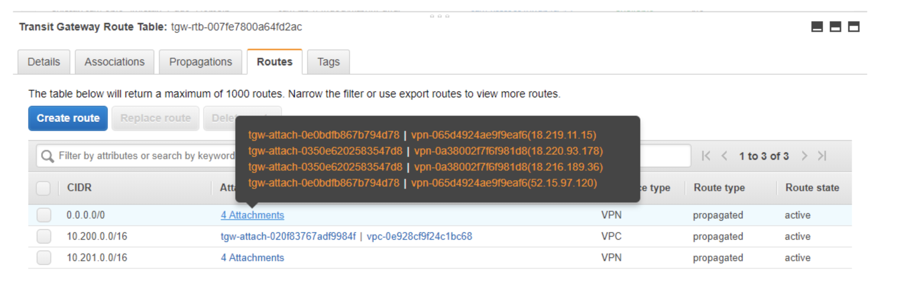
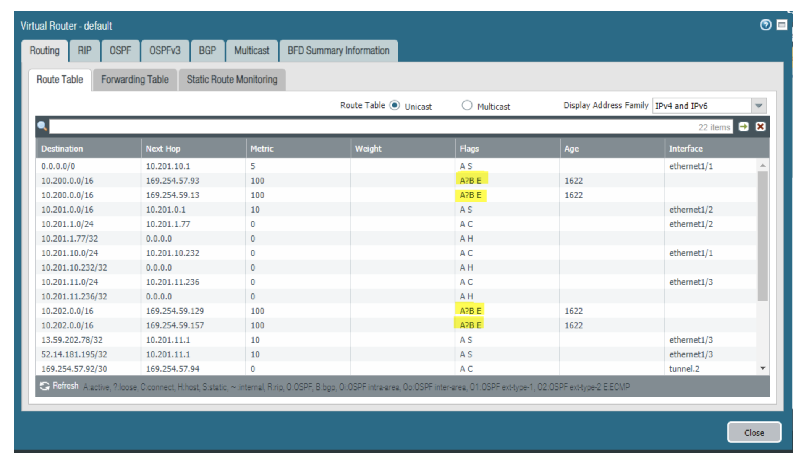

=======================================================================
Transit Gateway ECMP for DMZ Deployment  Limitation Test Validation
=======================================================================

Introduction
--------------

This document demonstrates that using AWS Transit Gateway ECMP functions to deploy multiple (or multi-AZ)
firewalls for traffic inspection between on-prem and cloud does not work.

AWS Transit Gateway VPN supports ECMP protocol that can load balance traffic across multiple VPN tunnels.
The question is, can Transit Gateway ECMP be used to deploy a transit DMZ as shown in the diagram below?

|dmz_with_ecmp|

If the above deployment were feasible, customers could inspect traffic between on-prem and cloud and effectively build a scale out DMZ architecture.

Test Validation
----------------

The test setup uses Palo Alto Networks (PAN) as the example firewall and is described in the following.

VPC1 is a Spoke VPC attached to a Transit Gateway. An EC2 instance in VPC1 serves as the HTTP client.

VPC3 is another Spoke VPC attached Transit Gateway. VPC3 simulates an on-prem data center with an EC2 instance serving as the
HTTP server. TGW-2 simulates an on-prem router, which also runs ECMP with the two Palo Alto Network instances in VPC2.

VPC2 is a Transit VPC and has two Available Zones (AZs). Each AZ has one Palo Alto Networks firewall to ensure HA. PAN1 is in
AZ-a and PAN2 is in AZ-b.

Both Palo Alto Network instances have three interfaces and all three interfaces have EIPs associated:

    - eth0: Management interface dedicated for remote access to Palo Alto Network's portal
    - eth1: Public IP used for creating Customer Gateway with TGW1
    - eth2: Public IP used for creating Customer Gateway with TGW2

|tgw-pan-ecmp|

Our configuration steps are as following:

1. Go to AWS Console and create two TGWs (TGW1 and TGW2). Both have "VPN ECMP Support" enabled.

2. Attach VPC1 to TGW1 and attach VPC3 to TGW2 at AWS console.

3. Update the route tables of VPC1 and VPC3:

    - VPC1: Traffic destinating to VPC3 CIDR -> TGW1-ID
    - VPC3: Traffic destinating to VPC1 CIDR -> TGW2-ID

4. Create two VPN Transit Gateway Attachments at TGW1. One attachment uses PAN1-eth1 as a Customer Gateway and the
other attachment uses PAN2-eth1 as a Customer Gateway. Both attachments require BGP running between PANs and TGW1. 
BGP ASN numbers for both Customer Gateways are the same (64999 in this test).

5. Create two VPN Transit Gateway Attachments at TGW2. One attachment uses PAN1-eth2 as a Customer Gateway and the
other attachment uses PAN2-eth2 as a Customer Gateway. Both attachments require BGP running between PANs and TGW2.
BGP ASN numbers for both Customer Gateways are the same (64999 in this test).

6. Configure PAN1 and PAN2 to bring up IPSec tunnels with TGW1 and TGW2. There are two IPSec tunnels for each
attachment between the PAN and its attached Transit Gateway. Both PANs advertise a default route (0.0.0.0/0) and VPC2 CIDR
(10.201.0.0/16) through BGP to TGW1 and TGW2.

7. Verify that ECMP is running between Transit Gateway and Palo Alto Network instances.

    - At AWS Console, check Transit Gateway Route Tables for TGW1 and TGW2. For each route advertised by PANs (0.0.0.0/0 and 10.201.0.0/16), there are four attachments. These four attachments are the four IPSec tunnels from both PAN1 and PAN2. Transit Gateway will use ECMP to distribute traffic among these four IPSec tunnels. One sample Transit Gateway route table is as below:

|tgw-pan-ecmp1|

    - At the Palo Alto Networks portal, check both Palo Alto Networks' route tables. Taking PAN1 as an example, traffic destinating to VPC1's CIDR (10.200.0.0/16) has two next hops. These two next hops are TGW1 IP addresses for terminating the two IPSec tunnels between PAN1 and TGW1. Same thing for traffic destinating to VPC3's CIDR (10.202.0.0.16). The image below is route table from PAN1. Please note that the highlighted "E" flag indicates ECMP is running among the two tunnels.

|tgw-pan-ecmp2|

    - Run traffic monitor in the Palo Alto Networks portal. Send pings between VPC1 and VPC3 and verify that ICMP packets are flowing through PAN1/PAN2.

After bringing up the setup, we run wget at VPC1 EC2 to browse the HTTP server running at VPC3 EC2 and observe the
following behaviors:

1. Stop PAN2 at AWS Console and only keep PAN1 running. wget from VPC1 to VPC3 always succeeds.

2. Stop PAN1 at AWS Console and keep PAN2 running. wget from VPC1 to VPC3 always succeeds.

3. Keep both PAN1 and PAN2 running. wget from VPC1 to VPC3 sometimes succeeds. Sometimes, wget times out. When a timeout happens, TCP packets from VPC1 to VPC3 go through PAN1 or PAN2, but the returning packets from VPC3 to VPC1
are distributed to a different Palo Alto Network instances by the other ECMP interface. The other Palo Alto Network instance will drop the returning packets due to missing
initiating a TCP connection.

Summary
---------

Running ECMP between Transit Gateway and multiple firewall instances cannot guarantee that the returning traffic will go through the same firewall instance as the
initiating traffic. As such, the ECMP based solution cannot be used to load balance traffic between multiple firewall instances between on-prem and cloud.

The technical reason behind it is that the two sets of ECMP running between firewall and Transit Gateway and between firewall and on-prem have no coordination among them. The ECMP decisions to determine
the next hop are made independently, resulting in the situation when the return traffic does not always go through the same firewall instance as the initiating traffic.

.. add in the disqus tag

.. disqus::
