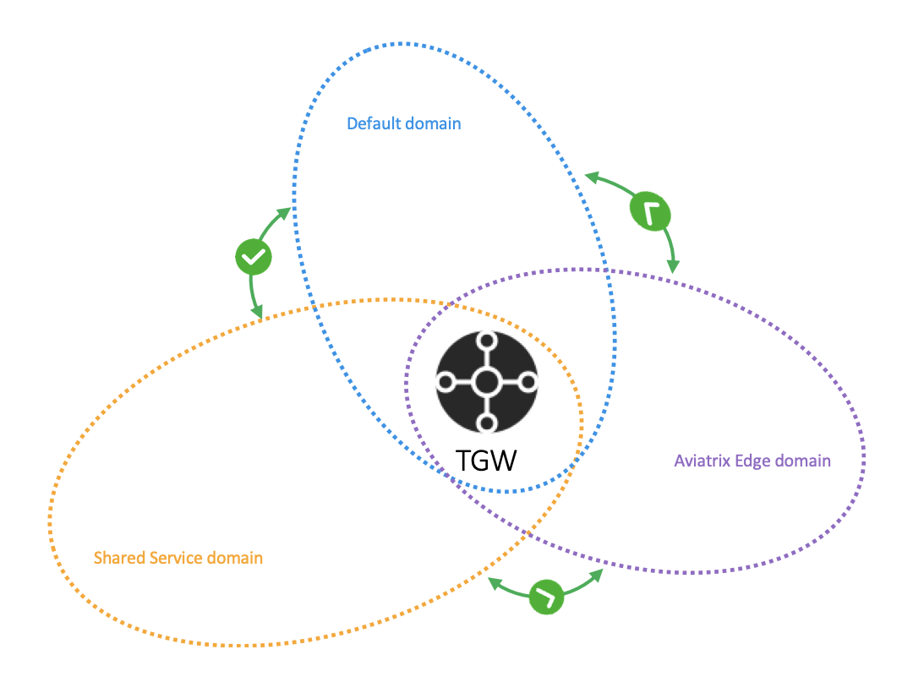
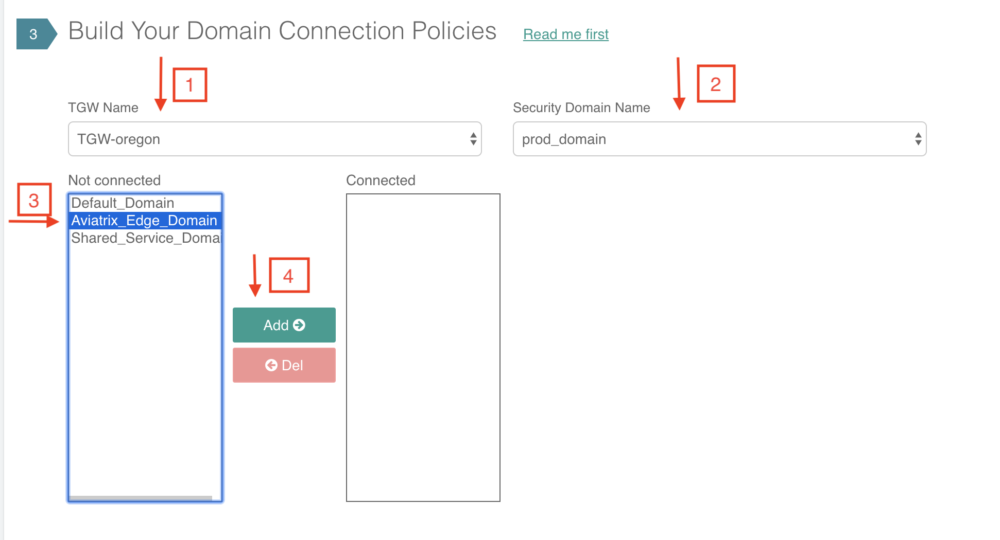
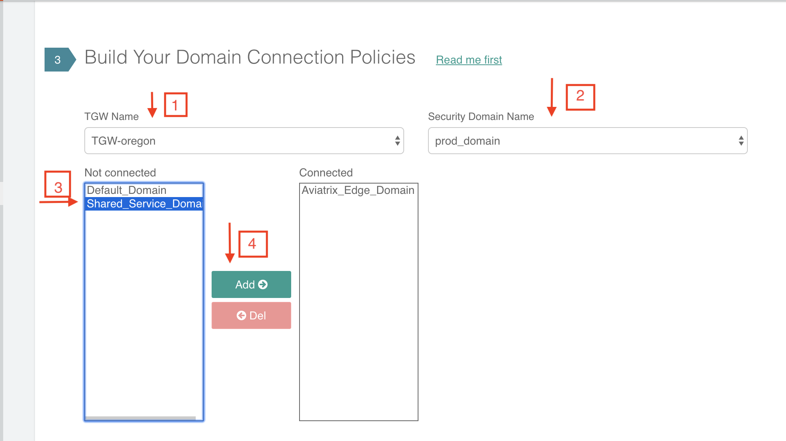
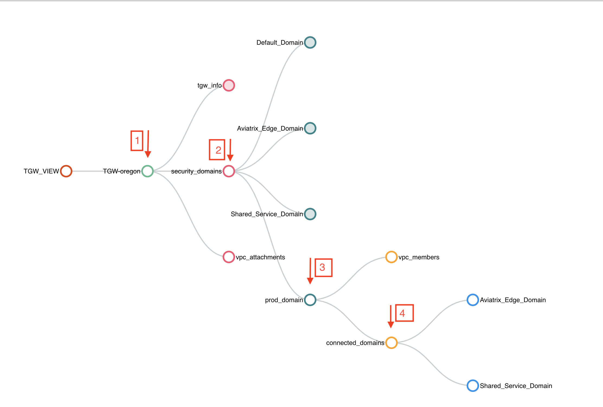
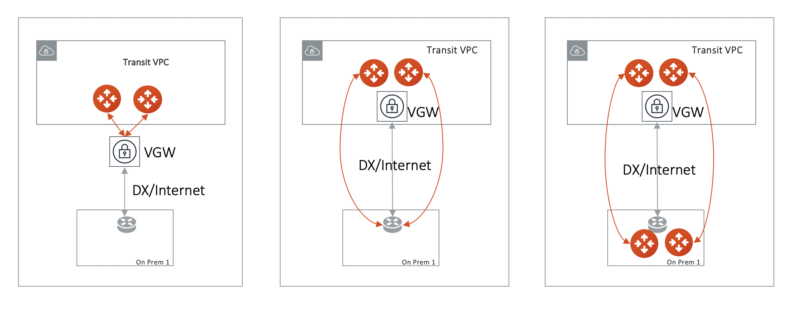
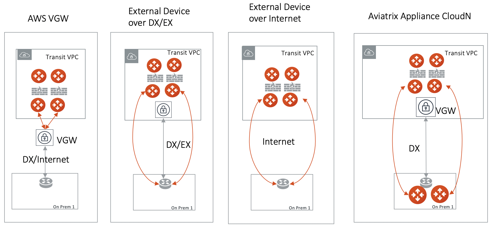
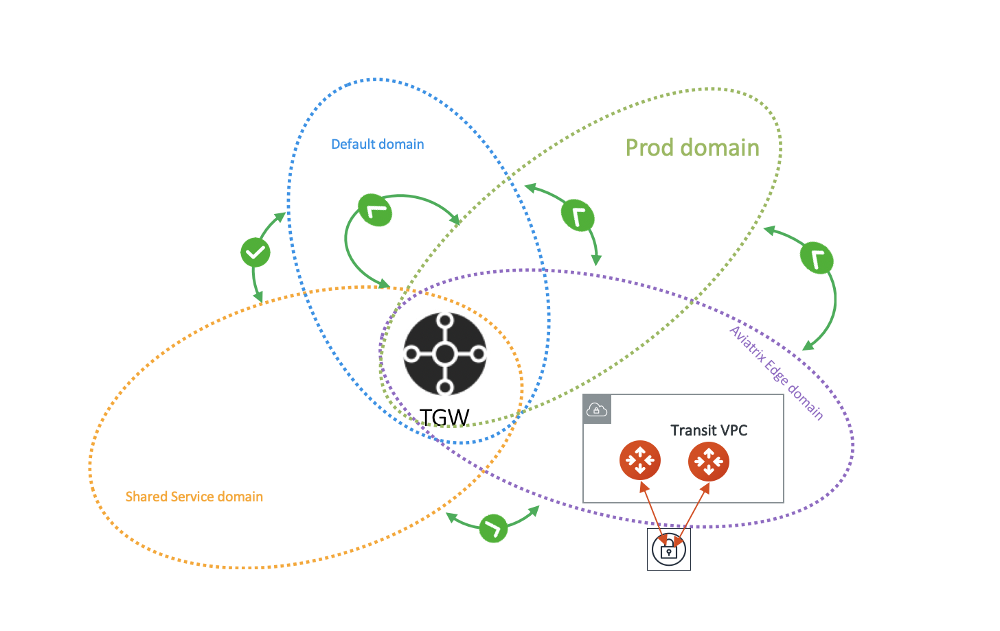
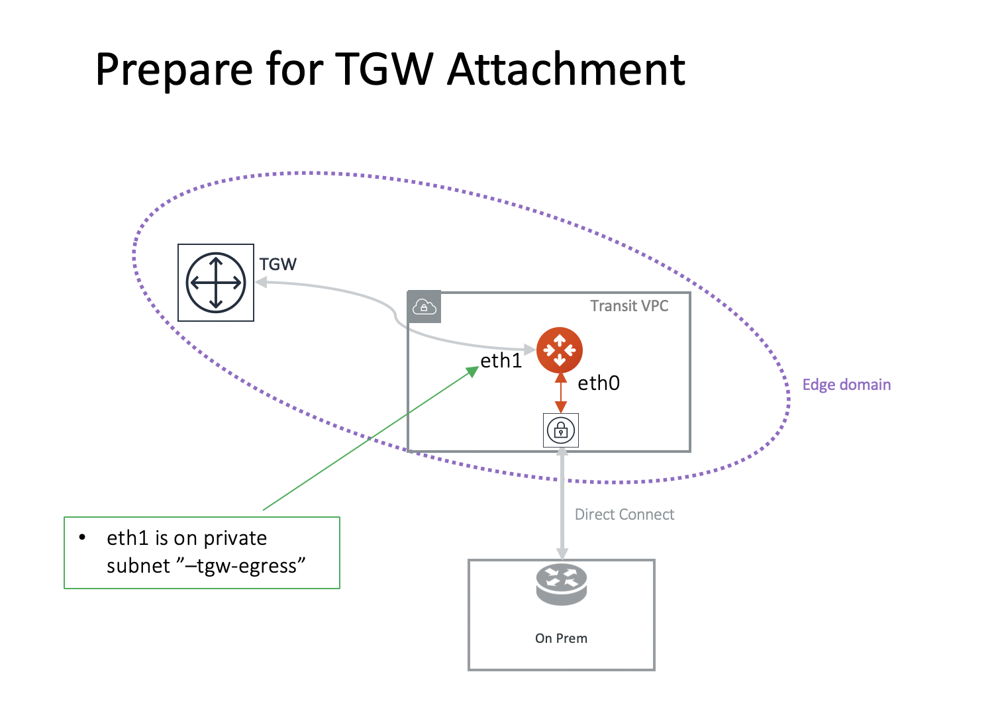
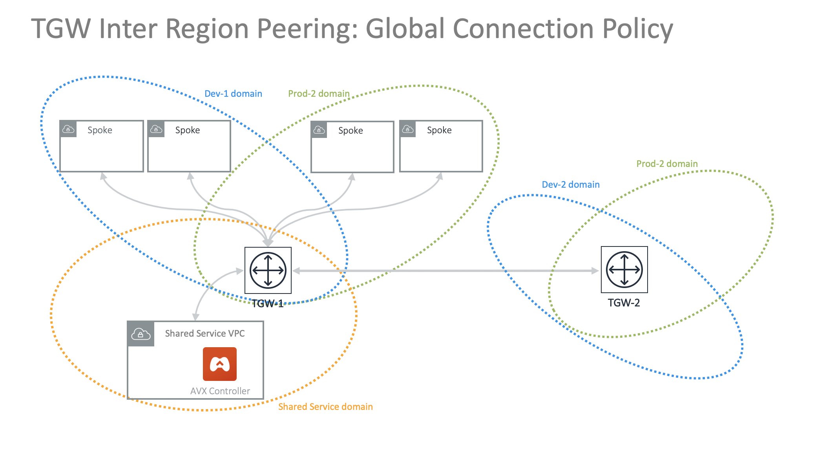

.. meta::
  :description: TGW Plan
  :keywords: Transit Gateway, AWS Transit Gateway, AWS TGW, TGW orchestrator, Aviatrix Transit network

=========================================================
TGW Orchestrator Plan
=========================================================

The AWS Transit Gateway (TGW) Orchestrator Plan is the first stage in deploying a AVX Transit Network using AWS Transit Gateway. 
After you go through the Plan 
stage configuration, you can proceed to the `Build stage <https://docs.aviatrix.com/HowTos/tgw_build.html>`_ 
to attach VPCs. 

For background information, refer to `AWS Transit Gateway  Orchestrator FAQ <https://docs.aviatrix.com/HowTos/tgw_faq.html>`_.

The plan stage consists of 4  sections:

 1.  **Create AWS Transit Gateway**. This is the only must-do section in Plan before you start to Build (attach VPCs) and consists of `Step 1 <https://docs.aviatrix.com/HowTos/tgw_plan.html#create-aws-tgw>`_. In this section, an AWS Transit Gateway and three connected Security Domains are created.  

 #.  **Create Segmented Network**. This is an optional section. It consists of `Step 2 <https://docs.aviatrix.com/HowTos/tgw_plan.html#optional-create-a-new-security-domain>`_ and `Step 3 <https://docs.aviatrix.com/HowTos/tgw_plan.html#optional-build-your-domain-connection-policies>`_. This section creates your own additional Security Domains and define Connection policies. This section is entirely modular and you can modify at any time. 

 #.  **Create Hybrid, multi region or multi cloud Connection**. This is an optional section. It consists of `Step 4 <https://docs.aviatrix.com/HowTos/tgw_plan.html#optional-setup-aviatrix-transit-gw>`_, `Step 5 <https://docs.aviatrix.com/HowTos/tgw_plan.html#optional-enable-aviatrix-transit-gw-for-hybrid-connection>`_ and `Step 6 <https://docs.aviatrix.com/HowTos/tgw_plan.html#optional-attach-aviatrix-transit-gw-to-tgw>`_. This section launches an Aviatrix Transit Gateway at the edge VPC, builds a hybrid connection to on-prem or another Aviatrix Transit gateway cluster, or deploys Transit DMZ . If you need hybrid connectivity, Step 4, 5 and 6 must all be executed and in sequence to complete this section. This section is entirely modular and you can modify at any time.
 
 #. **TGW Native Edge Connections**. This is an optional section. It creates TGW VPN, TGW DXGW and TGW Inter Region Peering. It consists of Step 7 & Step 8. 
 

In the planning stage, think about what network segmentation you need to achieve. For example, do you need to segment Dev/QA VPCs 
from your Prod VPCs, i.e., no connectivity is allowed between these VPCs in each group? The plan stage creates Transit Gateway and Transit Gateway route tables in AWS. There is no charge either by AWS or Aviatrix.

If you have not decided on network segmentation, no worries. Proceed to build a full mesh network by using the `Default_Domain <https://docs.aviatrix.com/HowTos/tgw_faq.html#what-is-the-default-domain>`_. 

.. tip::

 You can modify your plan at any time. Simply return to the Plan page and create security domains and change connection policies.  

The Transit Gateway Orchestrator Plan workflow provides a step by step instruction to define and setup your policies.

1. Create AWS TGW
-------------------------------------------

In order to use AWS Transit Gateway service, you must first create a AWS Transit Gateway. 

This step creates a AWS Transit Gateway in a specified region with a specified AWS account, the Aviatrix Controller also automatically creates 
the `Default_Domain <https://docs.aviatrix.com/HowTos/tgw_faq.html#what-is-the-default-domain>`_, the `Shared_Service_Domain <https://docs.aviatrix.com/HowTos/tgw_faq.html#what-is-the-default-domain>`_ and the `Aviatrix_Edge_Domain <https://docs.aviatrix.com/HowTos/tgw_faq.html#what-is-the-aviatrix-edge-domain>`_ and the corresponding AWS Transit Gateway route tables. 

|create_tgw|

Note that the three domains are connected, implying that if you attach a VPC to the Default Domain or Shared Service Domain, the VPCs can communicate with each other and can access on-prem through the Aviatrix Edge Domain.  

==========================================      ==========
**Setting**                                     **Value**
==========================================      ==========
Account Name                                    An `Aviatrix account <http://docs.aviatrix.com/HowTos/aviatrix_account.html#account>`_ that corresponds to an IAM role or account in AWS. 
Region                                          One of the AWS regions
TGW Name                                        The name of the AWS Transit Gateway
AWS Side AS Number                              TGW ASN number. Default AS number is 64512.
==========================================      ==========

After AWS Transit Gateway is created, you can validate by going to `View page <https://docs.aviatrix.com/HowTos/tgw_faq.html#what-can-be-displayed-at-the-view-page>`_ and seeing what has been created. 

--------------------------------------------------------------------------------------------------------------------

This section includes step 2 & 3 to plan a segmented network. 

2. Create a New Security Domain
--------------------------------------------------

If you plan to build a `default network (full mesh) <https://docs.aviatrix.com/HowTos/tgw_design_patterns.html#Full-mesh-network-design>`_, skip this section. 

You can make changes to your network segmentation at any time, simply come back to this page. 

If you plan to build a segmented network, use this section to create a new `Security Domain <https://docs.aviatrix.com/HowTos/tgw_faq.html#What-is-a-Security-Domain>`_ and setup `connection policies <https://docs.aviatrix.com/HowTos/tgw_faq.html#what-is-a-connection-policy>`_. 

In the example below, a new domain called prod_domain is created. 

|new_domain|

==========================================      ==========
**Setting**                                     **Value**
==========================================      ==========
TGW Name                                        The name of the AWS Transit Gateway
Security Domain Name                            Specify a unique domain name. For example, Dev_Domain
Aviatrix Firewall Domain                        Check this box if this domain is for Aviatrix Firewall Network.
Native Egress Domain                            Check this box if this domain is for non Aviatrix Firewall Network based central Internet bound traffic
Native Firewall Domain                          Check this box if this domain is for non Aviatrix Firewall Network based firewall traffic inspection
==========================================      ==========

3. Build Your Domain Connection Policies
----------------------------------------------------

This step specifies the connection relationship of one domain to others. Two connected domains imply that VPCs in 
each domain can communicate with each other despite the fact that they are in different domains. The Aviatrix Controller takes
care of both VPC route table and AWS Transit Gateway route table programming and updates. 

Highlight a domain on the left panel and click Add, the domain will appear to the right. 

In the example shown below, the intention is to connect the newly created prod_domain in Step 2 to the Aviatrix_Edge_Domain so that VPCs in the prod_domain can communicate with on-prem servers and hosts. 

|connect_domain_1|

Continue from the above example, you can connect prod_domain to Shared_Service_Domain, as shown below. 

|connect_domain_2|

Click the View page under AWS Transit Gateway Orchestrator and click each expandable circle to see what has been created, 
as shown below.  

|plan_view|

-----------------------------------------------------------------------------------------------------------------------

This section is for hybrid, multi region or multi cloud connections, it includes Step 4, 5 & 6. It sets up connection to on-prem datacenter over 
Direct Connect or Internet. 

4. Setup Aviatrix Transit GW  
------------------------------------------------------------------

This section, Step 4, 5 and 6, is about deploying Aviatrix Transit Gateways in a VPC and attach the VPC to TGW. From TGW point of view, this VPC is 
a Spoke VPC attached to TGW, however from Controller point of view, the Aviatrix Transit Gateway is the packet forwarding engine to on-prem 
or to another Aviatrix Transit Gateway. The direct attachment architecture allows the Aviatrix Transit Gateways to forward packets to TGW and Spoke VPCs 
at the rate of 50Mbps as specified by TGW. 

The use case for this deployment is to use Aviatrix Transit Gateway to connect to on-prem or to peer with another Aviatrix Transit Gateway. 

If you intend to use `TGW DXGW to connect to on-prem <https://docs.aviatrix.com/HowTos/tgw_plan.html#setup-aws-transit-gateway-direct-connect>`_ , `TGW VPN to connect to on-prem <https://docs.aviatrix.com/HowTos/tgw_plan.html#setup-aws-transit-gateway-vpn-connection>`_ or use `native TGW Peering to 
connect to regions <https://docs.aviatrix.com/HowTos/tgw_plan.html#tgw-inter-region-peering>`_ , skip this section. 

This section is modular, return to this section anytime if your requirements change later. 

.. tip::

  We strongly recommend you to create a new transit VPC at `Useful Tools -> Create a VPC <https://docs.aviatrix.com/HowTos/create_vpc.html>`_. Select the option "Aviatrix Transit VPC". 
  If you would like to use an existing VPC and its network CIDR is too small (not enough of /28 unused CIDR segments), use AWS Edit VPC CIDR feature to create a new /23 subnet to deploy the Aviatrix Transit Gateway in TGW use case. 

To deploy the Aviatrix Transit Gateways, take a detour and complete Step 1 & 2 in the `Transit Network workflow <https://docs.aviatrix.com/HowTos/transitvpc_workflow.html>`_. If you intent to use Aviatrix Transit Gateway to connect to on-prem, also complete `Step 3 <https://docs.aviatrix.com/HowTos/transitvpc_workflow.html#connect-the-transit-gw-to-aws-vgw>`_.

When complete, return to this section and continue to Step 5 in this workflow to Enable Aviatrix Transit GW to TGW. 

5. Prepare Aviatrix Transit GW for TGW Attachment
---------------------------------------------------------------

The Aviatrix Transit GW created in Step 4 does not build an IPSEC tunnel to AWS Transit Gateway. The networking between AWS Transit Gateway and the Aviatrix Transit GW is via the AWS VPC infrastructure.

This step designates an Aviatrix Transit GW to be used in conjunction with the AWS Transit Gateway. 
It creates a second Ethernet interface eth1 on the Aviatrix Transit GW for sending and receiving packets from AWS Transit Gateway. 
It also creates two subnets, -tgw-ingress and -tgw-egress  and two respective route tables in the edge VPC to route packets to and from AWS Transit Gateway. 

|prepare_tgw_attach|

==========================================      ==========
**Setting**                                     **Value**
==========================================      ==========
Cloud Type                                      AWS or AWS Gov Cloud
Aviatrix Transit Gateway Name                   Select a Transit GW from the drop down menu. 
==========================================      ==========

6. Attach Aviatrix Transit GW to TGW
------------------------------------------------------------------

This step attaches the Aviatrix Edge VPC to the AWS Transit Gateway and the Aviatrix Edge Domain, thus allowing the Aviatrix Transit GW to send and receive packets from AWS Transit Gateway. 

In this step, route entries are added to the two created private subnet route tables as described in the table below.

==========================================      ===============     ==================    =================
**subnet**                                      **route table**     **route entry**       **description**
==========================================      ===============     ==================    =================
-tgw-egress (for eth1)                          -tgw-egress         0.0.0.0/0 -> TGW      for traffic from Aviatrix Transit GW to TGW
-tgw-ingress                                    -tgw-ingress        0.0.0.0/0 -> eth1     for traffic from TGW to Aviatrix Transit GW
==========================================      ===============     ==================    =================

.. Note::
 
 There is no IPSEC tunnel between AWS Transit Gateway and the Aviatrix Transit GW, the Aviatrix GW behaves as an EC2 instance in a Spoke VPC (The Aviatrix edge VPC) attached to the AWS Transit Gateway, as shown in the diagram below. Such setup allows Aviatrix edge VPC to leverage the high performance provided by AWS Transit Gateway. 

|transit_complete|

After you finish Step 4, 5 and 6, your hybrid connection using Aviatrix Transit Gateway for TGW setup is complete. 
In the above example, 
if you have any Spoke VPCs attached to the prod_domain, EC2 instances should be able to communicate with 
on-prem. (Make sure instance security groups and any on-prem firewalls are configured properly.)

------------------------------------------

This section consists of TGW native VPN, Direct Connect and TGW Inter Region Peering functions. 

Since TGW does not propagate learned routes from DXGW or VPN to Spoke VPCs, Aviatrix Controller solves 
this problem by periodically polling the TGW route table and programming the learned routes to attached Spoke VPCs.

Setup AWS Transit Gateway VPN Connection
--------------------------------------------

Step 7 Setup VPN Connection
~~~~~~~~~~~~~~~~~~~~~~~~~~~~~

This function configures a native TGW VPN. It takes two steps: first configure, then download the configuration. 

This step creates a VPN connection from TGW in a selected Security Domain.

==========================================      ==========
**Setting**                                     **Value**
==========================================      ==========
AWS Transit Gateway Name                        The name of a TGW created by `TGW Plan <https://docs.aviatrix.com/HowTos/tgw_plan.html#create-aws-tgw>`_ by Aviatrix Controller
Connection Name                                 A unique name for the VPN connection
Remote Public IP                                Remote site public IP address
Dynamic (BGP) or Static                         Use BGP to connect to remote site or static IP
Remote CIDRs                                    When Static is selected, enter a list of CIDRs separated by comma. 
Remote AS Number                                When Dynamic is selected, enter the AS number of the remote site. 
Security Domain Name                            Select a Security Domain to associate the VPN attachment with
Learned CIDR Approval                           Select the option to enable `Approval <https://docs.aviatrix.com/HowTos/tgw_approval.html>`_. This option applies to Dynamic (BGP) mode only.
Global Acceleration                             Select the option to enable AWS Accelerated VPN
==========================================      ==========

Step 8 Download VPN Configuration
~~~~~~~~~~~~~~~~~~~~~~~~~~~~~~~~~~~~

Refresh the screen to see the newly created VPN connection.

If Static VPN is configured, you must go to AWS Console -> VPC -> Site-to-Site VPN Connections to download the
configuration file. 

If Dynamic VPN is configured, click the Download to download the configuration.

Setup AWS Transit Gateway Direct Connect
------------------------------------------

This section configures a native Direct Connect from TGW. This step can take more than 10 minutes for the connection to 
be ready.

Step 7 Setup Direct Connect
~~~~~~~~~~~~~~~~~~~~~~~~~~~~~

This step assumes that you have created Direct Connect Gateway and Transit Virtual Interface from AWS Console.

.. Note ::

  You may need to `update the Controller IAM policies <https://docs.aviatrix.com/HowTos/iam_policies.html#updating-iam-policies>`_ for this function. 

==========================================      ==========
**Setting**                                     **Value**
==========================================      ==========
AWS Transit Gateway Name                        The name of a TGW created by `TGW Plan <https://docs.aviatrix.com/HowTos/tgw_plan.html#create-aws-tgw>`_
Direct Connect Gateway Account Name             The Aviatrix Access Account name that created AWS Direct Connect Gateway
AWS Direct Connect Gateway                      The AWS Direct Connect Gateway you created from AWS Console
Allowed Prefix                                  A list of comma separated CIDRs for DXGW to advertise to remote (on-prem)
Security Domain Name                            Select a Security Domain to associate the VPN attachment with
Learned CIDR Approval                           Select the option to enable `Approval <https://docs.aviatrix.com/HowTos/tgw_approval.html>`_. This option applies to Dynamic (BGP) mode only.
==========================================      ==========

Step 8 Update Direct Connect Network Prefix
~~~~~~~~~~~~~~~~~~~~~~~~~~~~~~~~~~~~~~~~~~~~~

Use this step to update the "Allowed Prefix" to advertise to on-prem.

TGW Inter Region Peering
-----------------------------

TGW inter region peering is a feature where Controller orchestrates AWS TGW peering. In addition, the 
Controller programs and propagates network CIDR of Spoke VPCs and Edge Domains in a Security Domain to 
the remote TGW deployment, thus providing the end-to-end turn key solution. 

It takes two steps to connect two Security Domains in two regions. 

.. tip::

  Your Controller may not have the latest IAM policies to execute TGW peering, go to Accounts -> Access Accounts. Click the 3 dot skewer for the account where TGW is deployed and click Update policy. Do so for the all TGW accounts if you wish to TGW build inter region peering.

a. Create TGW Peering Attachment
~~~~~~~~~~~~~~~~~~~~~~~~~~~~~~~~~~~~

This step connects two TGWs in different regions using AWS native TGW Peering. It automatically creates two Security Domains associated with each 
TGW and respective attachment ID. 

==========================================      ==========
**Setting**                                     **Value**
==========================================      ==========
Cloud Type 1                                    Select AWS or AWS GovCloud
Region 1                                        Select a region where the one TGW is deployed
AWS Transit Gateway Name 1                      Select an AWS TGW Created `here <https://docs.aviatrix.com/HowTos/tgw_plan.html#create-aws-tgw>`_
Cloud Type 2                                    Select AWS or AWS GovCloud
Region 2                                        Select a region where the peering TGW is deployed
AWS Transit Gateway Name 2                      Select an AWS TGW Created `here <https://docs.aviatrix.com/HowTos/tgw_plan.html#create-aws-tgw>`_
==========================================      ==========

b. Build Connection Policies
~~~~~~~~~~~~~~~~~~~~~~~~~~~~~~~~~ 

After step a is completed, go to `Add/Modify Connection Policies  <https://docs.aviatrix.com/HowTos/tgw_plan.html#build-your-domain-connection-policies>`_. Refresh the page. The peered TGW with its Security Domains should appear on 
Not Connected panel. Select one remote Security Domain and click Add. Repeat this step for all intended connection, 
as shown in the diagram below. 

|tgw_peer|

In the above diagram, Dev-1 Domain of TGW-1 has connection policy to Dev-2 Domain of TGW-2. Any VPCs in Dev-1 Domain 
can communicate with VPCs in Dev-2 Domain.  

Similarly, Prod-1 Domain of TGW-1 has connection policy to Prod-2 Domain of TGW-2. Any VPCs in Prod-1 Domain can
communicate with VPCs in Prod-2 Domain. However Dev-1 cannot communicate with Prod-2 if there is no connection 
policy between them. 

--------------------------------------------------------------------------------------

This section consists of delete functions.

.. note::

 To delete an Aviatrix Transit GW attached to a AWS Transit Gateway, go through Step 7 and Step 8 listed below. Then go to Controller Gateway page to terminate the gateway instance.

Detach Aviatrix Transit GW from TGW
----------------------------------------------------

This step is the opposite of Step 6. It removes the private subnet route entries respectively. 

Disable Aviatrix Transit GW for TGW function
------------------------------------------------------------------

This step deletes the eth1 interface and other resources associated with the  Aviatrix Transit GW 
from AWS Transit Gateway Orchestrator. 

Delete Security Domain
---------------------------

This step delete a security domain created in Step 2. 

Delete AWS TGW
------------------

This step delete the AWS Transit Gateway created in Step 1. 

.. |new_domain| image:: tgw_plan_media/new_domain.png
   :scale: 30%

.. disqus::
