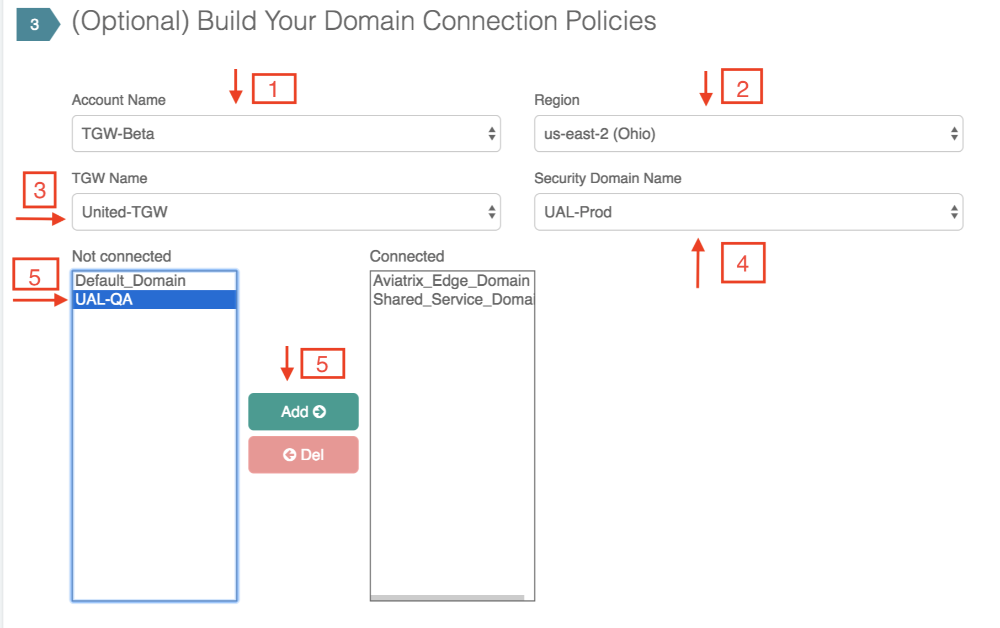

.. meta::
  :description: TGW Plan
  :keywords: AWS TGW, TGW orchestrator, Aviatrix Transit network

=========================================================
TGW Orchestrator Plan
=========================================================

TGW Orchestrator Plan is the first stage in deploying a Transit Network using TGW. 

For background information, refer to `TGW Orchestrator FAQ <https://docs.aviatrix.com/HowTos/tgw_faq.html>`_.

In the planning stage, think about what network segmentation you need to achieve. For example, do you need to segment Dev/QA VPCs 
from your Prod VPCs, i.e., no connectivity is allowed between these VPCs in each group? The plan stage creates TGW and TGW route tables in AWS. There is no charge either by AWS or Aviatrix.

If you have not decided, no worries, proceed to build a full mesh network by using the `Default_Domain <https://docs.aviatrix.com/HowTos/tgw_faq.html#what-is-the-default-domain>`_. 

.. tip::

 You can modify your plan at any time. Simply return to the Plan page and create security domains and changing connection policies.  

TGW Orchestrator Plan workflow provides a step by step instruction to define and setup your policies.

1. Create AWS TGW
-------------------------------------------

In order to use TGW service, you must first create a TGW. 

This step creates a TGW in a specified region with a specified AWS account, the Aviatrix Controller also automatically creates 
the `Default_Domain <https://docs.aviatrix.com/HowTos/tgw_faq.html#what-is-the-default-domain>`_, the `Shared_Service_Domain <https://docs.aviatrix.com/HowTos/tgw_faq.html#what-is-the-default-domain>`_ and the `Aviatrix_Edge_Domain <https://docs.aviatrix.com/HowTos/tgw_faq.html#what-is-the-aviatrix-edge-domain>`_ and the corresponding TGW route tables. . 

==========================================      ==========
**Setting**                                     **Value**
==========================================      ==========
Account Name                                    An `Aviatrix account <http://docs.aviatrix.com/HowTos/aviatrix_account.html#account>`_ that corresponds to an IAM role or account in AWS. 
Region                                          One of the AWS regions
TGW Name                                        The name of the TGW
AWS Side AS Numbert                             Default AS number is 64512. This field currently is not used.
==========================================      ==========

--------------------------------------------------------------------------------------------------------------------

2. (Optional) Create a New Security Domain
--------------------------------------------------

This section includes step 2 & 3 to plan a segmented network. 

If you plan to build a `default network (full mesh) <https://docs.aviatrix.com/HowTos/tgw_design_patterns.html#Full-mesh-network-design>`_, skip this section. 

You can make changes to your network segmentation at any time, simply come back to this page. 

If you plan to build a segmented network, use this section to create a new `Security Domain <https://docs.aviatrix.com/HowTos/tgw_faq.html#What-is-a-Security-Domain>`_ and setup `connection policies <https://docs.aviatrix.com/HowTos/tgw_faq.html#what-is-a-connection-policy>`_. 

(When planning for a segmented network, you need to create Security Domains where Spoke VPCs in a Security Domain can communicate with each other. Spoke VPCs in different Security Domains cannot communicate with each other unless you specify a policy to connect the two domains.) 

==========================================      ==========
**Setting**                                     **Value**
==========================================      ==========
TGW Name                                        The name of the TGW
Security Domain Name                            Specify a unique domain name. For example, Dev_Domain.
==========================================      ==========

3. (Optional) Build Your Domain Connection Policies
----------------------------------------------------

This step specifies the connection relationship of one domain to others. Two connected domains imply that VPCs in 
each domain can communicate with each other despite the fact that they are in different domains. Aviatrix Controller takes
care of both VPC route table and TGW route table programming and updates. 

Highlight a domain on the left panel and click Add, the domain will appears to the right, as shown below. 

|connect_domain|

-----------------------------------------------------------------------------------------------------------------------

4. (Optional) Setup Aviatrix Transit GW  
------------------------------------------------------------------

This section includes Step 4, 5 & 6. It sets up connection to on-prem datacenter over 
Direct Connect or Internet. 

If your deployment does not require on-prem connection, skip this section. 

Step 4 is to take a detour to setup Aviatrix Transit GW if you have not done so. Follow the `the Transit Network workflow <https://docs.aviatrix.com/HowTos/transitvpc_workflow.html>`_ and complete Step 1, 2 and 3. When complete, 
return to this section and continue to the next step. 

.. Note::

 For Aviatrix Transit GW to support Hybrid connection, the transit VPC needs to have a spare /26 CIDR space, i.e., not assigned to any subnets. Aviatrix Transit GW uses the spare space to create 4 subnets in the next step. 

5. (Optional) Enable Aviatrix Transit GW for Hybrid Connection
---------------------------------------------------------------

This step designates an Aviatrix Transit GW to be used in conjunction with TGW. It creates a second interface on the Aviatrix Transit GW for sending and receiving packets from TGW. It also creates two subnets and two respective route tables in the edge VPC to route packets to and from TGW. 

.. tip::

  Before you configure this step, make sure you have launched an Aviatrix Transit GW by following `the Transit Network workflow <https://docs.aviatrix.com/HowTos/transitvpc_workflow.html>`_, Step 1, 2 and 3. 

==========================================      ==========
**Setting**                                     **Value**
==========================================      ==========
Account Name                                    An `Aviatrix account <http://docs.aviatrix.com/HowTos/aviatrix_account.html#account>`_ that corresponds to an IAM role or account in AWS. This account is for launching Transit gateway. It does not need to be the same account as TGW creator. 
Gateway Namen                                   Select a Transit GW from the drop down menu. 
==========================================      ==========

6. (Optional) Attach Aviatrix Transit GW to TGW
------------------------------------------------------------------

This step attaches the Aviatrix Edge VPC to the TGW and thus allows the Aviatrix Transit GW to send and receive packets from TGW. 
Note there is no IPSEC tunnel between TGW and the Aviatrix Transit GW, the Aviatrix GW behaves as an EC2 instance in a Spoke VPC (The Aviatrix edge VPC) attached to the TGW.

------------------------------------------------------------------------------------------------

7. (Optional) Detach Aviatrix Transit GW from TGW
----------------------------------------------------

Step 7, 8, 9 and 10 are for all delete functions.   

8. (Optional) Disable Aviatrix Transit GW for Hybrid Connection
------------------------------------------------------------------

This step removes the designation of an Aviatrix Transit GW from TGW Orchestrator. 

9. Delete Security Domain
---------------------------

This step delete a security domain created in Step 2. 

10. Delete AWS TGW
------------------

This step delete the TGW created in Step 1. 

.. |image4| image:: transitvpc_workflow_media/launchSpokeGW.png
   :scale: 50%

.. |image5| image:: transitvpc_workflow_media/AttachSpokeGW.png
   :scale: 50%

.. |image6| image:: transitvpc_workflow_media/AttachMoreSpoke.png
   :scale: 50%

.. disqus::
